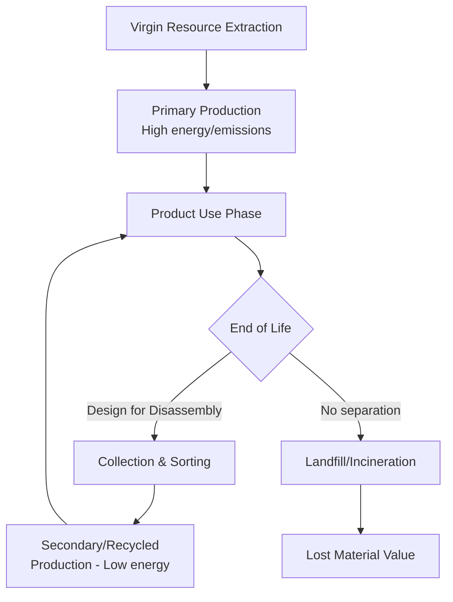

## Circular Economy Approaches to Energy-Intensive Materials

### Definition and Conceptual Basis

The circular economy (CE) framework applied to energy-intensive materials — primarily steel, aluminum, cement, plastics, and chemicals — seeks to reduce the primary energy and emissions embedded in material production by extending material lifetimes, maximizing reuse, and substituting recycled or secondary material flows for virgin extraction and processing. Because primary production of these materials is disproportionately energy- and emissions-intensive relative to secondary (recycled) production, circularity functions as a demand-side decarbonization lever that complements supply-side measures like fuel switching and carbon capture.

**Key Points**

- Circularity operates on the demand side of the materials economy: reducing the *quantity* of virgin material required, rather than only reducing the emissions intensity of producing a given quantity
- The economic logic rests on the large embodied-energy gap between primary and secondary production routes, which is structurally different across materials
- CE strategies are typically organized around the "R-frameworks" (reduce, reuse, remanufacture, recycle), with higher-value strategies (reduce, reuse) generally preserving more of the original embodied energy than recycling

### The Embodied Energy Gap: Primary vs. Secondary Production

| Material | Primary Route Energy Intensity | Secondary (Recycled) Route Energy Intensity | Approximate Energy Savings |
| --- | --- | --- | --- |
| Aluminum | ~14–17 kWh/kg (electrolytic reduction) | ~0.5–0.75 kWh/kg (remelting) | ~90–95% [Inference — figures vary by process technology, scrap quality, and regional electricity mix] |
| Steel (EAF from scrap) | ~20–25 GJ/tonne (BF-BOF route) | ~6–9 GJ/tonne (EAF from scrap) | ~60–70% [Inference — depends on scrap grade and furnace efficiency] |
| Plastics (mechanical recycling) | Varies by polymer (virgin production from petrochemical feedstock) | Substantially lower for mechanical recycling; chemical recycling routes are less favorable | Highly variable by polymer and recycling method [Unverified — mechanical vs. chemical recycling energy comparisons are polymer- and technology-specific] |
| Cement/Concrete | High (clinker calcination + kiln fuel) | Limited true "recycling" — see materials-specific section below | Limited — clinker cannot be effectively recycled at the molecular level |

**Key Points**

- Aluminum exhibits the largest primary-secondary energy gap of any major structural material, making scrap aluminum economically and environmentally preferable whenever quality permits
- Steel recycling via EAF is well-established and already accounts for a substantial share of global steel production, but is fundamentally constrained by scrap *availability*, not technology
- Cement/concrete circularity is structurally different from metals: because calcination is a one-way chemical transformation, "recycling" concrete mainly means aggregate reuse and limited carbonation-based reabsorption, not restoring it to clinker

### Material-Specific Circular Strategies

#### Steel

- **Scrap-based EAF production**: The dominant circular pathway; scrap steel is melted and reprocessed with a fraction of the energy and emissions of primary BF-BOF production
- **Scrap quality and "downcycling" risk**: Contamination with copper and other tramp elements degrades mechanical properties over successive recycling loops, limiting scrap use in high-specification applications (e.g., automotive sheet steel) — a phenomenon termed **quality cascading**
- **Design for disassembly**: Construction and automotive design practices that facilitate clean material separation at end-of-life improve scrap purity and preserve recyclability

**Key Points**

- Scrap availability is currently a binding constraint: global steel demand growth outpaces scrap supply from end-of-life products, meaning primary production (and its associated abatement challenge) cannot be eliminated by recycling alone in the near-to-medium term [Inference — the scrap supply/demand gap narrows over time as more steel put into use decades ago reaches end-of-life, but the timeline is model-dependent]

#### Aluminum

- **Closed-loop recycling**: Particularly effective in sectors like automotive and beverage cans, where alloy composition can be controlled and scrap streams kept relatively pure
- **Alloy sorting technology**: Laser-induced breakdown spectroscopy (LIBS) and other sorting technologies allow separation of aluminum scrap by alloy family, reducing downcycling into lower-grade casting alloys

#### Cement and Concrete

- **Aggregate recycling**: Crushed concrete demolition waste substitutes for virgin aggregate in new concrete or road base, reducing extraction-related energy and emissions (though this addresses a smaller share of total embodied emissions than clinker itself)
- **Carbonation curing and CO2 uptake**: Recycled concrete aggregate can reabsorb atmospheric $CO_2$ through carbonation, providing a modest, partial offset to the original calcination emissions
- **Clinker substitution via industrial byproducts**: Fly ash and slag reduce clinker content per tonne of cement, functioning as a circularity strategy insofar as it utilizes waste streams from other industrial processes

#### Plastics and Chemicals

- **Mechanical recycling**: Physically reprocessing plastic waste into new products; energy-efficient but limited by polymer degradation over multiple cycles and contamination
- **Chemical recycling (pyrolysis, depolymerization)**: Breaks polymers down to monomer or feedstock level for repolymerization; enables recycling of mixed or contaminated waste streams that mechanical recycling cannot handle, but is generally more energy-intensive than mechanical recycling [Unverified — comparative lifecycle energy data varies significantly across technology providers and is an active area of methodological debate]
- **Bio-based and CO2-derived feedstocks**: Adjacent to circularity in the strict sense, these reduce dependence on virgin fossil feedstock even where the "circular" loop is not literally closed material reuse

### Economic Framework: Why Circularity Is Not Automatically Adopted

**Key Points**

- Despite the energy-cost advantage of secondary production, market adoption of circular pathways is not automatic due to several economic frictions:
  - **Virgin material price distortions**: Externalities from primary production (carbon emissions, resource depletion, local pollution) are typically not fully priced into virgin material costs, artificially narrowing the cost gap with recycled material
  - **Collection and sorting costs**: Reverse logistics — collecting, sorting, and transporting end-of-life material — can offset the embodied-energy savings, particularly for geographically dispersed waste streams
  - **Quality and specification risk**: Manufacturers requiring tight material specifications (e.g., automotive-grade steel or aluminum) face higher due-diligence costs when sourcing recycled content, creating a preference for virgin material even at a cost premium
  - **Split incentives**: The party bearing end-of-life disposal costs (consumers, municipalities) is often different from the party that benefits from design-for-recyclability decisions (manufacturers), creating a misaligned incentive structure

**Externality Correction via Policy**

A carbon price applied to virgin material production internalizes the emissions externality and shifts relative costs toward recycled material:

$$P_{virgin}^{effective} = P_{virgin} + (\tau \times EF_{virgin})$$

Where $\tau$ is the carbon price and $EF_{virgin}$ is the emissions factor of primary production per unit of material. Because $EF_{virgin} \gg EF_{secondary}$ for most energy-intensive materials, a carbon price disproportionately raises the effective cost of virgin material relative to recycled material, improving the competitive position of circular pathways.

### Policy Instruments Supporting Circularity

- **Extended Producer Responsibility (EPR)**: Legally assigns end-of-life management costs to producers, incentivizing design for disassembly and recyclability at the point of product design
- **Recycled content mandates**: Regulatory requirements for minimum recycled content in specific product categories (e.g., EU targets for recycled plastic content in packaging and, more recently, in certain automotive and construction applications) [Unverified — specific mandate levels and covered product categories change over time and by jurisdiction; verify current regulatory text for compliance purposes]
- **Landfill taxes and waste disposal levies**: Raise the relative cost of disposal versus recycling, improving the economics of collection and sorting infrastructure
- **Green public procurement**: Government purchasing preferences for recycled-content materials in infrastructure projects, creating stable demand for secondary material markets
- **Material passports and digital product tracking**: Emerging systems that document material composition and provenance throughout a product's life to facilitate higher-quality end-of-life sorting and recycling [Recent/emerging — standardization and adoption remain at an early, fragmented stage across jurisdictions]

### Worked Example: Carbon Price Impact on Aluminum Sourcing Decision

A manufacturer requires 1,000 tonnes of aluminum input and compares primary versus secondary sourcing:

| Input | Emissions Factor (tCO2/t Al) | Base Cost ($/t) | Cost at $50/tCO2 Carbon Price |
| --- | --- | --- | --- |
| Primary aluminum | ~11–16 (grid-dependent) [Inference — highly sensitive to the carbon intensity of electricity used in electrolysis] | $2,400 | $2,400 + ($50 × ~13) ≈ $3,050 |
| Secondary (recycled) aluminum | ~0.5–0.8 | $2,200 | $2,200 + ($50 × ~0.65) ≈ $2,233 |

**Example**

Before the carbon price, secondary aluminum holds only a modest $200/t cost advantage. At $50/tCO2, the effective cost gap widens to roughly $800/t, substantially strengthening the economic case for scrap-based sourcing and illustrating how carbon pricing operates as a circularity-accelerating instrument even without any recycling-specific subsidy.

### Diagram: Value Retention Hierarchy

<svg xmlns="http://www.w3.org/2000/svg" viewBox="0 0 720 320" font-family="Arial, sans-serif">
<text x="360" y="24" text-anchor="middle" font-size="16" font-weight="bold">Circular Economy Value Retention Hierarchy (svg_diagram)</text>
<rect x="60" y="60" width="600" height="50" fill="#166534" opacity="0.9" />
<text x="360" y="90" text-anchor="middle" font-size="13" fill="white" font-weight="bold">REDUCE — highest value retention</text>
<rect x="90" y="120" width="540" height="50" fill="#22c55e" opacity="0.9" />
<text x="360" y="150" text-anchor="middle" font-size="13" fill="white" font-weight="bold">REUSE / REMANUFACTURE</text>
<rect x="120" y="180" width="480" height="50" fill="#eab308" opacity="0.9" />
<text x="360" y="210" text-anchor="middle" font-size="13" fill="#1f2937" font-weight="bold">RECYCLE (mechanical / EAF / remelt)</text>
<rect x="150" y="240" width="420" height="50" fill="#f97316" opacity="0.9" />
<text x="360" y="270" text-anchor="middle" font-size="13" fill="white" font-weight="bold">CHEMICAL RECYCLING / DOWNCYCLING</text>

<text x="360" y="305" text-anchor="middle" font-size="12" font-style="italic">Lower position = greater energy loss relative to original embodied energy</text>

</svg>

### Limitations and Structural Constraints

- **Circularity cannot fully substitute for primary production reduction**: Growing global material demand (particularly in developing economies building infrastructure and housing stock) means primary production will remain necessary for decades even under aggressive circularity scenarios [Inference — the balance between demand growth and circularity gains is scenario-dependent and varies substantially across long-term material demand projections]
- **Thermodynamic and quality limits**: Recycling is not infinitely repeatable without quality loss for most materials; "closed-loop" recycling claims should be evaluated against actual cascade and downcycling rates
- **Cement's structural exception**: Unlike metals, cement's core chemistry limits true closed-loop recycling, meaning circularity strategies for cement primarily address a smaller share of total sectoral emissions than for steel or aluminum

### Conclusion

Circular economy approaches address energy-intensive materials' decarbonization challenge from the demand side, exploiting the substantial embodied-energy gap between primary and secondary production routes — largest for aluminum, significant for steel, and structurally limited for cement. Realizing this potential at scale requires correcting market failures around externality pricing, reverse logistics costs, and split incentives through policy instruments such as extended producer responsibility, recycled content mandates, and carbon pricing that internalizes the emissions cost of virgin material production. Circularity functions as a necessary complement to, rather than a substitute for, supply-side decarbonization of primary production, since material demand growth and quality-cascading constraints prevent recycling alone from eliminating the need for primary capacity in hard-to-abate materials sectors.

**Related Topics**

- Marginal abatement cost curves for materials-sector decarbonization
- Extended Producer Responsibility (EPR) policy design
- Scrap steel markets and quality cascading dynamics
- Aluminum electrolysis energy intensity and grid decarbonization linkages
- Chemical recycling technologies and lifecycle assessment methodology
- Material passports and digital product tracking systems
- Carbon Border Adjustment Mechanisms and recycled-content trade implications
- Industrial symbiosis and byproduct exchange networks