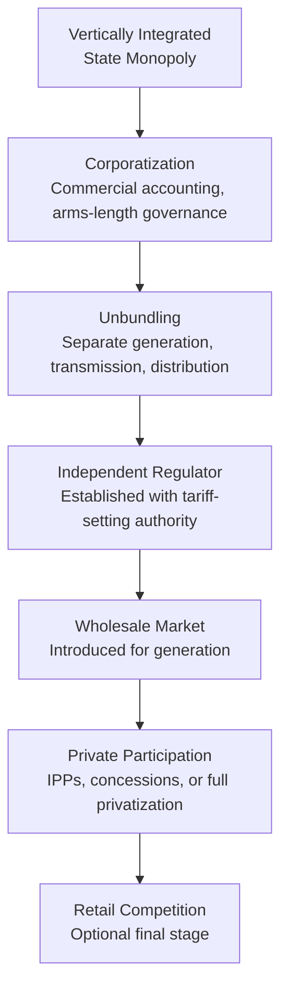

## Energy Sector Reform and Privatization Experiences

### Definition and Scope

Energy sector reform refers to the structural restructuring of electricity and fuel supply industries away from vertically integrated, typically state-owned monopoly models toward arrangements that introduce competition, private capital, and market-based pricing at some or all stages of the supply chain. Privatization — the transfer of ownership from public to private hands — is one specific instrument within this broader reform toolkit, distinct from related but separable reforms such as unbundling, liberalization, and independent regulation.

**Key Points**

- Reform, privatization, unbundling, and liberalization are related but distinct concepts frequently conflated in practice: a sector can be unbundled and liberalized while remaining state-owned, or privatized while remaining a vertically integrated monopoly
- The standard reference model — often called the "standard model" of power sector reform — emerged from World Bank and multilateral development bank advocacy in the 1990s, drawing heavily on the UK and Chilean experiences
- Frontier and emerging market reform outcomes have been highly heterogeneous, with results ranging from significant efficiency and investment gains to reversals, renationalization, and fiscal crises

### The Standard Reform Sequence

The canonical sequence advocated in the 1990s–2000s reform wave, most closely associated with World Bank technical assistance programs, comprises several sequential steps:

**Key Points**

- **Corporatization**: Converting a government department or state agency into a commercially run entity with its own balance sheet, subject to standard accounting and (nominally) hard budget constraints
- **Unbundling**: Separating generation, transmission, and distribution into distinct entities (vertical unbundling) and/or separating network and competitive segments (functional/ownership unbundling), intended to prevent cross-subsidization and enable competition in generation and retail
- **Independent regulation**: Establishing a regulatory body insulated from short-term political pressure, tasked with tariff-setting, licensing, and market oversight — considered a precondition for credible private investment
- **Private participation**: Ranges along a spectrum from Independent Power Producers (IPPs) selling into a single buyer, through concessions and management contracts, to full divestiture (privatization) of generation and/or distribution assets

### Spectrum of Private Sector Participation Models

| Model | Ownership | Operational Control | Investment Risk Bearer | Typical Use Case |
| --- | --- | --- | --- | --- |
| Management contract | Public | Private (limited scope) | Public | Improving operational efficiency without asset transfer |
| Lease/Affermage | Public | Private | Shared | Distribution utilities where new capital investment is limited |
| Concession | Public | Private | Private (partial) | Long-term infrastructure with defined investment obligations |
| BOT/BOOT (Build-Operate-Transfer) | Private (temporary) | Private | Private | New generation capacity (IPPs) |
| Full divestiture/privatization | Private | Private | Private | Generation and distribution asset sales |

**Key Points**

- Independent Power Producers (IPPs) under long-term Power Purchase Agreements (PPAs) with a state-owned "single buyer" utility have been the most widely adopted private participation model in frontier and emerging markets, since it isolates private investors from retail tariff-collection risk while preserving state control over transmission and distribution

### Economic Rationale for Reform

**Efficiency Arguments**

- **X-inefficiency reduction**: State monopolies, insulated from competitive pressure, are theorized to operate above minimum efficient cost (technical and allocative inefficiency); introducing competition or private ownership creates incentives to reduce costs
- **Investment mobilization**: Many frontier markets face persistent generation capacity shortfalls that state fiscal capacity alone cannot finance; private capital participation, particularly via IPPs, provides an alternative financing channel that does not directly burden sovereign balance sheets
- **Depoliticization of tariff-setting**: Independent regulation is intended to move tariff decisions away from short-term political cycles (which favor tariff freezes for popularity) toward cost-reflective pricing that sustains long-term sector financial viability

**Principal-Agent and Public Choice Framing**

$$\text{Efficiency Gap} = \text{Actual Cost} - \text{Minimum Feasible Cost}$$

State-owned utilities are frequently modeled as suffering from weak principal-agent alignment: government (the principal) has limited capacity to monitor and incentivize utility management (the agent) toward cost minimization, particularly where political objectives (employment protection, regionally distributed investment, tariff suppression) conflict with commercial efficiency objectives.

### Documented Outcomes: Successes

- **Chile (1980s–1990s)**: Widely cited as an early and relatively successful full-reform case — unbundling, privatization, and wholesale market introduction were associated with substantial improvements in generation reliability and investment, though outcomes were also shaped by Chile's broader macroeconomic stabilization program occurring concurrently [Inference — isolating the reform-specific effect from concurrent macroeconomic reforms is methodologically difficult]
- **Peninsular Malaysia and select Southeast Asian markets**: IPP programs under single-buyer models were associated with substantial new generation capacity additions during periods of rapid demand growth, addressing capacity shortfalls that public investment alone had been unable to finance [Unverified — comparative before/after reliability metrics vary by source and time period]
- **India's IPP program (1990s onward)**: Introduced private generation capacity at scale, though early experience (notably the Dabhol/Enron project) also illustrated significant contractual and political risk in PPA-based frontier market reform

### Documented Outcomes: Failures and Reversals

**California Electricity Crisis (2000–2001)**

- Partial deregulation (wholesale market liberalization combined with retail price caps) created a structural mismatch: utilities were required to purchase wholesale power at market prices while being restricted from passing costs through to capped retail tariffs
- Market design flaws combined with a drought-reduced hydropower supply and, subsequently, documented strategic withholding and market manipulation by some generators, produced extreme wholesale price spikes and utility insolvency
- **Key Points**: The California case is widely used as a cautionary example of the risks of partial, poorly sequenced reform — liberalizing wholesale markets while retaining administratively fixed retail prices creates a fiscal and reliability trap rather than a functioning competitive market

**Frontier Market Renationalization Episodes**

- Several Latin American and Sub-Saharan African utilities privatized during the 1990s–2000s were subsequently renationalized, often citing tariff affordability disputes, underinvestment relative to concession commitments, or political reversal following change of government [Unverified — specific country cases and causal attribution are contested in the literature and vary by political economy analysis]
- Common failure patterns identified across multiple case studies include: currency mismatch risk (dollar-denominated PPA obligations against local-currency revenue collection), regulatory capture or regulatory instability undermining the credibility needed for long-term private investment, and underestimation of the fiscal cost of "take-or-pay" IPP contracts during demand downturns

**Key Points**

- **Currency and macroeconomic risk** is a recurring theme specific to frontier and emerging markets not present in advanced-economy reform experiences: PPAs denominated in hard currency to attract foreign capital create fiscal exposure when local currency depreciates, since the state-owned offtaker's revenue (collected in local currency from often tariff-capped consumers) may not cover dollar-indexed payment obligations
- **Contract sanctity vs. renegotiation risk** creates a persistent tension: investors require credible long-term contract enforcement to commit capital, while governments face political pressure to renegotiate contracts perceived as unfavorable after signing, particularly following exchange rate shocks or changes in government

### The "Utility Death Spiral" Risk in Partial Reform

A structural risk in partially reformed systems retaining tariff subsidies or non-cost-reflective pricing:

$$\text{Utility Revenue} < \text{Cost of Service} \Rightarrow \text{Underinvestment} \Rightarrow \text{Service Quality Decline} \Rightarrow \text{Reduced Willingness to Pay}$$

This creates a self-reinforcing cycle in which chronic underpricing leads to underinvestment and service deterioration, which in turn undermines political and consumer support for the cost-reflective tariff increases needed to break the cycle.

### Diagram: Reform Risk Allocation Spectrum

<svg xmlns="http://www.w3.org/2000/svg" viewBox="0 0 720 260" font-family="Arial, sans-serif">
<text x="360" y="24" text-anchor="middle" font-size="16" font-weight="bold">Private Participation Risk Allocation Spectrum (svg_diagram)</text>
<line x1="60" y1="120" x2="660" y2="120" stroke="#374151" stroke-width="3" />
<polygon points="660,114 675,120 660,126" fill="#374151" />
<circle cx="90" cy="120" r="8" fill="#1e40af" />
<text x="90" y="150" text-anchor="middle" font-size="11">Management</text>
<text x="90" y="164" text-anchor="middle" font-size="11">Contract</text>
<circle cx="230" cy="120" r="8" fill="#166534" />
<text x="230" y="150" text-anchor="middle" font-size="11">Lease/</text>
<text x="230" y="164" text-anchor="middle" font-size="11">Affermage</text>
<circle cx="370" cy="120" r="8" fill="#92400e" />
<text x="370" y="150" text-anchor="middle" font-size="11">Concession</text>
<circle cx="500" cy="120" r="8" fill="#991b1b" />
<text x="500" y="150" text-anchor="middle" font-size="11">BOT/BOOT</text>
<text x="500" y="164" text-anchor="middle" font-size="11">(IPP)</text>
<circle cx="630" cy="120" r="8" fill="#5b21b6" />
<text x="630" y="150" text-anchor="middle" font-size="11">Full</text>
<text x="630" y="164" text-anchor="middle" font-size="11">Divestiture</text>

<text x="90" y="95" text-anchor="middle" font-size="11" font-weight="bold">Public bears</text>

<text x="90" y="108" text-anchor="middle" font-size="11" font-weight="bold">most risk</text>

<text x="630" y="95" text-anchor="middle" font-size="11" font-weight="bold">Private bears</text>

<text x="630" y="108" text-anchor="middle" font-size="11" font-weight="bold">most risk</text>

</svg>

### Preconditions for Successful Reform (Synthesized from Cross-Country Experience)

**Key Points**

- **Credible, independent regulation** established prior to, or concurrent with, private participation — regulatory institutions created after private capital has already been committed have generally struggled to establish credibility
- **Cost-reflective tariff pathway** with a clear, ideally pre-committed, glide path toward full cost recovery, reducing the fiscal exposure of take-or-pay contractual obligations
- **Targeted subsidies rather than blanket tariff suppression**, allowing affordability protection for low-income consumers without undermining sector-wide financial sustainability
- **Sequencing consistency**: partial reforms that liberalize one segment (e.g., wholesale generation) while leaving another segment administratively controlled (e.g., retail tariffs) have repeatedly produced the structural mismatches seen in California and multiple frontier market crises
- **Local currency risk mitigation mechanisms**, such as partial local-currency indexation, guarantees from multilateral development banks, or hedging facilities, to reduce the currency mismatch risk endemic to hard-currency PPAs in emerging markets

### Worked Example: Fiscal Exposure from Take-or-Pay PPAs

A frontier market utility signs IPP contracts with an aggregate take-or-pay obligation of 2,000 MW capacity at $0.08/kWh capacity charge, denominated in USD. Following a 30% local currency depreciation:

| Metric | Pre-Depreciation | Post-Depreciation |
| --- | --- | --- |
| PPA obligation (USD) | $140M/year | $140M/year (unchanged) |
| PPA obligation (local currency equivalent) | Baseline | +43% in local currency terms |
| Retail tariff (local currency, capped) | Baseline | Unchanged (politically constrained) |
| Utility revenue-cost gap | Manageable | Substantially widened |

**Example**

This scenario illustrates the mechanism behind several documented frontier market utility fiscal crises: currency depreciation increases the local-currency cost of servicing dollar-denominated IPP obligations, while retail tariffs — set in local currency and often politically resistant to rapid upward adjustment — fail to adjust commensurately, producing a widening quasi-fiscal deficit typically absorbed by the state budget or accumulated as utility arrears to generators.

### Conclusion

Energy sector reform and privatization experiences across emerging and frontier markets demonstrate that ownership transfer alone does not determine outcomes; the sequencing, regulatory credibility, and macroeconomic risk allocation embedded in reform design are at least as consequential as the public-private ownership question itself. Successful cases share common preconditions — credible independent regulation established early, a committed pathway to cost-reflective tariffs, and mechanisms to manage currency and political risk — while failure cases, from California's partial deregulation to multiple frontier market renationalizations, share common structural flaws: inconsistent sequencing, uncontained fiscal exposure from hard-currency contractual obligations, and tariff-setting frameworks that remain politically rather than commercially determined.

**Related Topics**

- Independent Power Producer (IPP) contract design and take-or-pay risk allocation
- Utility death spiral dynamics and tariff subsidy reform
- Regulatory credibility and regulatory capture in emerging market utilities
- Currency risk mitigation instruments (partial risk guarantees, local currency indexation)
- California electricity crisis market design analysis
- Vertical and functional unbundling in electricity market restructuring
- Single-buyer model economics versus full wholesale market liberalization
- Public-private partnership (PPP) risk transfer frameworks in infrastructure finance