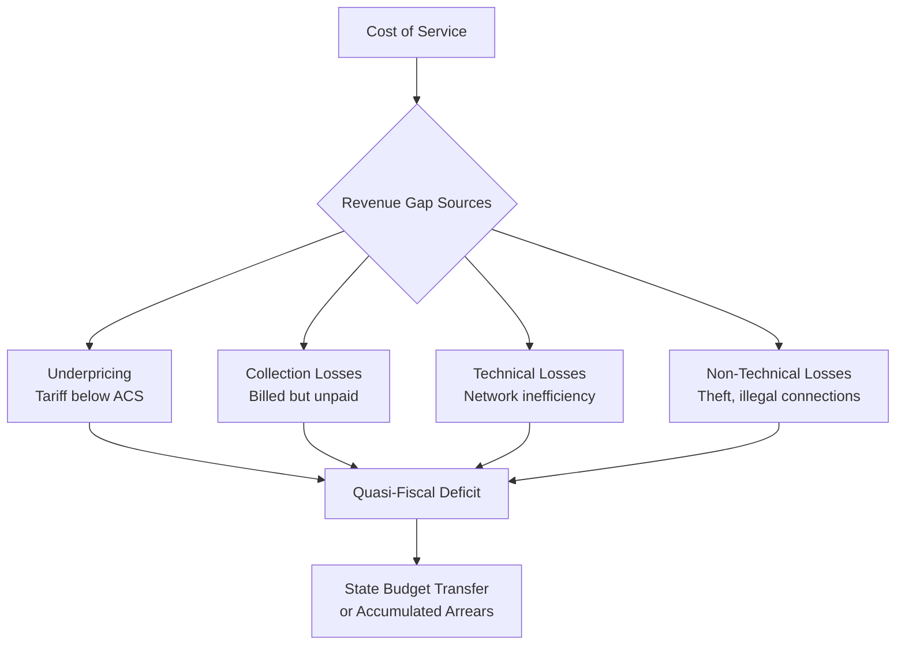

## Utility Financial Viability and Cost Recovery Challenges

### Definition and Scope

Utility financial viability refers to the capacity of an electricity or fuel distribution entity to generate sufficient revenue to cover its operating costs, debt service, and capital investment requirements on a sustained basis, without requiring recurring government transfers or accumulating unsustainable arrears. Cost recovery is the mechanism — primarily tariff design — through which this revenue is generated. In many emerging and frontier markets, a persistent gap between the cost of supplying electricity and the revenue collected constitutes one of the most binding structural constraints on sector development.

**Key Points**

- Financial viability is distinct from profitability in the commercial sense; a state-owned utility can be "financially viable" while earning a regulated, modest return, provided revenue covers full cost of service
- The quasi-fiscal deficit — the gap between utility revenue and cost of service, typically absorbed by the state budget rather than appearing as an explicit subsidy line item — is a central analytical concept in this domain
- Cost recovery shortfalls are frequently structural and multi-causal, involving tariff design, collection efficiency, technical losses, and governance factors simultaneously rather than any single failure

### The Cost Recovery Identity

A utility's financial position can be represented as:

$$\text{Revenue} = \text{Billed Sales} \times \text{Collection Rate} \times \text{Average Tariff}$$

$$\text{Cost of Service} = \text{Generation/Purchase Cost} + \text{Network O\&M} + \text{Debt Service} + \text{Capital Expenditure Requirement}$$

$$\text{Financial Viability Gap} = \text{Cost of Service} - \text{Revenue}$$

**Key Points**

- Each term on the revenue side represents a distinct point of potential failure: tariffs may be set below cost, billed sales may understate actual consumption due to losses, and even correctly billed amounts may not be collected
- A utility can appear financially distressed due to any single factor or, more commonly in frontier markets, a compounding combination of all three

### The "Hidden Costs" / ACS-ARC Framework

A widely used analytical decomposition, developed in World Bank utility performance analysis, separates cost recovery shortfalls into distinct components:

| Component | Description |
| --- | --- |
| **Underpricing** | Gap between Average Cost of Supply (ACS) and Average Revenue Collected (ARC) due to tariffs set below cost-reflective levels |
| **Underpayment/Collection losses** | Billed revenue not actually collected from customers (non-payment, including from government/state entities) |
| **Overstaffing/Inefficiency** | Operating costs above an efficient benchmark due to excess labor or input inefficiency |
| **Technical and non-technical (distribution) losses** | Electricity generated or purchased but not billed, due to network losses (technical) or theft/meter tampering/unmetered connections (non-technical) |

**Key Points**

- This decomposition is useful because different components require entirely different policy remedies: underpricing requires tariff reform, collection losses require billing and enforcement system improvements, and non-technical losses require metering, anti-theft, and network investment
- Distribution losses (technical plus non-technical) in some emerging market utilities have been reported well above the 6–8% considered typical for well-run networks in advanced economies, with non-technical losses (theft, illegal connections, meter tampering) often constituting the larger share of the excess in frontier markets [Unverified — loss levels vary enormously by country and utility; figures should be checked against current utility-specific data]

### Tariff Design and the Political Economy of Underpricing

**Cross-Subsidization Structures**

Many emerging market tariff schedules use increasing block tariffs (IBTs) or cross-class subsidies, where residential/low-consumption customers pay below-cost rates subsidized by industrial or high-consumption customers.

$$\text{Tariff}_{residential} < ACS < \text{Tariff}_{industrial}$$

**Key Points**

- This structure is politically durable because the beneficiaries (residential voters) are numerous and visible, while the cost is borne by industrial consumers or the state budget, both of which have comparatively less direct political voice on this specific issue
- Cross-subsidies can create industrial competitiveness concerns when industrial tariffs significantly exceed regional benchmarks, potentially incentivizing large consumers to self-generate ("grid defection") and further eroding the utility's revenue base
- Agricultural electricity subsidies (common in South Asian systems, for instance) represent a particularly large and politically entrenched category of below-cost pricing tied to groundwater irrigation, frequently cited as a major contributor to utility financial distress in the affected systems [Unverified — magnitude varies substantially by country and year]

**Tariff Adjustment Mechanisms**

- **Automatic fuel cost pass-through**: Mechanisms allowing tariffs to adjust automatically with input fuel cost changes, reducing the fiscal exposure created by discretionary, politically-timed tariff reviews
- **Multi-year tariff frameworks**: Pre-committed tariff paths set by an independent regulator, intended to reduce year-to-year political discretion and provide revenue predictability for investment planning
- **Political economy constraint**: Even where automatic adjustment mechanisms exist on paper, governments have frequently suspended or delayed their application during periods of high inflation or political sensitivity, undermining their credibility as a commitment device [Inference — the durability of automatic adjustment mechanisms under political pressure is context-dependent and has been inconsistent across countries and time periods]

### Distribution Losses: Technical and Non-Technical

**Technical Losses**

Arise from the physical properties of electricity transmission and distribution — resistive losses in conductors, transformer inefficiencies — and are reduced through network investment (conductor upgrades, transformer replacement, voltage optimization, network reconfiguration).

**Non-Technical (Commercial) Losses**

Arise from theft, meter tampering, unmetered or illegally connected consumers, and billing/metering errors. Addressing non-technical losses typically requires:

- **Advanced metering infrastructure (AMI) / smart meters**: Enable remote monitoring and tamper detection, though large-scale AMI rollouts require significant upfront capital that distressed utilities may struggle to finance without external support
- **Feeder-level loss auditing**: Segmenting the network to isolate high-loss areas for targeted intervention rather than network-wide investment
- **Legal and enforcement frameworks**: Addressing theft requires functioning legal enforcement capacity, which interacts with broader governance conditions outside the utility's direct control

### The Vicious Cycle: Underinvestment and Service Quality

$$\text{Revenue Shortfall} \Rightarrow \text{Deferred Maintenance/Investment} \Rightarrow \text{Service Quality Decline (outages, voltage issues)} \Rightarrow \text{Reduced Willingness to Pay} \Rightarrow \text{Further Revenue Shortfall}$$

**Key Points**

- This self-reinforcing dynamic is sometimes termed the "low-level equilibrium trap" in utility finance literature: poor service quality undermines the political and consumer legitimacy of tariff increases needed to fund the very investment that would improve service quality
- Breaking this cycle typically requires either a one-time external capital injection (concessional finance, multilateral development bank support, or government recapitalization) combined with credible governance reform, or a politically difficult sustained period of tariff increases ahead of visible service improvement

### Quasi-Fiscal Deficits and Sovereign Risk Linkages

**Key Points**

- Utility revenue shortfalls that are not explicitly budgeted as subsidies but instead manifest as accumulated arrears to fuel suppliers, IPPs, or lenders constitute a **quasi-fiscal deficit** — a fiscal cost that does not appear transparently in the government budget but represents a real contingent liability
- These arrears have documented linkages to broader sovereign credit risk in several emerging markets, where utility payment arrears to IPPs have contributed to disputes affecting the broader investment climate and, in some documented cases, sovereign guarantee calls [Unverified — the scale and specific transmission mechanism to sovereign risk varies by case and is analyzed differently across credit rating agencies and multilateral institutions]
- The IMF and World Bank frequently include utility sector reform and tariff adjustment as structural benchmarks in financial support programs for countries experiencing broader fiscal distress, reflecting the close linkage between utility quasi-fiscal deficits and overall public finance sustainability

### Diagram: Utility Financial Distress Cycle

<svg xmlns="http://www.w3.org/2000/svg" viewBox="0 0 720 340" font-family="Arial, sans-serif">
<text x="360" y="24" text-anchor="middle" font-size="16" font-weight="bold">Utility Financial Distress Cycle (svg_diagram)</text>
<circle cx="360" cy="180" r="130" fill="none" stroke="#d1d5db" stroke-width="1" stroke-dasharray="4,4" />
<rect x="290" y="40" width="160" height="55" rx="8" fill="#dbeafe" stroke="#1e40af" />
<text x="370" y="72" text-anchor="middle" font-size="11" font-weight="bold">Below-Cost Tariffs</text>
<rect x="520" y="130" width="160" height="55" rx="8" fill="#fef9c3" stroke="#92400e" />
<text x="600" y="162" text-anchor="middle" font-size="11" font-weight="bold">Deferred Maintenance</text>
<rect x="290" y="270" width="160" height="55" rx="8" fill="#fee2e2" stroke="#991b1b" />
<text x="370" y="302" text-anchor="middle" font-size="11" font-weight="bold">Service Quality Decline</text>
<rect x="60" y="130" width="160" height="55" rx="8" fill="#ede9fe" stroke="#5b21b6" />
<text x="140" y="162" text-anchor="middle" font-size="11" font-weight="bold">Lower Willingness to Pay</text>
<path d="M 450 65 Q 520 90 570 130" fill="none" stroke="#374151" stroke-width="2" marker-end="url(#arrow3)" />
<path d="M 600 185 Q 550 240 400 280" fill="none" stroke="#374151" stroke-width="2" marker-end="url(#arrow3)" />
<path d="M 320 290 Q 220 250 160 185" fill="none" stroke="#374151" stroke-width="2" marker-end="url(#arrow3)" />
<path d="M 150 130 Q 220 80 300 65" fill="none" stroke="#374151" stroke-width="2" marker-end="url(#arrow3)" />
</svg>

### Reform Approaches to Restoring Viability

- **Cost-reflective tariff transition paths**: Pre-announced, multi-year glide paths toward full cost recovery, sometimes combined with targeted lifeline tariffs (a small subsidized consumption block) to protect low-income households without subsidizing the entire consumer base
- **Performance-based distribution contracts**: Management contracts or concessions with explicit loss-reduction targets tied to compensation, isolating operational efficiency improvements from broader ownership questions
- **Direct benefit transfers**: Shifting subsidies from embedded tariff discounts to direct cash transfers to eligible households, allowing tariffs to move toward cost-reflectivity while preserving targeted affordability support and improving subsidy transparency and targeting accuracy [Inference — implementation success depends heavily on the quality of the underlying social registry and payment infrastructure, which varies substantially across countries]
- **Utility corporatization and ring-fencing**: Separating utility finances from general government accounts to increase transparency of the quasi-fiscal deficit and strengthen incentives for commercial management practices

### Worked Example: Decomposing a Revenue Gap

A distribution utility has a cost of service of $0.12/kWh. Its average billed tariff is $0.09/kWh, collection rate is 85%, and total system losses (technical + non-technical) are 22% against a 10% efficient benchmark.

| Component | Contribution to Revenue Gap (illustrative) |
| --- | --- |
| Tariff underpricing ($0.09 vs $0.12 ACS) | ~25% revenue shortfall from pricing alone |
| Collection losses (85% collection rate) | Additional ~15% shortfall on billed amounts |
| Excess losses (22% vs 10% benchmark, ~12 percentage point gap) | Effectively ~12% of generated electricity unbilled |

**Example**

Even if this utility were granted a tariff increase closing the entire $0.03/kWh pricing gap, its financial viability would remain compromised unless collection enforcement and loss reduction were addressed concurrently — illustrating why single-lever reforms (tariff increases alone) frequently underperform relative to policy expectations when other components of the revenue gap remain unaddressed.

### Conclusion

Utility financial viability challenges in emerging and frontier markets typically arise from a compounding combination of below-cost tariffs, collection inefficiency, and technical and non-technical distribution losses, rather than any single cause — meaning that reform strategies targeting only one component (most commonly, tariff increases alone) frequently fail to restore full viability. Because the resulting revenue shortfall is usually absorbed as an implicit quasi-fiscal deficit rather than an explicit budget line, its true fiscal cost is often underappreciated until it manifests as accumulated arrears, IPP payment disputes, or broader sovereign fiscal pressure. Durable restoration of viability generally requires coordinated action across tariff design, loss reduction investment, and collection enforcement, combined with governance reforms that increase transparency around the quasi-fiscal deficit and protect the credibility of tariff adjustment mechanisms against short-term political pressure.

**Related Topics**

- ACS-ARC (Average Cost of Supply / Average Revenue Collected) gap analysis methodology
- Quasi-fiscal deficits and sovereign contingent liability frameworks
- Cross-subsidization and increasing block tariff design
- Advanced metering infrastructure (AMI) investment economics
- Direct benefit transfers versus embedded tariff subsidies
- IPP payment arrears and sovereign guarantee risk
- Performance-based distribution concession contract design
- IMF/World Bank structural benchmarks in energy sector lending programs