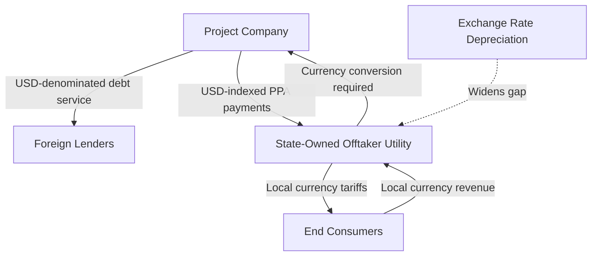

## Currency Risk and Energy Infrastructure Financing

### Definition and Scope

Currency risk in energy infrastructure financing arises from the mismatch between the currency denomination of a project's debt obligations and revenue streams. Because large-scale generation, transmission, and distribution infrastructure typically requires foreign-currency-denominated capital (equipment imports, foreign lender financing) while revenue is collected in local currency from domestic consumers, exchange rate movements between financial close and the full loan tenor create a structural exposure that is distinct from, but often compounding with, the sector's other financial viability challenges.

**Key Points**

- Currency risk in this context is fundamentally a **maturity and currency mismatch problem**: energy infrastructure has long asset lives (20–30+ years) and correspondingly long-tenor debt, over which cumulative exchange rate movements can be substantial even without a single crisis event
- The exposure differs depending on which party bears it contractually — the project company, the offtaker utility, the government, or the lender — and this allocation is a central design variable in project finance structuring
- Frontier and emerging markets are disproportionately affected because local capital markets are typically too shallow to provide long-tenor local-currency debt at the scale infrastructure projects require, forcing reliance on hard-currency financing

### Sources of Currency Mismatch in Project Structures

**Key Points**

- The state-owned offtaker collects revenue in local currency from consumers but must make payments to the IPP that are indexed to, or directly denominated in, hard currency — creating a currency conversion obligation that sits on the offtaker's balance sheet rather than the project company's
- This structure effectively transfers currency risk from the project company (and its foreign lenders, who require hard-currency debt service) to the state-owned utility or, ultimately, the sovereign, since utilities in financial distress typically rely on state support
- Where local currency depreciates without a corresponding increase in local retail tariffs, the offtaker's local-currency revenue becomes insufficient to cover its hard-currency-indexed obligations, converting a private-sector project finance risk into a public sector quasi-fiscal liability

### Risk Allocation Mechanisms in Project Contracts

| Mechanism | Description | Risk Borne By |
| --- | --- | --- |
| USD-denominated PPA | Payments fixed in or directly paid in hard currency | Offtaker/sovereign (conversion and collection risk) |
| Local-currency PPA with indexation | Payments in local currency, indexed to an exchange rate formula | Offtaker (formula-driven), partially mitigated for project company |
| Local-currency PPA, unindexed | Payments in local currency, no adjustment mechanism | Project company (and its foreign lenders) |
| Government guarantee/comfort letter | Sovereign backstops offtaker payment obligations | Sovereign |
| Partial risk guarantee (e.g., World Bank/MIGA) | Multilateral institution covers defined default risk | Multilateral institution (with government counter-guarantee) |

**Key Points**

- USD-denominated or USD-indexed PPAs have historically been the dominant structure for attracting foreign project finance to frontier markets, since foreign lenders typically require debt service in a currency matching their own funding base
- This structure, while necessary to mobilize foreign capital under shallow local capital market conditions, is the direct mechanism by which currency risk becomes a sovereign and utility balance sheet exposure rather than being absorbed by the private project company

### Why Local-Currency Financing Remains Limited

**Key Points**

- **Shallow domestic capital markets**: Many frontier markets lack a sufficiently deep pool of long-tenor local-currency institutional capital (pension funds, insurance companies, local currency bond markets) to finance 15–20 year infrastructure debt
- **Local currency funding cost premium**: Even where local-currency debt is available, it typically carries a substantially higher interest rate than hard-currency debt, reflecting inflation expectations and currency risk premia priced in by domestic lenders — meaning the currency risk is not eliminated but rather repriced as a higher explicit interest cost
- **Limited hedging market depth**: Long-tenor foreign exchange hedging instruments (cross-currency swaps, forwards) for many frontier market currencies either do not exist at the required tenor or carry prohibitively high hedging costs, since hedge providers themselves face limited counterparty depth and higher pricing for illiquid currency pairs [Inference — hedging market depth varies substantially by country and currency, and has been improving in some markets through dedicated facilities]

$$\text{Local Currency Debt Cost} = \text{Hard Currency Base Rate} + \text{Local Inflation Premium} + \text{Currency Risk Premium} + \text{Liquidity Premium}$$

### Institutional Solutions to Currency Risk

**Local Currency Financing Facilities**

Dedicated institutions and facilities have been developed specifically to address this gap, most notably TCX (The Currency Exchange Fund), a specialized entity established with development finance institution backing to provide hedging instruments for currencies where commercial hedging markets are absent or prohibitively expensive.

**Key Points**

- TCX and similar facilities function by pooling currency risk across many transactions and countries, allowing diversification benefits that no single commercial counterparty financing an individual project could achieve
- Multilateral development banks (World Bank, regional development banks) and development finance institutions increasingly promote local-currency lending programs specifically to reduce sovereign and utility exposure to the currency mismatch structurally embedded in hard-currency project finance [Recent/evolving — the scale and coverage of these programs has been expanding, and current program terms should be verified against current institutional documentation]

**Partial Risk Guarantees and Political Risk Insurance**

- **Multilateral Investment Guarantee Agency (MIGA)** and similar political risk insurers provide coverage against currency inconvertibility and transfer restriction risk, distinct from currency depreciation risk itself — these instruments protect against the *inability* to convert and repatriate local currency revenue, not against the exchange rate level
- **Partial Risk Guarantees (PRGs)** from institutions like the World Bank cover defined categories of government payment default, including failures arising from currency-related fiscal distress, but require a sovereign counter-guarantee, meaning the ultimate risk remains with the government even where multilateral instruments provide a credit enhancement layer

### Case Pattern: Currency Depreciation and IPP Payment Disputes

Several documented episodes in frontier energy markets illustrate the transmission mechanism from currency depreciation to utility and sovereign fiscal stress:

1. IPP contracts signed with USD-indexed capacity and energy payments during a period of currency stability
2. Subsequent macroeconomic shock produces significant local currency depreciation (commonly cited ranges in documented cases span from double-digit to well over 50% depreciation depending on the episode) [Unverified — magnitude is case-specific and sourced from country-level balance of payments and exchange rate data that should be verified for any specific case study]
3. Offtaker utility's local-currency revenue, collected at politically constrained retail tariffs, becomes insufficient to meet the now-larger local-currency equivalent of USD-indexed obligations
4. Utility accumulates payment arrears to IPPs, triggering contractual default provisions, potential termination payment obligations, or government intervention to avoid a broader investment climate reputational cost
5. Resolution typically involves some combination of: emergency tariff adjustment, government assumption of the payment gap (explicit subsidy or quasi-fiscal absorption), contract renegotiation, or in severe cases, sovereign guarantee calls

**Key Points**

- This pattern is not specific to any single country but represents a recurring structural vulnerability documented across multiple frontier and emerging market IPP programs, reflecting the underlying currency mismatch design rather than idiosyncratic mismanagement in any one case [Inference — while the general pattern is well-documented in development finance literature, attributing outcomes in specific historical episodes to currency risk alone versus other contributing factors requires case-specific analysis]

### Diagram: Currency Risk Transmission Chain

<svg xmlns="http://www.w3.org/2000/svg" viewBox="0 0 720 300" font-family="Arial, sans-serif">
<text x="360" y="24" text-anchor="middle" font-size="16" font-weight="bold">Currency Risk Transmission Chain (svg_diagram)</text>
<rect x="30" y="70" width="150" height="60" rx="8" fill="#dbeafe" stroke="#1e40af" />
<text x="105" y="95" text-anchor="middle" font-size="11" font-weight="bold">Local Currency</text>
<text x="105" y="110" text-anchor="middle" font-size="11">Depreciation</text>
<rect x="220" y="70" width="150" height="60" rx="8" fill="#fef9c3" stroke="#92400e" />
<text x="295" y="95" text-anchor="middle" font-size="11" font-weight="bold">Widening USD-Indexed</text>
<text x="295" y="110" text-anchor="middle" font-size="11">Obligation Gap</text>
<rect x="410" y="70" width="150" height="60" rx="8" fill="#fee2e2" stroke="#991b1b" />
<text x="485" y="95" text-anchor="middle" font-size="11" font-weight="bold">Utility Payment</text>
<text x="485" y="110" text-anchor="middle" font-size="11">Arrears to IPPs</text>
<rect x="220" y="180" width="150" height="60" rx="8" fill="#ede9fe" stroke="#5b21b6" />
<text x="295" y="205" text-anchor="middle" font-size="11" font-weight="bold">Sovereign</text>
<text x="295" y="220" text-anchor="middle" font-size="11">Guarantee Call</text>
<rect x="410" y="180" width="150" height="60" rx="8" fill="#dcfce7" stroke="#166534" />
<text x="485" y="205" text-anchor="middle" font-size="11" font-weight="bold">Contract</text>
<text x="485" y="220" text-anchor="middle" font-size="11">Renegotiation</text>
<line x1="180" y1="100" x2="220" y2="100" stroke="#374151" stroke-width="2" marker-end="url(#arrow4)" />
<line x1="370" y1="100" x2="410" y2="100" stroke="#374151" stroke-width="2" marker-end="url(#arrow4)" />
<line x1="485" y1="130" x2="295" y2="180" stroke="#374151" stroke-width="2" marker-end="url(#arrow4)" />
<line x1="485" y1="130" x2="485" y2="180" stroke="#374151" stroke-width="2" marker-end="url(#arrow4)" />
</svg>

### Emerging Approaches: Renewable-Specific Considerations

**Key Points**

- Renewable energy IPPs (solar, wind) introduce a distinct dynamic: near-zero marginal fuel cost means the *entire* revenue stream, not just a fuel cost pass-through component, is exposed to the currency indexation structure of the PPA — there is no natural local-currency cost offset from fuel purchases as there might be conceptually for a domestically-fueled thermal plant
- Auction-based renewable procurement in some emerging markets has begun experimenting with local-currency-denominated bids supported by dedicated hedging facilities, intended to reduce the currency mismatch at the point of contract design rather than managing it after the fact through guarantees [Recent/emerging — adoption remains limited to specific programs and markets, and standard practice is still evolving]
- The falling levelized cost of renewable generation in hard-currency terms has, in some analyses, been partially offset by the currency and country risk premium embedded in the discount rate applied to emerging market renewable projects, meaning technology cost declines do not automatically translate into proportionally lower currency-risk-adjusted financing costs [Inference — the magnitude of this offset is project- and country-specific and is an active area of applied energy finance research]

### Worked Example: Weighted Average Cost of Capital Impact

Comparing an identical renewable project financed in an advanced economy versus a frontier market illustrates the currency and country risk premium embedded in financing costs:

| Component | Advanced Economy | Frontier Market (illustrative) |
| --- | --- | --- |
| Risk-free base rate | ~4% | ~4% (USD base) |
| Country risk premium | ~0.5% | ~3–6% [Inference — highly country-specific] |
| Currency risk premium (if locally financed) | Minimal | ~2–5% [Inference — dependent on currency volatility and hedging market depth] |
| Resulting illustrative WACC | ~6–7% | ~10–15% |

**Example**

A project with identical technical characteristics and identical hard-currency equipment costs can face a levelized cost of electricity 30–50% higher in a frontier market purely due to the elevated cost of capital driven by country and currency risk premia, independent of any difference in resource quality or construction cost — illustrating why de-risking instruments (guarantees, hedging facilities, blended concessional finance) are often more impactful for frontier market renewable deployment economics than further reductions in equipment cost.

### Conclusion

Currency risk in energy infrastructure financing is a structural consequence of financing long-lived, capital-intensive assets with hard-currency debt while collecting revenue in local currency from consumers whose tariffs are often politically constrained — a mismatch that shallow domestic capital markets in frontier economies make difficult to avoid through local-currency financing alone. The resulting risk is typically transferred contractually from private project companies to state-owned offtakers and ultimately to sovereign balance sheets through USD-indexed PPA structures, converting what begins as a private financing risk into a recurring source of quasi-fiscal exposure. Institutional responses — including local-currency financing facilities like TCX, multilateral partial risk guarantees, and evolving local-currency renewable procurement structures — aim to redistribute or mitigate this risk, but the fundamental tension between the currency composition of financing markets and the local-currency nature of retail tariff revenue remains a defining, largely structural feature of frontier and emerging market energy infrastructure economics.

**Related Topics**

- Local currency financing facilities (TCX) and cross-currency hedging instruments
- Partial risk guarantees and MIGA political risk insurance structures
- IPP payment arrears and utility financial viability linkages
- Weighted average cost of capital (WACC) decomposition for emerging market energy projects
- Sovereign guarantee frameworks in project finance
- Renewable energy auction design in currency-constrained markets
- Country risk premium estimation methodologies in infrastructure finance
- Blended concessional finance structures for de-risking frontier market investment