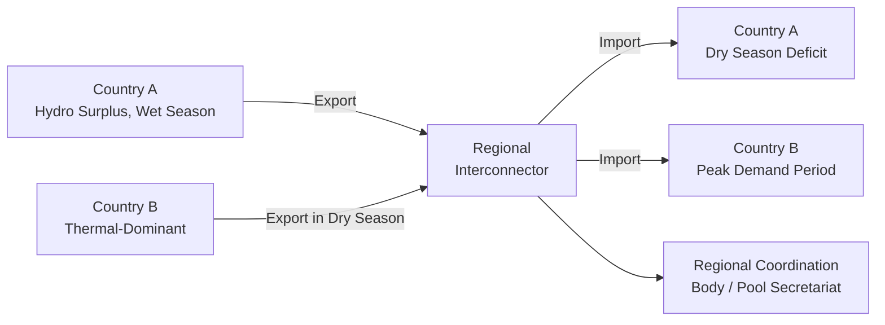

## Regional Power Pools and Cross-Border Trade in Developing Regions

### Definition and Scope

A regional power pool is an institutional and technical arrangement enabling multiple national electricity systems to interconnect their transmission grids and trade electricity across borders, either through bilateral contracts, centralized dispatch coordination, or organized wholesale markets. In developing regions, power pools are typically motivated less by the wholesale-market efficiency goals emphasized in advanced-economy market integration and more by the economics of diversity: exploiting differences in generation mix, hydrology, demand timing, and reserve margins across countries that individually lack the scale or resource diversity to achieve efficient, reliable supply on their own.

**Key Points**

- Major developing-region power pools include the Southern African Power Pool (SAPP), the West African Power Pool (WAPP), the East African Power Pool (EAPP), the Central American Electrical Interconnection System (SIEPAC), and the Greater Mekong Subregion (GMS) power trade arrangements
- These pools vary substantially in institutional maturity, from largely bilateral coordination arrangements to more developed structures with day-ahead trading platforms
- The core economic rationale — resource complementarity, reserve margin pooling, and economies of scale in generation investment — is broadly shared, but implementation and institutional depth differ significantly by region

### Economic Rationale for Cross-Border Power Trade

**Resource Complementarity**

Different countries within a region often have structurally different generation portfolios shaped by their natural resource endowments — hydro-rich countries, gas- or coal-endowed countries, and countries with strong solar or wind resources can trade to exploit these differences rather than each developing costly domestic capacity across the full technology range.

**Key Points**

- **Seasonal and hydrological complementarity**: In several developing-region pools, countries with wet-season hydro surplus can export to hydro-deficit or dry-season-constrained neighbors, and vice versa across the annual cycle, smoothing regional supply variability that no single country's hydrology could achieve alone
- **Demand diversity**: Countries with different peak demand timing (driven by climate, time zone, or economic structure differences) can share reserve capacity more efficiently than each maintaining independent reserve margins sized for their own peak
- **Reduced reserve margin requirements**: Pooling allows a region to maintain a lower aggregate reserve margin than the sum of what each country would need independently, since the probability of simultaneous peak demand or simultaneous generation outage across multiple countries is lower than the probability of either event in any single country

$$\text{Regional Reserve Margin} < \sum_{i} \text{National Reserve Margin}_i$$

**Economies of Scale in Generation Investment**

- Large hydropower or other capital-intensive generation projects often exceed the efficient scale for a single small national market but become economically viable when output can be exported regionally, allowing investment to be sized to least-cost regional generation economics rather than constrained national demand
- This logic has motivated several large hydropower developments in West and Southern Africa explicitly designed with export capacity to neighboring markets as part of the original project economics [Unverified — specific project-level export share assumptions vary and should be verified against individual project documentation]

### Institutional Architecture of Power Pools

| Institutional Element | Function |
| --- | --- |
| Pool coordination body/secretariat | Facilitates technical coordination, market rules development, and information exchange among member utilities |
| Grid codes and technical standards | Harmonized technical requirements enabling safe, stable interconnected operation across national systems |
| Transmission interconnectors | Physical cross-border transmission lines enabling power flow |
| Trading arrangements | Ranging from purely bilateral long-term contracts to centralized day-ahead trading platforms |
| Dispute resolution mechanisms | Address commercial and technical disputes between member utilities across different national jurisdictions |

**Key Points**

- Most developing-region power pools began with, and many remain primarily structured around, **bilateral long-term contracts** between national utilities rather than a centralized short-term wholesale market, reflecting both the political sensitivity of ceding dispatch control and the technical prerequisites (metering, communication infrastructure, harmonized grid codes) needed for centralized trading
- The Southern African Power Pool has developed further toward organized short-term trading (including a day-ahead market platform) relative to some other developing-region pools, though the majority of traded volume in most of these pools has historically remained bilateral [Unverified — the current balance between bilateral and centralized trading volume shifts over time and should be verified against current pool reporting]

### Barriers to Regional Power Trade

**Political Economy Barriers**

- **Sovereignty and energy security concerns**: Governments are frequently reluctant to become dependent on cross-border electricity supply for a share of domestic demand, particularly where political relations with neighboring countries are strained or historically volatile
- **Asymmetric bargaining power**: Where one country's utility is substantially larger or more creditworthy than counterparts, smaller countries may face unfavorable contract terms or payment security demands, complicating trade agreement negotiation
- **Tariff harmonization difficulty**: Divergent domestic tariff structures (reflecting different subsidy regimes and cost recovery levels across countries) complicate establishing mutually acceptable cross-border trading prices

**Technical and Infrastructure Barriers**

- **Interconnector capacity constraints**: Existing cross-border transmission capacity in several developing-region pools remains limited relative to the theoretical trading potential implied by resource complementarity, constraining actual traded volumes below economically efficient levels [Inference — the specific capacity gap varies by interconnector and has been the subject of numerous regional transmission master plan studies]
- **Grid stability and synchronization**: Interconnecting systems with different historical grid standards, frequency stability characteristics, or protection system designs requires technical harmonization investment before reliable interconnected operation is possible
- **Metering and settlement infrastructure**: Accurate cross-border metering and billing settlement systems are a prerequisite for trust between counterparties and for moving beyond simple bilateral long-term contracts toward more dynamic trading arrangements

**Financial and Payment Risk Barriers**

- **Counterparty credit risk**: Utilities in financially distressed member countries (see utility financial viability challenges) present payment risk to exporting counterparts, requiring credit support mechanisms (letters of credit, escrow arrangements, or third-party guarantees) that add transaction cost and complexity to cross-border deals
- **Currency risk in cross-border settlement**: Trade settlement typically occurs in a reference hard currency to avoid embedding bilateral exchange rate risk into the trading relationship, which reintroduces the same currency mismatch dynamics discussed in domestic IPP financing to the cross-border trading context

### Case Pattern: Southern African Power Pool (SAPP)

**Key Points**

- SAPP, established in the early 1990s, is generally regarded as one of the more institutionally developed power pools among developing regions, having progressed from purely bilateral trading toward a short-term energy market platform [Unverified — institutional development milestones and current market design details should be verified against current SAPP documentation, as governance structures and market rules have evolved over time]
- The pool's operation has been materially affected by drought-driven hydropower shortfalls in member countries with high hydro dependence, illustrating a structural vulnerability: pooling arrangements built substantially around hydro complementarity are exposed to correlated regional hydrological risk (e.g., a region-wide drought) that undermines the diversification benefit the pool is designed to provide
- This vulnerability has increased the strategic case for diversifying the pool's generation mix — including solar and wind — to reduce correlated regional supply risk rather than substituting one form of resource concentration (thermal) for another

### Case Pattern: West African Power Pool (WAPP)

**Key Points**

- WAPP's development has centered heavily on building physical interconnector infrastructure across West African countries with historically limited cross-border transmission capacity, alongside institutional development of trading rules and a regional regulatory framework
- The pool's economic case rests substantially on enabling access to lower-cost regional generation (including large hydropower resources concentrated in specific countries) for import-dependent neighboring markets that would otherwise rely on more expensive domestic thermal generation [Unverified — specific cost comparison figures are project- and time-period-specific]

### Diagram: Power Pool Value Drivers

<svg xmlns="http://www.w3.org/2000/svg" viewBox="0 0 720 300" font-family="Arial, sans-serif">
<text x="360" y="24" text-anchor="middle" font-size="16" font-weight="bold">Regional Power Pool Value Drivers (svg_diagram)</text>
<circle cx="200" cy="160" r="80" fill="#dbeafe" opacity="0.85" stroke="#1e40af" />
<text x="200" y="150" text-anchor="middle" font-size="12" font-weight="bold">Resource</text>
<text x="200" y="166" text-anchor="middle" font-size="12" font-weight="bold">Complementarity</text>
<text x="200" y="182" text-anchor="middle" font-size="10">(hydro/thermal/</text>
<text x="200" y="195" text-anchor="middle" font-size="10">solar mix)</text>
<circle cx="380" cy="160" r="80" fill="#dcfce7" opacity="0.85" stroke="#166534" />
<text x="380" y="150" text-anchor="middle" font-size="12" font-weight="bold">Reserve Margin</text>
<text x="380" y="166" text-anchor="middle" font-size="12" font-weight="bold">Pooling</text>
<text x="380" y="182" text-anchor="middle" font-size="10">(lower aggregate</text>
<text x="380" y="195" text-anchor="middle" font-size="10">reserve need)</text>
<circle cx="290" cy="220" r="80" fill="#fef9c3" opacity="0.85" stroke="#92400e" />
<text x="290" y="230" text-anchor="middle" font-size="12" font-weight="bold">Economies of</text>
<text x="290" y="246" text-anchor="middle" font-size="12" font-weight="bold">Scale</text>
<text x="290" y="262" text-anchor="middle" font-size="10">(large hydro/</text>
<text x="290" y="275" text-anchor="middle" font-size="10">generation projects)</text>
</svg>

### Worked Example: Cross-Border Trade Value Estimation

Consider two neighboring countries: Country A has abundant wet-season hydropower with a marginal generation cost of $0.03/kWh but faces a dry-season deficit met by emergency diesel generation at $0.25/kWh. Country B has stable gas-fired thermal capacity at $0.08/kWh year-round but limited hydro resources.

| Scenario | Country A Cost | Country B Cost | Combined Cost (no trade) |
| --- | --- | --- | --- |
| Wet season, no trade | $0.03/kWh (surplus, curtailed or wasted) | $0.08/kWh | Inefficient — A's cheap surplus unused |
| Dry season, no trade | $0.25/kWh (diesel) | $0.08/kWh | High cost from A's emergency generation |
| **With cross-border trade** | Exports wet-season surplus to B | Imports A's cheap hydro in wet season; exports thermal to A in dry season | Both countries access lower blended cost |

**Example**

Under a trading arrangement, Country A can export wet-season hydro surplus to Country B at a price between $0.03 and $0.08/kWh (mutually beneficial to both), while importing Country B's thermal generation during its dry season at a price below its own $0.25/kWh diesel alternative — creating a trading surplus for both parties that neither could capture operating in isolation, illustrating the core gains-from-trade logic underlying power pool formation even in the absence of any centralized market mechanism.

### Emerging Directions

- **Renewable integration and pooling**: As solar and wind capacity grows across member countries, power pools increasingly serve a grid-balancing function beyond their original hydro/thermal complementarity logic, helping smooth variable renewable output across a wider geographic footprint than any single national grid could achieve [Recent/emerging — the scale of this function varies by pool and renewable penetration level]
- **Regional transmission master planning**: Multilateral development banks increasingly support coordinated regional transmission investment planning intended to unlock trading potential currently constrained by interconnector capacity limits
- **Continental-scale integration initiatives**: Broader continental power market integration initiatives (e.g., discussions around an African continental power market architecture) represent a longer-term extension of the regional pool model, though implementation timelines and institutional design for such continental-scale efforts remain at an early and evolving stage [Unverified — specific initiative status and timelines change and should be verified against current sources]

### Conclusion

Regional power pools in developing regions generate economic value primarily through resource complementarity, reserve margin pooling, and economies of scale in large generation investment — gains from trade that individual countries, often constrained by limited domestic resource diversity and smaller market scale, cannot capture in isolation. Realizing this potential has proven institutionally and technically demanding: political sovereignty concerns, asymmetric bargaining power, interconnector capacity constraints, and cross-border counterparty credit and currency risk have collectively kept most developing-region power pools closer to bilateral coordination arrangements than fully integrated wholesale markets, even decades after their establishment. The growing role of variable renewable energy and correlated regional hydrological risk are reshaping the strategic rationale for these pools, shifting emphasis toward renewable balancing functions alongside their original hydro-thermal complementarity logic.

**Related Topics**

- Southern African Power Pool (SAPP) institutional evolution and market design
- West African Power Pool (WAPP) interconnector investment programs
- Cross-border counterparty credit risk mitigation in power trading
- Regional transmission master planning and multilateral development bank financing
- Hydrological risk correlation and regional drought exposure in hydro-dependent power systems
- Grid code harmonization for cross-border interconnection
- Continental power market integration initiatives
- Variable renewable energy balancing through geographic diversification