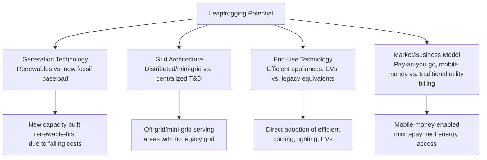

## Leapfrogging Potential in Emerging Market Energy Systems

### Definition and Conceptual Basis

Energy leapfrogging refers to the possibility that emerging and frontier markets, particularly those with limited existing centralized energy infrastructure, can bypass the sequential technology adoption pathway historically followed by industrialized economies (large fossil-fired central generation and extensive transmission/distribution grid buildout) and move directly to decentralized, digitally enabled, or renewable-based energy system architectures. The concept is drawn by analogy from telecommunications, where many developing countries skipped extensive fixed-line telephone infrastructure and moved directly to mobile networks.

**Key Points**

- Leapfrogging is fundamentally an argument about **path dependency avoidance**: because infrastructure investments are long-lived and create technological and institutional lock-in, countries without extensive existing legacy infrastructure face a lower switching cost to adopt a newer technology paradigm from the outset
- The concept applies across multiple layers of the energy system: generation technology (renewables vs. fossil baseload), grid architecture (decentralized/distributed vs. centralized transmission-dependent), and end-use technology (efficient appliances and electric mobility vs. legacy equivalents)
- The telecommunications analogy, while widely invoked, has important disanalogies with energy systems that qualify the strength of the leapfrogging argument in this sector

### The Telecommunications Analogy and Its Limits

**Key Points**

- Mobile telephony leapfrogging succeeded substantially because the marginal infrastructure cost of extending coverage (cell towers) was dramatically lower than fixed-line infrastructure (trenching, copper wire per household), and because mobile technology matured to a point of clear technical and cost superiority before most developing countries had built out extensive fixed-line networks
- Electricity systems differ in at least three structurally important ways: (1) electricity, unlike voice/data, involves physical energy transfer requiring meaningful conductor capacity regardless of technology generation, so distribution networks cannot be "skipped" as completely as fixed-line telephone networks were; (2) grid-connected renewable generation still typically requires transmission and distribution infrastructure to reach demand centers, limiting the degree to which centralized network buildout can be avoided entirely; (3) reliability and power quality requirements for many productive uses (industrial motors, cold chains, hospitals) are more stringent than voice/data service tolerances, constraining how far decentralized, lower-reliability solutions can substitute for grid connection
- The leapfrogging concept is therefore more accurately applied to **specific system layers** — off-grid/mini-grid deployment in areas without existing grid infrastructure, or generation technology choice for new capacity — rather than to the electricity system as a whole [Inference — the appropriate scope of the leapfrogging concept is a matter of ongoing academic and policy debate rather than a settled consensus]

### Dimensions of Potential Leapfrogging

#### Generation Technology Leapfrogging

- The most economically supported dimension of leapfrogging: because solar PV and wind costs have declined substantially and are, in many markets, now cost-competitive with or cheaper than new fossil-fired generation on a levelized cost basis, countries building new generation capacity have direct economic incentive to build renewable capacity rather than replicate the fossil-baseload-first sequence historically followed by industrialized economies
- This dimension does not require any special "developing country" advantage — it reflects the underlying cost trajectory of the technology itself — but the *absence* of substantial existing fossil generation capital stock in some emerging markets does reduce the stranded-asset and vested-interest barriers that complicate the transition in economies with large legacy fossil fleets [Inference — the relative weight of "lack of legacy lock-in" versus "underlying technology cost economics" in explaining renewable-first capacity additions varies by market and is difficult to cleanly separate empirically]

#### Grid Architecture: Distributed and Off-Grid Systems

**Key Points**

- **Solar home systems (SHS)** and **mini-grids** represent the clearest and most empirically supported leapfrogging case: for populations in areas with no existing grid connection and long expected timelines for centralized grid extension, distributed solar-battery systems provide a direct path to electricity access without requiring the intermediate step of grid extension
- **Pay-as-you-go (PAYGo) solar** business models, enabled by mobile money infrastructure, have extended electricity access to populations that traditional utility connection and billing models (requiring formal addresses, credit history, and upfront connection costs) previously excluded — combining a technology leapfrog (distributed solar) with a financing/business model leapfrog (mobile-money-enabled micropayments)
- Mini-grids occupy an intermediate position: they can be designed for eventual interconnection with the main grid as it extends, functioning as a transitional rather than permanently parallel infrastructure, though the economics and technical planning for this eventual interconnection require deliberate design consideration from the outset

#### End-Use Technology Leapfrogging

- **Highly efficient appliances**: Markets without extensive existing inefficient appliance stock can adopt high-efficiency cooling, lighting, and refrigeration technology directly, avoiding the "sunk cost" resistance to efficiency upgrades seen in markets with large existing inefficient appliance bases
- **Electric mobility**: Some analysts have proposed that markets with lower existing internal combustion vehicle penetration and less-developed fuel retail infrastructure face a comparatively lower switching barrier to electric vehicle adoption, though this claim is qualified by the requirement for reliable grid electricity access and charging infrastructure investment, which themselves face the broader infrastructure constraints discussed above [Speculation — the empirical case for EV leapfrogging specifically, as opposed to renewable generation leapfrogging generally, remains less developed and is more contested in the literature]

### Constraints and Counterarguments

**Structural Constraints**

- **Capital cost and financing access**: Even where a leapfrog technology has a lower long-run cost, the higher upfront capital cost typical of renewable and distributed energy technologies (relative to some fossil alternatives with lower capital but higher operating cost) can be a binding constraint in capital-constrained economies, particularly where local financing markets are shallow (see currency risk and infrastructure financing challenges)
- **Grid stability and integration limits**: Variable renewable generation requires either grid flexibility resources (storage, flexible thermal capacity, demand response) or sufficiently large and interconnected grids to absorb variability — smaller, weaker grids common in some emerging markets may face technical integration constraints on renewable penetration that are less binding in larger, more robust systems [Inference — specific technical penetration limits are grid- and system-specific and require detailed technical studies rather than generalized assumptions]
- **Industrial policy and legacy interest path dependency**: Where a country has existing fossil fuel extraction industries, associated employment, or geopolitical relationships tied to fossil fuel trade, leapfrogging faces political economy resistance analogous to, though often more acute than, similar dynamics in industrialized economies

**The Access-Reliability-Leapfrogging Trilemma**

$$\text{Universal Access} + \text{High Reliability} + \text{Minimal Centralized Grid Investment} \Rightarrow \text{Generally Not Simultaneously Achievable}$$

**Key Points**

- A core tension exists between the leapfrogging aspiration (minimizing centralized grid investment) and the reliability requirements of productive economic uses (which generally require either a robust interconnected grid or substantial and costly distributed storage/backup capacity)
- This suggests leapfrogging is most viable for basic household electricity access (lighting, phone charging, small appliances) via off-grid solar, while grid-quality reliability for industrial and commercial productive uses generally still requires progression toward more conventional, though ideally renewable-dominated, centralized or strengthened grid infrastructure [Inference — the boundary between "basic access adequately served by off-grid" and "productive use requiring grid-quality reliability" is context- and application-specific]

### Diagram: Leapfrogging Applicability Spectrum

<svg xmlns="http://www.w3.org/2000/svg" viewBox="0 0 720 280" font-family="Arial, sans-serif">
<text x="360" y="24" text-anchor="middle" font-size="16" font-weight="bold">Leapfrogging Applicability by Use Case (svg_diagram)</text>
<line x1="60" y1="140" x2="660" y2="140" stroke="#374151" stroke-width="3" />
<polygon points="660,134 675,140 660,146" fill="#374151" />
<circle cx="100" cy="140" r="9" fill="#166534" />
<text x="100" y="175" text-anchor="middle" font-size="11" font-weight="bold">Basic Household</text>
<text x="100" y="188" text-anchor="middle" font-size="11">Access (lighting)</text>
<text x="100" y="110" text-anchor="middle" font-size="10">High leapfrog fit</text>
<circle cx="280" cy="140" r="9" fill="#65a30d" />
<text x="280" y="175" text-anchor="middle" font-size="11" font-weight="bold">New Generation</text>
<text x="280" y="188" text-anchor="middle" font-size="11">Capacity Choice</text>
<circle cx="460" cy="140" r="9" fill="#ca8a04" />
<text x="460" y="175" text-anchor="middle" font-size="11" font-weight="bold">Commercial/Small</text>
<text x="460" y="188" text-anchor="middle" font-size="11">Industrial Load</text>
<circle cx="620" cy="140" r="9" fill="#991b1b" />
<text x="620" y="175" text-anchor="middle" font-size="11" font-weight="bold">Heavy Industry/</text>
<text x="620" y="188" text-anchor="middle" font-size="11">Grid-Critical Loads</text>
<text x="620" y="110" text-anchor="middle" font-size="10">Low leapfrog fit</text>
</svg>

### Worked Example: Off-Grid vs. Grid Extension Cost Comparison

A rural community of 500 households sits 40 km from the nearest grid connection point.

| Option | Approximate Cost Driver | Timeline to Access |
| --- | --- | --- |
| Grid extension | Transmission/distribution line construction cost scales with distance; often the dominant cost factor for remote, low-density populations | Multi-year, dependent on national grid extension planning and financing |
| Solar mini-grid | Capital cost concentrated in generation and local distribution; largely distance-independent | Months, dependent on project development and financing |
| Solar home systems (individual) | Lowest capital cost per household; no shared distribution infrastructure | Weeks to months, dependent on PAYGo financing approval |

**Example**

For this community, grid extension cost typically rises roughly in proportion to distance from the existing network (a widely used rule-of-thumb in rural electrification planning places grid extension cost per kilometer well above the equivalent per-household cost of solar home systems for adequately dispersed populations at this kind of distance) [Inference — the specific crossover distance at which off-grid options become cost-superior to grid extension is highly sensitive to population density, terrain, and local labor/equipment costs, and should be assessed via location-specific least-cost electrification planning rather than a universal threshold]. This illustrates the standard economic logic underlying least-cost rural electrification planning tools, which typically recommend off-grid solutions for sufficiently remote, low-density populations and grid extension or densification-based mini-grids for populations closer to existing infrastructure or with higher expected load growth.

### Policy and Planning Implications

- **Integrated least-cost electrification planning**: Geospatial planning tools that jointly optimize grid extension, mini-grid, and off-grid solar deployment based on population density, distance from existing infrastructure, and expected demand growth have become standard practice in donor-supported national electrification planning, replacing purely grid-extension-centric historical approaches
- **Regulatory frameworks for distributed generation**: Countries pursuing leapfrogging strategies at the distributed generation layer require regulatory frameworks addressing mini-grid tariff-setting, eventual grid interconnection terms, and quality-of-service standards — regulatory gaps in this area have been cited as a barrier to private mini-grid investment scale-up in several markets [Unverified — regulatory frameworks are evolving rapidly across jurisdictions and current status should be verified against current country-specific regulatory documentation]
- **Avoiding new lock-in**: The leapfrogging opportunity is time-limited in the sense that new capacity and infrastructure investment decisions made today create long-lived path dependency; the economic case for leapfrogging strengthens the argument for aligning near-term capacity expansion planning with renewable-first and distributed-inclusive approaches before large-scale conventional infrastructure lock-in occurs

### Conclusion

Leapfrogging potential in emerging market energy systems is strongest and most empirically supported at the level of new generation technology choice (renewable-first capacity additions, favored by underlying cost trends) and off-grid/mini-grid access for populations without existing grid infrastructure, where distributed solar and mobile-money-enabled financing models provide a genuine alternative pathway to the historical grid-extension-first sequence. The concept is more constrained when applied to the electricity system as a whole, since physical energy transfer requirements, reliability needs for productive economic uses, and the practical necessity of transmission and distribution infrastructure for grid-connected renewables limit how completely the telecommunications leapfrogging analogy transfers to the power sector. Realizing leapfrogging potential in practice depends on integrated least-cost planning that matches the appropriate technology and grid architecture to specific population density, distance, and reliability requirements rather than assuming a uniform leapfrogging pathway applies across all use cases.

**Related Topics**

- Least-cost geospatial electrification planning methodologies
- Mini-grid regulatory frameworks and grid interconnection design
- Pay-as-you-go (PAYGo) solar business models and mobile money integration
- Levelized cost of electricity trends for utility-scale renewables
- Grid flexibility and variable renewable energy integration limits
- Rural electrification financing and donor program design
- Stranded asset risk and fossil fuel industrial policy path dependency
- Distributed energy resource (DER) market design in emerging economies