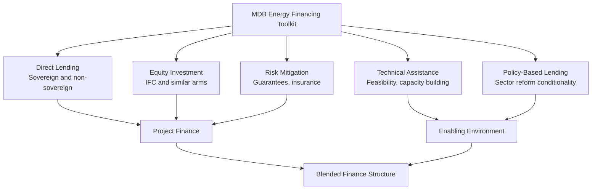

## Multilateral Development Bank Roles in Energy Financing

### Definition and Scope

Multilateral development banks (MDBs) are international financial institutions owned by multiple member governments that provide financing, guarantees, technical assistance, and policy advice to support economic development, including energy sector investment in emerging and frontier markets. In energy financing specifically, MDBs perform functions that extend well beyond simple capital provision: they address market failures related to risk, information asymmetry, and coordination that limit private capital mobilization, particularly in markets where commercial financing alone is insufficient or unavailable at bankable terms.

**Key Points**

- Major energy-relevant MDBs include the World Bank Group (IBRD, IDA, IFC, MIGA), regional development banks (African Development Bank, Asian Development Bank, Inter-American Development Bank, European Bank for Reconstruction and Development), and newer institutions such as the New Development Bank and Asian Infrastructure Investment Bank
- MDB roles span the full project lifecycle: early-stage technical assistance and feasibility studies, policy and regulatory reform support, direct project financing, risk mitigation instruments, and portfolio guarantees
- A defining economic characteristic of MDB financing is its **catalytic or "additionality" function** — MDBs generally aim to mobilize private capital that would not otherwise be available, rather than substitute for financing markets could provide on their own

### Instruments and Mechanisms

#### Direct Lending

| Type | Counterparty | Typical Use |
| --- | --- | --- |
| Sovereign lending | National governments | Transmission/distribution infrastructure, sector reform programs, state utility recapitalization |
| Non-sovereign/private sector lending | Project companies, private utilities | IPP debt financing, distribution concession investment |
| Concessional/soft loans (e.g., IDA) | Low-income country governments | Below-market-rate financing for the poorest countries with limited debt capacity |

#### Equity and Quasi-Equity Investment

- Institutions such as the International Finance Corporation (IFC) provide direct equity or mezzanine investment in energy projects and, increasingly, in energy sector financial intermediaries, aiming to demonstrate commercial viability and crowd in subsequent private equity investment in similar projects
- **Key Points**: Equity participation by an MDB arm is often used specifically as a signaling mechanism — the MDB's due diligence and continued involvement is intended to reduce information asymmetry for other potential investors evaluating similar opportunities in an unfamiliar market or technology segment

#### Risk Mitigation Instruments

- **Partial Risk Guarantees (PRGs)**: Cover specified categories of government or state-owned entity payment default risk, addressing the counterparty credit risk that private lenders and IPP sponsors face when a state-owned offtaker is the primary revenue counterparty
- **Partial Credit Guarantees**: Cover a portion of debt service risk regardless of cause, used to improve the credit profile of a borrower to access longer tenors or lower rates than would otherwise be available
- **Political Risk Insurance (MIGA and similar)**: Covers currency inconvertibility/transfer restriction, expropriation, breach of contract, and war/civil disturbance risk — distinct from commercial or currency depreciation risk
- **Key Points**: These instruments do not eliminate underlying project or country risk but reallocate it to an institution (the MDB) with a different risk-bearing capacity, longer investment horizon, and — critically — a preferred creditor status in many sovereign contexts that gives MDB-guaranteed instruments a distinct risk profile from equivalent commercial guarantees

#### Technical Assistance and Capacity Building

- Feasibility studies, resource assessment (e.g., wind and solar resource mapping), regulatory framework design, and utility capacity building are frequently financed on a grant or highly concessional basis, since these activities generate public-good-like benefits (improved sector information, institutional capacity) that are difficult for a single private investor to capture and therefore tend to be underprovided by purely commercial actors

#### Policy-Based Lending and Sector Reform Conditionality

- Budget support operations tied to specific energy sector policy reform commitments (tariff reform, unbundling, regulatory independence) leverage the financing relationship to support politically difficult structural reforms discussed elsewhere in this chapter (see utility financial viability and sector reform topics)
- **Key Points**: This conditionality-based approach has drawn both support (as a mechanism to build credible reform commitment) and criticism (concerns about sovereignty, the appropriateness of external institutions influencing domestic tariff policy, and historically mixed evidence on the durability of reforms undertaken primarily to satisfy lending conditionality) [Unverified — the empirical literature on conditionality effectiveness is extensive and its conclusions vary by methodology, time period, and country sample]

### Economic Rationale: Addressing Market Failures

**Key Points**

- **Information asymmetry and first-mover cost**: Early investors in a new technology or market face disproportionate due diligence and demonstration costs relative to later entrants who benefit from the resolved uncertainty; MDB involvement in early transactions can absorb part of this cost and generate market information (resource data, regulatory precedent, technical performance data) that benefits the broader market
- **Coordination failure**: Large infrastructure investments sometimes require complementary investments (generation, transmission, distribution) that are individually unviable without the others being committed simultaneously; MDBs can help coordinate and sequence multi-party financing that no single private actor could arrange alone
- **Externality-related underinvestment**: Renewable energy and grid modernization investments generate positive externalities (emissions reduction, energy security, reduced local air pollution) not fully captured in project cash flows; concessional MDB financing can be structured to reflect this social value that private commercial return calculations would not capture on their own

$$\text{Private Investment} < \text{Socially Optimal Investment} \Rightarrow \text{Concessional Finance Fills the Gap}$$

### Blended Finance Structures

Blended finance combines concessional public/philanthropic capital with commercial capital in a single structure, using the concessional layer to improve the risk-return profile for commercial investors.

| Layer | Typical Provider | Risk Position |
| --- | --- | --- |
| First-loss/junior equity | Development finance institution or donor-funded facility | Absorbs initial losses |
| Senior debt | Commercial lenders, institutional investors | Protected by junior layers |
| Guarantee overlay | MDB partial risk/credit guarantee | Reduces residual risk on senior tranche |

**Key Points**

- The explicit goal of blended structures is **capital mobilization leverage** — using a defined amount of concessional capital to attract a multiple of that amount in commercial co-investment that would not otherwise flow to the transaction
- Reported mobilization ratios (commercial capital mobilized per dollar of concessional capital) vary substantially by instrument type, sector, and market, and have been the subject of extensive tracking and methodology debate among MDBs and development finance institutions (e.g., through joint reporting initiatives) [Unverified — specific mobilization ratio figures should be checked against current joint MDB reporting, as methodologies and reported figures have evolved over time]

### Case Pattern: Renewable Energy Auction Support

**Key Points**

- MDBs have played a documented role in supporting the design and initial rounds of competitive renewable energy procurement programs in multiple emerging markets, providing technical assistance for auction design, partial risk guarantees to backstop offtaker payment obligations, and sometimes direct or concessional financing for early rounds to establish a credible price discovery track record
- This support function has been associated in several documented country programs with declining renewable energy tender prices across successive auction rounds, though attributing price declines specifically to MDB involvement versus broader global technology cost declines and increased market competition requires careful analysis and varies by case [Inference — separating the MDB-specific contribution from concurrent global cost trends is methodologically challenging and not precisely quantifiable from available public information]

### Diagram: MDB Role in De-Risking Investment

<svg xmlns="http://www.w3.org/2000/svg" viewBox="0 0 720 300" font-family="Arial, sans-serif">
<text x="360" y="24" text-anchor="middle" font-size="16" font-weight="bold">MDB De-Risking Function (svg_diagram)</text>
<rect x="40" y="60" width="640" height="50" fill="#991b1b" opacity="0.85" />
<text x="360" y="90" text-anchor="middle" font-size="12" fill="white" font-weight="bold">Perceived Risk Without MDB Involvement (high country/currency/counterparty risk premium)</text>
<line x1="360" y1="115" x2="360" y2="150" stroke="#374151" stroke-width="2" marker-end="url(#arrow5)" />
<text x="450" y="140" font-size="11" font-style="italic">Guarantees, TA, blended finance</text>
<rect x="40" y="160" width="640" height="50" fill="#166534" opacity="0.85" />
<text x="360" y="190" text-anchor="middle" font-size="12" fill="white" font-weight="bold">Reduced Effective Risk to Commercial Investors</text>
<line x1="360" y1="215" x2="360" y2="250" stroke="#374151" stroke-width="2" marker-end="url(#arrow5)" />
<rect x="140" y="255" width="440" height="40" fill="#1e40af" opacity="0.85" />
<text x="360" y="280" text-anchor="middle" font-size="12" fill="white" font-weight="bold">Increased Private Capital Mobilization</text>
</svg>

### Critiques and Limitations of MDB Energy Financing

**Key Points**

- **Crowding-out concerns**: Critics argue that in some cases, MDB financing on favorable terms may displace rather than mobilize commercial capital that would have been available anyway, undermining the additionality rationale — a concern MDBs generally attempt to address through additionality testing during project appraisal, though the robustness of such testing has been debated [Unverified — the extent of genuine crowding-out versus genuine additionality is contested empirically and varies by transaction]
- **Fossil fuel financing debates**: MDBs have faced significant scrutiny and internal policy revision regarding continued financing of fossil fuel projects (particularly natural gas) in the context of global decarbonization goals, balanced against energy access and energy security arguments in specific country contexts — most major MDBs have adopted policies restricting or ending direct coal financing, with gas financing policies varying more significantly by institution [Unverified — specific institutional policies on fossil fuel financing change periodically and should be verified against current institutional policy documents]
- **Conditionality and sovereignty tension**: As noted above, policy-based lending conditionality generates ongoing debate about the appropriate scope of external institutional influence over domestic energy policy choices
- **Bureaucratic transaction costs**: MDB project preparation and approval processes are frequently criticized as slower and more procedurally complex than commercial financing alternatives, which can be a meaningful disadvantage for time-sensitive project development, particularly in fast-moving technology segments like renewable energy where equipment costs and technical standards evolve rapidly

### Worked Example: Guarantee Impact on Project Financing Cost

A renewable energy project in a frontier market faces the following financing terms with and without an MDB partial risk guarantee covering offtaker payment default:

| Scenario | Perceived Offtaker Risk | Debt Tenor Available | Interest Rate | Approximate Impact on LCOE |
| --- | --- | --- | --- | --- |
| Without guarantee | High | 8–10 years | Higher risk premium | Higher, due to shorter tenor requiring higher annual debt service |
| With MDB partial risk guarantee | Reduced | 15–18 years | Lower risk premium | Lower, due to longer tenor and reduced risk premium spreading debt service over more years |

**Example**

Because a partial risk guarantee both reduces the interest rate risk premium and, often more significantly, extends the achievable debt tenor (since lenders are more willing to commit to longer maturities against a partially guaranteed counterparty), the levelized cost of electricity impact can be substantial: extending debt tenor from roughly 8 to 15+ years alone can materially reduce the annual debt service burden built into the tariff, illustrating why guarantee instruments are often a more powerful de-risking lever than direct interest rate subsidies of comparable face value.

### Conclusion

Multilateral development banks play a role in emerging market energy financing that extends well beyond direct capital provision, functioning primarily as market-failure-correcting institutions that address information asymmetry, coordination problems, and risk allocation constraints that limit private capital flow to bankable but unfamiliar or high-perceived-risk markets and technologies. Their toolkit — spanning direct lending, equity investment, risk mitigation guarantees, technical assistance, and policy-based lending — is increasingly deployed through blended finance structures explicitly designed to mobilize a multiple of commercial capital per dollar of concessional resources committed. This catalytic function remains subject to ongoing debate regarding genuine additionality versus crowding-out, the appropriate scope of reform conditionality, and the evolving position of these institutions on fossil fuel financing amid competing energy access, energy security, and decarbonization objectives.

**Related Topics**

- Blended finance structuring and capital mobilization ratio methodology
- Partial risk guarantees and political risk insurance instrument design
- Policy-based lending conditionality and energy sector reform durability
- IFC and MIGA private sector energy investment mechanisms
- Renewable energy auction design and MDB technical assistance programs
- MDB fossil fuel financing policy evolution
- Preferred creditor status and sovereign risk mitigation
- Additionality assessment methodology in development finance