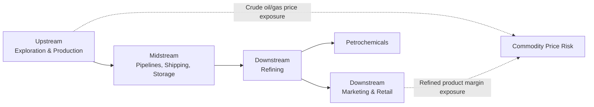

## Vertical Integration Strategies of Energy Majors

### Definition and Scope

Vertical integration in the energy sector refers to a company's ownership or control of multiple sequential stages of the value chain — from upstream resource extraction through midstream processing and transportation to downstream refining, marketing, and retail. Energy majors (the large, typically publicly traded international oil companies such as ExxonMobil, Shell, Chevron, TotalEnergies, and BP) have historically been organized around integrated business models, though the degree and strategic rationale for integration has evolved substantially and varies across companies and eras.

**Key Points**

- The classic "integrated oil company" (IOC) model spans upstream (exploration and production), midstream (pipelines, shipping, storage), and downstream (refining, petrochemicals, marketing/retail) segments under a single corporate structure
- Vertical integration is distinct from horizontal integration (expanding within a single value chain stage, e.g., acquiring additional upstream acreage) and from diversification into adjacent energy forms (e.g., oil majors investing in renewable power generation)
- The strategic case for integration has shifted over time in response to changing commodity price volatility, capital market preferences, and — more recently — energy transition considerations

### The Value Chain Structure

**Key Points**

- **Upstream**: Exploration, field development, and production of crude oil and natural gas — typically the highest-margin but also highest-capital-intensity and highest-geological-risk segment
- **Midstream**: Transportation and storage infrastructure (pipelines, LNG shipping, terminals) connecting production to processing and end markets, generally characterized by more stable, often regulated or long-term-contracted cash flows
- **Downstream**: Refining (converting crude into refined products), petrochemicals, and marketing/retail (fuel stations, lubricants) — margins here are driven by the crack spread (the differential between crude input cost and refined product output prices) rather than crude price levels directly

### Economic Rationale for Vertical Integration

**Reducing Transaction Costs (Transaction Cost Economics)**

Following Williamson's transaction cost framework, vertical integration can be justified where relationship-specific investments (e.g., a refinery configured for a specific crude slate, or a pipeline serving a specific field) create hold-up risk if upstream and downstream stages are operated by separate, arms-length parties.

$$\text{Integration Benefit} > \text{Coordination Cost of Separate Ownership} \Rightarrow \text{Vertical Integration Favored}$$

**Key Points**

- A refinery built to process a specific crude grade from a particular field represents an **asset-specific investment**; if the refinery and the field are owned by different parties, each faces contractual hold-up risk (the field owner could demand higher prices knowing the refinery has no easy alternative crude source, or vice versa) — common ownership internalizes this risk
- This logic has historically been strongest for **crude-refinery matching** and **pipeline-field relationships**, where physical and locational specificity is highest

**Margin Smoothing Across Commodity Cycles**

- Upstream profitability is highly correlated with crude oil prices, while downstream refining margins (crack spreads) are frequently counter-cyclical or only weakly correlated with crude price levels — refining margins can widen when crude prices fall (if product prices are stickier) and compress during periods of tight crude supply
- **Key Points**: This creates a natural hedging rationale for integration — a company with both upstream and downstream segments experiences less consolidated earnings volatility than a pure-play upstream or downstream company, since weakness in one segment's margin is often, though not always, offset by strength in the other [Inference — the strength of this natural hedge varies by cycle and is not a perfectly reliable offsetting relationship in all periods]

**Information and Coordination Advantages**

- Integrated companies possess direct visibility into crude quality, supply reliability, and market demand signals across the value chain, potentially enabling better-informed investment and operational decisions than would be available to a stand-alone entity relying on arms-length market transactions and public price signals alone

### Trends Toward Deintegration

**Key Points**

- Since the 1990s–2000s, many energy majors have pursued **selective deintegration** — divesting downstream retail and, in some cases, refining assets — reflecting several economic and capital market pressures distinct from the original transaction cost rationale for integration:
  - **Capital market preference for "pure-play" valuation**: Equity analysts and investors have often argued that integrated companies trade at a "conglomerate discount," since a single integrated entity's stock is harder to value cleanly against sector-specific peer comparables than a focused pure-play upstream or downstream company
  - **Differing capital allocation and return profiles**: Upstream exploration is high-risk, high-return capital allocation, while downstream retail is comparatively low-risk, capital-light, and cash-generative — some companies have concluded that these segments warrant different capital discipline and management focus, better achieved through separation
  - **Rise of independent refiners and traders**: The growth of specialized independent refining companies (e.g., in the US, companies focused purely on refining) and sophisticated commodity trading houses has demonstrated that arms-length market transactions can substitute for internal coordination in many segments, reducing the transaction-cost case for integration where crude and product markets are sufficiently liquid and standardized
- This has produced a bifurcated landscape: some majors retain substantial integration (particularly in refining tied to specific crude sourcing arrangements) while others have moved toward more upstream-focused portfolios with reduced downstream footprint [Unverified — the specific portfolio composition of individual named companies changes over time through ongoing divestment and acquisition activity and should be verified against current company disclosures]

### Diagram: Integration vs. Deintegration Trade-offs

<svg xmlns="http://www.w3.org/2000/svg" viewBox="0 0 720 320" font-family="Arial, sans-serif">
<text x="360" y="24" text-anchor="middle" font-size="16" font-weight="bold">Integration vs. Deintegration Trade-offs (svg_diagram)</text>
<rect x="30" y="60" width="310" height="220" rx="8" fill="#dbeafe" stroke="#1e40af" />
<text x="185" y="85" text-anchor="middle" font-size="13" font-weight="bold">Favors Integration</text>
<text x="50" y="115" font-size="11">• High asset specificity</text>
<text x="50" y="140" font-size="11">• Illiquid/thin crude or product</text>
<text x="65" y="158" font-size="11">markets</text>
<text x="50" y="183" font-size="11">• Desire for margin</text>
<text x="65" y="201" font-size="11">smoothing across cycle</text>
<text x="50" y="226" font-size="11">• Strategic crude security</text>
<text x="65" y="244" font-size="11">objectives</text>
<rect x="380" y="60" width="310" height="220" rx="8" fill="#dcfce7" stroke="#166534" />
<text x="535" y="85" text-anchor="middle" font-size="13" font-weight="bold">Favors Deintegration</text>
<text x="400" y="115" font-size="11">• Liquid, standardized</text>
<text x="415" y="133" font-size="11">commodity markets</text>
<text x="400" y="158" font-size="11">• Capital market pure-play</text>
<text x="415" y="176" font-size="11">valuation preference</text>
<text x="400" y="201" font-size="11">• Segment-specific capital</text>
<text x="415" y="219" font-size="11">discipline needs</text>
<text x="400" y="244" font-size="11">• Availability of sophisticated</text>
<text x="415" y="262" font-size="11">independent trading markets</text>
</svg>

### Vertical Integration and the Energy Transition

**Key Points**

- Energy majors' diversification into low-carbon power generation, renewables, and, in some cases, electricity retail represents a form of **horizontal diversification into an adjacent energy value chain** rather than vertical integration within the traditional oil and gas chain, though some companies have framed this as extending an "integrated energy company" model analogous to their historical oil and gas integration logic
- **Key Points**: The strategic rationale offered for this diversification parallels the traditional vertical integration logic in some respects (leveraging existing customer relationships, trading and risk management capability, and project execution expertise) but differs in that the underlying commodity (electrons versus barrels) involves different market structures, regulatory environments, and competitive dynamics, meaning the transaction-cost and asset-specificity arguments that justified traditional oil and gas integration do not transfer automatically [Inference — the degree to which historical integration capabilities and rationale usefully transfer to renewable power and electricity retail businesses is a matter of ongoing strategic debate among companies and analysts, with different majors adopting visibly different degrees of commitment to this diversification]
- Some companies have pursued this diversification more aggressively (larger renewable power and low-carbon investment allocations) while others have maintained closer strategic focus on core oil and gas integration, reflecting differing corporate strategic bets on the pace and nature of energy transition and differing shareholder base preferences [Unverified — relative strategic positioning among specific named companies shifts over time with changing capital allocation announcements and should be verified against current company strategy disclosures]

### National Oil Companies: A Distinct Integration Logic

**Key Points**

- National Oil Companies (NOCs) — state-owned entities such as Saudi Aramco, Petrobras, and others — frequently pursue vertical integration for reasons distinct from the shareholder-value-maximization logic typically emphasized in IOC integration strategy, including:
  - **Resource nationalism and value capture**: Extending state control and value capture further down the value chain (into domestic refining and petrochemicals) rather than exporting only unprocessed crude
  - **Domestic industrial policy objectives**: Building downstream petrochemical and refining capacity to support broader national industrialization and employment goals, which may be pursued even where standalone commercial returns would not independently justify the investment under private-sector capital allocation criteria
  - **Energy security and price stability objectives**: Ensuring domestic refined product supply security independent of international market conditions
- This means integration decisions by NOCs cannot be analyzed purely through the transaction-cost and capital-market-valuation lens applied to IOCs, since NOC objective functions typically include broader sovereign economic development goals alongside, or sometimes ahead of, standalone project-level commercial returns [Inference — the relative weighting of commercial versus broader sovereign objectives in specific NOC investment decisions is not typically disclosed with the transparency available for publicly traded IOCs, making precise characterization difficult]

### Worked Example: Margin Smoothing Illustration

Consider a simplified two-segment company facing a crude price decline:

| Period | Crude Price | Upstream Segment Margin | Refining Crack Spread | Downstream Segment Margin | Consolidated Result |
| --- | --- | --- | --- | --- | --- |
| High crude price environment | $90/bbl | Strong | Compressed (input costs high, product prices lag) | Weak | Moderated by mix |
| Crude price decline | $50/bbl | Weakened | Wider (input costs fall faster than product prices in the short term) | Strengthened | Moderated by mix |

**Example**

An integrated company experiences a smaller swing in consolidated earnings across this price cycle than either a pure upstream or pure downstream company would individually, because the widening crack spread during the crude price decline partially offsets the weaker upstream segment result — illustrating the natural hedge rationale that has historically supported integration, while also illustrating why this relationship is a matter of degree and correlation strength rather than a guaranteed, precisely offsetting mechanism in every cycle [Inference — the actual offsetting relationship strength varies by the specific timing and drivers of any given price cycle].

### Conclusion

Vertical integration strategies among energy majors have evolved from a historically dominant "fully integrated oil company" model — justified by transaction cost economics around asset-specific crude-refinery relationships and margin-smoothing benefits across upstream and downstream cycles — toward a more differentiated landscape shaped by capital market pure-play valuation preferences, the maturation of liquid arms-length crude and product trading markets, and, more recently, strategic diversification into adjacent low-carbon energy value chains that do not straightforwardly inherit the traditional integration rationale. National oil companies represent a structurally distinct case, where integration decisions are shaped as much by sovereign industrial policy and resource nationalism objectives as by the shareholder-value-maximization framework that dominates analysis of investor-owned international majors.

**Related Topics**

- Transaction cost economics and asset specificity theory (Williamson)
- Crack spread economics and refining margin drivers
- Conglomerate discount theory in equity valuation
- National oil company strategic objectives versus international oil company shareholder models
- Energy major diversification into renewable power and electricity retail
- Commodity trading houses and the rise of arms-length crude/product markets
- Capital allocation frameworks across upstream, midstream, and downstream segments
- Resource nationalism and domestic value-chain capture policy