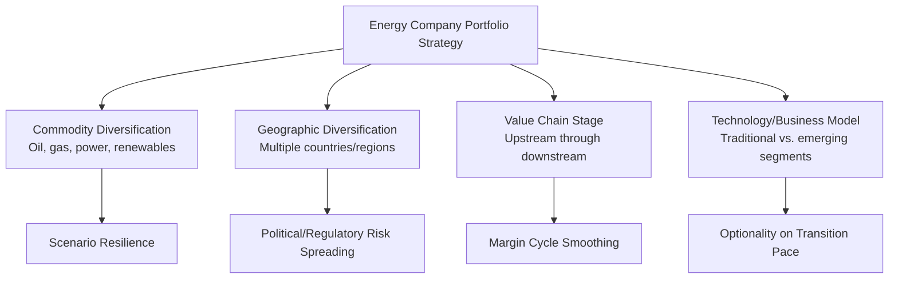

## Diversification and Portfolio Strategy Across Energy Value Chains

### Definition and Scope

Diversification and portfolio strategy in the energy sector refers to a company's deliberate allocation of capital and management attention across multiple business segments — spanning different commodities (oil, gas, power, renewables), different value chain stages, different geographies, and different risk-return profiles — with the objective of optimizing risk-adjusted returns, managing exposure to structural transition uncertainty, and sustaining long-term enterprise value across multiple plausible future scenarios.

**Key Points**

- Diversification is analytically distinct from vertical integration: diversification typically refers to expansion across *different commodity or business types* (oil and gas into power generation, or into renewables), while vertical integration refers to expansion across *sequential stages within a single value chain*
- Energy company portfolio strategy is increasingly explicitly framed around **scenario planning** for multiple energy transition pathways, given genuine uncertainty about the pace and shape of the shift away from fossil fuels
- Portfolio strategy choices vary substantially across companies, reflecting differing views on transition timing, differing shareholder base composition and preferences, and differing starting-point asset endowments

### Rationale for Diversification: Corporate Finance Theory

**Modern Portfolio Theory Applied to Corporate Strategy**

Classical portfolio theory suggests diversification reduces unsystematic (idiosyncratic) risk by combining assets with imperfectly correlated returns. Applied at the corporate level, this logic has historically been contested in corporate finance theory, since public shareholders can, in principle, achieve diversification more efficiently themselves by holding a diversified portfolio of pure-play company stocks rather than relying on a single company to diversify internally.

$$\sigma_{portfolio}^2 = w_1^2\sigma_1^2 + w_2^2\sigma_2^2 + 2w_1w_2\rho_{1,2}\sigma_1\sigma_2$$

**Key Points**

- The classical corporate finance objection to diversification — that it duplicates what shareholders can do themselves at lower cost, and often at a "conglomerate discount" — applies to energy company diversification in principle, but energy sector diversification proponents typically argue several distinct rationales apply beyond pure risk-pooling:
  - **Transition scenario hedging**: Given genuine, irreducible uncertainty about the pace of decarbonization policy and technology adoption (as opposed to purely diversifiable idiosyncratic risk), a company with exposure across both traditional hydrocarbons and low-carbon energy may be better positioned across multiple plausible future states of the world than a company committed entirely to one segment [Inference — whether transition-pathway uncertainty is more like idiosyncratic risk (better diversified by shareholders) or systematic/structural risk (potentially warranting corporate-level hedging) is a genuinely contested question in energy strategy analysis]
  - **Capability and asset transfer**: Diversification into adjacent segments that can leverage existing capabilities (large-scale project execution, offshore engineering expertise transferring from oil and gas platforms to offshore wind, trading and risk management capability transferring from commodity trading to power trading) may generate genuine synergies not available to a shareholder simply buying a basket of unrelated pure-play stocks
  - **License to operate and stakeholder considerations**: Diversification toward lower-carbon activities may address regulatory, investor (particularly ESG-focused capital), and broader stakeholder pressure in ways that pure financial diversification logic does not fully capture

### Dimensions of Energy Portfolio Diversification

#### Commodity and Business-Type Diversification

- **Oil and gas majors diversifying into power**: Several traditional oil and gas majors have built electricity generation, renewable development, and power trading/retail businesses, ranging from modest portfolio allocations to more substantial strategic commitments depending on the company [Unverified — specific capital allocation percentages by named companies change with each strategy update and should be verified against current company disclosures]
- **Natural gas as a "transition fuel" positioning**: Many companies have emphasized natural gas (and associated LNG infrastructure) as a core diversification pillar, positioned as a lower-carbon-intensity fossil fuel that can support grid balancing alongside variable renewables, though this positioning has drawn debate regarding methane leakage lifecycle emissions and the risk of gas infrastructure becoming a stranded or underutilized asset under more aggressive decarbonization scenarios [Inference — the long-term role of gas as a "transition fuel" versus a target for more rapid displacement is an unresolved and actively debated question in energy and climate policy analysis]
- **Carbon capture, hydrogen, and biofuels**: Additional diversification directions pursued to varying degrees by different companies, often justified by capability transfer arguments (subsurface expertise for carbon storage, large-project execution for hydrogen infrastructure)

#### Geographic Diversification

- Spreading operations and assets across multiple countries and regulatory jurisdictions reduces concentrated exposure to any single country's political risk, resource nationalization risk, or regulatory shift, though this must be balanced against the operational complexity and management attention cost of operating across highly heterogeneous regulatory and political environments

#### Scenario-Based Portfolio Construction

**Key Points**

- Leading energy companies increasingly construct portfolio strategy explicitly around multiple published transition scenarios (ranging from slower, policy-constrained transition pathways to more rapid, Paris-Agreement-aligned pathways), stress-testing planned capital allocation against each scenario's implied demand and price trajectories for different energy commodities
- This scenario-based approach represents a methodological shift from single-point-forecast capital planning toward **real options thinking**, where certain investments are valued partly for the strategic optionality they preserve under uncertain future conditions rather than solely for their expected-value net present value under a single base-case forecast [Inference — the degree to which real options framing genuinely drives capital allocation decisions versus serving as retrospective strategic narrative is difficult to verify externally from public disclosures alone]

### The Core Strategic Tension: Focus vs. Optionality

$$\text{Focused Strategy: Maximize Returns in Core Competency} \quad \text{vs.} \quad \text{Diversified Strategy: Preserve Optionality Across Scenarios}$$

**Key Points**

- Critics of energy major diversification into renewables and power argue that these companies often lack the specific competitive advantages that would justify entry versus pure-play renewable developers and utilities, who may have lower cost of capital for these specific asset classes, deeper sector-specific expertise, and organizational structures better suited to the different risk-return and margin profile of renewable power versus oil and gas
- Proponents counter that the scale of capital, project execution capability, and existing energy market relationships held by energy majors provide a genuine, transferable advantage in scaling certain segments (particularly offshore wind, given overlap with offshore oil and gas engineering competencies, and large-scale trading operations)
- This debate reflects a broader unresolved question in energy sector strategy: whether the "integrated energy company" diversification model will prove analogous to historical successful vertical integration, or will instead resemble unsuccessful historical conglomerate diversification episodes in other industries where companies entered adjacent sectors without a defensible competitive advantage [Speculation — this is a matter of ongoing strategic debate without settled empirical resolution, and outcomes are likely to vary significantly by company and by specific diversification segment]

### Diagram: Portfolio Strategy Positioning Spectrum

<svg xmlns="http://www.w3.org/2000/svg" viewBox="0 0 720 300" font-family="Arial, sans-serif">
<text x="360" y="24" text-anchor="middle" font-size="16" font-weight="bold">Energy Company Portfolio Positioning Spectrum (svg_diagram)</text>
<line x1="60" y1="150" x2="660" y2="150" stroke="#374151" stroke-width="3" />
<polygon points="660,144 675,150 660,156" fill="#374151" />
<circle cx="120" cy="150" r="10" fill="#991b1b" />
<text x="120" y="185" text-anchor="middle" font-size="11" font-weight="bold">Core Hydrocarbon</text>
<text x="120" y="198" text-anchor="middle" font-size="11">Focus</text>
<text x="120" y="120" text-anchor="middle" font-size="10">Maximizes core-competency returns</text>
<circle cx="300" cy="150" r="10" fill="#c2410c" />
<text x="300" y="185" text-anchor="middle" font-size="11" font-weight="bold">Gas-Weighted</text>
<text x="300" y="198" text-anchor="middle" font-size="11">Transition Positioning</text>
<circle cx="480" cy="150" r="10" fill="#65a30d" />
<text x="480" y="185" text-anchor="middle" font-size="11" font-weight="bold">Balanced</text>
<text x="480" y="198" text-anchor="middle" font-size="11">Multi-Energy Portfolio</text>
<circle cx="640" cy="150" r="10" fill="#166534" />
<text x="640" y="185" text-anchor="middle" font-size="11" font-weight="bold">Renewables/Power-</text>
<text x="640" y="198" text-anchor="middle" font-size="11">Led Diversification</text>
<text x="640" y="120" text-anchor="middle" font-size="10">Maximizes transition optionality</text>
</svg>

### Capital Markets and Investor Response

**Key Points**

- Investor response to energy major diversification strategies has been mixed and has varied significantly by investor type: some institutional investors and ESG-focused funds have favored diversification toward lower-carbon segments, while other investors — including some seeking direct, undiluted exposure to oil and gas commodity price movements — have expressed preference for focused, "pure-play" hydrocarbon strategies, arguing that diversification dilutes returns without proportionate strategic benefit [Unverified — the balance of investor sentiment shifts over time with commodity price cycles, ESG capital flow trends, and relative segment performance, and any characterization risks being time-period-specific]
- This has created a genuine strategic tension for company management: diversification intended to address long-term transition risk and broaden stakeholder legitimacy can, in the near-to-medium term, create tension with segments of the investor base focused on near-term returns from core hydrocarbon operations
- Some companies have responded to this tension by pursuing structural separation (spinning off renewable or specific business units) intended to allow investors to select their preferred exposure directly, echoing the deintegration logic discussed in vertical integration strategy [Unverified — specific structural separation transactions and their outcomes are company- and time-period-specific and should be verified against current corporate transaction disclosures]

### Worked Example: Scenario-Weighted Portfolio Comparison

Consider two illustrative strategic postures evaluated across three simplified transition scenarios:

| Scenario | Focused Hydrocarbon Portfolio Outcome | Diversified Portfolio Outcome |
| --- | --- | --- |
| Slow transition (continued fossil fuel demand growth) | Strong returns from core asset base | Moderate returns; renewable segment underperforms relative to opportunity cost |
| Moderate/managed transition | Adequate but declining long-term returns as demand growth slows | Balanced returns across segments |
| Rapid transition (aggressive decarbonization policy) | Significant stranded asset risk and value impairment | Renewable/power segment provides offsetting value; reduced overall downside |

**Example**

A diversified portfolio sacrifices some upside in the slow-transition scenario (since capital allocated to lower-return-at-the-time renewable segments could have earned higher returns in continued core hydrocarbon operations) in exchange for reduced downside exposure in the rapid-transition scenario — illustrating the classic risk-return trade-off underlying diversification, with the "correct" strategic choice depending critically on management's (and the market's) probability-weighting across these scenarios, which is itself a matter of significant uncertainty and disagreement [Inference — no consensus probability weighting across transition scenarios exists, meaning the ex-ante "optimal" portfolio choice cannot be objectively determined and different companies rationally reach different strategic conclusions based on differing scenario assessments].

### Conclusion

Diversification and portfolio strategy across energy value chains reflects companies' attempts to navigate genuine structural uncertainty about the pace and shape of the energy transition, extending beyond classical corporate finance risk-pooling logic (which shareholders could largely replicate themselves) toward arguments grounded in capability transfer, scenario resilience, and stakeholder legitimacy. This has produced visibly divergent strategic postures across energy majors — from continued core hydrocarbon focus to more substantial multi-energy diversification — reflecting differing assessments of transition timing, differing views on the transferability of core competencies to adjacent segments, and differing investor base compositions and preferences. The absence of consensus on transition-scenario probability weighting means this strategic divergence is unlikely to resolve toward a single dominant model in the near term, and will likely continue to be evaluated retrospectively against how the actual pace of transition unfolds relative to each company's strategic bet.

**Related Topics**

- Real options theory applied to corporate energy investment planning
- Stranded asset risk and scenario-based capital allocation
- ESG investment flows and their influence on energy company strategy
- Conglomerate discount theory and corporate structural separation
- Offshore wind and offshore oil/gas capability transfer analysis
- Natural gas transition fuel debate and methane lifecycle emissions
- Energy company scenario planning methodology (e.g., published transition scenario frameworks)
- Capital markets segmentation between pure-play and diversified energy equities