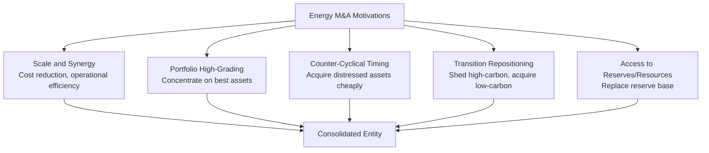

## Mergers, Acquisitions, and Asset Divestiture Patterns

### Definition and Scope

Mergers, acquisitions, and divestitures (M&A) in the energy sector encompass the transactions through which companies consolidate, acquire, or shed assets and business units to reshape their portfolios in response to commodity cycles, strategic repositioning needs, capital discipline pressures, and energy transition considerations. Energy sector M&A activity has historically been notably cyclical, correlating closely with commodity price cycles, and has increasingly featured transition-driven strategic rationale layered on top of traditional consolidation and scale motivations.

**Key Points**

- Energy M&A activity level and deal rationale differ substantially by segment (upstream oil and gas consolidation, midstream infrastructure roll-ups, downstream refining divestitures, and renewable energy platform acquisitions each follow somewhat distinct patterns)
- Deal activity has historically shown strong correlation with commodity price cycles: low-price environments tend to produce distressed consolidation and asset sales, while high-price environments have historically produced both aggressive growth-oriented acquisitions and, more recently, capital discipline-driven return-of-capital preferences that can dampen large-scale M&A appetite
- Transition-related strategic rationale (portfolio decarbonization, renewable platform acquisition, and divestiture of higher-carbon-intensity or higher-transition-risk assets) has become an increasingly explicit driver of transaction structuring, alongside traditional scale, synergy, and commodity-cycle-timing rationale

### Classic Motivations for Energy Sector M&A

**Scale and Synergy Realization**

- Consolidation among upstream operators in mature basins (e.g., shale plays) has frequently been justified by economies of scale in drilling and completion operations, shared infrastructure utilization, and general and administrative cost reduction achievable by combining overlapping corporate functions
- **Key Points**: Synergy realization claims made at deal announcement are subject to well-documented execution risk; the gap between announced projected synergies and realized post-integration cost savings has been a recurring subject of scrutiny in M&A performance analysis across industries generally, and energy sector transactions are not exempt from this pattern [Inference — specific synergy realization rates for individual transactions are difficult to verify precisely from public disclosures and vary considerably by transaction]

**Portfolio High-Grading**

- Companies frequently use divestiture to exit non-core or lower-return assets (mature fields with declining production, geographically peripheral positions, or assets requiring disproportionate management attention relative to their portfolio contribution) while using acquisition proceeds or capital to concentrate on higher-return, larger-scale, or strategically core positions
- This pattern is sometimes described as "portfolio high-grading" — systematically improving average portfolio quality metrics (such as breakeven cost per barrel) through selective acquisition and divestiture rather than exclusively through organic development

**Counter-Cyclical and Distressed Acquisition**

- Companies with stronger balance sheets have historically used commodity price downturns as opportunities to acquire distressed assets or entire companies at valuations compressed by the price environment, on the expectation of subsequent price recovery
- **Key Points**: This counter-cyclical strategy requires balance sheet capacity (low leverage, strong liquidity) precisely during the periods when such capacity is scarcest across the sector generally, meaning only a subset of well-capitalized companies are typically positioned to execute this strategy during any given downturn

**Reserve Replacement**

- For upstream companies, M&A can serve as an alternative to exploration-based reserve replacement, particularly where organic exploration success rates or available prospective acreage are limited — acquiring already-discovered reserves and production, while typically commanding a valuation premium over unproven exploration acreage, avoids exploration risk entirely

### Transition-Driven M&A Patterns

**Divestiture of Higher-Carbon-Intensity Assets**

- Several energy companies have divested higher-carbon-intensity assets (including specific high-emissions-intensity oil sands, coal-related, or older/less-efficient thermal power assets) as part of portfolio decarbonization strategies aimed at improving reported portfolio-average emissions intensity metrics
- **Key Points**: This pattern has drawn a specific and widely discussed critique in energy transition analysis: divestiture of a high-emissions asset by a company subject to decarbonization pressure does not necessarily reduce global emissions if the asset continues operating under new ownership, potentially with a buyer facing less stakeholder or regulatory pressure regarding its emissions profile — this dynamic is sometimes termed "emissions laundering" or the "seller's problem" in transition finance literature, and represents a genuine limitation of divestiture as a decarbonization strategy at the level of the buyer-seller system as a whole, even where it improves the selling company's own reported metrics [Inference — the magnitude and prevalence of this effect across the broader universe of energy asset divestitures is difficult to comprehensively quantify, though the mechanism itself is well-documented conceptually in the literature]

**Acquisition of Renewable and Low-Carbon Platforms**

- Energy majors have acquired renewable energy development platforms, battery storage companies, EV charging networks, and related low-carbon businesses as a faster route to scale in these segments than purely organic development, reflecting the general M&A logic that acquisition can compress the time-to-scale relative to greenfield development, at the cost of an acquisition premium
- **Key Points**: Valuation multiples paid for renewable development platforms and related low-carbon businesses have in some periods been characterized by analysts as elevated relative to the underlying near-term cash flow generation of these businesses, reflecting competitive bidding among multiple strategic and financial acquirers pursuing similar transition-positioning objectives simultaneously [Unverified — specific valuation multiple comparisons are transaction- and time-period-specific and require verification against contemporaneous deal data]

### Midstream Consolidation Patterns

**Key Points**

- Midstream infrastructure (pipelines, processing, storage, export terminals) has experienced its own distinct consolidation logic, often centered on **drop-down structures** (where an upstream or integrated parent company transfers midstream assets into a separately listed entity, frequently a Master Limited Partnership structure in the US context) and subsequent simplification transactions (where the parent later reacquires or consolidates the separately listed midstream entity)
- This pattern reflects a cycle in which the initial separation was often motivated by tax-advantaged structure and capital market access considerations specific to the drop-down vehicle, while subsequent reconsolidation has often been motivated by governance simplification, reduced cost of capital for the combined entity, and reduced conflicts of interest between the parent and the minority public unitholders of the separated vehicle [Unverified — the specific structural and tax considerations underlying MLP formation and simplification transactions are jurisdiction- and time-period-specific, and current tax treatment should be verified against current regulatory guidance for any specific analysis]

### Diagram: Energy M&A Activity and Commodity Price Cycle Relationship

<svg xmlns="http://www.w3.org/2000/svg" viewBox="0 0 720 320" font-family="Arial, sans-serif">
<text x="360" y="24" text-anchor="middle" font-size="16" font-weight="bold">M&amp;A Activity Pattern Across Commodity Price Cycle (svg_diagram)</text>
<path d="M 60 220 Q 180 80 300 220 T 540 220 T 660 100" fill="none" stroke="#1e40af" stroke-width="3" />
<text x="360" y="270" text-anchor="middle" font-size="12" font-weight="bold">Commodity Price Level (illustrative)</text>
<rect x="150" y="230" width="100" height="30" fill="#fee2e2" stroke="#991b1b" />
<text x="200" y="250" text-anchor="middle" font-size="10" font-weight="bold">Distressed M&amp;A</text>
<rect x="380" y="230" width="140" height="30" fill="#dbeafe" stroke="#1e40af" />
<text x="450" y="250" text-anchor="middle" font-size="10" font-weight="bold">Counter-Cyclical Buying</text>
<rect x="580" y="60" width="120" height="30" fill="#dcfce7" stroke="#166534" />
<text x="640" y="80" text-anchor="middle" font-size="10" font-weight="bold">Growth Acquisitions</text>
</svg>

### Deal Structuring Considerations Specific to Energy

**Contingent and Earnout Structures**

- Given commodity price volatility, energy transactions frequently incorporate contingent payment structures (price-linked earnouts, contingent value rights) that adjust final consideration based on subsequent commodity price realization, allowing buyers and sellers to bridge valuation gaps arising from differing price outlook assumptions at the time of negotiation

**Regulatory and Antitrust Considerations**

- Large-scale consolidation within concentrated regional markets (particular shale basins, or national midstream/downstream markets) can attract antitrust scrutiny from competition authorities, particularly where a transaction would meaningfully increase concentration in a specific regional market or specific segment such as refining capacity in a constrained regional market [Unverified — the specific antitrust standards, thresholds, and enforcement posture vary by jurisdiction and evolve with regulatory policy changes over time]

**Cross-Border and Sovereign Considerations**

- Energy sector transactions frequently intersect with national security and strategic asset review frameworks (such as CFIUS review in the United States, or equivalent foreign investment screening mechanisms in other jurisdictions), given the strategic significance often attributed to energy infrastructure and resource assets, adding an additional layer of regulatory approval risk and timeline uncertainty beyond standard antitrust review

### Worked Example: Divestiture Valuation and the Seller's Problem

A company divests a mature, higher-emissions-intensity oil field as part of its portfolio decarbonization strategy:

| Consideration | Seller's Perspective | Broader System Perspective |
| --- | --- | --- |
| Reported portfolio emissions intensity | Improves (asset removed from reported scope) | Unchanged at the system level if asset continues producing |
| Capital redeployment | Proceeds redirected to lower-carbon investment or shareholder returns | No direct effect on global production/emissions |
| Buyer's likely profile | Often a smaller, private, or less disclosure-intensive operator | May face less stakeholder/regulatory pressure to curtail production or invest in emissions reduction |
| Net global emissions effect | Not directly addressed by the transaction | [Inference — likely limited to no net reduction from the divestiture itself, absent independent production curtailment by either party] |

**Example**

This pattern illustrates why divestiture-based portfolio decarbonization, while capable of improving a specific company's reported metrics and potentially satisfying near-term investor or regulatory reporting pressure, does not by itself constitute global emissions reduction unless accompanied by independent verification that the divested asset's production is genuinely curtailed, retired, or subject to equivalent or stronger emissions management under its new ownership — a consideration increasingly incorporated into responsible divestiture frameworks and buyer due diligence expectations promoted by some investor and NGO stakeholder groups [Unverified — the adoption and enforcement rigor of such responsible divestiture frameworks varies considerably and is not universal market practice].

### Conclusion

Mergers, acquisitions, and divestiture patterns in the energy sector reflect a combination of enduring commodity-cycle-correlated consolidation logic — scale and synergy realization, portfolio high-grading, counter-cyclical distressed acquisition, and reserve replacement — layered increasingly with transition-driven strategic rationale involving both the acquisition of low-carbon platforms and the divestiture of higher-carbon-intensity assets. The latter transition-driven divestiture pattern carries a specific and important limitation: because divestiture alone does not guarantee that a sold asset's emissions profile changes under new ownership, its effectiveness as a genuine decarbonization mechanism, as distinct from a portfolio-reporting-metric improvement mechanism, depends critically on downstream buyer behavior and independent verification frameworks that are not yet uniformly established across the market.

**Related Topics**

- Master Limited Partnership drop-down and simplification transaction structures
- Synergy realization measurement and post-merger integration performance
- CFIUS and foreign investment screening in strategic energy asset transactions
- "Emissions laundering" and responsible divestiture framework design
- Counter-cyclical acquisition strategy and balance sheet capacity analysis
- Antitrust and competition policy in concentrated regional energy markets
- Contingent payment and earnout structures in commodity-linked M&A
- Portfolio high-grading metrics (breakeven cost curves, reserve quality benchmarking)