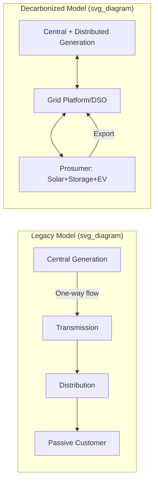

## Utility Business Model Evolution under Decarbonization

### Overview

The traditional regulated utility business model was built around a simple logic: utilities earn a return on capital invested in generation, transmission, and distribution assets, with volumetric sales of electricity or gas serving as the primary revenue driver. Decarbonization disrupts every pillar of this model — the generation mix, the demand trajectory, the capital structure, and the regulatory compact itself. This topic covers the mechanics of the legacy model, the specific pressures decarbonization places on it, and the emerging business model archetypes utilities are adopting in response.

### The Legacy Regulated Utility Model

#### Cost-of-Service Regulation

Most vertically integrated utilities operate under cost-of-service (rate-of-return) regulation. The regulator (a Public Utility Commission in the US context, or equivalent) sets rates so the utility can recover:

- Prudently incurred operating expenses (fuel, labor, maintenance)
- Depreciation on the rate base
- A regulator-approved return on the rate base (the "allowed ROE")

$$\text{Revenue Requirement} = \text{O\&M} + \text{Depreciation} + (\text{Rate Base} \times \text{Allowed ROE})$$

Rate base typically includes net plant in service (gross plant minus accumulated depreciation), working capital, and sometimes deferred tax balances.

#### The Investment Incentive Problem

Because profit scales with rate base, this model creates a structural incentive to **build capital-intensive assets** rather than to minimize system cost or promote efficiency. This is the well-documented Averch-Johnson effect: utilities are incentivized to over-capitalize relative to the cost-minimizing input mix, since more approved capital directly increases the earnings base. [Inference: the magnitude of this distortion in any specific jurisdiction is an empirical question, not a settled universal constant]

#### Volumetric Sales Dependency

Distribution utilities historically recovered fixed costs through volumetric ($/kWh or $/therm) charges. This ties revenue to throughput, meaning:

- Any load lost to efficiency, self-generation, or electrification-timing mismatches directly erodes revenue between rate cases
- Fixed costs (poles, wires, pipes) are recovered through a variable-looking charge, creating a mismatch between cost causation and price signal

### Decarbonization Pressure Points on the Legacy Model

#### 1. The "Utility Death Spiral" Dynamic

Distributed energy resources (DER) — particularly rooftop solar paired with net metering — allow customers to reduce their net purchases of grid electricity while remaining connected to (and dependent on) the grid for backup and export. Because fixed costs are recovered volumetrically:

- Departing load shifts fixed-cost recovery onto remaining customers
- Higher resulting rates increase the incentive for further defection
- In the extreme, this iterates toward a shrinking, cost-burdened remaining customer base

This is often called the **utility death spiral**. [Inference: In practice, the spiral has been dampened in most jurisdictions by demand charges, minimum bills, declining net-metering compensation (e.g., transitions to net billing), and the fact that full grid defection remains uneconomic for the large majority of customers — so this is best understood as a directional pressure rather than an empirically realized collapse in most markets.]

#### 2. Asset Stranding Risk

Decarbonization policy (carbon pricing, coal phase-outs, renewable portfolio standards, methane regulations) can render existing generation or gas infrastructure uneconomic before the end of its depreciable life. This creates **stranded asset risk** — rate base that regulators may disallow from full cost recovery. Utilities and regulators have developed several mechanisms to manage this:

- **Securitization**: converting the remaining book value of a retiring asset into a bond repaid via a dedicated, non-bypassable tariff, allowing lower-cost recovery than continued rate-base earnings
- **Accelerated depreciation**: shortening the recovery period ahead of policy-driven retirement
- **Early retirement settlements**: negotiated agreements balancing shareholder and ratepayer interests

#### 3. Load Growth Reversal, Then Reacceleration

Decades of flat-to-declining per-capita electricity demand (driven by efficiency standards and DER adoption) are now being offset — and in many regions reversed — by electrification (EVs, heat pumps) and new large-load demand (data centers, particularly AI-driven compute). This creates a planning problem: utilities must size investment for a highly uncertain, potentially bimodal demand future, where interconnection queues for both generation and large loads have become a binding constraint. [Unverified: the specific magnitude and timing of load growth is jurisdiction-specific and subject to forecasting error]

#### 4. Distributed and Two-Sided Grid Operations

Decarbonization pushes generation from centralized, dispatchable plants toward distributed, variable, and customer-owned resources (rooftop solar, batteries, EVs as flexible load/storage). The distribution grid must evolve from a one-way delivery system to a platform managing bidirectional power flow, requiring:

- Advanced Distribution Management Systems (ADMS)
- Real-time hosting capacity analysis
- DER interconnection and aggregation frameworks (e.g., FERC Order 2222 in the US, enabling DER aggregations to participate in wholesale markets)

### Emerging Business Model Archetypes

#### A. Performance-Based Regulation (PBR)

PBR shifts away from pure cost-of-service toward mechanisms that reward outcomes rather than capital deployed:

- **Multi-year rate plans (MRPs)**: rates set for 3-5 years with inflation-indexed escalators, reducing the frequency of rate cases and giving utilities efficiency incentives (cost underruns are partially retained as profit)
- **Performance Incentive Mechanisms (PIMs)**: financial rewards/penalties tied to metrics such as reliability (SAIDI/SAIFI), interconnection speed, customer service, and emissions reduction
- **Revenue decoupling**: severs the link between volumetric sales and revenue by true-ing up actual revenue to an approved target, removing the utility's disincentive to support efficiency and DER adoption

$$\text{Decoupled Revenue Adjustment} = \text{Approved Revenue Requirement} - \text{Actual Billed Revenue}$$

#### B. Distribution System Operator (DSO) / "Platform" Model

Under this model, the distribution utility transitions from an owner-operator of all grid assets to a neutral market-facilitating platform, analogous to an ISO/RTO at the distribution level:

- Publishes hosting capacity maps and interconnection data
- Operates a distribution-level marketplace where DERs (aggregated by third parties) bid to provide grid services (voltage support, congestion relief, capacity deferral)
- Earns revenue through platform/transaction fees or a modified rate base for enabling infrastructure, rather than solely through owned generation/poles-and-wires capital

New York's Reforming the Energy Vision (REV) initiative is a widely referenced example of a state-led effort to formalize this model direction. [Inference: the degree to which any given utility has actually operationalized a full DSO platform versus a partial version of it varies significantly by jurisdiction]

#### C. Total Energy Service / "Utility 3.0" Models

Some utilities and holding companies extend beyond regulated wires-and-poles into:

- Behind-the-meter asset ownership or financing (rooftop solar, storage, EV chargers) via unregulated subsidiaries
- Energy-as-a-service contracts, particularly for commercial/industrial customers seeking decarbonization-as-a-service (efficiency, on-site generation, and demand management bundled with a service fee rather than a capital purchase)
- Microgrid development and resilience-as-a-service offerings

#### D. Unregulated Renewable Development Arms

Many investor-owned utility holding companies have expanded into competitive, unregulated renewable generation development (wind, solar, storage) that sells output via long-term Power Purchase Agreements (PPAs) rather than rate base. This diversifies earnings away from regulatory risk but exposes the parent company to merchant price risk and development risk. [Inference: the balance between regulated and unregulated earnings is a strategic choice that varies by company and is disclosed in investor materials, not a universal industry constant]

#### E. Non-Wires Alternatives (NWAs)

Rather than building traditional capital infrastructure (a new substation or feeder upgrade) to meet growing or peak demand, utilities increasingly procure demand response, storage, or efficiency as an alternative. This is significant to the business model because:

- It substitutes an operating-expense-like procurement (or a smaller capital deployment) for a large capital project
- Under a pure cost-of-service framework, this can reduce utility earnings versus building the traditional asset — so regulators have paired NWA policies with earnings adjustment mechanisms or shared-savings incentives to align utility interest with system cost minimization

### Comparative Table: Legacy vs. Decarbonized Business Model

| Dimension | Legacy Model | Decarbonization-Aligned Model |
| --- | --- | --- |
| Revenue driver | Volumetric sales + rate base growth | Decoupled revenue, performance metrics, platform fees |
| Asset strategy | Owner-operator of all generation/wires | Mix of owned infrastructure + third-party DER integration |
| Risk allocation | Ratepayers bear most demand/fuel risk; utility bears construction risk | Increased utility exposure to stranded assets; shared DER integration risk |
| Regulatory tool | Cost-of-service rate cases | PBR, MRPs, PIMs, securitization |
| Grid role | One-way power delivery | Two-way platform / DSO functions |
| Growth vector | Rate base expansion (generation, T&D) | Grid modernization, non-wires alternatives, service diversification |

### Worked Example: Decoupling Mechanism Effect

A distribution utility has an approved revenue requirement of $500 million for the year. Due to a mild summer and energy efficiency programs, actual volumetric billing yields only $470 million.

- **Without decoupling**: the utility retains $470 million in revenue against a $500 million cost basis — a $30 million shortfall the utility must absorb (or seek recovery for in the next rate case, with lag).
- **With decoupling**: a deferred revenue asset of $30 million is recorded, and rates are trued up in a subsequent period (often via a rider) to collect the difference from customers, holding the utility's revenue at the $500 million approved level regardless of sales volume.

This illustrates mechanically why decoupling removes the utility's financial disincentive toward supporting customer-side efficiency and DER adoption.

### Regulatory and Policy Levers Summary

- **Integrated Resource Planning (IRP)**: increasingly required to model decarbonization scenarios, DER growth, and electrification load explicitly
- **Performance metrics tied to decarbonization**: some PIMs now directly reward emissions reductions or clean energy procurement milestones, not just reliability
- **Rate design reform**: time-of-use rates, demand charges, and minimum bills to better align price signals with cost causation as volumetric sales become a less reliable cost-recovery mechanism
- **Green tariffs and community choice aggregation (CCA)**: alternative retail-choice mechanisms that partially unbundle the traditional utility's default supply role

### Key Risks and Uncertainties

- [Speculation] The long-run equilibrium business model (full DSO platform vs. hybrid owner-operator) is still contested across jurisdictions, and different regulatory cultures (US state-by-state, UK RIIO framework, EU unbundling requirements) may converge on different endpoints.
- Financing costs for the energy transition are sensitive to interest rate environments and utility credit ratings, which are themselves affected by regulatory support for cost recovery — behavior here may vary by capital market conditions and is not fully within utility or regulator control.
- Large-load interconnection (data centers) is creating tension between decarbonization goals and reliability/cost-allocation fairness that is actively being litigated in several US rate cases as of this writing. [Unverified: outcomes are pending and jurisdiction-specific]

### Related Topics

- Performance-Based Regulation (PBR) design and PIM metric selection
- FERC Order 2222 and DER aggregation in wholesale markets
- Utility asset securitization mechanics for stranded cost recovery
- Integrated Resource Planning (IRP) methodology under uncertainty
- Time-of-use and demand-charge rate design
- Distribution System Operator (DSO) platform architecture
- Non-wires alternatives (NWA) cost-effectiveness screening
- Utility holding company structures: regulated vs. unregulated earnings mix
- Large-load (data center) interconnection and cost allocation policy
- Community Choice Aggregation and retail utility unbundling