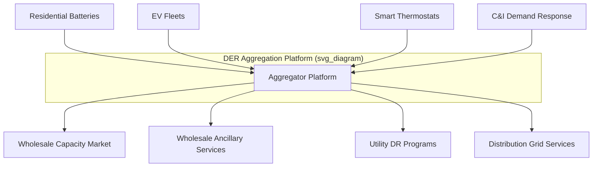

## Energy Service and Platform Business Models

### Overview

Energy service and platform business models represent a departure from commodity-based sales (selling kWh, therms, or liters of fuel) toward monetizing outcomes, capabilities, or intermediation. Two related but distinct families are covered here: **Energy Service** models, where a provider sells a guaranteed outcome (comfort, uptime, efficiency savings) rather than a unit of energy, and **Platform** models, where a company creates a marketplace or coordination layer connecting multiple sides of the energy system (generators, consumers, flexibility providers, capital). Both are strategic responses to commoditization, decarbonization, and distributed energy resource (DER) proliferation.

### Part 1: Energy Service Business Models

#### 1.1 Energy Performance Contracting (EPC) / ESCO Model

The Energy Service Company (ESCO) model is the most established form of this archetype. An ESCO designs, finances, installs, and often operates efficiency or generation upgrades for a customer (typically commercial, industrial, or public sector), and is repaid from the value created.

**Core mechanics:**

- The ESCO conducts an energy audit and proposes a package of measures (lighting retrofits, HVAC upgrades, on-site generation, controls)
- Savings are calculated against an agreed **baseline** using a measurement and verification (M&V) protocol (commonly IPMVP — International Performance Measurement and Verification Protocol)
- The customer pays the ESCO from realized savings, often structured so that payments approximate what the customer previously spent on energy, with the delta between old spend and new (lower) spend covering the ESCO's financing and margin

$$\text{Guaranteed Savings} = \text{Baseline Energy Cost} - \text{Post-Retrofit Energy Cost}$$

**Two dominant contract structures:**

- **Guaranteed Savings model**: the ESCO guarantees a minimum savings level; if actual savings fall short, the ESCO compensates the customer for the shortfall. Financing is typically arranged by the customer (or a third party), and the ESCO's balance sheet risk is limited to the performance guarantee.
- **Shared Savings model**: the ESCO finances the project on its own balance sheet and splits realized savings with the customer at an agreed ratio for the contract term. This shifts both financing risk and performance risk onto the ESCO, typically commanding a larger share of savings to compensate for that risk.

#### 1.2 Energy-as-a-Service (EaaS)

EaaS generalizes the ESCO logic beyond efficiency retrofits to a broader bundle: on-site generation (solar, CHP), storage, EV charging infrastructure, and demand management, delivered under a single subscription or usage-based fee rather than a capital purchase.

**Key characteristics:**

- Customer pays a fixed or variable service fee (e.g., $/month, $/kWh delivered, or $/ton-hour of cooling) instead of purchasing and owning equipment
- The EaaS provider (or a financing partner) retains asset ownership, capturing depreciation and tax benefits (e.g., Investment Tax Credit eligibility in the US) that the end customer may not be able to use efficiently
- Shifts the customer's accounting treatment from CapEx to OpEx, which can be attractive for balance-sheet and budgeting reasons

**Common sub-models:**

| Model | Structure | Typical Use Case |
| --- | --- | --- |
| Solar PPA | Third party owns rooftop/on-site solar; customer buys output at a fixed $/kWh, usually below utility retail rate | Commercial/industrial rooftop solar |
| Lighting/HVAC-as-a-Service | Provider owns and maintains equipment; customer pays for guaranteed lumens/comfort | Retail, office buildings |
| EV Charging-as-a-Service | Provider owns and operates charging hardware/software; site host pays subscription or revenue-share | Fleet depots, retail parking |
| Microgrid-as-a-Service | Provider owns generation, storage, and controls; customer pays for resilience/reliability outcome | Hospitals, data centers, campuses |

#### 1.3 Outcome-Based Pricing and Risk Transfer

The defining strategic feature of energy service models is the transfer of performance and financing risk from customer to provider. This has direct implications for the provider's business model:

- Requires access to relatively low-cost capital (since the provider is effectively running a specialty finance business alongside an energy business)
- Requires robust M&V and often software-based monitoring to defend savings/performance claims and manage disputes
- Creates recurring, contracted, multi-year revenue streams that are more attractive to investors than one-off equipment sales (favorable for valuation multiples if structured and disclosed as contracted recurring revenue)

### Part 2: Platform Business Models

#### 2.1 Defining Feature: Multi-Sided Markets

A platform business model creates value primarily by facilitating transactions or coordination between two or more distinct user groups, rather than by producing the underlying good itself. In energy, common platform configurations include:

- **DER aggregation platforms**: connect distributed asset owners (solar+storage, EVs, smart thermostats) with wholesale/retail markets or utility programs, monetizing the aggregated flexibility
- **Retail energy marketplaces**: connect multiple retail suppliers with consumers in deregulated markets (comparison/switching platforms)
- **C&I energy procurement/PPA platforms**: connect corporate offtakers with renewable developers for PPA matching and structuring
- **EV charging network platforms**: connect charge point operators, drivers, and sometimes utilities/grid operators via roaming and interoperability protocols
- **Carbon and REC/environmental attribute marketplaces**: connect generators of environmental attributes with buyers seeking compliance or voluntary claims

#### 2.2 Value Capture Mechanisms

Platforms typically monetize through one or more of:

- **Take rate / transaction fee**: a percentage of the value transacted (common in PPA matching platforms, environmental attribute marketplaces)
- **Subscription/SaaS fee**: charged to one or more sides for access to software, analytics, or market access (common in DER management software)
- **Revenue share on dispatched value**: the aggregator retains a share of the payments received from grid services markets in exchange for enrolling and managing customer assets
- **Data and analytics monetization**: aggregated, anonymized usage or grid data sold to utilities, regulators, or other market participants

#### 2.3 Network Effects and Their Limits in Energy Platforms

Classic platform economics relies on network effects: more participants on one side increase value for the other side(s). In energy platforms, this holds with important caveats:

- **DER aggregation**: value to the grid operator increases with more enrolled capacity (better ability to meet minimum bid sizes, more reliable aggregate response), which is a genuine network effect
- **Geographic constraints**: unlike digital platforms, most energy platform value is geographically bound — a DER aggregator's value in one ISO/RTO territory does not transfer to enrolling customers elsewhere, limiting the global winner-take-all dynamics seen in pure digital platforms [Inference: this is a structural feature of physical grid boundaries, not a claim about any specific company's competitive position]
- **Regulatory gatekeeping**: market access frequently requires qualification under specific rules (e.g., FERC Order 2222 in the US enabling DER aggregations in wholesale markets, or state-level DR program rules), meaning regulatory approval — not just user adoption — is a gating factor for platform scale

#### 2.4 Interoperability Standards

Platform models in energy depend heavily on technical interoperability standards to connect heterogeneous hardware and software:

- **OCPP (Open Charge Point Protocol)**: widely used for communication between EV charge points and charging network management systems
- **OpenADR**: standard for automated demand response signaling between utilities/grid operators and customer-side systems
- **IEEE 2030.5 (Smart Energy Profile)**: used for DER communication, including in several US utility DER management programs
- **Green Button**: standard for customer energy usage data access and sharing

[Unverified: the specific version and adoption status of any given standard in a particular jurisdiction should be confirmed against current regulatory filings, as these evolve]

### Worked Example: EaaS Solar PPA Economics

A commercial customer has average retail electricity costs of $0.14/kWh. An EaaS provider proposes to install rooftop solar at no upfront cost, selling output via a PPA at $0.10/kWh for 20 years, with an annual escalator of 2%.

- **Customer economics**: immediate savings of $0.04/kWh on solar-covered consumption, with no capital outlay, no O&M responsibility, and predictable (though escalating) pricing versus utility rate uncertainty
- **Provider economics**: the provider models project IRR based on (a) PPA revenue over 20 years, (b) available tax incentives (e.g., ITC, accelerated depreciation), (c) O&M and financing costs, and (d) a terminal/residual value assumption for the system at contract end
- **Risk allocation**: the provider bears production risk (weather, degradation), maintenance risk, and financing risk; the customer bears counterparty risk (provider solvency) and site-access/hosting obligations over the contract term

### Part 3: Strategic Drivers for Adoption

#### Why Energy Companies Pursue These Models

- **Margin expansion beyond commoditized energy sales**, where retail electricity/gas margins are thin and regulated
- **Customer relationship deepening**: service and platform models create multi-year, high-touch relationships versus a commodity transaction
- **Decarbonization enablement without customer capital constraints**: EaaS removes the capital barrier that often blocks customer-side decarbonization investment
- **Diversification of revenue away from regulatory/commodity price risk** (relevant for both utility holding companies and independent energy retailers)

#### Common Execution Risks

- Requires specialty finance capability (structuring, credit underwriting, securitization of contracted cash flows) that is a different skill set from traditional energy operations
- M&V disputes can create customer relationship and legal risk if baseline methodology is not rigorously agreed upfront
- Platform models depend on regulatory market access rules that can change, materially altering the addressable market (e.g., changes to net metering, DR compensation methodology, or aggregation rules)
- [Speculation] Consolidation is likely among smaller DER aggregation platforms as minimum efficient scale requirements (for balance sheet, software, and market relationships) increase, though the pace and ultimate market structure is not established.

### Related Topics

- Energy Performance Contracting and IPMVP measurement & verification protocols
- Investment Tax Credit (ITC) and depreciation treatment (MACRS) for third-party-owned energy assets
- FERC Order 2222 and DER wholesale market participation
- Virtual Power Plant (VPP) architecture and dispatch optimization
- OCPP, OpenADR, and IEEE 2030.5 interoperability standards
- Corporate PPA structuring (physical vs. financial/virtual PPAs)
- Securitization of contracted recurring revenue streams
- Demand response program design and baseline methodologies
- Microgrid-as-a-Service and resilience valuation frameworks
- Utility business model evolution under decarbonization (related chapter item)