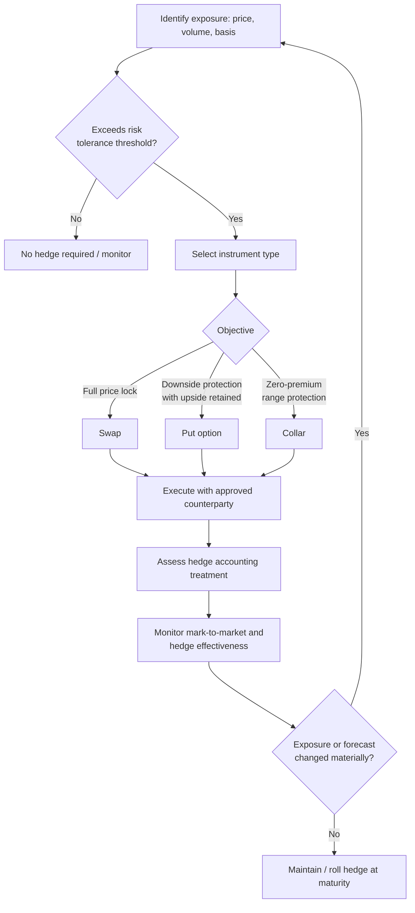

## Corporate Risk Management and Hedging Strategy Design

### Overview

Corporate risk management in energy markets refers to the systematic identification, measurement, and mitigation of financial exposures arising from commodity price volatility, operational uncertainty, and market structure. Energy companies—whether producers, refiners, utilities, or large industrial consumers—face cash flow variability driven by fluctuations in the prices of oil, natural gas, power, and refined products. Hedging strategy design is the process of selecting financial and physical instruments to reduce this variability in line with corporate risk appetite, capital structure constraints, and stakeholder objectives.

### Why Firms Hedge: Theoretical Foundations

**Key Points**

- Under the Modigliani-Miller framework with perfect capital markets, hedging is irrelevant to firm value because shareholders can diversify idiosyncratic risk themselves.
- In practice, market frictions create rationales for corporate hedging:
  - **Costly financial distress**: reducing cash flow volatility lowers the probability of default, bankruptcy costs, and covenant breaches.
  - **Underinvestment problem (Froot, Scharfstein, Stein 1993)**: hedging ensures internal funds are available to finance positive-NPV projects, avoiding reliance on costly external capital.
  - **Tax convexity**: if effective tax rates are convex (e.g., due to tax credits, loss carryforwards), stabilizing pre-tax income reduces expected tax liability.
  - **Managerial risk aversion**: undiversified managers with compensation tied to firm performance may hedge to protect personal wealth—an agency consideration rather than a value-maximizing one.
  - **Debt capacity**: lower cash flow volatility supports higher optimal leverage, increasing the value of the tax shield.

[Inference] The relative weight of these motives varies by firm size, ownership structure, and access to capital markets; smaller, more leveraged firms typically exhibit stronger hedging incentives than large, well-capitalized firms with diversified cash flows.

### Types of Risk Exposure in Energy Corporates

#### 1. Commodity Price Risk

Exposure to changes in the price of the underlying commodity a firm produces, processes, or consumes.

- **Producers** (E&P companies): exposed to downside price risk on oil/gas output.
- **Refiners**: exposed to crack spread risk (the differential between crude input costs and refined product output prices).
- **Utilities/Power generators**: exposed to spark spread risk (power price minus fuel cost, adjusted for heat rate) and dark spread risk (for coal generators).
- **Large consumers** (airlines, chemical manufacturers): exposed to rising input costs (jet fuel, natural gas feedstock).

#### 2. Basis Risk

The risk that the hedging instrument's price does not move perfectly with the exposure being hedged, due to:

- Geographic differences (e.g., hedging Permian crude with WTI Cushing futures)
- Quality/grade differences (e.g., sour vs. sweet crude)
- Timing mismatches between hedge settlement and physical exposure realization

#### 3. Volumetric Risk

Uncertainty in the physical quantity produced or consumed (e.g., well decline rates, weather-driven demand for power/gas, unplanned outages). This creates a compounding effect with price risk—firms may be "over-hedged" or "under-hedged" if volumes deviate from forecast.

#### 4. Basis/Locational and Transportation Risk

Particularly relevant in natural gas and power markets, where transmission constraints create locational price differentials (e.g., Henry Hub vs. Waha Hub pricing during Permian takeaway constraints).

#### 5. Credit and Counterparty Risk

Risk that a hedging counterparty defaults on its obligations, especially relevant for over-the-counter (OTC) derivatives not cleared through an exchange.

#### 6. Regulatory and Political Risk

Changes in carbon pricing, subsidy regimes, price caps, or market design (relevant to renewables and power markets) that alter the economics of underlying assets.

### Core Hedging Instruments

#### Physical Contracts

- **Fixed-price forward contracts**: bilateral agreements to buy/sell a commodity at a set price for future delivery. Common in gas and power markets (e.g., PPAs).
- **Tolling agreements**: contractual right to convert fuel into power at a facility for a fee, effectively creating an operational hedge for spark spread exposure.

#### Exchange-Traded Derivatives

- **Futures contracts**: standardized, exchange-cleared agreements (e.g., NYMEX WTI, ICE Brent, NYMEX Henry Hub) offering price certainty with daily mark-to-market and margining, reducing counterparty risk via central clearing.
- **Options on futures**: calls and puts providing asymmetric payoff profiles; used to hedge downside while retaining upside (for producers) or vice versa (for consumers).

#### OTC Derivatives

- **Swaps**: fixed-for-floating exchanges of cash flows based on an index price; the most common hedging tool for producers locking in a fixed price against floating market prices.
- **Costless collars**: simultaneous purchase of a put option and sale of a call option, structured so the premiums offset (zero upfront cost), establishing a price floor and ceiling.
- **Three-way collars**: adds a short put below the floor to reduce premium cost, at the expense of losing full downside protection below the second strike.
- **Basis swaps**: hedge the price differential between two locations or grades.
- **Crack spread / spark spread swaps**: hedge processing margins directly rather than hedging each leg separately.

### Hedge Structuring: The Collar Example

A typical producer collar structure:

$$\text{Payoff} = \max(K_{floor} - S_T, 0) - \max(S_T - K_{ceiling}, 0)$$

Where $S_T$ is the settlement price, $K_{floor}$ is the put strike, and $K_{ceiling}$ is the call strike. The producer receives the put payoff (protection below $K_{floor}$) but forgoes gains above $K_{ceiling}$ due to the written call.

**Example**

A shale producer expects to sell 500,000 barrels of oil over the next year and wants downside protection while retaining some upside participation.

- Buys puts at $K_{floor} = \$65$/bbl
- Sells calls at $K_{ceiling} = \$85$/bbl
- Premiums approximately offset (costless collar)
- Realized price range: the producer effectively receives no less than $65/bbl and no more than $85/bbl, regardless of where spot settles, while retaining full participation between the two strikes.

### Hedge Ratio Determination

The optimal hedge ratio minimizes variance of the hedged position and is derived from the regression of spot price changes on futures price changes:

$$h^* = \rho_{S,F} \times \frac{\sigma_S}{\sigma_F}$$

Where $h^*$ is the optimal hedge ratio, $\rho_{S,F}$ is the correlation between spot and futures price changes, and $\sigma_S$, \sigma_F}
 are their respective standard deviations. This is the **minimum-variance hedge ratio** (Ederington, 1979), commonly estimated via ordinary least squares regression on historical price changes.

[Inference] In practice, many corporates simplify this to a fixed percentage-of-production hedging policy (e.g., "hedge 50% of next 12 months' production, tapering to 20% in year two") rather than continuously re-estimating statistically optimal ratios, due to governance simplicity and board-level communicability.

### Hedge Program Design Process

#### 1. Risk Identification and Quantification

- Map all commodity, FX, and interest rate exposures across the business
- Quantify exposure using **Cash Flow at Risk (CFaR)** or **Earnings at Risk (EaR)** methodologies, analogous to Value at Risk (VaR) but applied to operating cash flows over a budget horizon

$$\text{CFaR}_{\alpha} = \mu_{CF} - z_{\alpha}\sigma_{CF}$$

Where $\mu_{CF}$ is expected cash flow, $\sigma_{CF}$ is cash flow volatility, and $z_{\alpha}$ is the critical value for confidence level $\alpha$.

#### 2. Setting Risk Appetite and Policy

- Board/Risk Committee establishes tolerance thresholds (e.g., maximum acceptable CFaR relative to fixed obligations like debt service and dividends)
- Defines hedge ratio bands by tenor (e.g., 70–90% hedged for next 12 months, 40–60% for months 13–24, 0–30% beyond 24 months)
- Establishes approved instruments (e.g., swaps and collars permitted; naked short options prohibited)

#### 3. Instrument Selection and Execution

- Match instrument type to exposure profile and accounting objectives (see hedge accounting below)
- Diversify counterparties and monitor credit exposure via ISDA/CSA agreements and margin thresholds

#### 4. Governance and Controls

- Segregation of duties between front office (trading/execution), middle office (risk measurement), and back office (settlement/accounting)
- Regular mark-to-market reporting and stress testing
- Board or Risk Committee oversight with periodic policy review

#### 5. Monitoring and Rebalancing

- Dynamic rebalancing as production forecasts, budgets, or market conditions change
- Rolling hedge programs (layering in new hedges as older ones roll off) to smooth price realization over time

### Hedge Accounting Considerations

[Unverified] Specific accounting treatment depends on jurisdiction (ASC 815 under US GAAP, IFRS 9 internationally) and requires formal hedge documentation at inception.

- **Cash flow hedges**: used for forecasted transactions (e.g., future production sales); effective portion of gains/losses recorded in Other Comprehensive Income (OCI) and reclassified to earnings when the hedged transaction occurs, reducing income statement volatility.
- **Fair value hedges**: used for hedging changes in the fair value of a recognized asset or liability; gains/losses recognized immediately in earnings alongside the offsetting change in the hedged item.
- **Hedge effectiveness testing**: required periodically to confirm the hedge remains highly effective (historically an 80–125% offset ratio threshold under legacy guidance, though modern principles-based standards like ASC 2017-12 relaxed strict quantitative bright-line tests in favor of qualitative assessment where appropriate).
- Failure to qualify for hedge accounting results in mark-to-market volatility flowing directly through earnings, which can misrepresent underlying economic hedging activity to investors—an important design consideration even though it does not change economic risk reduction.

### Sector-Specific Strategy Design

#### Upstream (E&P)

- Primary tool: swaps and collars on crude oil and natural gas production
- Hedge horizon typically tied to reserve-based lending (RBL) covenants; lenders often require minimum hedge percentages (e.g., 50–75% of PDP volumes) as a condition of the credit facility
- Basis hedges critical in basins with takeaway constraints (e.g., Permian, Marcellus)

#### Midstream

- Generally lower commodity exposure due to fee-based contracts, but percent-of-proceeds (POP) or keep-whole processing agreements retain direct commodity sensitivity requiring hedging

#### Refining

- Crack spread hedging (e.g., 3-2-1 crack spread: 3 barrels crude → 2 barrels gasoline + 1 barrel distillate) to protect processing margins
- Feedstock optionality hedges when running variable crude slates

#### Power and Utilities

- Spark spread hedging via tolling agreements or synthetic spark spread swaps (long power, short gas)
- Weather derivatives (heating/cooling degree day contracts) to hedge volumetric demand risk
- Renewable generators increasingly use virtual PPAs (financial swaps referencing a hub price) to hedge merchant price exposure while remaining physically unbundled from offtake

#### Corporate Consumers (Airlines, Shipping, Chemicals)

- Jet fuel/bunker fuel hedging via crack spread or crude proxy hedges when direct product hedges are illiquid
- Layered hedge programs with rolling tenors to avoid concentrated re-hedging risk at unfavorable price points

### Illustrative Hedge Program Structure (svg_diagram)

<svg xmlns="http://www.w3.org/2000/svg" viewBox="0 0 760 380" font-family="Arial, sans-serif">
<text x="380" y="24" text-anchor="middle" font-size="16" font-weight="bold" fill="#1a1a1a">Corporate Hedging Program Structure (svg_diagram)</text>
<rect x="20" y="50" width="200" height="60" rx="6" fill="#eef4ff" stroke="#4a72c9" stroke-width="1.5" />
<text x="120" y="75" text-anchor="middle" font-size="12" font-weight="bold" fill="#1a1a1a">Risk Identification</text>
<text x="120" y="93" text-anchor="middle" font-size="10" fill="#333">CFaR / EaR analysis</text>
<rect x="280" y="50" width="200" height="60" rx="6" fill="#eef4ff" stroke="#4a72c9" stroke-width="1.5" />
<text x="380" y="75" text-anchor="middle" font-size="12" font-weight="bold" fill="#1a1a1a">Board Risk Policy</text>
<text x="380" y="93" text-anchor="middle" font-size="10" fill="#333">Hedge ratio bands, tenor limits</text>
<rect x="540" y="50" width="200" height="60" rx="6" fill="#eef4ff" stroke="#4a72c9" stroke-width="1.5" />
<text x="640" y="75" text-anchor="middle" font-size="12" font-weight="bold" fill="#1a1a1a">Instrument Selection</text>
<text x="640" y="93" text-anchor="middle" font-size="10" fill="#333">Swaps, collars, options</text>
<line x1="220" y1="80" x2="280" y2="80" stroke="#666" stroke-width="1.5" marker-end="url(#arrow)" />
<line x1="480" y1="80" x2="540" y2="80" stroke="#666" stroke-width="1.5" marker-end="url(#arrow)" />
<rect x="280" y="150" width="200" height="60" rx="6" fill="#fff4e6" stroke="#d98c2b" stroke-width="1.5" />
<text x="380" y="175" text-anchor="middle" font-size="12" font-weight="bold" fill="#1a1a1a">Execution</text>
<text x="380" y="193" text-anchor="middle" font-size="10" fill="#333">Trading desk / counterparties</text>
<line x1="640" y1="110" x2="640" y2="130" stroke="#666" stroke-width="1.5" />
<line x1="640" y1="130" x2="380" y2="130" stroke="#666" stroke-width="1.5" />
<line x1="380" y1="130" x2="380" y2="150" stroke="#666" stroke-width="1.5" marker-end="url(#arrow)" />
<rect x="280" y="250" width="200" height="60" rx="6" fill="#e8f7ee" stroke="#2f9e5c" stroke-width="1.5" />
<text x="380" y="275" text-anchor="middle" font-size="12" font-weight="bold" fill="#1a1a1a">Monitoring &amp; Reporting</text>
<text x="380" y="293" text-anchor="middle" font-size="10" fill="#333">Mark-to-market, effectiveness tests</text>
<line x1="380" y1="210" x2="380" y2="250" stroke="#666" stroke-width="1.5" marker-end="url(#arrow)" />
<rect x="280" y="330" width="200" height="40" rx="6" fill="#f5eefc" stroke="#8a4dc9" stroke-width="1.5" />
<text x="380" y="355" text-anchor="middle" font-size="11" font-weight="bold" fill="#1a1a1a">Rebalance / Roll Hedges</text>
<line x1="480" y1="280" x2="600" y2="280" stroke="#666" stroke-width="1.5" />
<line x1="600" y1="280" x2="600" y2="350" stroke="#666" stroke-width="1.5" />
<line x1="600" y1="350" x2="480" y2="350" stroke="#666" stroke-width="1.5" marker-end="url(#arrow)" />
<line x1="220" y1="350" x2="120" y2="350" stroke="#666" stroke-width="1.5" />
<line x1="120" y1="350" x2="120" y2="110" stroke="#666" stroke-width="1.5" marker-end="url(#arrow)" />
</svg>

### Hedge Decision Flow

### Common Pitfalls in Hedge Program Design

- **Over-hedging relative to actual production**: if volumes fall short of forecast (e.g., due to well underperformance), the firm can become net short and exposed to rising prices on the excess hedge position.
- **Speculative drift**: hedge programs that evolve into directional bets based on management's price views, undermining the risk-reduction purpose and often violating board-approved policy.
- **Ignoring basis risk**: hedging with a liquid benchmark (e.g., WTI) that diverges materially from the firm's actual realized price (e.g., regional grade) can leave substantial residual risk.
- **Procyclical hedging behavior**: many producers historically increased hedging after price declines (when reduced cash flow motivates protection) rather than at high prices when protection is cheaper and more valuable—a behavioral pattern noted in energy hedging literature. [Inference] This tendency is well-documented anecdotally in industry commentary on E&P hedging behavior during price cycles, though the degree varies by company.
- **Counterparty concentration**: relying on too few OTC counterparties increases credit risk in stressed markets, as seen in energy trading counterparty failures during periods of extreme volatility.

### Performance Measurement

Hedge program effectiveness is typically evaluated via:

- **Realized price vs. unhedged market price**: comparing the blended realized price (physical + hedge settlement) against what would have been achieved without hedging
- **Hedge effectiveness ratio**: variance reduction achieved, $1 - \frac{\sigma^2_{hedged}}{\sigma^2_{unhedged}}$
- **Opportunity cost tracking**: quantifying foregone upside in rising markets as a transparency measure to stakeholders, since hedging inherently trades away some upside for downside protection

**Related Topics**

- Value at Risk (VaR) and Cash Flow at Risk (CFaR) modeling in energy portfolios
- Reserve-based lending (RBL) covenant structures and mandatory hedging requirements
- Hedge accounting under ASC 815 / IFRS 9 in detail
- Virtual power purchase agreements (VPPAs) and renewable energy hedging structures
- Counterparty credit risk management and ISDA/CSA documentation
- Weather derivatives and volumetric risk hedging
- Basis risk management in shale basins with takeaway constraints
- Real options analysis vs. financial hedging for upstream investment decisions