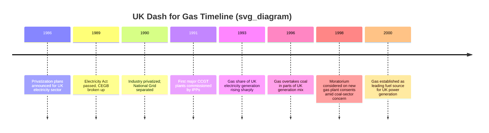
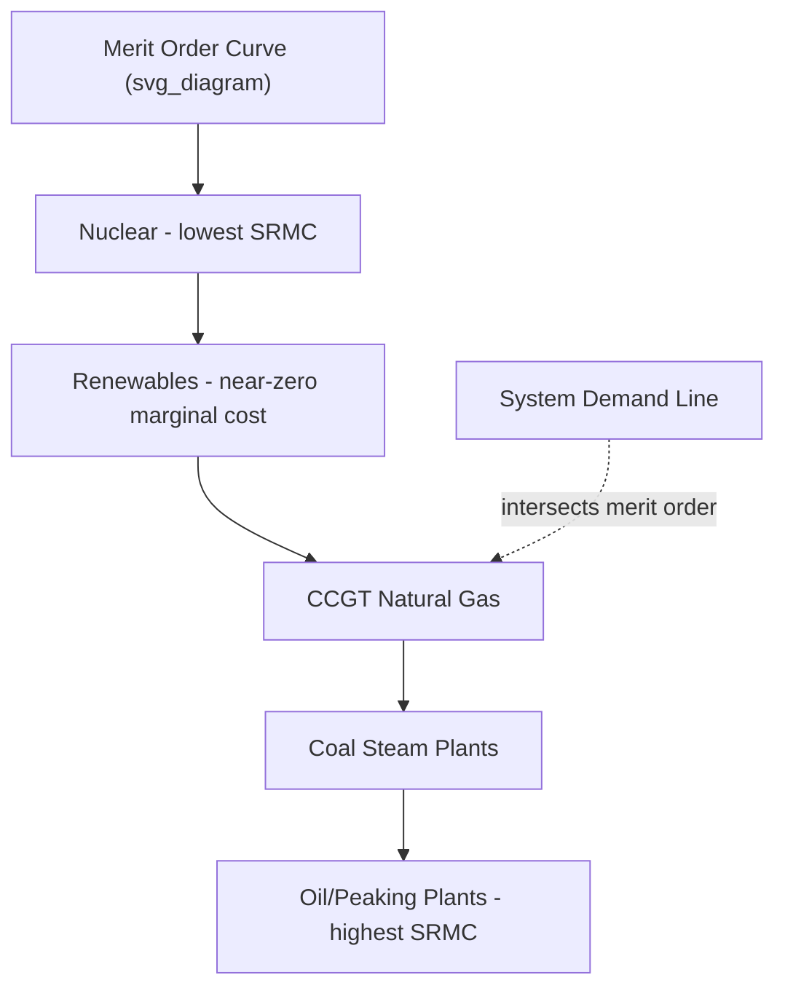

## Rise of Natural Gas and the Dash for Gas

### Overview

The "Dash for Gas" refers to the rapid, market-driven substitution of coal (and to a lesser extent oil) with natural gas in electricity generation, beginning most notably in the United Kingdom in the late 1980s and early 1990s and later echoed in the United States, parts of Europe, and other liberalizing electricity markets. It represents a pivotal episode in the history of energy transitions because it demonstrates how a combination of technological innovation (the combined-cycle gas turbine), market liberalization, and regulatory change can drive a fuel-switching transition faster than resource depletion or climate policy alone.

### Historical Context

**Pre-transition energy landscape**

Before the dash for gas, most industrialized economies relied heavily on coal for electricity generation, often for reasons of energy security and domestic employment (e.g., coal mining regions in the UK, Appalachia in the US, the Ruhr in Germany). Natural gas was historically underused in power generation because:

- Combustion turbine technology was less efficient than steam turbines for baseload power
- Many governments restricted gas use in power stations to conserve it for premium uses (heating, industrial feedstock)
- Gas markets were often regulated, with prices administratively set rather than market-determined

**The UK as the archetypal case**

The UK dash for gas (roughly 1990–2000) is the most studied example. It followed:

- **Privatization of the electricity industry** under the Electricity Act 1989, which broke up the Central Electricity Generating Board (CEGB) into generation, transmission, and distribution companies
- **Discovery and maturation of North Sea gas fields**, providing an abundant, relatively cheap domestic gas supply
- **Removal of restrictions** on using gas for power generation (the UK had earlier implemented policies discouraging gas use in electricity to preserve supplies)
- **Introduction of independent power producers (IPPs)** who could enter the market without the sunk capital and labor obligations tied to coal

### Key Technological Enabler: Combined-Cycle Gas Turbines (CCGT)

**How CCGT works**

A combined-cycle gas turbine plant combines two thermodynamic cycles:

1. **Brayton cycle (gas turbine)**: Natural gas is combusted, and the hot expanding gases drive a turbine directly connected to a generator.
2. **Rankine cycle (steam turbine)**: Waste heat from the gas turbine exhaust is captured in a Heat Recovery Steam Generator (HRSG) to produce steam, which drives a secondary steam turbine.

This cascading use of heat allows CCGT plants to achieve thermal efficiencies of 50–60%, compared to 33–40% for conventional coal-fired steam plants of the era.

$$\eta_{combined} = \eta_{gas} + \eta_{steam}(1 - \eta_{gas})$$

Where $\eta_{gas}$ is the efficiency of the gas turbine (Brayton) cycle and $\eta_{steam}$ is the efficiency of the bottoming steam (Rankine) cycle.

**Comparative advantages over coal plants**

| Attribute | CCGT | Conventional Coal Steam Plant |
| --- | --- | --- |
| Thermal efficiency | 50–60% | 33–40% |
| Capital cost per kW | Lower | Higher |
| Construction time | 2–3 years | 5–7 years |
| Labor intensity | Low | High (mining, handling, ash disposal) |
| CO2 emissions per kWh | ~40–50% lower than coal | Baseline |
| SO2/NOx/particulates | Substantially lower | Higher |
| Fuel flexibility/storage | Requires pipeline/LNG infrastructure | Coal is stockpilable on-site |

[Inference] The precise efficiency and emissions differentials vary by plant vintage, load factor, and fuel quality; the ranges above reflect typical values reported for late-20th-century CCGT versus coal steam plants and should not be read as fixed constants.

### Drivers of the Dash for Gas

**1. Market liberalization and privatization**

Deregulated electricity markets removed the incentive structures that had favored long-lived, capital-intensive coal plants operated by state utilities. New entrants (IPPs) favored gas because:

- Lower upfront capital costs reduced financial risk
- Shorter construction timelines meant faster returns on investment
- Smaller, modular plant sizes matched incremental demand growth better than large coal units

**2. Gas price and supply abundance**

Access to relatively cheap gas — from the North Sea in the UK, and later from expanded pipeline networks and (in the US, from the 2000s) shale gas — reduced fuel cost risk relative to coal, which faced rising extraction costs and, in some markets, labor disputes.

**3. Environmental and regulatory pressure**

- Gas combustion produces roughly half the CO2 per unit of energy compared to coal, plus far lower sulfur dioxide (SO2), nitrogen oxides (NOx), and particulate emissions.
- Acid rain regulations (e.g., the UK's Large Combustion Plant Directive precursors, US Clean Air Act Amendments of 1990) raised the compliance costs of coal plants, making gas comparatively more attractive.

**4. Political economy factors**

In the UK specifically, the dash for gas is widely interpreted as serving a political function: reducing dependence on the National Union of Mineworkers (NUM) and domestic coal supply chains following the 1984–85 miners' strike, thereby weakening the leverage of coal-sector labor over electricity supply. [Inference] While this motive is frequently cited in the political economy literature on UK energy policy, the relative weight of this factor versus purely economic drivers remains a matter of some historical debate among energy historians.

### Timeline of Key Events (UK Case)

### Quantitative Impact

In the UK, natural gas's share of electricity generation rose from near-negligible levels (well under 5%) in 1990 to approximately 30% by the late 1990s, while coal's share fell correspondingly from over 65% to roughly 30–35% over the same period. [Unverified] Exact year-by-year percentages vary across data sources (DUKES, IEA, Ofgem historical statistics) depending on methodology and reporting boundaries, so specific figures should be cross-checked against official UK government energy statistics (Digest of UK Energy Statistics) for precise values.

### The US "Second Dash for Gas" (Shale Era)

A distinct but related episode occurred in the United States from roughly 2005–2015, driven by different mechanisms:

- **Technological breakthrough**: Combination of horizontal drilling and hydraulic fracturing ("fracking") unlocked previously uneconomic shale gas formations (Marcellus, Barnett, Haynesville, etc.)
- **Price collapse**: US Henry Hub natural gas prices fell from highs above $10/MMBtu (2005–2008) to sustained lows near $2–4/MMBtu through much of the 2010s
- **Coal displacement**: Cheap gas directly displaced coal in the merit order for electricity dispatch, contributing to a measurable decline in US coal-fired generation and associated CO2 emissions

**Key distinction**: The UK dash for gas was primarily a policy/market-liberalization-driven transition using conventional gas; the US shale-driven shift was primarily a supply-side technological and price-driven transition, occurring within an already-liberalized market structure.

### Economic Framework: Merit Order Effect

Natural gas's rise in the generation mix is well explained by the **merit order** concept in electricity markets, where plants are dispatched in order of ascending short-run marginal cost (SRMC):

$$SRMC = \frac{Fuel\ Price}{Efficiency} + Variable\ O\&M + Carbon\ Cost\ (if\ applicable)$$

When gas prices fall and/or CCGT efficiency rises relative to coal, gas plants move lower in the merit order (are dispatched more often), displacing coal plants at the margin. This is a purely economic mechanism, distinct from any climate policy intervention, though carbon pricing (e.g., the EU Emissions Trading System from 2005) later reinforced the same directional effect by raising coal's relative SRMC.

### Environmental Consequences

**Positive effects:**

- Significant reduction in SO2, NOx, and particulate matter emissions, improving urban and regional air quality
- Roughly 40–50% reduction in CO2 emissions per unit of electricity generated compared to equivalent coal generation
- Reduced ash and solid waste disposal burden

**Trade-offs and criticisms:**

- Increased dependence on gas import infrastructure and, in some cases, geopolitically sensitive supply routes (e.g., European reliance on Russian pipeline gas post-liberalization)
- Methane leakage across the gas supply chain (extraction, processing, transmission) partially offsets the CO2 advantage in full lifecycle greenhouse gas accounting
- Critics argue the dash for gas "locked in" fossil fuel infrastructure for decades, potentially delaying investment in renewables and nuclear that might otherwise have filled the gap directly

[Inference] The magnitude of lifecycle methane leakage and its effect on gas's net climate advantage over coal is an area of active scientific measurement and remains dependent on upstream leakage rates, which vary significantly by basin, infrastructure age, and regulatory enforcement.

### Comparative International Experience

| Country/Region | Approximate Period | Primary Driver | Notes |
| --- | --- | --- | --- |
| United Kingdom | 1990–2000 | Market liberalization + North Sea gas | Archetypal "Dash for Gas" |
| United States | 2005–2015 | Shale gas technology + price collapse | "Shale gas revolution" |
| Germany | 1990s–2000s (partial) | Market opening, later Energiewende | Coexisted with strong renewables push and coal phase-out debates |
| Japan | Post-2011 (Fukushima) | Nuclear shutdown, LNG import surge | Gas as substitute for lost nuclear capacity |
| China | 2010s–ongoing | Air quality policy, urban pollution control | Gas expansion concentrated in urban heating/power, still coal-dominant overall |

[Inference] Country-specific drivers and timelines are broadly documented in energy policy literature, but exact percentage shifts and dates vary by source and should be verified against national energy statistics agencies for research or policy use.

### Economic and Policy Lessons

1. **Market structure matters as much as resource endowment.** The UK had access to North Sea gas for years before privatization, but the dash for gas only occurred once market liberalization removed institutional barriers to entry and fuel switching.
2. **Capital cost and construction lead time are powerful market signals.** CCGT's lower capital intensity and shorter build times made it attractive to risk-averse private investors in liberalized markets, independent of long-run fuel price forecasts.
3. **Fuel transitions can occur without explicit climate policy.** The UK dash for gas predates serious international climate policy (Kyoto Protocol, 1997) and was driven by economics and energy security, not decarbonization goals — though it had substantial incidental climate benefits.
4. **Rapid fuel switching creates stranded asset risk.** Coal plants and associated mining infrastructure faced early retirement or underutilization, a pattern relevant to contemporary debates about stranded fossil fuel assets amid renewable energy transitions.

### Relevance to Broader Energy Transition Theory

The dash for gas is frequently cited in energy transitions literature as a counterexample to the assumption that energy transitions are inherently slow, multi-decadal processes (as historically observed with the shift from wood to coal, or coal to oil). It demonstrates that under the right combination of:

- Technological readiness (CCGT maturity)
- Regulatory/market restructuring
- Resource availability
- Relative cost advantage

a fuel transition can occur within a single decade at the level of a national electricity system — a finding often invoked in discussions of the feasibility of accelerated decarbonization transitions today.

### Related Topics

- Combined-cycle gas turbine (CCGT) thermodynamics and efficiency engineering
- UK electricity market liberalization and the Electricity Act 1989
- North Sea oil and gas development history
- US shale gas revolution and hydraulic fracturing economics
- Merit order effect and electricity market dispatch modeling
- Carbon pricing mechanisms (EU ETS) and their interaction with fuel switching
- Stranded assets in fossil fuel transitions
- Methane leakage and lifecycle greenhouse gas accounting for natural gas
- Coal phase-out policies in OECD countries
- Energy security implications of gas import dependence (geopolitics of pipeline gas and LNG)
- Comparison with the "second dash for gas" in the 2020s amid post-Ukraine-war European energy security concerns