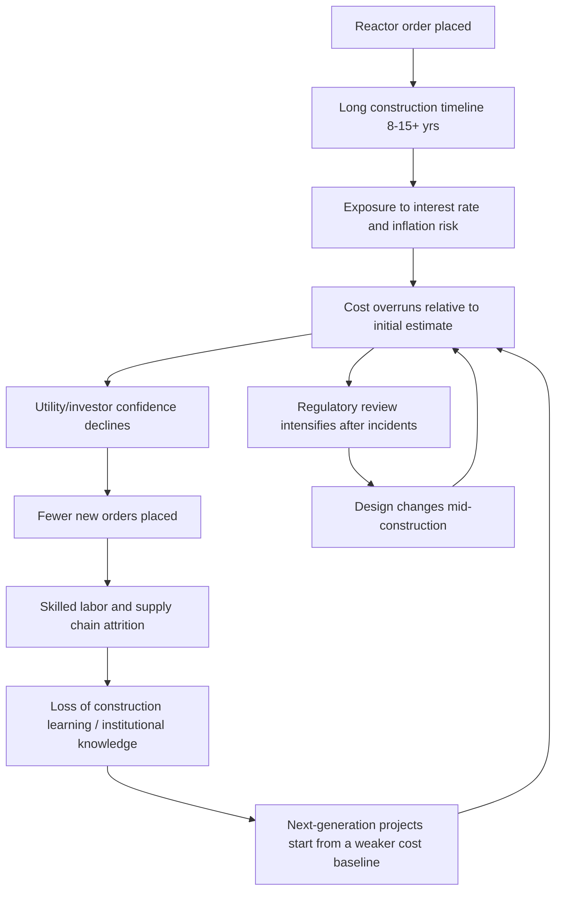

## Nuclear Power Expansion and Subsequent Stagnation

### Overview

Nuclear power represents a distinct case study in energy transition economics: a technology that achieved rapid capacity growth from the 1960s through the mid-1980s, followed by a multi-decade stagnation in most Western economies despite continued (and in some regions accelerating) deployment elsewhere. Understanding this trajectory requires analyzing the interplay of capital cost economics, regulatory regimes, public risk perception, competing fuel prices, and the unique financing challenges posed by nuclear's cost structure.

### Historical Timeline

**Phase 1: Early Development (1950s–1960s)**

- 1951: EBR-I (Experimental Breeder Reactor I) in Idaho becomes the first reactor to generate usable electricity from nuclear fission.
- 1954: The USSR's Obninsk plant becomes the first nuclear plant connected to a public grid.
- 1956: Calder Hall in the UK becomes the first commercial-scale nuclear power station.
- 1957: Shippingport Atomic Power Station (Pennsylvania) becomes the first large-scale commercial reactor in the US.
- Framed politically under "Atoms for Peace" (Eisenhower, 1953), nuclear power was promoted as a civilian dividend of Cold War-era nuclear technology investment.

**Phase 2: Rapid Expansion (Late 1960s–1970s)**

- Utilities in the US, France, Japan, West Germany, and the UK ordered reactors at a rapid pace.
- Vendors (Westinghouse, General Electric, Babcock & Wilcox, Combustion Engineering) offered turnkey contracts at aggressive fixed prices to build market share, absorbing cost overruns themselves — a practice that proved financially unsustainable and was discontinued by the early 1970s.
- The 1973 oil embargo and subsequent oil price shocks intensified interest in nuclear as an energy-security hedge against imported oil, particularly in France and Japan.
- France launched the Messmer Plan (1974), a state-directed program to build out nuclear capacity using a standardized reactor design (Westinghouse-derived PWR technology under license), aiming to reduce oil dependency after the embargo.

**Phase 3: Peak Ordering and the Turning Point (Mid-to-Late 1970s)**

- US reactor orders peaked around 1973–1974 (over 200 reactors were on order or under construction at various points in the 1970s in the US alone).
- Construction times and costs began escalating well before the major accidents, driven by:
  - Post-1973 macroeconomic conditions: high inflation and high interest rates dramatically increased the carrying cost of long-duration construction projects.
  - Regulatory changes following the creation of the Nuclear Regulatory Commission (NRC) in 1974-75 (splitting promotional and regulatory functions previously combined in the Atomic Energy Commission), which introduced additional design review cycles and backfitting requirements.
  - Declining electricity demand growth after the 1973–75 recession, which undercut the demand forecasts used to justify new plant orders.

**Phase 4: Stagnation (1979–2000s, US/Western Europe)**

- Three Mile Island (1979, Pennsylvania): partial core meltdown with no direct fatalities, but it triggered sweeping regulatory reassessment, public confidence collapse, and a wave of retrofit requirements on the existing fleet.
- Chernobyl (1986, USSR/Ukraine): a catastrophic RBMK reactor accident with significant radiological release, reinforcing global public opposition, especially in West Germany, Italy, and Sweden.
- No new US reactor orders that were subsequently completed occurred between 1978 and the 2010s (Watts Bar Unit 1, ordered earlier, was not completed until 1996; Watts Bar Unit 2 not until 2016).
- Italy voted to phase out nuclear power entirely after a 1987 referendum (post-Chernobyl).
- Germany's *Atomausstieg* (nuclear phase-out) policy, initiated in 2000/2002 and accelerated after Fukushima (2011), led to the final shutdown of Germany's last reactors in April 2023.

**Phase 5: Divergence (2000s–Present)**

- China, South Korea, India, and Russia continued or expanded nuclear construction programs, often under different institutional financing arrangements (state-owned utilities, sovereign-backed loans) that better absorbed cost and schedule risk.
- Fukushima Daiichi accident (2011, Japan) prompted a second wave of stagnation/reversal: Japan idled its entire reactor fleet pending safety reviews; Germany accelerated its phase-out; several countries paused new licensing reviews.
- A partial "nuclear renaissance" narrative in the 2000s-2010s (driven by climate concerns and rising fossil fuel prices) largely failed to materialize in the West: flagship projects like Vogtle (US, Georgia) and Hinkley Point C (UK) and Olkiluoto 3 (Finland) experienced severe cost overruns and multi-year delays, reinforcing rather than reversing the stagnation narrative in liberalized electricity markets.

### Core Economic Drivers of Expansion

**Key Points**

- **Capital-intensity vs. fuel-cost structure**: Nuclear plants have very high capital expenditure (capex) relative to operating expenditure (opex). Once built, the marginal cost of generation is low (fuel — enriched uranium — is a small fraction of total lifetime cost), which made nuclear attractive in an environment of rising fossil fuel prices, since it displaced fuel-cost volatility with locked-in capital cost.
- **Energy security motive**: Countries heavily reliant on imported oil/gas (France, Japan, South Korea) pursued nuclear explicitly as a diversification and sovereignty strategy, independent of levelized cost comparisons.
- **Economies of scale and standardization (attempted)**: Vendors and utilities expected that larger unit sizes and reactor standardization would drive down $/kW costs analogous to fossil-fuel plant experience curves. This assumption broke down in most Western markets (see negative learning below).
- **State-directed industrial policy**: France's approach exemplifies successful large-scale build-out under centralized planning: a single utility (EDF), a small number of standardized designs, and continuous, overlapping construction schedules that retained skilled labor and supply chains between projects.

### Core Economic Drivers of Stagnation

**Key Points**

- **Negative learning curve / cost escalation**: Unlike solar PV or many manufactured technologies exhibiting cost declines with cumulative deployment, nuclear construction costs in the US and France (post-1970s) rose with cumulative experience, a phenomenon documented in the economics literature as "negative learning" or "forgetting by doing." Contributing factors include:
  - Increasing regulatory stringency and design complexity added after each safety review cycle.
  - Loss of skilled labor, supplier networks, and institutional construction know-how during multi-decade order gaps.
  - Site-specific customization rather than true modular replication in most US builds (in contrast to France's more standardized approach).
- **Construction Work in Progress (CWIP) and cost-of-capital exposure**: Nuclear projects, given multi-year (often 8–15+ year) construction timelines, are exceptionally sensitive to the cost of capital. High interest rates in the late 1970s/early 1980s dramatically inflated the finance-charge component of total project cost, sometimes exceeding the direct construction cost itself.
- **Regulatory and licensing risk**: In liberalized/deregulated electricity markets (post-1990s US, UK), investors bear the risk of regulatory delay or design changes mid-construction, a risk not well-suited to conventional project finance, discouraging private capital.
- **Market structure shift — deregulation**: The shift from vertically integrated, rate-of-return-regulated utilities (which could pass capital costs to ratepayers with limited risk) to competitive wholesale electricity markets removed the institutional mechanism that had underwritten large capital-intensive, long-payback assets. Merchant nuclear plants must recover costs through volatile wholesale power prices, which is poorly matched to nuclear's cost profile.
- **Demand growth miscalculation**: Reactor orders placed in the early 1970s assumed continued historical electricity demand growth (~7%/year in the US); actual post-1973 growth was substantially lower, leaving utilities with excess planned capacity and stranding many partially built or cancelled projects (over 100 US reactor orders were cancelled between 1972 and 1990).
- **Competing fuel price declines**: Natural gas price declines (particularly post-2008 US shale boom) combined with efficient combined-cycle gas turbine (CCGT) technology drastically undercut nuclear's economics on a pure levelized-cost basis in gas-abundant markets.
- **Public risk perception and the availability heuristic**: Accidents (TMI, Chernobyl, Fukushima) each produced disproportionate shifts in public opposition and political risk relative to the statistical safety record of the technology (measured in deaths per unit of energy produced, nuclear ranks among the safest sources — [Inference: based on comparative mortality studies such as those from Our World in Data/Markandya & Wilkinson (2007); exact figures vary by study methodology and accident-cost assumptions]). This asymmetry between statistical risk and perceived/political risk is a recurring theme in energy economics risk analysis.
- **Waste disposal and back-end cost uncertainty**: Absence of a permanent high-level waste repository in most countries (e.g., the cancelled Yucca Mountain project in the US) created unresolved long-term liability and political friction, adding to perceived project risk without necessarily being the dominant cost driver.

### Comparative Case Studies

**France: Successful State-Led Expansion**

- Achieved roughly 70–75% of electricity generation from nuclear by the late 1980s/1990s through the Messmer Plan.
- Success factors: single state-owned utility (EDF) as sole buyer, standardized reactor design (derivative of Westinghouse PWR under license from Framatome), continuous overlapping construction pipeline avoiding boom-bust ordering cycles, and insulation from short-term electoral/market pressure during the build-out period.
- [Inference: Subsequent French nuclear economics have deteriorated somewhat since the 1990s, evidenced by the cost and schedule overruns of the EPR (European Pressurized Reactor) design at Flamanville 3 (France) and Olkiluoto 3 (Finland), suggesting that even France's institutional advantages have eroded as construction experience gaps widened between reactor generations.]

**United States: Boom-Bust Cycle**

- Peak ordering 1965–1974, followed by near-total order cancellation and a 30+ year gap in new construction starts.
- The Vogtle Units 3 and 4 (Georgia, completed 2023 and 2024 respectively) illustrate contemporary US nuclear economics: initial cost estimate near $14 billion, final cost over $30 billion, with schedule delays exceeding 7 years — often cited as a cautionary economic case for new large-reactor construction in liberalized US markets. [Unverified: precise final cost figures vary slightly by source and accounting methodology (utility-reported vs. independent audit).]

**Germany: Political Phase-Out**

- Nuclear phase-out driven primarily by political and public-opinion factors (Green Party coalition politics, post-Chernobyl and post-Fukushima sentiment) rather than by nuclear-specific cost economics; Germany simultaneously pursued the *Energiewende* renewable expansion program.
- [Inference: The German case is frequently cited in energy economics debates over whether phase-out timing was economically optimal, given subsequent reliance on coal and gas generation to fill the capacity gap, though this remains a contested empirical and policy question outside the scope of a purely descriptive account.]

### Illustrative Diagram: Global Nuclear Reactor Construction Starts Over Time (svg_diagram)

<svg xmlns="http://www.w3.org/2000/svg" viewBox="0 0 760 420">
<text x="380" y="24" text-anchor="middle" font-size="16" font-weight="bold" fill="#1a1a1a">Illustrative Pattern: Global Nuclear Construction Starts by Decade (svg_diagram)</text>
<line x1="70" y1="360" x2="720" y2="360" stroke="#333" stroke-width="2" />
<line x1="70" y1="360" x2="70" y2="50" stroke="#333" stroke-width="2" />
<text x="30" y="365" font-size="11" fill="#333">0</text>
<text x="15" y="215" font-size="11" fill="#333">~40</text>
<text x="15" y="60" font-size="11" fill="#333">~80</text>
<text x="395" y="400" text-anchor="middle" font-size="12" fill="#333">Decade</text>

<rect x="90" y="290" width="70" height="70" fill="#5b8ac1" />
<rect x="180" y="70" width="70" height="290" fill="#3a6ea5" />
<rect x="270" y="150" width="70" height="210" fill="#5b8ac1" />
<rect x="360" y="310" width="70" height="50" fill="#a3c1e0" />
<rect x="450" y="325" width="70" height="35" fill="#a3c1e0" />
<rect x="540" y="260" width="70" height="100" fill="#5b8ac1" />
<rect x="630" y="240" width="70" height="120" fill="#3a6ea5" />

<text x="125" y="378" text-anchor="middle" font-size="11">1960s</text>

<text x="215" y="378" text-anchor="middle" font-size="11">1970s</text>

<text x="305" y="378" text-anchor="middle" font-size="11">1980s</text>

<text x="395" y="378" text-anchor="middle" font-size="11">1990s</text>

<text x="485" y="378" text-anchor="middle" font-size="11">2000s</text>

<text x="575" y="378" text-anchor="middle" font-size="11">2010s</text>

<text x="665" y="378" text-anchor="middle" font-size="11">2020s</text>

<text x="215" y="60" text-anchor="middle" font-size="11" fill="`#3a6ea5`" font-weight="bold">Peak (West)</text>

<text x="395" y="300" text-anchor="middle" font-size="10" fill="#555">TMI + Chernobyl</text>

<text x="665" y="230" text-anchor="middle" font-size="10" fill="#555">China-led growth</text>

</svg>

*Note: bar heights are illustrative/schematic to convey the qualitative pattern of Western boom-bust cycles versus later China/Asia-led growth, not precise reactor-count data. [Speculation: exact per-decade global construction-start counts should be sourced from IAEA PRIS database for quantitative work.]*

### Causal Structure: Feedback Loop of Cost Escalation and Stagnation

### Levelized Cost Framing

A simplified representation of nuclear's Levelized Cost of Electricity (LCOE) sensitivity to capital cost and discount rate:

$$LCOE = \frac{\sum_{t=0}^{n} \frac{C_t + O_t}{(1+r)^t}}{\sum_{t=0}^{n} \frac{E_t}{(1+r)^t}}$$

Where $C_t$ is capital expenditure in year $t$, $O_t$ is operating expenditure, $E_t$ is energy output, and $r$ is the discount rate. Because nuclear's $C_t$ terms are concentrated in early years (long pre-operational construction) while $E_t$ terms only begin after commissioning, nuclear LCOE is disproportionately sensitive to $r$: a higher discount rate (reflecting higher cost of capital or perceived project risk) inflates the numerator's early-year terms far more than for a technology with a short construction/payback period such as CCGT or solar PV. This mathematical sensitivity is a central reason project finance risk (regulatory delay, interest rate environment) has an outsized effect on nuclear competitiveness relative to fuel-cost differences alone.

### Comparative Cost Trajectory Table

| Technology | Typical Construction Lead Time | Capital Cost Trend (Historical) | Dominant Cost Driver |
| --- | --- | --- | --- |
| Nuclear (large PWR/BWR, US/EU) | 8–15+ years | Rising ("negative learning") | Capex + financing cost |
| Nuclear (China, standardized) | 5–7 years | Comparatively stable/declining [Inference: based on reported Chinese build costs, though independent verification of Chinese project accounting is limited] | Capex, lower financing risk |
| Coal | 3–5 years | Historically declining, now rising with emissions controls | Fuel + capex |
| CCGT (natural gas) | 2–3 years | Declining (efficiency gains) | Fuel price volatility |
| Solar PV (utility-scale) | 1–2 years | Sharply declining (positive learning curve) | Capex (falling), near-zero fuel cost |

### Policy and Institutional Lessons

**Key Points**

- Nuclear economics are strongly path-dependent on **institutional and market structure** rather than purely on engineering cost curves: cost-of-service regulated monopolies (France, early US) historically supported large capital-intensive builds better than merchant/competitive markets.
- **Continuity of construction pipeline** (avoiding boom-bust ordering) appears empirically important for retaining the workforce and supply chain needed to control costs — a factor sometimes termed the "fleet effect."
- **Regulatory stability** during construction (avoiding retroactive design mandates) reduces cost risk, though this must be balanced against legitimate safety-driven regulatory evolution following new information (e.g., post-Fukushima seismic/flooding requirements).
- Modern policy responses to nuclear stagnation include Small Modular Reactors (SMRs), which aim to reduce per-unit capital exposure and construction time through factory fabrication and standardization — [Speculation: as of the mid-2020s, SMR designs remain largely pre-commercial or in early deployment phases (e.g., NuScale's initial US project cancellation in 2023), so their capacity to reverse the historical cost-escalation pattern is not yet empirically demonstrated at scale].

### Related Topics

- Levelized Cost of Electricity (LCOE) methodology and its limitations for capital-intensive generation
- The economics of energy security and strategic fuel diversification
- Learning curves and experience curves in energy technology cost trends (positive vs. negative learning)
- Deregulation of electricity markets and its effect on capital-intensive generation investment
- Small Modular Reactors (SMRs) and next-generation nuclear economics
- Risk perception, the availability heuristic, and energy technology public acceptance
- Comparative case study: China's state-directed nuclear expansion model
- Nuclear waste management economics and long-term liability accounting
- The 1973 and 1979 oil shocks and their effect on energy diversification policy
- Stranded asset risk in long-lived capital-intensive energy infrastructure