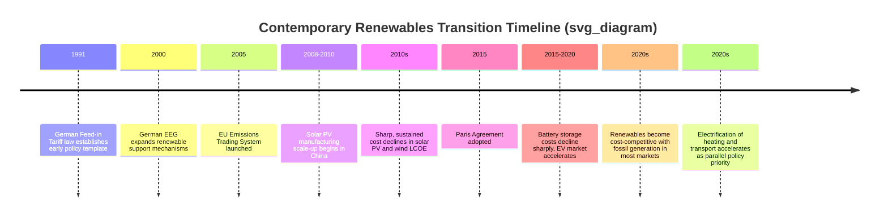
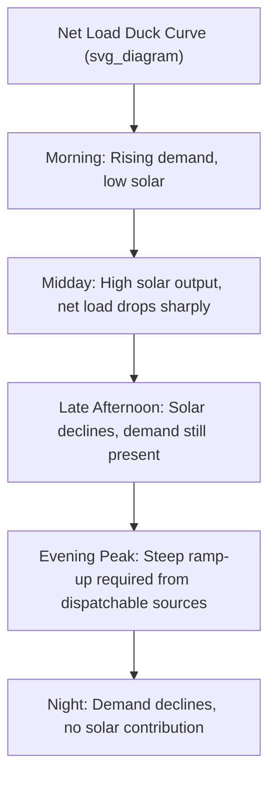

## Contemporary Transition Toward Renewables and Electrification

### Overview

The contemporary energy transition, roughly spanning the 2000s to the present, is characterized by two closely intertwined structural shifts: the rapid cost decline and deployment growth of variable renewable energy (VRE) technologies — principally wind and solar photovoltaics — and the parallel push toward electrification of end-use sectors historically reliant on direct fossil fuel combustion (transport, heating, and portions of industry). Unlike earlier historical transitions driven primarily by resource discovery or market liberalization (e.g., the dash for gas), this transition is substantially policy-driven, motivated by climate change mitigation, and enabled by sustained technology learning curves rather than a single dominant technological breakthrough.

### Historical Trajectory and Turning Points

**Early foundations (1970s–1990s)**

Modern renewable energy technology development traces back to the 1970s oil shocks, which prompted early government R&D investment in solar and wind technologies in the US, Germany, and Denmark. However, costs remained far above fossil fuel generation, limiting deployment to niche applications (off-grid, research demonstration, small-scale wind in Denmark and California).

**Policy-driven early deployment (1990s–2000s)**

- **Germany's Feed-in Tariff (Stromeinspeisungsgesetz, 1991; expanded via the EEG in 2000)** established a critical policy template: guaranteed, above-market payments for renewable electricity fed into the grid, providing investment certainty that catalyzed early-mover deployment and manufacturing scale-up.
- **Denmark's wind industry development**, supported by sustained industrial policy, established an early globally competitive wind turbine manufacturing base (e.g., Vestas).
- **California's Renewable Portfolio Standards** and similar mechanisms in other US states created state-level demand pull independent of federal policy.

**The cost-decline inflection (2008–present)**

The most consequential development in the contemporary transition has been the dramatic, sustained decline in the levelized cost of solar photovoltaic and wind generation, driven substantially by manufacturing scale-up (particularly in China for solar PV) and continuous technology learning.

### The Learning Curve Phenomenon

Unlike nuclear power's anomalous cost-escalation pattern, solar PV and, to a lesser extent, wind have exhibited textbook technology learning curves, where costs decline predictably as cumulative deployed capacity increases.

**Wright's Law / experience curve formulation**

$$C_n = C_1 \cdot n^{-b}$$

Where $C_n$ is the cost at cumulative production volume $n$, $C_1$ is the cost of the first unit, and $b$ is the learning rate exponent (related to the learning rate $LR$ by $LR = 1 - 2^{-b}$).

Solar PV modules have historically exhibited a learning rate in the range of approximately 20–28% per doubling of cumulative production — meaning costs fall by roughly that percentage each time cumulative global production doubles. [Inference] The precise learning rate varies by time period, technology generation (crystalline silicon vs. thin-film vs. emerging technologies), and study methodology; the figure cited reflects a commonly referenced historical range rather than a fixed physical constant, and future learning rates as the technology matures may differ from historical rates.

**Drivers of solar PV cost decline**

- Manufacturing scale economies, particularly the buildout of large-scale polysilicon and wafer/cell/module production capacity concentrated substantially in China
- Continuous incremental efficiency improvements in cell technology (e.g., transition from aluminum back surface field to PERC, and more recently to TOPCon and heterojunction cell architectures)
- Reductions in balance-of-system costs (inverters, mounting structures, installation labor) alongside module cost declines
- Global policy support (feed-in tariffs, auctions, tax credits) providing sustained demand pull to justify manufacturing investment

**Wind cost decline drivers**

- Turbine scale-up: increasing rotor diameter and hub height, raising capacity factor and energy capture per turbine
- Offshore wind maturation, moving from fixed-bottom shallow-water installations toward larger, more efficient turbines and (in early deployment) floating platforms for deeper waters
- Competitive auction mechanisms replacing fixed feed-in tariffs in many mature markets, driving developer cost discipline

### Technical Characteristics of Variable Renewable Energy

**Capacity factor and variability**

Unlike dispatchable thermal generation, wind and solar output vary with weather and time of day, characterized by capacity factor (the ratio of actual output to theoretical maximum continuous output):

$$CF = \frac{Actual\ Energy\ Generated}{Rated\ Capacity \times Time\ Period}$$

Typical capacity factors:

| Technology | Typical Capacity Factor Range |
| --- | --- |
| Utility-scale solar PV (fixed tilt) | 15–25% |
| Utility-scale solar PV (tracking) | 20–30% |
| Onshore wind | 25–45% |
| Offshore wind | 35–55% |

[Inference] These ranges are broadly representative but depend substantially on site-specific resource quality (solar irradiance, wind speed distribution), technology generation, and geographic location; actual project-specific capacity factors should be assessed using local resource data.

**Grid integration challenges**

The variability and partial unpredictability of VRE generation introduces distinct system-level challenges not present with dispatchable thermal generation:

1. **Intermittency and forecasting error**, requiring enhanced weather forecasting integration into grid operations
2. **Reduced system inertia**, since conventional synchronous generators (coal, gas, nuclear, hydro) provide grid frequency stability through rotational mass, a property inverter-based renewable generation does not inherently provide without additional grid-forming inverter technology
3. **Duck curve effect**, where high midday solar output combined with evening demand peaks creates steep net-load ramping requirements for remaining dispatchable capacity

4. **Curtailment**, where excess renewable generation must be reduced or wasted during periods of oversupply relative to demand and transmission/storage capacity
5. **Transmission expansion needs**, since high-quality wind and solar resources are often geographically distant from demand centers, requiring substantial new transmission infrastructure investment

### Energy Storage as an Enabling Technology

**Lithium-ion battery storage**

The parallel cost decline of lithium-ion battery technology — driven substantially by electric vehicle manufacturing scale-up — has made grid-scale battery storage increasingly viable for:

- Short-duration (typically 1–4 hour) arbitrage and peak-shaving applications
- Frequency regulation and other fast-response ancillary services, where batteries' near-instantaneous response time offers advantages over conventional thermal plant ramping
- Firming variable renewable output over hourly to daily timescales

**Limitations for long-duration storage**

[Inference] Lithium-ion battery economics remain generally unfavorable for storage durations extending to multiple days or seasonal timescales due to the linear scaling of battery cost with energy capacity (as opposed to power capacity); alternative technologies (pumped hydro, compressed air, hydrogen, thermal storage, and various emerging long-duration storage chemistries) are under active development and deployment for this application, though none has yet achieved cost and scale parity with lithium-ion for shorter-duration applications.

### Electrification of End-Use Sectors

Electrification refers to the substitution of direct fossil fuel combustion in end-use applications with electricity-powered alternatives, typically paired with (though not strictly dependent on) a decarbonizing electricity grid.

**Transport electrification**

- Battery electric vehicles (BEVs) convert grid electricity to motive power via electric motors, achieving substantially higher well-to-wheel energy efficiency than internal combustion engine vehicles, since electric drivetrains avoid the thermodynamic losses inherent in combustion-based heat engines
- Charging infrastructure buildout (Level 1/2 AC charging, DC fast charging) represents a major parallel infrastructure transition alongside vehicle electrification itself
- [Inference] The net lifecycle greenhouse gas benefit of vehicle electrification depends substantially on the carbon intensity of the electricity grid used for charging, and this benefit therefore varies significantly by region and evolves over time as grids decarbonize

**Heating electrification**

- Heat pumps extract ambient heat from air, ground, or water sources and use a vapor-compression refrigeration cycle in reverse to deliver space and water heating, achieving a Coefficient of Performance (COP) typically well above 1 (i.e., delivering more heat energy than the electrical energy consumed), unlike resistive electric heating

$$COP = \frac{Heat\ Delivered}{Electrical\ Energy\ Input}$$

Typical air-source heat pump COP values range from approximately 2.5–4.5 under moderate climate conditions, though performance degrades in colder ambient temperatures, an important consideration for heat pump deployment in cold-climate regions. [Inference] Specific COP values are highly dependent on outdoor temperature, unit sizing, and installation quality, and should be assessed against manufacturer specifications and climate-specific performance data for the region of installation.

**Industrial electrification**

- Lower-temperature industrial process heat is increasingly amenable to electrification (electric boilers, industrial heat pumps)
- High-temperature industrial processes (steel, cement) remain more difficult to electrify directly and are the subject of ongoing research into alternative approaches (e.g., hydrogen-based direct reduction for steel, electric arc furnace expansion), representing one of the more technically challenging frontiers of the broader decarbonization effort

### Policy Instruments Driving the Transition

| Instrument | Mechanism | Example |
| --- | --- | --- |
| Feed-in tariffs | Fixed, guaranteed price per unit of renewable generation | Germany's EEG (2000) |
| Renewable Portfolio Standards / Clean Energy Standards | Mandated minimum renewable share for utilities | Various US states |
| Competitive auctions / contracts for difference | Price discovery via competitive bidding, often with price guarantee | UK Contracts for Difference scheme |
| Tax credits | Direct reduction in tax liability tied to renewable investment/production | US Investment Tax Credit (ITC), Production Tax Credit (PTC) |
| Carbon pricing | Raises relative cost of fossil generation, indirectly favoring renewables | EU Emissions Trading System |
| Electrification mandates/incentives | Direct policy support for electric end-use technology adoption | EV purchase incentives, heat pump subsidy programs |

### Comparative Cost Trajectory: Illustrative Framework

### System-Level Economic Considerations

**Merit order effect of renewables**

Because wind and solar have near-zero short-run marginal cost (no fuel cost), their addition to the generation mix pushes higher-marginal-cost fossil generation further up the dispatch order, generally suppressing wholesale electricity prices during periods of high renewable output — a phenomenon sometimes termed the "merit order effect," conceptually analogous to but distinct from gas's earlier displacement of coal in the dash for gas.

**Value deflation / cannibalization effect**

[Inference] As the share of any single VRE technology in a given market grows, its own marginal market value tends to decline relative to the average electricity price, because periods of high wind or solar output coincide with periods when many other wind/solar generators are also producing, depressing prices precisely when that technology generates most — a well-documented phenomenon in the energy economics literature, though its precise magnitude is market- and technology-specific.

### Distinguishing This Transition from Earlier Historical Transitions

| Feature | Dash for Gas | Nuclear Expansion | Contemporary Renewables/Electrification |
| --- | --- | --- | --- |
| Primary driver | Market liberalization, economics | Energy security, state industrial policy | Climate policy, sustained technology learning |
| Timeframe | ~1 decade (UK case) | ~2 decades (expansion), then multi-decade stagnation | Multi-decade, ongoing, accelerating |
| Cost trend | Immediate cost advantage from efficiency | Cost escalation over time (Western markets) | Sustained cost decline via learning curve |
| Technology maturity path | Mature, well-understood combustion technology adapted to new market | Complex, safety-critical, high capital intensity | Modular, manufacturable, rapidly iterating technology |
| Grid integration complexity | Low (dispatchable, similar to coal) | Low (dispatchable, baseload) | High (variable, requires storage/flexibility/transmission) |

### Key Points

- The contemporary transition is distinguished from earlier historical energy transitions by being substantially climate-policy-driven rather than purely market- or security-driven, though economic cost-competitiveness has increasingly become a self-reinforcing driver independent of subsidy.
- Solar PV and wind have exhibited genuine, sustained technology learning curves — a pattern notably different from nuclear power's historical cost-escalation trend — with costs falling as a function of cumulative deployed capacity.
- Variable renewable energy's core technical challenge is not primarily generation cost but system integration: managing variability, maintaining grid stability, and matching supply timing with demand, which is driving parallel investment in storage, transmission, and demand flexibility.
- Electrification of transport and heating is a necessary complement to renewable electricity deployment for economy-wide decarbonization, since decarbonizing the grid alone does not reduce emissions from sectors still directly combusting fossil fuels.
- High-temperature industrial heat and certain heavy transport applications remain the most technically challenging sectors to electrify directly, representing an active frontier of technology development.

### Next Steps

- Grid-forming inverter technology and its role in maintaining system stability with high VRE penetration
- Long-duration energy storage technologies (pumped hydro, compressed air, iron-air batteries, thermal storage)
- Green hydrogen production and its role in hard-to-electrify sectors
- Transmission planning and permitting challenges for renewable resource integration
- Capacity markets and resource adequacy in high-renewable electricity systems
- Vehicle-to-grid (V2G) technology and its potential contribution to grid flexibility
- Comparative national case studies (Germany's Energiewende, Denmark's wind integration, California's duck curve management)
- Carbon border adjustment mechanisms and their interaction with industrial electrification competitiveness