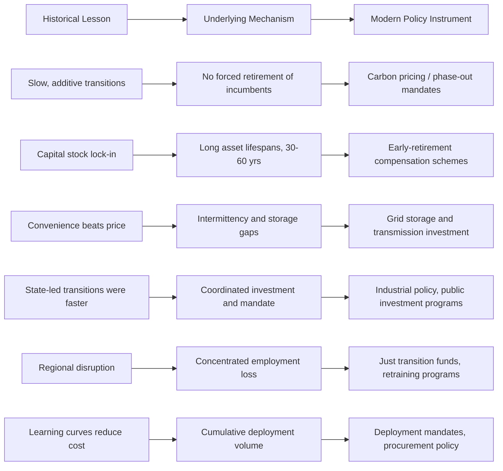

## Lessons from Historical Transitions for Current Policy

### Overview

Energy transitions—the shift from one dominant energy source or technology to another (wood to coal, coal to oil, and now fossil fuels to low-carbon sources)—have occurred repeatedly over the past three centuries. Historical analysis of these transitions provides an empirical basis for evaluating the feasibility, pace, and policy requirements of the current transition to renewable and low-carbon energy systems. This subtopic synthesizes findings from economic history and energy systems research into actionable lessons for contemporary energy policy.

### Historical Transitions as an Analytical Base

Three major transitions are typically studied:

1. **Wood/biomass to coal** (roughly 1600s–1900s in Western Europe, later elsewhere)
2. **Coal to oil and gas** (roughly 1900s–1970s)
3. **Fossil fuels to electricity as an energy carrier**, and more recently **fossil fuels to renewables** (ongoing)

Each transition was driven by a combination of factors: relative cost, energy density, convenience of use, infrastructure compatibility, and government policy. [Inference] The relative weight of these drivers differed across transitions, which is itself a key lesson—no single "transition template" exists.

### Lesson 1: Historical Transitions Were Slow and Additive, Not Substitutive

**Key Points**

- Past transitions typically took **50–100 years** from initial adoption to dominance of the new energy source.
- New energy sources historically **added to** total energy supply rather than fully replacing prior sources in absolute terms—coal use did not decline in absolute terms even as oil's share grew; wood and biomass remain in significant use globally today.
- This implies that global primary energy consumption has historically been characterized by **stacking**, not **switching**.

**Policy Implication**

Current climate policy requires an actual *substitution* of fossil fuels (net emissions reduction), not merely the addition of renewables alongside continued fossil fuel growth. This is a structurally different challenge than prior transitions, which occurred without an equivalent constraint forcing the retirement of the incumbent source. [Inference] This suggests today's transition may require a faster pace and more deliberate policy intervention than historical market-driven transitions achieved organically.

### Lesson 2: Infrastructure and Capital Stock Lock-In Slows Transitions

**Key Points**

- Long-lived capital assets (power plants, refineries, pipelines, vehicle fleets, industrial equipment) have economic lifespans of **30–60 years**.
- Historical transitions were paced by the **depreciation and replacement cycle** of existing capital stock; new technologies were adopted primarily at the point of new investment, not through early retirement of functioning assets.
- The coal-to-oil transition in transportation, for example, unfolded over decades in step with the natural retirement of coal-fired locomotives and ships.

**Policy Implication**

Policies that only incentivize *new* clean technology adoption (e.g., subsidies for new solar/wind capacity) without addressing the retirement timeline of existing fossil assets will replicate the slow, additive pattern of history. Accelerating transitions requires either:

- Policies that shorten effective asset lifespans (carbon pricing that makes continued operation uneconomical, mandated phase-out dates)
- Compensation mechanisms for early retirement (just transition funds, stranded asset write-downs)

### Lesson 3: Energy Density and Convenience Drove Adoption More Than Price Alone

**Key Points**

- Coal displaced wood substantially due to higher energy density per unit volume/mass, enabling more compact, transportable, and powerful applications (steam engines).
- Oil displaced coal in transportation largely due to convenience (liquid fuel handling, higher power-to-weight ratio for engines) rather than price advantage alone; [Inference] in many periods oil was not reliably cheaper than coal per unit of energy.
- This indicates that **non-price attributes**—reliability, storability, flexibility, ease of use—have historically been decisive.

**Policy Implication**

Renewable energy policy that focuses exclusively on levelized cost of electricity (LCOE) may understate adoption barriers related to intermittency, storage, and grid integration. Effective policy should address these convenience/reliability gaps directly (grid-scale storage investment, demand response infrastructure, transmission buildout) rather than assuming cost parity alone will drive substitution.

### Lesson 4: Government Policy Has Historically Accelerated or Redirected Transitions

**Key Points**

- The **French nuclear program** (Plan Messmer, launched 1974 following the oil crisis) is a well-documented case of a state-directed transition, achieving roughly 70–80% of electricity generation from nuclear within about 15 years—far faster than market-driven historical transitions.
- **Wartime and crisis mobilization** (e.g., U.S. and UK industrial energy shifts during World War II) demonstrated that rapid energy system reconfiguration is possible under strong central coordination and resource prioritization.
- **UK's coal-to-natural-gas transition** ("Dash for Gas," 1990s) was substantially accelerated by privatization and regulatory changes that favored gas-fired generation.

**Policy Implication**

Historical precedent supports the conclusion that transitions can be significantly accelerated beyond the "natural" multi-decade pace when there is sustained political commitment, direct state investment or mandate, and coordinated industrial policy. [Inference] This is often cited as evidence against purely market-based, price-signal-only approaches (e.g., carbon pricing alone) achieving the transition speed required for climate targets, though this remains a debated point in energy policy circles.

### Lesson 5: Regional and Resource-Endowment Heterogeneity Shaped Outcomes

**Key Points**

- Countries with domestic coal (UK, Germany, U.S.) industrialized around coal-based systems earlier and more completely than resource-poor nations.
- Japan's relative lack of domestic fossil fuel resources shaped its historical emphasis on energy efficiency and, later, nuclear power.
- Transition pathways were never uniform; they were conditioned by domestic resource endowment, geography, and existing industrial base.

**Policy Implication**

A one-size-fits-all global transition policy is historically unsupported. Effective current policy design should account for differentiated national starting points (fossil fuel endowments, grid infrastructure maturity, industrial composition) rather than assuming uniform technology pathways or timelines across countries—this is part of the rationale behind the UNFCCC principle of "common but differentiated responsibilities."

### Lesson 6: Employment and Social Disruption Require Deliberate Management

**Key Points**

- The decline of coal mining regions (Appalachia in the U.S., the Ruhr Valley in Germany, South Wales in the UK) in prior transitions produced **long-lasting regional economic depression** where transition support was inadequate or delayed.
- The Ruhr Valley case is often cited as a partial success due to Germany's structural adjustment programs (retraining, infrastructure diversification) implemented over decades, though [Inference] outcomes remain contested and recovery was uneven and slow even with these programs.

**Policy Implication**

This is the direct historical precedent for the modern **"just transition"** policy framework, which explicitly incorporates worker retraining, regional economic diversification funding, and transition timelines calibrated to social absorption capacity—rather than encouraging abrupt fossil fuel sector contraction.

### Lesson 7: Technology Cost Curves Follow Predictable Learning Patterns

**Key Points**

- Historical technologies (electric lighting, internal combustion engines) exhibited **learning curves**—cost declines as a function of cumulative production/deployment, often approximated by **Wright's Law**: cost declines by a roughly constant percentage for each doubling of cumulative production.
- Solar photovoltaic costs have followed a documented learning curve with cost declines historically in the range of roughly 20–28% per doubling of cumulative installed capacity, broadly consistent with patterns observed in other manufactured technologies.

$$C_n = C_1 \cdot n^{-b}$$

Where $C_n$ is the cost at cumulative production $n$, $C_1$ is the cost of the first unit, and $b$ is the learning elasticity (related to the learning rate).

**Policy Implication**

Deployment-driving policies (feed-in tariffs, renewable portfolio standards, procurement mandates) that increase cumulative production volume are historically effective at driving down technology costs, independent of direct R&D subsidy. This supports "deploy to decarbonize" policy logic alongside R&D investment, since learning-by-doing has historically been a larger cost-reduction driver than laboratory research alone for several mature technologies. [Inference] The applicability of historical learning rates to future solar/wind/battery cost trajectories is not guaranteed, since learning rates can flatten as technologies mature.

### Comparative Transition Timeline (svg_diagram)

<svg xmlns="http://www.w3.org/2000/svg" viewBox="0 0 900 380" font-family="Arial, sans-serif">
<text x="450" y="25" font-size="18" font-weight="bold" text-anchor="middle" fill="#1a1a1a">Historical Energy Transitions: Pace and Drivers (svg_diagram)</text>
<line x1="80" y1="340" x2="860" y2="340" stroke="#333" stroke-width="2" />
<text x="70" y="90" font-size="11" fill="#333" text-anchor="end">1700</text>
<text x="70" y="150" font-size="11" fill="#333" text-anchor="end">1850</text>
<text x="70" y="210" font-size="11" fill="#333" text-anchor="end">1900</text>
<text x="70" y="270" font-size="11" fill="#333" text-anchor="end">1970</text>
<text x="70" y="330" font-size="11" fill="#333" text-anchor="end">2020</text>
<line x1="80" y1="90" x2="860" y2="90" stroke="#ddd" stroke-width="1" stroke-dasharray="4,3" />
<line x1="80" y1="150" x2="860" y2="150" stroke="#ddd" stroke-width="1" stroke-dasharray="4,3" />
<line x1="80" y1="210" x2="860" y2="210" stroke="#ddd" stroke-width="1" stroke-dasharray="4,3" />
<line x1="80" y1="270" x2="860" y2="270" stroke="#ddd" stroke-width="1" stroke-dasharray="4,3" />
<line x1="80" y1="330" x2="860" y2="330" stroke="#ddd" stroke-width="1" stroke-dasharray="4,3" />
<rect x="150" y="90" width="60" height="240" fill="#8B5E3C" opacity="0.7" />
<text x="180" y="80" font-size="12" text-anchor="middle" fill="#333">Wood→Coal</text>
<text x="180" y="355" font-size="10" text-anchor="middle" fill="#555">~150 yrs</text>
<rect x="330" y="210" width="30" height="120" fill="#4A4A4A" opacity="0.7" />
<text x="345" y="200" font-size="12" text-anchor="middle" fill="#333">Coal→Oil</text>
<text x="345" y="345" font-size="10" text-anchor="middle" fill="#555">~70 yrs</text>
<rect x="450" y="255" width="15" height="15" fill="#1E6091" opacity="0.9" />
<text x="500" y="262" font-size="12" fill="#333">France: Nuclear (state-led, ~15 yrs)</text>
<rect x="600" y="270" width="230" height="60" fill="#2E8B57" opacity="0.6" />
<text x="715" y="260" font-size="12" text-anchor="middle" fill="#333">Fossil→Renewables (ongoing)</text>
<text x="715" y="355" font-size="10" text-anchor="middle" fill="#555">~50+ yrs projected</text>

<text x="450" y="365" font-size="11" font-style="italic" text-anchor="middle" fill="#666">Narrower bars = faster, more state-directed transitions</text>

</svg>

### Framework Diagram: From Historical Lesson to Policy Instrument

### Quantitative Synthesis: Historical Transition Speeds

| Transition | Approx. Duration to Dominance | Primary Driver | Degree of State Direction |
| --- | --- | --- | --- |
| Wood → Coal | ~100–150 years | Energy density, industrialization | Low |
| Coal → Oil (transport) | ~50–70 years | Convenience, power-to-weight | Low–Moderate |
| Oil crisis → Nuclear (France) | ~15 years | Energy security shock | Very High |
| Coal → Gas (UK, "Dash for Gas") | ~10–15 years | Regulatory/market liberalization | High |
| Fossil fuels → Renewables (global, ongoing) | Projected 30–50+ years [Speculation] | Cost decline, climate policy, mandates | Variable by country |

[Speculation] Projected durations for the current transition are inherently uncertain and depend heavily on policy choices, technology breakthroughs (e.g., storage cost declines, green hydrogen scalability), and geopolitical factors that cannot be reliably forecast from historical analogy alone.

### Worked Example: Applying the Learning Curve Lesson to Policy Design

**Scenario**: A government is deciding between (a) a fixed subsidy per unit of R&D spending, and (b) a feed-in tariff that guarantees a fixed price per unit of renewable electricity generated, in order to reduce future solar costs.

**Analysis using Wright's Law logic:**

- R&D subsidies primarily affect $C_1$ (the cost of initial technology development) but do not necessarily increase $n$ (cumulative deployment volume).
- Feed-in tariffs directly increase $n$ by incentivizing deployment, which—per the historical learning curve pattern observed in solar PV—has been associated with cost reductions at a rate empirically closer to 20–28% per doubling of cumulative capacity.

**Conclusion**: Historically, deployment-focused policy instruments (feed-in tariffs, renewable portfolio standards) have driven larger aggregate cost reductions in mature manufacturing-based technologies like solar PV than R&D-focused instruments alone, though R&D remains essential for breakthrough technologies not yet on a manufacturing learning curve (e.g., long-duration storage, green hydrogen electrolysis). [Inference] The specific mix of R&D versus deployment support is disputed among energy economists and technology maturity should factor into public policy resource allocation decisions.

### Common Points of Disagreement Among Energy Historians and Economists

- **Whether market forces alone (price signals) can replicate historical transition speeds**, given that the current transition requires substitution rather than addition—this is a major point of contested debate, not resolved fact.
- **Whether the "energy transition" framing itself is historically accurate**, since some economic historians (e.g., Vaclav Smil) argue that past shifts were never full "transitions" but rather additions to an ever-expanding energy mix, casting doubt on whether "transition" is even the correct term for a process requiring absolute fossil fuel decline.
- **The applicability of the French nuclear precedent** to renewable-based transitions, since nuclear is dispatchable baseload power while wind/solar are intermittent, meaning the state-coordination lesson may not transfer identically across technology types. [Inference]

**Next Steps**

- Energy transition theory and the S-curve adoption model
- Wright's Law and technology learning curves in depth
- Case study: the Ruhr Valley coal phase-out and regional economic policy
- Case study: France's Plan Messmer and state-directed nuclear buildout
- Just transition frameworks and international labor policy (ILO guidelines)
- Carbon pricing mechanisms: cap-and-trade vs. carbon tax design
- Stranded asset risk and financial regulation in fossil fuel divestment
- Grid-scale energy storage economics and policy incentives
- Comparative national case studies: Germany's Energiewende, China's renewable industrial policy, U.S. Inflation Reduction Act