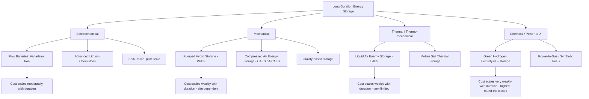

## Long-Duration Energy Storage Economics

### Overview

Long-duration energy storage (LDES) refers to storage technologies capable of discharging electricity for **10 or more consecutive hours**, distinguishing them from short-duration lithium-ion battery systems (typically 1–4 hours) that dominate current grid-scale deployment. As power systems integrate higher shares of variable renewable energy (wind and solar), the economic case for LDES centers on addressing **multi-day weather lulls, seasonal supply-demand mismatches, and diurnal renewable variability** that short-duration storage cannot economically resolve. Long-duration energy storage (LDES) is typically defined as 10+ hours, and is what grids will need to handle multi-day weather events and seasonal swings, in contrast to the vast majority of installed and contracted battery energy storage systems (BESS), which sit in the 1–4 hour bucket. [polinovelbess](https://www.polinovelbess.com/info/grid-scale-battery-storage-2026-costs-technolo-103489640.html)

### Why Duration Changes the Economics

Storage economics do not scale linearly with duration because **capital costs split into two distinct components**:

1. **Power capacity cost** ($/kW): the cost of the conversion equipment (turbines, compressors, inverters, electrolyzers) that determines how fast energy can be charged or discharged.
2. **Energy capacity cost** ($/kWh): the cost of the storage medium itself (battery cells, tanks, reservoirs, caverns) that determines how much energy can be held.

For **lithium-ion batteries**, the energy-capacity cost dominates and scales poorly with duration—extending duration means adding proportionally more cells. Adding six more hours of duration to a lithium system roughly triples the cell cost, whereas in technologies like liquid air energy storage the energy is stored in comparatively cheap tankage, with the expensive component being the cryogenic turbomachinery. This structural difference is the central economic argument for non-lithium LDES technologies at durations beyond 8–10 hours: **technologies with cheap energy-scaling components (tanks, caverns, reservoirs) become progressively more cost-competitive as required duration increases**, even if their round-trip efficiency or power-capacity costs are less favorable than lithium-ion. [howtostoreelectricity](https://howtostoreelectricity.com/liquid-air-energy-storage-cost-per-kwh/)

### The Levelized Cost of Storage (LCOS) Framework

The primary metric for comparing storage economics across technologies and durations is **Levelized Cost of Storage (LCOS)**, analogous to LCOE but accounting for round-trip efficiency losses and cycling patterns.

**Key Points**

- LCOS expresses the cost of storing and later discharging one unit of electricity, amortized over the asset's operating life and total energy throughput.
- Unlike LCOE, LCOS must account for **charging cost** (the price paid for electricity used to charge the system), **round-trip efficiency**, and **cycle life/degradation**.

$$LCOS = \frac{\sum_{t=0}^{n} \dfrac{CAPEX_t + OPEX_t + Charging\ Cost_t}{(1+r)^t}}{\sum_{t=0}^{n} \dfrac{Energy\ Discharged_t}{(1+r)^t}}$$

Where $r$ is the discount rate, $n$ is the asset lifetime in years, and $Energy\ Discharged_t$ accounts for round-trip efficiency losses.

**Simplified approximation** commonly used for first-pass estimates:

$$LCOS \approx \frac{Total\ Lifetime\ Cost}{Total\ Lifetime\ Energy\ Delivered}$$

**Worked Example**

Using representative utility-scale parameters:

| Parameter | Value |
| --- | --- |
| System capacity | 100 MWh |
| Lifetime | 15 years |
| Cycles per year | 300 |
| Round-trip efficiency | 90% |
| Total lifetime cost | $58 million |

Dividing total lifetime cost by total lifetime energy delivered under these parameters yields an LCOS result of approximately $0.143 per kWh, equivalent to roughly $143 per MWh. This example illustrates why utilization (cycles per year) and efficiency are as economically significant as upfront capital cost—a system with higher CAPEX but higher cycling frequency and efficiency can achieve a lower LCOS than a cheaper, underutilized system. [sunlithenergy](https://sunlithenergy.com/cost-of-storing-energy-bess/)

### Comparative LCOS by Technology (2026)

**Key Points**

Short-duration lithium-ion (LFP) remains the cost leader for durations under 4 hours, but costs and competitiveness shift substantially at longer durations:

| Technology | Typical Duration | LCOS Range (2026) | Key Cost Driver |
| --- | --- | --- | --- |
| Lithium Iron Phosphate (LFP) | 2–4 hrs | ~$90–140/MWh | Cell price, cycle count |
| Vanadium Flow Battery | 6–10 hrs | ~$140–230/MWh | Electrolyte volume, stack cost |
| Sodium-ion (pilot-scale) | 2–4 hrs | ~$120–190/MWh | Early-stage manufacturing scale |
| Pumped Hydro Storage (PHES) | 8–24+ hrs | ~$100–150/MWh (new-build) | Site availability, civil works |
| Liquid Air Energy Storage (LAES) | 8–24+ hrs | ~€120–180/MWh, with a credible pathway toward €80–110/MWh by the mid-2030s | Cryogenic turbomachinery |
| Advanced/Adiabatic CAES | 10+ hrs | ~224 EUR/MWh in a European base-case scenario | Compressed air storage geology, compressor/expander efficiency |

[Inference] These figures vary substantially by region, financing structure, and site-specific factors (geology for CAES/PHES, grid interconnection costs); they should be treated as indicative ranges rather than precise universal benchmarks, and cost estimates for less mature technologies (LAES, advanced CAES) carry higher uncertainty than for mature lithium-ion systems. The first commercial-scale plants of newer technologies will almost certainly cost more than techno-economic models suggest, since first-of-a-kind projects typically carry cost premiums not captured in mature-technology cost projections. [howtostoreelectricity](https://howtostoreelectricity.com/liquid-air-energy-storage-cost-per-kwh/)

### Duration-Dependent Technology Selection

**Key Points**

- The lowest LCOS across technologies is generally achieved at maximum utilization, specifically between discharge durations of 1–64 hours and discharge frequencies of 100 to 5,000 cycles per year. [storage-lab](https://www.storage-lab.com/levelized-cost-of-storage)
- Vanadium flow batteries become more economically competitive relative to lithium-ion specifically at 6–10 hour durations under heavy cycling conditions, though financing, augmentation costs, and EPC (engineering, procurement, construction) scope can shift project economics by 12–30% even when underlying battery pack prices appear similar. [solartodo](https://solartodo.com/knowledge/grid-scale-battery-storage-cost-trends-2026-h2-lcos-analysis-by-technology)
- Despite changing underlying technologies, future cost projections show a proportional cost reduction across the entire discharge-duration and cycling-frequency spectrum, with LCOS of 100–150 USD/MWh projected to be achievable in five of thirteen modeled application archetypes by 2040. [storage-lab](https://www.storage-lab.com/levelized-cost-of-storage)

This finding is economically significant: it suggests that **no single technology dominates across all duration ranges**—the least-cost technology choice is a function of the specific duration and cycling requirement of the application, not a fixed ranking of technologies.

### Revenue Stacking and Bankability

**Key Points**

- LDES projects rarely earn revenue from a single service; project economics typically depend on **revenue stacking** across multiple grid services: energy arbitrage (buying low-price/off-peak electricity, discharging at high-price/peak periods), capacity payments, ancillary services (frequency regulation, reserves), and transmission/distribution deferral value.
- For a large, long-duration utility-scale battery project, shifting half of daily solar generation to overnight hours adds approximately $33/MWh to the underlying cost of solar generation, based on a $65/MWh LCOS assumption. [ember-energy](https://ember-energy.org/latest-insights/how-cheap-is-battery-storage/)
- The LCOS for such a project depends on guaranteed revenue structures, with all-in project capex around $125/kWh split between roughly $75/kWh for core equipment and roughly $50/kWh for installation and grid connection. [ember-energy](https://ember-energy.org/latest-insights/how-cheap-is-battery-storage/)

**Policy/Finance Implication**

[Inference] Because LDES projects often depend on revenue streams that are not yet fully monetized in many electricity markets (e.g., explicit long-duration capacity products, seasonal firming contracts), bankability frequently depends on policy mechanisms such as contracts-for-difference, capacity market reforms that recognize duration value, or state-backed offtake agreements—rather than on merchant energy-arbitrage revenue alone.

### Cost Trajectory and Learning Effects

**Key Points**

- Longer asset lifetimes, higher round-trip efficiency, and lower project risk premiums alone have been shown to reduce LCOS by roughly 35%, from approximately $100/MWh to $65/MWh, even before accounting for falling underlying battery hardware prices. [ember-energy](https://ember-energy.org/latest-insights/how-cheap-is-battery-storage/)
- Cell-level pricing for utility-grade LFP batteries settled in the $55–75/kWh range in early 2026 on the international market, a level below what most analysts had expected for this stage of the cost-decline curve, driven by cell oversupply and competitive engineering-procurement-construction (EPC) pricing. [polinovelbess](https://www.polinovelbess.com/info/grid-scale-battery-storage-2026-costs-technolo-103489640.html)
- Regional variation in installed system costs remains substantial: 4-hour LFP systems installed in China run roughly $90–130/kWh, compared to roughly $180–260/kWh in Europe and $230–320/kWh in the United States, reflecting domestic content requirements, tariffs, and labor/EPC cost differences. [polinovelbess](https://www.polinovelbess.com/info/grid-scale-battery-storage-2026-costs-technolo-103489640.html)

[Inference] This regional cost dispersion illustrates that LDES economics are not purely a function of technology maturity but are heavily mediated by trade policy, domestic manufacturing incentives, and labor markets—meaning national LCOS benchmarks should not be extrapolated globally without adjustment.

### Round-Trip Efficiency Trade-offs

**Key Points**

- Round-trip efficiency (RTE)—the ratio of energy discharged to energy used for charging—varies substantially by technology and directly affects both the effective LCOS and the charging-cost component of total lifecycle cost.
- Liquid air energy storage exhibits round-trip efficiency of roughly 50–70% with waste-heat integration, a level generally regarded as inferior to lithium-ion (typically 85–95% RTE) but is often accepted as an economic trade-off given LAES's superior cost-scaling with duration. [howtostoreelectricity](https://howtostoreelectricity.com/liquid-air-energy-storage-cost-per-kwh/)
- Lower RTE technologies effectively require **more input electricity per unit delivered**, meaning their competitiveness improves as the cost of charging electricity (often off-peak or curtailed renewable power) approaches zero—since a larger share of "wasted" energy has correspondingly lower opportunity cost.

**Policy Implication** [Inference]: Regions with substantial renewable curtailment (excess wind/solar generation that would otherwise be wasted) may find lower-RTE, lower-cost-per-kWh LDES technologies more economically attractive than high-RTE, high-cost lithium-ion systems, since the "wasted" energy in a lower-efficiency system has near-zero opportunity cost when charged from otherwise-curtailed generation.

### Technology Landscape Diagram

### LCOS vs. Duration Relationship (svg_diagram)

<svg xmlns="http://www.w3.org/2000/svg" viewBox="0 0 800 420" font-family="Arial, sans-serif">
<text x="400" y="25" font-size="17" font-weight="bold" text-anchor="middle" fill="#1a1a1a">Relative Cost Scaling by Duration (svg_diagram)</text>
<line x1="80" y1="360" x2="750" y2="360" stroke="#333" stroke-width="2" />
<line x1="80" y1="360" x2="80" y2="60" stroke="#333" stroke-width="2" />
<text x="415" y="395" font-size="13" text-anchor="middle" fill="#333">Discharge Duration (hours)</text>
<text x="30" y="210" font-size="13" text-anchor="middle" fill="#333" transform="rotate(-90 30 210)">Relative Total Cost</text>

<text x="80" y="378" font-size="11" text-anchor="middle" fill="#555">2</text>

<text x="230" y="378" font-size="11" text-anchor="middle" fill="#555">8</text>

<text x="400" y="378" font-size="11" text-anchor="middle" fill="#555">16</text>

<text x="570" y="378" font-size="11" text-anchor="middle" fill="#555">24</text>

<text x="740" y="378" font-size="11" text-anchor="middle" fill="#555">48+</text>

<polyline points="80,320 230,220 400,90 570,50 740,30" fill="none" stroke="#C0392B" stroke-width="3" />
<text x="620" y="45" font-size="12" fill="#C0392B" font-weight="bold">Lithium-ion (energy-cost dominated)</text>
<polyline points="80,340 230,300 400,270 570,255 740,240" fill="none" stroke="#1E6091" stroke-width="3" />
<text x="600" y="228" font-size="12" fill="#1E6091" font-weight="bold">LAES / CAES (tank-cost dominated)</text>
<polyline points="80,350 230,330 400,310 570,300 740,292" fill="none" stroke="#2E8B57" stroke-width="3" />
<text x="590" y="285" font-size="12" fill="#2E8B57" font-weight="bold">Pumped Hydro (site-dependent, flat)</text>

<text x="415" y="415" font-size="11" font-style="italic" text-anchor="middle" fill="#666">Illustrative relative scaling — not to precise cost scale</text>

</svg>

### Barriers to LDES Deployment

**Key Points**

- **Market design gaps**: Most wholesale electricity markets were not designed with explicit products for multi-day or seasonal storage value, making revenue difficult to forecast and finance against.
- **Siting constraints**: Pumped hydro and compressed air technologies require specific geology (elevation differentials, salt caverns, depleted gas reservoirs), limiting deployment to favorable sites.
- **First-of-a-kind (FOAK) risk premiums**: Novel technologies such as liquid air storage face cost premiums on initial commercial deployments beyond what mature techno-economic models predict, a pattern common to first-of-a-kind infrastructure projects generally. [howtostoreelectricity](https://howtostoreelectricity.com/liquid-air-energy-storage-cost-per-kwh/)
- **Financing structure mismatch**: Long asset lifetimes (30–50+ years for PHES/CAES) require long-duration financing instruments and offtake certainty that may not align with typical project finance tenors used for shorter-duration battery projects.

### Conclusion

LDES economics differ fundamentally from short-duration battery storage economics because the **cost structure separates power capacity from energy capacity**, meaning technologies with cheap, scalable energy-storage media (tanks, caverns, reservoirs) become progressively more competitive as required duration increases, even when their efficiency or power-side costs are less favorable. Current data indicates lithium-ion retains cost leadership under approximately 4 hours, while flow batteries, pumped hydro, compressed air, and liquid air storage become more competitive at 6+ hour durations, with no single technology dominating across all duration and cycling profiles. [Inference] The central unresolved economic challenge is less about technology cost curves—which are following broadly predictable, if uncertain, downward trajectories—and more about market design and revenue certainty, since most electricity markets do not yet price the specific reliability value that multi-day and seasonal storage provides.

**Next Steps**

- Levelized Cost of Storage (LCOS) modeling in depth: discount rate sensitivity and cycle-life assumptions
- Compressed air energy storage (CAES) geology and site-selection economics
- Green hydrogen as a long-duration storage vector: electrolyzer economics and round-trip efficiency
- Capacity market design reforms for duration-differentiated storage products
- Revenue stacking strategies and ancillary service market participation for storage assets
- Seasonal storage economics and the role of thermal storage in industrial decarbonization
- Comparative case study: California duck curve mitigation via storage vs. transmission investment
- First-of-a-kind (FOAK) cost premiums and technology risk in infrastructure finance