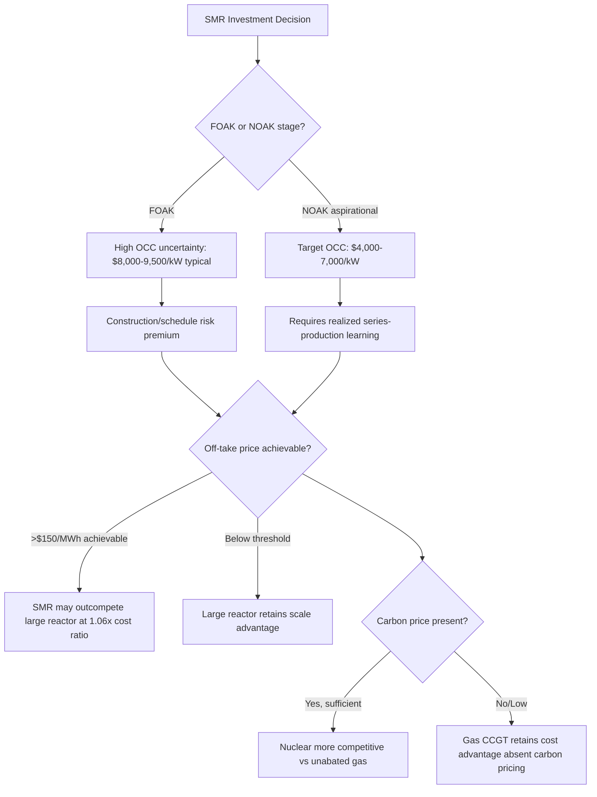

## Small Modular and Advanced Nuclear Reactor Economics

### Overview

Small modular reactors (SMRs) are nuclear reactors typically defined by electrical output below roughly 300 MWe, designed around **factory fabrication of standardized modules** rather than bespoke on-site construction, with the goal of reversing the cost escalation and schedule overruns that have characterized large-reactor construction in Western markets over the past several decades. By shifting nuclear construction from bespoke on-site megaprojects to factory-fabricated modular units, SMRs target capital expenditure of $4,000–7,000/kW (nth-of-a-kind, or NOAK) versus $8,000–12,000/kW for recent large reactor builds, with construction timelines compressed from 6–10 years to 3–5 years. "Advanced" reactors additionally refers to non-light-water Generation IV designs (gas-cooled, molten-salt, sodium-cooled fast reactors) that use alternative coolants and fuel cycles, which introduce distinct cost structures alongside the modularity premise.

### The Core Economic Proposition

**Key Points**

- Large nuclear reactors have historically suffered from **negative economies of scale realization**—cost overruns and schedule delays that erode the theoretical per-unit cost advantage of larger plants (Vogtle Units 3 & 4 in the U.S. realized costs around $140–180/MWh, well above initial projections).
- SMRs trade the **economy of scale** (larger plants historically produce cheaper electricity per unit of capacity, all else equal) for **economies of series production** (learning-by-doing and standardization across many factory-built modules) and reduced construction risk (shorter build times reduce financing/interest-during-construction costs).
- Whether the "economies of series" savings outweigh the loss of "economies of scale" is the central, unresolved economic question in SMR viability. [Inference] This trade-off has not yet been empirically validated at commercial scale in Western markets, since no Western SMR fleet has reached the "nth-of-a-kind" production stage where series learning effects would be expected to materialize.

### Overnight Capital Cost (OCC) Benchmarks

**Key Points**

Overnight capital cost (OCC)—the hypothetical cost of construction if it occurred instantaneously, excluding financing costs—is the primary input driving nuclear LCOE, and estimates vary substantially by reactor type, source, and production stage (first-of-a-kind vs. nth-of-a-kind):

| Source / Study | Reactor Type | OCC Estimate |
| --- | --- | --- |
| IAEA (2020) | General SMR range | $2,000–6,000/kW |
| Bottom-up engineering study (90% CI) | Various SMR designs | $4,300–6,400/kW |
| Techno-economic analysis | Light-Water SMR (LW-SMR) | $4,844/kW |
| Techno-economic analysis | Gas-Cooled SMR (GC-SMR) | $4,355/kW |
| Techno-economic analysis | Molten-Salt SMR (MS-SMR) | $3,985/kW |
| EPRI comparison study | Large LWR — First-of-a-kind (FOAK) | $9,450/kWe |
| EPRI comparison study | Large LWR — Nth-of-a-kind (NOAK) | $5,050/kWe |
| EPRI comparison study | SMR — First-of-a-kind (FOAK) | $8,460/kWe |
| EPRI comparison study | SMR — Nth-of-a-kind (NOAK) | $5,134/kWe |
| Industry synthesis (2026) | SMR general range | $3,500–7,500/kW, with first-of-a-kind units at the high end |
| Industry synthesis (2026) | SMR (NOAK target) vs. recent large reactor builds | $4,000–7,000/kW vs. $8,000–12,000/kW |

**Key finding**: [Inference] Notably, the EPRI comparison shows FOAK SMR overnight cost ($8,460/kWe) is actually *lower* than FOAK large-reactor cost ($9,450/kWe) per kW, while NOAK costs converge closely ($5,134/kWe SMR vs. $5,050/kWe large reactor)—suggesting the per-kW capital cost gap between SMRs and large reactors may be smaller than commonly assumed once construction-risk-driven FOAK premiums are factored in, though this remains a modeled projection rather than an empirically realized outcome for Western SMR fleets.

### The Economy-of-Scale Penalty: Quantified

**Key Points**

- Economic modeling comparing a 114 MW SMR unit to a 1,144 MW conventional pressurized water reactor (PWR) found the SMR's total capital cost per kW of $2,901/kW compares to $6,936/kW for the large reference plant in one modeling scenario, though this reflects an optimistic modeled case rather than a typical outcome; the same analysis noted the SMR would take roughly 1.5 years to build versus 5 years for the large reference plant.
- A separate systematic review found average SMR capital costs were on average 41% higher than for large reactors on a per-kW basis, illustrating that estimates diverge sharply depending on methodology (top-down vs. bottom-up engineering estimates) and the specific reactor designs compared.
- One study modeling nth-of-a-kind SMRs found their overnight cost only between 1.06 and 1.26 times higher than that of a large reactor, framing SMRs as a genuinely competitive option requiring smaller upfront investment capital, rather than a categorically more expensive technology per unit of capacity.

[Inference] The wide dispersion across these estimates (ranging from SMRs being cheaper per kW to 41% more expensive) reflects genuine methodological and design uncertainty in the literature, not a settled consensus—readers should treat any single point estimate with caution and view the range itself as the more reliable signal.

### Levelized Cost of Electricity (LCOE) Comparison

**Key Points**

| Power Source | LCOE Range | Capacity Factor | Dispatchable | Notes |
| --- | --- | --- | --- | --- |
| Utility-Scale Solar (PV) | $30–50/MWh | 20–30% | No | Cheapest source; intermittent |
| Onshore Wind | $25–50/MWh | 25–45% | No | Low cost; intermittent, site-dependent |
| Natural Gas (CCGT) | $40–75/MWh | 85–90% | Yes | Low capex, high fuel/carbon price exposure |
| Large Nuclear (new-build) | $80–180/MWh | 90–93% | Yes | Vogtle 3&4 realized roughly $140–180/MWh |
| SMR (FOAK) | $80–150/MWh | 90–95% | Yes | High uncertainty; first-of-a-kind premium |
| SMR (NOAK target) | $50–80/MWh | 90–95%+ | Yes | Aspirational; not yet empirically demonstrated at scale |

[Inference] The NOAK target range of $50–80/MWh represents an industry aspiration contingent on achieving genuine serial production learning effects; it should be treated as a projection rather than a demonstrated outcome, since [Speculation] whether any Western SMR program reaches sufficient deployment volume to realize these learning-curve savings before the mid-2030s remains genuinely uncertain and depends on sustained order volumes, supply chain maturity, and regulatory streamlining.

### Cost Structure Breakdown: Why SMR Designs Differ

**Key Points**

Techno-economic decomposition reveals that different SMR coolant technologies achieve savings through different mechanisms:

- **Light-water SMRs (LW-SMR) and gas-cooled SMRs (GC-SMR)** utilize natural circulation, which eliminates coolant piping, pumps, and drives, reducing certain cost accounts substantially.
- **Molten-salt SMRs (MS-SMR)** integrate fuel-salt pumps directly into the core-unit and operate at low pressure, which decreases the cost of the pressure vessel, reactor building, and related equipment—though this design adds costs associated with molten salt fuel handling and radioactive waste processing, primarily in coolant pumps and waste processing accounts.
- Passive safety systems, a common design feature marketed across most SMR designs, contribute only a modest cost account (on the order of $55/kW in one detailed accounting), suggesting the "reduced safety system cost" argument, while real, is a relatively minor contributor to overall SMR economic advantage compared to modularity and factory fabrication effects.

**Sensitivity**: A Monte Carlo sensitivity analysis found that a 20% positive or negative change in key cost drivers shifted overnight capital costs by roughly $661/kW (LW-SMR), $805/kW (GC-SMR), and $151/kW (MS-SMR) respectively—indicating gas-cooled designs carry the highest cost sensitivity to input assumption changes among the three, while molten-salt designs are comparatively more cost-stable under the modeled sensitivity ranges.

### The First-of-a-Kind (FOAK) Risk Case Study: NuScale

**Key Points**

- NuScale's Carbon Free Power Project (CFPP) is widely cited as a cautionary case for FOAK cost escalation: costs escalated from an initial $5.3 billion estimate to $9.2 billion before the project's cancellation, illustrating the gap between early-stage cost projections and realized construction costs for genuinely first-of-a-kind nuclear designs.
- This case is used by critics to argue that SMRs may face the same "cost disease" dynamics (schedule slippage, design changes during construction, supply chain immaturity) that have afflicted large reactor projects, undermining the core premise that modularity alone resolves nuclear's cost overrun problem.
- Proponents counter that the CFPP cancellation reflects the specific commercial and off-take challenges of a genuinely first-of-a-kind project rather than a structural failure of the SMR concept itself, and point to lower-risk ongoing projects such as GE Hitachi's BWRX-300 at Darlington (Ontario Power Generation), targeting first commercial operation around 2029, as a more representative test case.

[Inference] Because only a small number of Western SMR projects have reached final investment decision or construction, the empirical evidence base for evaluating whether SMRs genuinely avoid large-reactor cost overrun patterns remains thin; the NuScale case is informative but should not be treated as conclusively representative of the technology class as a whole.

### Break-Even Analysis Against Alternatives

**Key Points**

- One economic analysis found that when the electricity-selling price in a project increases above $150/MWh, an SMR with an overnight cost 1.06 times that of a large reactor presents better economic indicators than the large reactor across modeled discount rates.
- Conversely, when the SMR's overnight cost reaches 1.26 times the large-reactor cost, the large reactor's economic indicators remain superior across all discount rates considered in that analysis, indicating a **cost-ratio threshold** beyond which SMR modularity benefits do not compensate for lost economies of scale.
- Comparing to fossil alternatives, one techno-economic analysis found that even the lowest-costing nuclear plant type analyzed (molten-salt SMR) would require a capital cost reduction of $2,959/kW to achieve cost parity with a natural gas combined-cycle plant without carbon capture, absent a carbon price or tax on natural gas emissions—illustrating that nuclear's competitiveness against unabated gas remains highly sensitive to carbon pricing policy.

### Non-Levelized Cost Drivers: Fuel and Licensing

**Key Points**

- Many advanced (non-light-water) SMR designs rely on **High-Assay Low-Enriched Uranium (HALEU)** fuel, which faces documented supply chain constraints in Western markets, creating a fuel-availability risk factor not fully captured in overnight capital cost estimates alone.
- Regulatory licensing pathways (NRC in the U.S., CNSC in Canada, ONR in the UK) for genuinely novel reactor designs introduce schedule and cost uncertainty distinct from construction cost itself; licensing timeline risk is frequently cited alongside construction cost risk as a determinant of overall project financeability.
- Non-Western markets have progressed differently: Russia already operates the world's first floating SMR, and China is deploying the land-based Linglong One reactor, illustrating that state-directed development models have achieved commercial or near-commercial SMR deployment ahead of most Western private-sector-led programs. [Inference] This divergence suggests that financing structure and state involvement, not technology readiness alone, may be a significant differentiator in near-term deployment pace across countries.

### Deployment Outlook

**Key Points**

- The IEA projects 10–25 GWe of installed global SMR capacity by 2035, representing roughly 1–3% of global nuclear capacity—characterized in industry analysis as indicating a steady evolution rather than an overnight revolution in the nuclear sector's contribution to global electricity supply.
- [Speculation] Emerging demand from AI data centers seeking dedicated, carbon-free, dispatchable power has been cited in recent industry analysis as a potential accelerant for SMR order volumes, though the durability and scale of this demand driver as a long-term SMR revenue anchor is not yet empirically established.

### Economic Decision Framework Diagram

### Capital Cost Comparison Diagram (svg_diagram)

<svg xmlns="http://www.w3.org/2000/svg" viewBox="0 0 850 400" font-family="Arial, sans-serif">
<text x="425" y="25" font-size="17" font-weight="bold" text-anchor="middle" fill="#1a1a1a">Overnight Capital Cost: FOAK vs NOAK (svg_diagram)</text>
<line x1="100" y1="340" x2="800" y2="340" stroke="#333" stroke-width="2" />
<line x1="100" y1="340" x2="100" y2="60" stroke="#333" stroke-width="2" />
<text x="60" y="345" font-size="11" text-anchor="end" fill="#555">$0</text>
<text x="60" y="255" font-size="11" text-anchor="end" fill="#555">$4,000</text>
<text x="60" y="165" font-size="11" text-anchor="end" fill="#555">$7,000</text>
<text x="60" y="80" font-size="11" text-anchor="end" fill="#555">$9,500</text>
<line x1="100" y1="255" x2="800" y2="255" stroke="#ddd" stroke-width="1" stroke-dasharray="4,3" />
<line x1="100" y1="165" x2="800" y2="165" stroke="#ddd" stroke-width="1" stroke-dasharray="4,3" />
<line x1="100" y1="80" x2="800" y2="80" stroke="#ddd" stroke-width="1" stroke-dasharray="4,3" />
<rect x="150" y="87" width="80" height="253" fill="#C0392B" opacity="0.75" />
<text x="190" y="352" font-size="11" text-anchor="middle" fill="#333">Large LWR FOAK</text>
<text x="190" y="80" font-size="10" text-anchor="middle" fill="#333">~$9,450/kW</text>
<rect x="280" y="182" width="80" height="158" fill="#E67E22" opacity="0.75" />
<text x="320" y="352" font-size="11" text-anchor="middle" fill="#333">Large LWR NOAK</text>
<text x="320" y="175" font-size="10" text-anchor="middle" fill="#333">~$5,050/kW</text>
<rect x="410" y="108" width="80" height="232" fill="#1E6091" opacity="0.75" />
<text x="450" y="352" font-size="11" text-anchor="middle" fill="#333">SMR FOAK</text>
<text x="450" y="101" font-size="10" text-anchor="middle" fill="#333">~$8,460/kW</text>
<rect x="540" y="180" width="80" height="160" fill="#2E8B57" opacity="0.75" />
<text x="580" y="352" font-size="11" text-anchor="middle" fill="#333">SMR NOAK</text>
<text x="580" y="173" font-size="10" text-anchor="middle" fill="#333">~$5,134/kW</text>
<rect x="670" y="255" width="80" height="85" fill="#7F8C8D" opacity="0.75" />
<text x="710" y="352" font-size="11" text-anchor="middle" fill="#333">NOAK Target</text>
<text x="710" y="248" font-size="10" text-anchor="middle" fill="#333">~$4,000-7,000/kW</text>

<text x="425" y="378" font-size="11" font-style="italic" text-anchor="middle" fill="#666">EPRI and industry-synthesis estimates; ranges vary by source</text>

</svg>

### Conclusion

SMR and advanced reactor economics center on a genuinely unresolved trade-off: sacrificing the economies of scale that favor large reactors in exchange for economies of series production (factory fabrication, standardization, shorter construction schedules) that reduce financing and schedule risk. Overnight capital cost estimates across credible sources range widely—from $2,000/kW to over $9,000/kW depending on reactor type, coolant technology, and production stage—reflecting genuine model uncertainty rather than a settled cost baseline. [Inference] The NuScale CFPP cancellation demonstrates that first-of-a-kind cost escalation risk, long characteristic of large nuclear, has not been automatically resolved by modularity alone; whether nth-of-a-kind cost targets ($50–80/MWh LCOE) are achievable depends on sustained order volumes and supply chain maturation that remain unproven in Western markets as of the current data. Break-even against gas and renewables remains highly sensitive to carbon pricing policy and achievable power-purchase-agreement pricing, making SMR competitiveness as much a function of policy design as of underlying engineering cost curves.

**Next Steps**

- Levelized Cost of Electricity (LCOE) modeling methodology and discount rate sensitivity for capital-intensive generation
- Generation IV reactor technology types: gas-cooled, molten-salt, sodium-cooled fast reactors
- HALEU fuel supply chain economics and enrichment capacity constraints
- Nuclear licensing reform economics: NRC/CNSC/ONR pathway comparison
- Carbon pricing mechanisms and their effect on dispatchable low-carbon generation competitiveness
- Case study: GE Hitachi BWRX-300 at Darlington (Ontario Power Generation)
- Case study: NuScale Carbon Free Power Project cancellation
- AI data center demand as an emerging driver of dispatchable clean power investment
- Comparative learning curves: nuclear serial production vs. solar/battery manufacturing learning rates