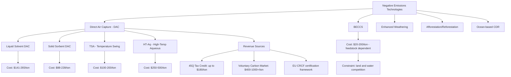

## Direct Air Capture and Negative Emissions Economics

### Overview

Direct air capture (DAC) is a negative emissions technology (NET) that removes carbon dioxide directly from ambient air (at atmospheric concentrations of roughly 400+ ppm), distinguishing it from point-source carbon capture, which captures CO₂ from concentrated flue-gas streams at industrial facilities. Global energy demands are met largely through fossil fuel combustion, which produces greater than 35 gigatons of CO₂ annually, and direct air capture is positioned as a technology that could address both current and legacy emissions, since it can theoretically be deployed anywhere, independent of proximity to an emissions source. The central economic challenge distinguishing DAC from point-source capture is that **atmospheric CO₂ is far more dilute** than flue gas, requiring substantially more energy and infrastructure per ton captured, which is the primary driver of DAC's persistently higher cost.

### Why DAC Costs More Than Point-Source Capture

**Key Points**

- Point-source carbon capture from concentrated industrial flue gas using amine-based scrubbing technology has a minimum cost around $65 per ton of CO₂, with broader estimates in the range of $52–77 per ton.
- DAC must extract CO₂ from ambient air where the gas is far more dilute (approximately 400 ppm) than in flue gas streams (which can be 5–15% CO₂ by volume), requiring significantly more air to be processed per ton of CO₂ captured, which drives substantially higher energy consumption and capital cost.
- Current DAC systems require roughly 1,000–1,289 kWh per tonne of CO₂ captured (combined electricity and heat), a substantially higher energy intensity than most point-source capture applications.

[Inference] This dilution penalty is a physical/thermodynamic constraint rather than an engineering limitation that can be fully eliminated through better technology—meaning DAC is likely to remain structurally more expensive per ton than point-source capture even as both technologies mature, absent a fundamental change in capture chemistry.

### Current Cost Estimates: A Wide and Contested Range

**Key Points**

DAC cost literature shows an unusually wide range of estimates, reflecting genuine methodological disagreement, technology-type variation, and the nascent commercial state of the industry:

| Source/Estimate Type | Cost Range ($/ton CO₂) | Notes |
| --- | --- | --- |
| National Academies of Sciences (liquid solvents) | $141–265/ton | Existing technology basis |
| National Academies of Sciences (solid sorbents) | $88–228/ton | Existing technology basis |
| American Physical Society (2011 estimate) | $600–1,000/ton | Early, often-cited pessimistic benchmark |
| Historical cost decline (2018 reporting) | Fell from $600/ton to $94–232/ton | Alkali-material absorption approach |
| Climeworks (Iceland facility, real-world reference) | ~$1,200/ton | Cited as one of few "real" priced DAC data points |
| Current commercial operations (2024–2025 industry synthesis) | $400–1,000+/ton | Reflects actual operating DAC plants |
| TSA (temperature swing adsorption) technology | $100–200/ton | Narrower range for this specific technology pathway |
| HT-Aq (high-temperature aqueous) technology | $250–500/ton | Higher due to expensive materials, complex operations |
| Natural gas + renewable hybrid approach | $250–490/ton | Combines intermittent renewables with gas reliability |

**Key Point**: [Inference] The wide dispersion in these estimates (spanning nearly two orders of magnitude, from $88/ton to $1,200/ton) reflects both genuine technology heterogeneity (different capture chemistries have fundamentally different cost structures) and the very small number of operating commercial-scale DAC facilities providing empirical (rather than modeled) cost data—Climeworks' Iceland facility being one of the only cited "real" cost figures in the literature rather than a projection.

### Future Cost Trajectories: Divergent Projections

**Key Points**

- Widely cited optimistic industry targets suggest DAC costs need to fall from $600–1,000 per ton today to below $200 per ton, and ideally closer to $100 per ton, to enable the technology's widespread adoption at climate-relevant scale by 2050.
- A more skeptical academic study (Sievert, Schmidt, and Steffen, ETH Zürich) projected future DAC costs are more likely to fall in the $230–540 per ton range, explicitly pushing back against the often-cited optimistic figure of $100–300 per ton, based on accounting for realistic technology characteristics rather than idealized learning-curve assumptions.
- Climeworks itself has acknowledged that its long-term costs might stabilize around $300 per ton CO₂ by 2030, a figure notably higher than the original $100 per ton target often cited in policy discussions.
- One techno-economic study projected costs could decrease to $100–600 per ton of CO₂ by 2050 through strategic deployment, but concluded that achieving the more optimistic $100 per ton target specifically is unlikely without substantial policy support.

[Inference] The consistent pattern across independent academic and industry-insider projections—each landing meaningfully above the $100/ton aspirational target—suggests the $100/ton benchmark, while a useful shorthand in climate policy discourse, should be treated with considerable skepticism as an achievable near-to-medium-term cost floor. [Speculation] Whether costs converge toward the more optimistic $100–300 range or the more conservative $230–540 range over the next two decades remains genuinely unresolved and will depend on deployment volume, energy price trajectories, and materials science advances that cannot be reliably forecast today.

### Cost Decomposition: Capital vs. Energy vs. Storage

**Key Points**

- Large-scale DAC deployment (targeting 1 gigaton of CO₂ captured annually) would require substantial dedicated power generation capacity; overall capital and financing costs for the new generating plants needed could easily total around three times the direct construction cost—approximately $5 trillion—to meet a 1 Gt CO₂ annual capture goal.
- If those capital costs were recovered over a 50-year period, the cost per tonne of CO₂ captured attributable to power infrastructure alone would be approximately $100; recovering the same costs over a shorter financing period would increase the per-tonne cost substantially, illustrating the sensitivity of DAC economics to financing assumptions and asset lifetime.
- Most techno-economic DAC cost studies assume a 20-year plant operating life for the DAC facility itself, a shorter asset life than many other energy infrastructure investments (compare to 30–60 year lifespans typical of power generation assets), which increases the annualized capital cost recovery burden per ton captured.

**Worked Example: Financing Period Sensitivity**

Using the illustrative case above:

$$\text{Annualized Capital Cost per Ton} = \frac{\text{Total Capital Cost}}{\text{Annual Capture Volume} \times \text{Recovery Period (years)}} \times \text{(financing factor)}$$

If $5 trillion in generation capital cost is recovered over 50 years against 1 Gt/year of capture, the effective per-ton contribution from power infrastructure is roughly $100/ton; halving the recovery period to 25 years roughly doubles this component (before accounting for compounding interest effects), illustrating why financing structure and discount rate assumptions are as economically consequential as underlying engineering cost estimates in DAC techno-economic analysis.

### Policy Instruments Driving DAC Investment

**Key Points**

- The U.S. Section 45Q tax credit currently offers up to $180 per tonne of CO₂ permanently stored via DAC under the Inflation Reduction Act, representing the largest federal subsidy currently available for CO₂ removal and directly narrowing the gap between DAC's current operating cost and a commercially viable price point.
- The EU's Carbon Removal Certification Framework (CRCF), adopted in December 2024, creates a regulatory foundation for certifying and monetizing carbon removal activities, including DAC, within the European policy landscape.
- DAC-derived carbon removal credits command premium prices in the Voluntary Carbon Market (VCM), currently ranging from $400 to over $1,000 per tonne, reflecting institutional buyers' willingness to pay for what is considered the highest-quality carbon removal in terms of permanence and verifiability, distinct from lower-quality/lower-permanence offset types.

[Inference] The combination of a $180/ton federal tax credit and premium voluntary-market pricing above $400/ton suggests that current DAC commercial viability, where it exists, depends heavily on policy support and premium-market buyers rather than on DAC being cost-competitive against the broader carbon price or general market conditions—meaning near-term DAC deployment scale is likely to remain policy-and-premium-buyer-dependent rather than market-driven at scale.

### DAC vs. Alternative Negative Emissions Technologies

**Key Points**

| Criterion | Direct Air Capture (DAC) | BECCS (Bioenergy with Carbon Capture and Storage) |
| --- | --- | --- |
| Current cost | $400–1,000+/tCO₂ (commercial operations) | $20–200/tCO₂ (varies by feedstock/geography) |
| Projected cost by 2050 | $100–300/tCO₂ (optimistic projections) | $50–150/tCO₂ (limited by biomass feedstock constraints) |
| Energy intensity | High: ~1,000–1,289 kWh/tonne CO₂ | Moderate: can be energy-positive with high-quality biomass, though often energy-neutral to negative in practice |
| Land footprint | Near-zero | Requires vast land and water resources |
| Scalability ceiling | Unlimited theoretical scale | Limited by available biomass feedstock and land competition with food/conservation uses |

**Key finding**: BECCS currently costs less per tonne than DAC and can generate net energy in favorable configurations, but requires vast land and water resources, whereas DAC costs more but has a near-zero land footprint and theoretically unlimited scale. Most credible climate mitigation scenarios deploy both technologies as complements rather than as competing substitutes, reflecting their distinct resource-constraint profiles.

### Reframing the Cost Benchmark: Social Cost of Carbon

**Key Points**

- The commonly cited $100 per tCO₂ target functions largely as a convenient psychological and communications benchmark—very few bulk commodities sell for less than $100 per ton, with even basic materials like cement, coal, and iron ore typically trading between $100 and $200 per ton, making sub-$100 DAC an unusually aggressive cost target relative to comparable industrial commodities.
- An alternative economic framework evaluates DAC against the **social cost of carbon**—an estimate of the economic damages caused by one ton of CO₂ emissions, incorporating climate-related disaster costs, health effects, and agricultural losses—rather than against an arbitrary round-number price target.
- Using the social cost of carbon as the relevant benchmark, DAC systems operating even at $300–500 per ton could deliver net positive economic benefits by avoiding higher future climate damage costs, since recent estimates of the social cost of carbon are cited as significantly exceeding $100 per ton.

[Inference] This reframing is analytically useful but does not resolve the practical financing problem: even if DAC is net beneficial from a societal cost-avoidance perspective, project-level financing still requires an identifiable revenue stream (tax credits, carbon markets, or voluntary buyers) willing to pay the current operating cost, since diffuse societal benefit does not by itself generate the cash flow needed to service project debt or attract private capital.

### Negative Emissions Technology Landscape Diagram

### Cost Trajectory Diagram (svg_diagram)

<svg xmlns="http://www.w3.org/2000/svg" viewBox="0 0 850 420" font-family="Arial, sans-serif">
<text x="425" y="25" font-size="17" font-weight="bold" text-anchor="middle" fill="#1a1a1a">DAC Cost Projections: Optimistic vs Conservative (svg_diagram)</text>
<line x1="100" y1="360" x2="800" y2="360" stroke="#333" stroke-width="2" />
<line x1="100" y1="360" x2="100" y2="60" stroke="#333" stroke-width="2" />
<text x="415" y="395" font-size="12" text-anchor="middle" fill="#333">Timeline</text>
<text x="40" y="210" font-size="12" text-anchor="middle" fill="#333" transform="rotate(-90 40 210)">Cost per tCO2 (USD)</text>

<text x="150" y="378" font-size="11" text-anchor="middle" fill="#555">Today</text>

<text x="450" y="378" font-size="11" text-anchor="middle" fill="#555">2030</text>

<text x="750" y="378" font-size="11" text-anchor="middle" fill="#555">2050</text>

<text x="60" y="90" font-size="10" text-anchor="end" fill="#555">$1000</text>

<text x="60" y="200" font-size="10" text-anchor="end" fill="#555">$500</text>

<text x="60" y="300" font-size="10" text-anchor="end" fill="#555">$200</text>

<text x="60" y="345" font-size="10" text-anchor="end" fill="#555">$100</text>

<line x1="100" y1="90" x2="800" y2="90" stroke="#ddd" stroke-width="1" stroke-dasharray="4,3" />
<line x1="100" y1="200" x2="800" y2="200" stroke="#ddd" stroke-width="1" stroke-dasharray="4,3" />
<line x1="100" y1="300" x2="800" y2="300" stroke="#ddd" stroke-width="1" stroke-dasharray="4,3" />
<line x1="100" y1="345" x2="800" y2="345" stroke="#ddd" stroke-width="1" stroke-dasharray="4,3" />
<polyline points="150,100 450,240 750,300" fill="none" stroke="#C0392B" stroke-width="3" stroke-dasharray="6,3" />
<text x="600" y="235" font-size="11" fill="#C0392B" font-weight="bold">Optimistic ($100-300 by 2050)</text>
<polyline points="150,100 450,180 750,220" fill="none" stroke="#1E6091" stroke-width="3" />
<text x="600" y="175" font-size="11" fill="#1E6091" font-weight="bold">Conservative - ETH Zürich ($230-540)</text>
<circle cx="150" cy="100" r="5" fill="#333" />
<text x="155" y="95" font-size="10" fill="#333">~$400-1000+</text>

<text x="425" y="415" font-size="11" font-style="italic" text-anchor="middle" fill="#666">Illustrative interpolation between cited benchmark figures</text>

</svg>

### Conclusion

DAC economics are defined by a persistent, physically-grounded cost premium over point-source capture, driven by the dilute concentration of atmospheric CO₂, with current commercial operating costs generally cited in the $400–1,000+ per ton range and only a handful of real-world operating facilities (such as Climeworks' Iceland plant) providing empirical rather than modeled cost data. [Inference] Future cost projections diverge meaningfully between optimistic industry targets ($100–300/ton by 2050) and more conservative independent academic analysis ($230–540/ton), and this divergence should be treated as a genuine open question rather than one with a clearly favored answer. Current commercial deployment is substantially policy- and premium-buyer-dependent, anchored by the U.S. 45Q tax credit ($180/ton) and voluntary carbon market pricing ($400–1,000+/ton) rather than by DAC's cost competitiveness in a generalized carbon market. Evaluating DAC against the social cost of carbon rather than an arbitrary $100/ton benchmark offers a more economically grounded framework for assessing societal net benefit, though this does not resolve the practical project-financing challenge of matching diffuse societal benefit to a concrete, bankable revenue stream.

**Next Steps**

- Carbon capture, utilization, and storage (CCUS) economics for point-source industrial emissions
- BECCS techno-economics and biomass feedstock supply chain constraints
- Voluntary carbon market structure, credit quality standards, and price formation
- Section 45Q tax credit design and its effect on U.S. carbon capture project financing
- EU Carbon Removal Certification Framework (CRCF) implementation and market effects
- Social cost of carbon: methodology, estimation controversies, and policy applications
- Learning curve analysis applied to nascent, capital-intensive climate technologies
- Comparative case study: Climeworks Iceland (Orca/Mammoth) facility economics