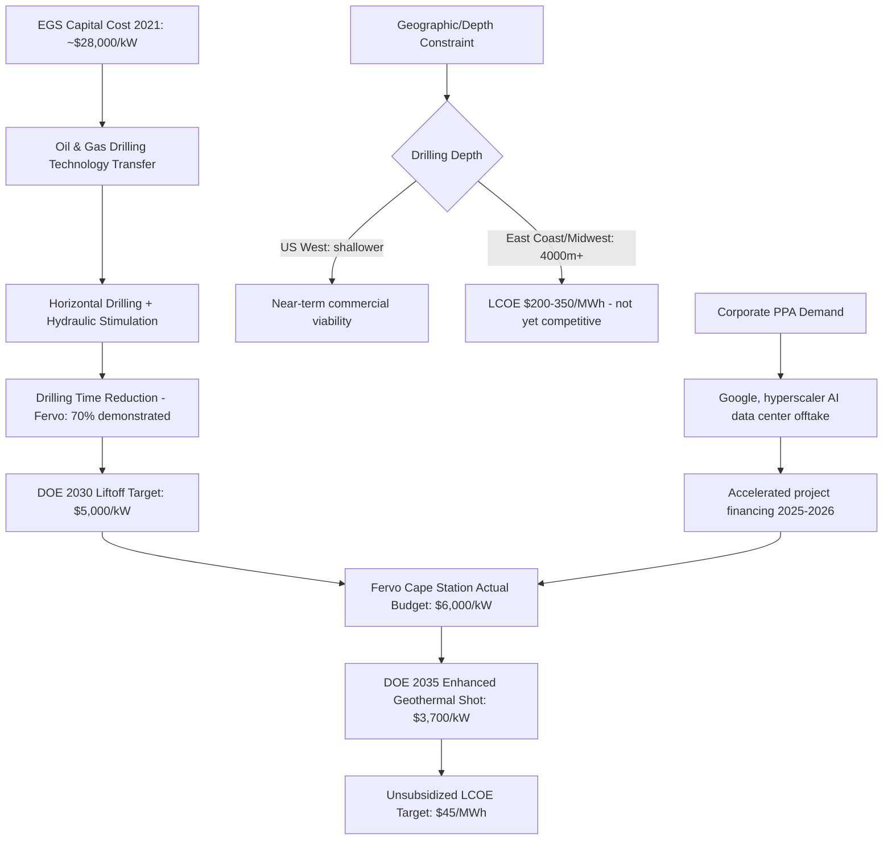

## Geothermal Energy Economics and Enhanced Geothermal Systems

### Overview

Geothermal energy economics divides into two distinct technology classes with fundamentally different cost profiles: **conventional hydrothermal geothermal**, which relies on naturally occurring combinations of heat, permeability, and fluid found in a limited number of favorable geological locations, and **Enhanced (or Engineered) Geothermal Systems (EGS)**, which artificially create the permeability needed to extract heat from hot dry rock using techniques adapted from the oil and gas industry (horizontal drilling and hydraulic stimulation), dramatically expanding the geographic resource base beyond naturally favorable hydrothermal sites. EGS has moved from a novel technology with high scientific risk to a commercially deployable solution where the primary remaining challenges are cost and execution, rather than fundamental technical feasibility, marking a significant maturation milestone for the sector as of 2026.

### Why EGS Changes the Economic Resource Base

**Key Points**

- Conventional hydrothermal geothermal is geographically constrained to locations with naturally occurring heat, permeability, and water—historically limiting deployment largely to specific regions such as the western United States, Iceland, and parts of the Pacific Ring of Fire.
- EGS adapts horizontal drilling and hydraulic stimulation from the oil and gas industry to create heat zones in dry rock, meaning the underlying resource (hot rock at depth) exists across far more of the earth's crust than naturally permeable hydrothermal sites, in principle transforming geothermal from a geographically niche resource into a broadly available one.
- This resource-base expansion is analogous to how hydraulic fracturing transformed oil and gas from a play-specific resource into a broadly extractable one—EGS proponents argue this same "unconventional" transformation is now occurring in geothermal.

[Inference] The economic significance of this shift is substantial: if EGS costs decline as projected, geothermal could transition from a resource-constrained niche technology to a broadly deployable source of firm, dispatchable, carbon-free baseload power—though this transformation remains contingent on the cost trajectories discussed below actually materializing at commercial scale.

### Capital Cost Trajectory: A Dramatic Historical Decline Target

**Key Points**

| Milestone / Target | Capital Cost | Source/Context |
| --- | --- | --- |
| 2021 baseline | ~$28,000/kW | Historical starting point for EGS capital cost |
| US DOE 2030 "liftoff" target | ~$5,000/kW | Department of Energy commercial liftoff benchmark |
| Fervo Energy Cape Station (actual budget) | ~$6,000/kW | Near the DOE 2030 target, achieved roughly a decade ahead of NREL's technology-case projection |
| CTVC estimated capital cost reference | ~$5,000/kW | Short of Fervo's ultimate goal, but cited as still a viable commercial price point |
| US DOE 2035 "Enhanced Geothermal Shot" target | $3,700/kW | Equivalent to an unsubsidized LCOE of $45/MWh |
| Drilling cost intensity (2025-2026 data) | ~$4.2 million per MW | Reflects current capital intensity constraining commercial financing |

The targeted reduction from $28,000/kW in 2021 to $3,700/kW by 2035 represents an approximately 87% capital cost reduction target over 14 years—an extraordinarily aggressive cost-decline trajectory by the standards of most energy infrastructure technologies. [Inference] Achieving a cost decline of this magnitude would require sustained learning-by-doing effects analogous to what occurred in shale oil and gas drilling, where per-well costs fell substantially as operators gained experience; whether geothermal EGS can replicate this pace of improvement is the central open question in the sector's economics.

### Levelized Cost of Energy (LCOE): Current State and Targets

**Key Points**

| Milestone | LCOE ($/MWh) | Context |
| --- | --- | --- |
| Current global geothermal average (roundtable estimate) | ~$240/MWh | Cited as current baseline prior to EGS cost reductions |
| Current EGS LCOE (2026, pre-scale plants) | $90–140/MWh | Significantly higher than subsidized solar or wind |
| Reuters/Taff current estimate (June 2026) | $100–120/MWh | For pre-scale plants under 150 MW |
| Reuters/Taff projected estimate | $65–80/MWh | Based on scaling and technology improvement assumptions |
| Fervo Energy Cape Station target | $45/MWh | Aligned with DOE's Enhanced Geothermal Shot target |
| Veritas Europaea projection | Below $60/MWh | Achievable through continued learning-by-doing and well-cost reductions |
| Long-term EGS competitive goal | Below $60–70/MWh | Positions EGS as competitive bulk power source |
| AtlasPeak Research comparison range | $90–140/MWh | Direct comparison of EGS to traditional geothermal costs |

[Inference] The convergence of multiple independent analysts (DOE, Fervo, Veritas Europaea, Reuters) around a $45–80/MWh long-term target range lends somewhat more credibility to this projection than is typical for early-stage energy technologies, though it should still be treated as a target contingent on continued drilling cost reductions rather than an already-achieved outcome.

### Drilling Cost: The Central Economic Bottleneck

**Key Points**

- Drilling costs for a single deep EGS well can exceed $14 million, concentrating substantial financial risk in the project's earliest stages, before any revenue generation begins—a structural characteristic that makes EGS financing more challenging than for modular renewable technologies like solar and wind, which can be built and begin generating revenue incrementally.
- Fervo Energy has demonstrated a 70% drilling time reduction at its projects, representing the most direct empirical evidence to date of learning-by-doing cost reductions in commercial EGS drilling operations.
- The U.S. Department of Energy has committed $171.5 million in funding specifically to GA Drilling, reflecting continued public capital investment aimed at accelerating drilling technology cost reduction—an indication that drilling efficiency improvement is viewed by policymakers as the single most direct lever for EGS cost reduction, rather than surface-plant or stimulation technology improvements.

**Policy/Investment Implication**: [Inference] Because drilling represents the dominant capital cost component and the primary source of demonstrated cost reduction to date (via time-reduction learning effects), EGS project economics are likely to remain highly sensitive to well count and drilling depth per project—meaning geographic sites requiring shallower drilling depths will retain a meaningful cost advantage even as overall sector costs decline.

### Geographic Cost Variation: Depth as the Key Driver

**Key Points**

- The US West (Nevada, Utah) has emerged as the primary near-term EGS proving ground, benefiting from geologically favorable (shallower, hotter) conditions relative to other regions.
- In regions such as the East Coast and Midwest United States, which require drilling depths greater than 4,000 meters, EGS LCOE can exceed $200–350/MWh—a cost level substantially above the Western U.S. near-term commercial targets, illustrating that EGS cost competitiveness remains strongly geology-dependent even with drilling technology improvements.
- The European Union represents a substantial addressable market for enhanced geothermal, with an estimated resource potential of 43 GW, driven by strong regional demand for both baseload clean electricity and decarbonized heat (geothermal's ability to supply industrial and district heat, not just electricity, is a distinguishing economic advantage over intermittent renewables in heat-intensive markets).

[Inference] This depth-dependent cost variation implies that near-term commercial EGS deployment will likely remain geographically concentrated in favorable geological regions (US West, parts of Europe) even after broader technology cost reductions are achieved, with full geographic democratization of the resource—the long-term EGS value proposition—remaining a longer-term and less certain outcome.

### Competing Technology Pathway: Closed-Loop Geothermal (Eavor)

**Key Points**

- An alternative technological approach to EGS is the closed-loop model, pioneered by companies such as Eavor Technologies, which circulates working fluid through a sealed underground loop rather than using hydraulic stimulation to create permeability in the surrounding rock.
- Closed-loop systems are marketed as a risk-averse, scalable model specifically because they avoid fracking and water use, distinguishing their environmental and permitting risk profile from stimulation-based EGS.
- Eavor's projects target sub-$80/MWh LCOE, a cost level comparable to EGS long-term targets, suggesting genuine technology-pathway competition rather than a single dominant "next-generation geothermal" design.

[Inference] The existence of two structurally distinct technical approaches (stimulation-based EGS vs. closed-loop) competing toward similar cost targets suggests the sector has not yet converged on a single dominant design, which is typical of an industry in the early-to-mid commercialization phase; investors and policymakers should expect continued technology bifurcation rather than assuming EGS-style stimulation will become the sole commercial approach.

### Revenue and Financing Structure: The Corporate PPA Model

**Key Points**

- A distinguishing feature of current commercial EGS financing is the prominent role of corporate power purchase agreements (PPAs) from technology companies seeking firm, carbon-free power for data center operations, exemplified by Google's equity participation (a $462 million equity round alongside Cal STRS) and power purchase commitments with Fervo Energy.
- Fervo Energy has secured substantial debt financing, including a $421 million debt deal, alongside corporate PPA commitments totaling several hundred megawatts, indicating that geothermal EGS financing in 2026 is being substantially underwritten by hyperscale technology company demand for firm clean power (driven by AI data center electricity needs) rather than by traditional utility procurement alone.
- With help from tax incentives in the Inflation Reduction Act, at least one major EGS project has been reported as being profitable from the start of construction, according to industry commentary—though this reflects a specific project's claimed economics rather than a demonstrated sector-wide outcome.

[Inference] The reliance on corporate/hyperscaler demand (particularly AI data center power needs) as a primary near-term revenue anchor represents a similar dynamic to what is emerging in SMR nuclear financing—both technologies appear to be benefiting from a demand-side shift toward firm, carbon-free power driven by data center growth, which may be accelerating commercial deployment timelines beyond what traditional utility-driven demand alone would have supported. [Speculation] Whether this data-center-driven demand surge is durable enough to sustain financing through to full cost-competitiveness, or represents a temporary financing bridge, cannot be determined from currently available information.

### EGS Value Proposition Relative to Variable Renewables

**Key Points**

- The primary strength of EGS lies in its potential for 24/7 carbon-free baseload power, combined with a comparatively small land footprint and a large underlying resource base—distinguishing it from intermittent wind and solar, which require storage or backup capacity to provide equivalent firm capacity.
- At the DOE's 2035 Enhanced Geothermal Shot target of $45/MWh, the technology is explicitly positioned as very competitive with utility-scale solar and wind paired with storage, and with combined-cycle natural gas, on a like-for-like firm-power basis.

**Comparative Framing** (drawing on the LDES economics discussed elsewhere in this chapter): [Inference] EGS's core economic proposition—firm, dispatchable clean power without the storage-duration cost penalties affecting battery and other storage technologies—positions it as a direct alternative pathway to achieving grid firmness, competing against the combination of variable renewables plus long-duration storage rather than against solar or wind in isolation. Whichever pathway (firm generation like EGS/SMR vs. variable generation plus storage) achieves lower delivered cost of firm capacity first is likely to shape near-term grid decarbonization investment patterns significantly.

### SWOT Summary of EGS Commercialization

**Key Points**

| Category | Assessment |
| --- | --- |
| Strength | Firm, 24/7 carbon-free baseload power; small land footprint; large underlying resource base; demonstrated ability to serve major corporate offtakers |
| Weakness | High upfront drilling cost concentrating financial risk before revenue generation; strong geographic/depth dependence on ultimate project cost |
| Opportunity | Active technology transfer from oil and gas drilling expertise; hyperscale/AI data center demand for firm clean power; European baseload and heat demand (43 GW EU market potential) |
| Threat | Slow regulatory permitting timelines remain a significant hurdle to rapid scaling |

### EGS Cost Reduction Pathway Diagram

### EGS vs. Conventional Geothermal Cost Comparison Diagram (svg_diagram)

<svg xmlns="http://www.w3.org/2000/svg" viewBox="0 0 850 400" font-family="Arial, sans-serif">
<text x="425" y="25" font-size="17" font-weight="bold" text-anchor="middle" fill="#1a1a1a">Geothermal LCOE Trajectory: Current vs Targets (svg_diagram)</text>
<line x1="100" y1="350" x2="800" y2="350" stroke="#333" stroke-width="2" />
<line x1="100" y1="350" x2="100" y2="60" stroke="#333" stroke-width="2" />
<text x="40" y="205" font-size="12" text-anchor="middle" fill="#333" transform="rotate(-90 40 205)">LCOE ($/MWh)</text>

<text x="60" y="345" font-size="10" text-anchor="end" fill="#555">$0</text>

<text x="60" y="270" font-size="10" text-anchor="end" fill="#555">$80</text>

<text x="60" y="195" font-size="10" text-anchor="end" fill="#555">$140</text>

<text x="60" y="120" font-size="10" text-anchor="end" fill="#555">$200</text>

<text x="60" y="70" font-size="10" text-anchor="end" fill="#555">$240</text>

<line x1="100" y1="270" x2="800" y2="270" stroke="#ddd" stroke-width="1" stroke-dasharray="4,3" />
<line x1="100" y1="195" x2="800" y2="195" stroke="#ddd" stroke-width="1" stroke-dasharray="4,3" />
<line x1="100" y1="120" x2="800" y2="120" stroke="#ddd" stroke-width="1" stroke-dasharray="4,3" />
<rect x="140" y="75" width="90" height="275" fill="#8B4513" opacity="0.75" />
<text x="185" y="365" font-size="10" text-anchor="middle" fill="#333">Global Avg (current)</text>
<text x="185" y="68" font-size="10" text-anchor="middle" fill="#333">~$240</text>
<rect x="280" y="196" width="90" height="154" fill="#C0392B" opacity="0.75" />
<text x="325" y="365" font-size="10" text-anchor="middle" fill="#333">EGS Current (2026)</text>
<text x="325" y="189" font-size="10" text-anchor="middle" fill="#333">$90-140</text>
<rect x="420" y="255" width="90" height="95" fill="#E67E22" opacity="0.75" />
<text x="465" y="365" font-size="10" text-anchor="middle" fill="#333">Near-term Projected</text>
<text x="465" y="248" font-size="10" text-anchor="middle" fill="#333">$65-80</text>
<rect x="560" y="290" width="90" height="60" fill="#2E8B57" opacity="0.75" />
<text x="605" y="365" font-size="10" text-anchor="middle" fill="#333">DOE 2035 Target</text>
<text x="605" y="283" font-size="10" text-anchor="middle" fill="#333">$45</text>
<rect x="700" y="100" width="90" height="250" fill="#7F8C8D" opacity="0.6" />
<text x="745" y="365" font-size="10" text-anchor="middle" fill="#333">East US (deep)</text>
<text x="745" y="93" font-size="10" text-anchor="middle" fill="#333">$200-350</text>

<text x="425" y="385" font-size="11" font-style="italic" text-anchor="middle" fill="#666">DOE, Fervo, Reuters, and industry-analyst benchmark figures</text>

</svg>

### Conclusion

Geothermal energy economics is undergoing a significant transformation driven by Enhanced Geothermal Systems, which apply oil-and-gas-derived drilling and stimulation technology to expand the addressable geothermal resource base beyond naturally favorable hydrothermal sites. Capital costs have declined dramatically from roughly $28,000/kW in 2021 toward near-term commercial budgets around $6,000/kW, with a DOE 2035 target of $3,700/kW implying an unsubsidized LCOE of $45/MWh—a level that would make EGS genuinely competitive with variable renewables-plus-storage and combined-cycle gas. Current commercial LCOE remains substantially higher ($90–140/MWh), and drilling cost and depth remain the dominant constraints on near-term geographic deployment, with Eastern U.S. sites requiring deep drilling remaining uncompetitive ($200–350/MWh) even as Western U.S. and select European sites approach commercial viability. [Inference] Near-term commercial momentum appears substantially driven by corporate PPA demand from hyperscale technology companies seeking firm, carbon-free power for data centers, a financing dynamic that parallels similar demand-side shifts observed in SMR nuclear financing; whether this demand source alone can sustain the sector through to full cost-competitiveness, absent broader utility-driven procurement, remains an open question.

**Next Steps**

- Hydraulic stimulation techniques and induced seismicity risk economics in EGS
- Closed-loop geothermal technology (Eavor) versus open-loop EGS: comparative technical and financial risk profiles
- Corporate power purchase agreements (PPAs) as a financing mechanism for firm clean power projects
- AI data center electricity demand and its effect on firm/dispatchable clean power investment
- Geothermal district heating economics as a complement to electricity generation revenue
- Learning curve analysis: comparing EGS drilling cost reduction to shale oil and gas historical cost declines
- Comparative case study: Fervo Energy Cape Station (Utah) project economics and financing structure
- Inflation Reduction Act tax incentive structures for geothermal and their effect on project bankability