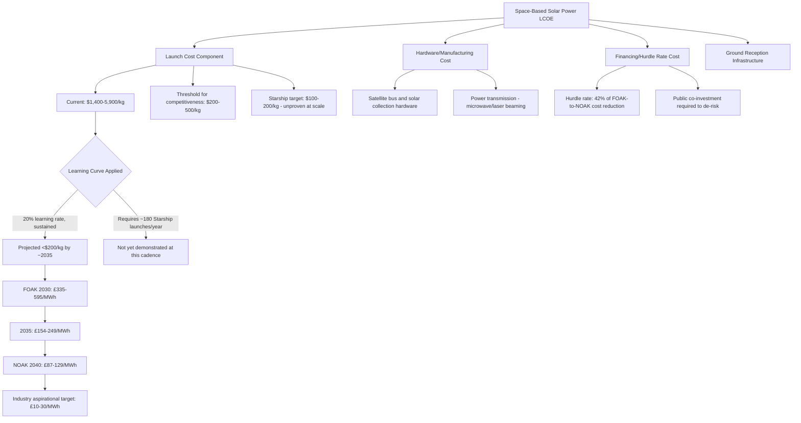

## Space-Based and Novel Renewable Energy Concepts

### Overview

Space-based solar power (SBSP) is the most prominent "novel" renewable energy concept currently under serious economic evaluation, alongside a smaller set of emerging concepts (airborne wind energy, kite-based generation, ocean thermal energy conversion). SBSP proposes collecting solar energy in orbit—where sunlight is uninterrupted by atmosphere, weather, or day-night cycles—and transmitting it to Earth via microwave or laser beaming. Its economics are fundamentally distinct from any terrestrial renewable technology because the **dominant cost driver is not the energy-harvesting hardware itself, but the cost of launching that hardware into orbit**. This subtopic focuses primarily on SBSP as the most economically developed and heavily analyzed novel concept, given the depth of recent techno-economic literature.

### The Central Economic Variable: Launch Cost per Kilogram

**Key Points**

Unlike terrestrial solar or wind, where LCOE is driven primarily by manufacturing cost and financing, SBSP's LCOE is overwhelmingly a function of a single variable: cost per kilogram to orbit. Launch costs account for over 55% of LCOE variance in current SBSP modeling, and this share grows over time as satellite production costs fall relative to launch costs—meaning launch, not hardware, is the long-run binding constraint on SBSP economics.

| Launch Provider / Vehicle | Cost per kg | Notes |
| --- | --- | --- |
| Historical baseline (1970) | ~$54,500/kg | Illustrates the multi-order-of-magnitude decline already achieved |
| SpaceX Falcon 9 (current) | ~$2,700–2,720/kg | Current commercial benchmark |
| SpaceX Falcon Heavy (current) | ~$1,400/kg | Larger vehicle, lower per-kg cost |
| GEO-adjusted cost (current reusable) | ~$4,500–5,900/kg | Reflects added cost of orbit-raising burns beyond LEO insertion |
| SpaceX Starship (projected, at scale) | $100–200/kg | Company-stated target; not yet demonstrated commercially |
| NASA study baseline assumption | $1,000–1,500/kg | Criticized by SBSP proponents as an overly pessimistic baseline |
| ESA (Solaris program) planning assumption | $300–500/kg | European agency's working estimate for future system economics |

[Inference] The wide spread between current demonstrated launch costs ($1,400–5,900/kg) and the levels required for SBSP viability ($100–500/kg) represents the single largest source of uncertainty in all SBSP economic modeling; essentially every credible study treats future launch cost decline as the pivotal, unresolved assumption rather than a settled input.

### Threshold Cost Levels: What Different Launch Costs Enable

**Key Points**

Multiple independent sources converge on similar threshold framings, where specific launch cost levels are argued to unlock specific SBSP competitiveness milestones:

- Below $500/kg, space-based solar power is argued by industry commentary to become economically competitive with ground-based nuclear power.
- The European Space Agency's SOLARIS program estimates space-based solar could deliver power at €50–100/MWh if launch costs reach $500/kg, a level ESA already uses as its own planning assumption.
- Once launch costs fall below $200/kg, one space-solar company founder (a former SpaceX engineer) asserts space-based solar power becomes cheaper than Earth-based nuclear plants and fossil fuel power stations.
- $200/kg is often cited by SpaceX and others as a threshold beyond which launch could cease to be the limiting cost factor for ambitious space programs generally, not solely SBSP.

[Inference] The clustering of multiple independent threshold estimates around the $200–500/kg range provides converging evidence that this range represents a genuine inflection point for SBSP viability, though [Speculation] whether launch costs will actually reach this range on the timelines proponents suggest remains highly uncertain and contingent on Starship's operational cost performance at scale, which has not yet been commercially demonstrated.

### Current (Present-Day) Cost Reality: Far From Competitive

**Key Points**

- At today's technology level, SBSP is far from competitive: in one detailed model (Caltech CSSPS), the "current" system cost comes out to approximately 780 ¢/kWh (i.e., $7,800/MWh), with a total program price tag of close to $39 billion, of which $27 billion is for launch alone.
- A separate independent analysis found that a one-gigawatt orbital array might require around 10,000 tons of material lifted to orbit; at $6,000/kg, this represents a $60 billion launch bill before a single watt is generated, with fabrication, assembly, and ground infrastructure roughly doubling the total cost.
- Even under optimistic near-term studies using $2,000/kg launch costs, resulting electricity costs still run to hundreds of dollars per MWh, compared to well under $50/MWh for terrestrial solar backed by storage—illustrating the scale of the remaining cost gap even under fairly aggressive (though not maximally optimistic) launch-cost assumptions.
- A January 2024 NASA study delivered notably pessimistic conclusions: baseline lifecycle costs of $610/MWh for one reference design and approximately $1,590/MWh for a second reference design, making these systems 12 to 80 times more expensive than terrestrial renewable alternatives under NASA's baseline assumptions.

**Key controversy**: [Inference] The NASA study's methodology has been publicly disputed by veteran SBSP researcher John Mankins, who argued NASA selected the very worst possible combination of parameters rather than middle-of-the-road estimates typical of systems analysis; NASA's baseline assumptions included launch costs of $1,500/kg, 10-year hardware lifetimes, and conservative efficiency projections. When NASA itself modeled rosier assumptions ($500/kg launch costs, electric space tugs for orbit-raising, and cheaper hardware), it found space-based solar power could become just as cost-competitive as ground-based renewable energy, and comparably clean on a life-cycle greenhouse gas basis. This dispute illustrates that SBSP cost conclusions are highly sensitive to input assumption selection, and headline cost figures should always be read alongside their underlying launch-cost and hardware-lifetime assumptions.

### Long-Run Cost Targets: UK and European Modeling

**Key Points**

The most detailed publicly available techno-economic modeling comes from UK government-commissioned studies (Frazer-Nash Consultancy, Space Solar, and Imperial College London):

| Modeled Case | LCOE (2024 GBP) | Interpretation |
| --- | --- | --- |
| 2030 initial small-scale system (FOAK) | £335–595/MWh | Early commercial system with high risk and cost |
| 2035 small-scale system | £154–249/MWh | Reflects modeled learning and performance gains |
| 2040 repeated-build (NOAK) system | £87–129/MWh | Mature, nth-of-a-kind system economics |
| Space Solar's own mature target | £10–30/MWh | Industry-stated aspirational long-run target |

These figures do not directly disprove the more aspirational £10–30/MWh mature target cited by industry proponents, because the studies examine different system sizes, production stages, financing conditions, launch assumptions, and deployment periods—but they demonstrate why an aspirational mature-technology cost figure cannot be treated as representative of present commercial cost. Energy-system benefits (grid value) were estimated to reduce the comparison cost by £21/MWh in each modeled case.

**Key cost decomposition findings**:

- Hurdle rate (the minimum required rate of return for investors) alone accounts for 42% of the total LCOE reduction observed moving from the first-of-a-kind (2030) to nth-of-a-kind (2040) system—indicating that de-risking the investment proposition, not just technology improvement, is a major driver of eventual cost competitiveness.
- Every £100 million in public grant funding is estimated to reduce the effective 2030 LCOE by £33.50/MWh, illustrating the direct economic leverage of early-stage public co-investment in de-risking the technology.
- Net benefits are reported to hold up even if all SBSP costs are doubled, suggesting the underlying benefit case has some resilience to cost overrun risk according to this modeling.

**Policy Implication**: [Inference] Private investment alone is not expected to fund SBSP development at this stage; without public co-investment, projected returns fall below the required hurdle rate. This positions SBSP economics as structurally similar to other frontier energy technologies discussed in this chapter (SMR nuclear, DAC, EGS) in that public policy support and de-risking mechanisms—not private capital alone—are treated as prerequisites for reaching commercial viability, rather than optional accelerants.

### Development Program Cost and Funding Requirements

**Key Points**

- The UK-focused development pathway is estimated to require a program of roughly £7.5–16.3 billion over an 18-year period, with 50–77% of that spend needing to come from public funding sources.
- Even the first small-scale UK system is assessed in this modeling to deliver a benefit-to-cost ratio of 1.81, and to sit within a wider European rollout that could generate a net present value of approximately £183 billion, rising to £767 billion in scenarios where climate (Net Zero) targets would otherwise be missed between 2022 and 2070.
- One independent skeptical analysis notes that closing the full cost gap to competitiveness would require driving launch costs down by at least an order of magnitude beyond even fairly optimistic current projections—characterizing this as the scale of improvement needed to move SBSP "from heroic engineering to commercial sense."

[Inference] The reported benefit-cost ratios and net-present-value figures should be interpreted cautiously, as they depend heavily on assumptions about future carbon prices, avoided climate damages, and the counterfactual cost of alternative decarbonization pathways—all of which carry independent uncertainty beyond the launch-cost uncertainty already discussed.

### The Launch-Cost Learning Curve: Applying Historical Analogy

**Key Points**

- Analysis of SpaceX launch pricing data across vehicle classes (Falcon 1 through Falcon Heavy) yields an approximate 20% learning rate—meaning price per kilogram falls by roughly 20% for every doubling of cumulative mass launched, broadly consistent with learning curves observed in other manufactured technologies (see Wright's Law discussion in the Historical Transitions material).
- If this learning rate is sustained, launch prices could fall below $200/kg by approximately 2035, though this outcome would require approximately 180 Starship launches per year—a cadence far beyond current launch industry flight rates and not yet demonstrated.

$$C_n = C_1 \cdot n^{-b}$$

Applying the same learning-curve framework used for terrestrial technology cost decline to launch costs provides a structured way to project SBSP cost trajectories, though [Speculation] whether the required launch cadence (180 Starship flights/year) is achievable on the proposed timeline depends on manufacturing, regulatory, and operational factors with no close historical precedent to benchmark against.

### Comparative Framing: Data Center Power Costs

**Key Points**

- One recent analysis comparing space-based infrastructure economics found that if LEO launch prices drop to $200/kg, the "launched power price" (cost of power-generating hardware launched to orbit, amortized over satellite lifetime) could be approximately $810/kW/year for a Starlink-v2-type satellite architecture, or $810–7,500/kW/year across a broader range of satellite designs with different mass-to-power ratios.
- For comparison, current power spend for terrestrial U.S. data centers is reported at approximately $570–3,000/kW/year, depending on regional power price variation and operator power usage effectiveness (PUE).
- This comparison suggests that if launch costs reach $200/kg, the cost of launching power-generation hardware to orbit, amortized over its operational lifetime, could become roughly comparable to terrestrial data center energy costs on a per-kW basis—a notably different framing than the traditional grid-electricity LCOE comparisons used elsewhere in SBSP literature.

[Inference] This alternative framing (comparing to data center power costs rather than grid LCOE) suggests a possible near-term niche application for space-based power—directly powering off-grid or space-based computing infrastructure—that could become economically viable at a lower launch-cost threshold than full grid-scale terrestrial SBSP, since it avoids the additional cost and conversion losses associated with beaming power back to Earth's surface.

### Cost Structure Diagram

### Cost Trajectory Comparison Diagram (svg_diagram)

<svg xmlns="http://www.w3.org/2000/svg" viewBox="0 0 850 420" font-family="Arial, sans-serif">

<text x="425" y="25" font-size="17" font-weight="bold" text-anchor="middle" fill="`#1a1a1a`">SBSP LCOE vs Launch Cost Assumption (svg_diagram)</text>

<line x1="100" y1="360" x2="800" y2="360" stroke="#333" stroke-width="2" />

<line x1="100" y1="360" x2="100" y2="60" stroke="#333" stroke-width="2" />

<text x="415" y="395" font-size="12" text-anchor="middle" fill="#333">Launch Cost Assumption ($/kg, log scale)</text>

<text x="40" y="210" font-size="12" text-anchor="middle" fill="#333" transform="rotate(-90 40 210)">LCOE ($/MWh, log scale)</text>

<text x="150" y="378" font-size="10" text-anchor="middle" fill="#555">$5,900</text>

<text x="350" y="378" font-size="10" text-anchor="middle" fill="#555">$2,000</text>

<text x="550" y="378" font-size="10" text-anchor="middle" fill="#555">$500</text>

<text x="720" y="378" font-size="10" text-anchor="middle" fill="#555">$100-200</text>

<text x="60" y="90" font-size="10" text-anchor="end" fill="#555">$7,800</text>

<text x="60" y="180" font-size="10" text-anchor="end" fill="#555">$500</text>

<text x="60" y="270" font-size="10" text-anchor="end" fill="#555">$100</text>

<text x="60" y="345" font-size="10" text-anchor="end" fill="#555">$30</text>

<line x1="100" y1="180" x2="800" y2="180" stroke="#ddd" stroke-width="1" stroke-dasharray="4,3" />

<line x1="100" y1="270" x2="800" y2="270" stroke="#ddd" stroke-width="1" stroke-dasharray="4,3" />

<polyline points="150,95 350,150 550,220 720,300" fill="none" stroke="`#C0392B`" stroke-width="3" />

<circle cx="150" cy="95" r="5" fill="`#C0392B`" />

<circle cx="350" cy="150" r="5" fill="`#C0392B`" />

<circle cx="550" cy="220" r="5" fill="`#C0392B`" />

<circle cx="720" cy="300" r="5" fill="`#C0392B`" />

<text x="600" y="60" font-size="11" fill="#666" font-style="italic" text-anchor="middle">Terrestrial solar+storage benchmark: ~$50/MWh</text>

<line x1="100" y1="350" x2="800" y2="350" stroke="`#2E8B57`" stroke-width="2" stroke-dasharray="8,4" />

<text x="425" y="415" font-size="11" font-style="italic" text-anchor="middle" fill="#666">Illustrative curve connecting cited benchmark data points</text>

</svg>

### Other Novel Renewable Concepts (Brief Note)

**Key Points**

- Airborne wind energy systems (tethered kites or drones capturing high-altitude, more consistent wind resources) and ocean thermal energy conversion (OTEC, exploiting temperature differentials between surface and deep ocean water) represent other novel concepts under active but much smaller-scale development than SBSP.
- [Inference] These technologies generally have far less mature techno-economic literature than SBSP, reflecting their earlier stage of development and smaller current investment scale; SBSP has received disproportionate economic analysis attention in 2025–2026 relative to other novel concepts, likely reflecting the scale of recent public and private capital commitments to the sector.

### Conclusion

Space-based solar power's economics are almost entirely a function of one variable—launch cost per kilogram to orbit—more so than any terrestrial energy technology's economics depend on a single input. Current commercial launch costs ($1,400–5,900/kg depending on orbit and vehicle) place SBSP far from competitive, with present-day system costs running into the hundreds to thousands of dollars per MWh. Multiple independent analyses converge on a $200–500/kg launch-cost threshold as the approximate inflection point for genuine competitiveness with terrestrial nuclear and renewables-plus-storage, a level dependent on SpaceX's Starship program (or comparable reusable heavy-lift vehicles) achieving its stated cost targets at commercial operational scale—which has not yet been demonstrated. [Inference] UK and European government-commissioned modeling provides the most methodologically detailed public cost trajectory, projecting a decline from £335–595/MWh (2030, first-of-a-kind) to £87–129/MWh (2040, nth-of-a-kind), with public co-investment treated as a structural prerequisite rather than an optional accelerant, mirroring the public-support dependency seen in other frontier technologies covered in this chapter (SMR nuclear, DAC, EGS). [Speculation] Whether launch costs will actually reach the required threshold on proponents' proposed timelines, and whether the required launch cadence (on the order of 180 heavy-lift flights per year) is operationally achievable, remain genuinely open questions that cannot be resolved from currently available data.

**Next Steps**

- Reusable launch vehicle economics and the SpaceX Starship cost-reduction roadmap
- Wireless power transmission technology: microwave vs. laser beaming efficiency and safety economics
- ESA SOLARIS program: European public investment strategy for space-based solar power
- Learning curve theory applied to aerospace manufacturing and launch services
- Comparative techno-economic case study: NASA's 2024 SBSP assessment and its methodological critiques
- Airborne wind energy systems: technical concept and early-stage economics
- Ocean thermal energy conversion (OTEC): resource potential and cost barriers
- Public-private co-investment models for de-risking frontier energy technologies