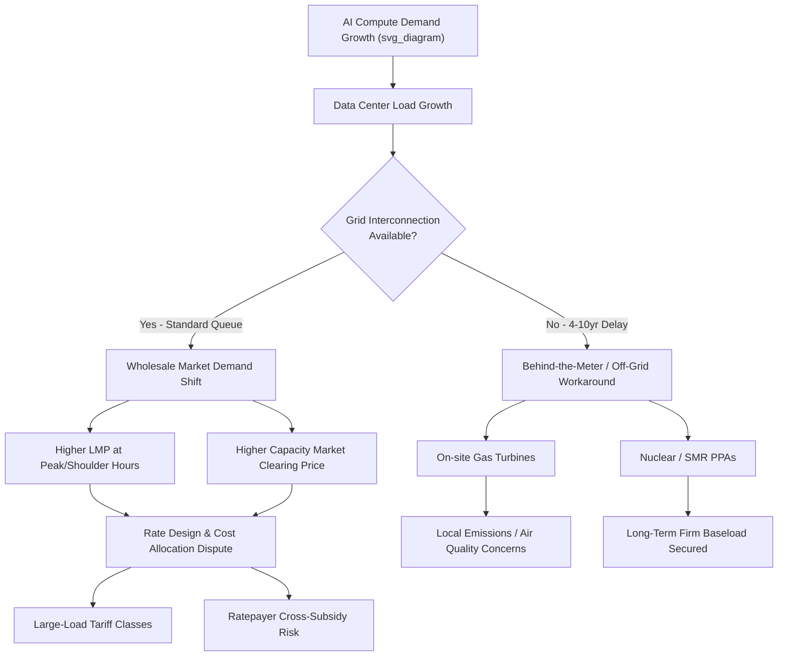

## Artificial Intelligence's Growing Electricity Demand and Market Effects

### Overview and Scope of the Phenomenon

Artificial intelligence workloads, particularly training and inference for large-scale deep learning models, have emerged as a fast-growing category of electricity demand in wholesale power markets. This item examines the phenomenon through an energy economics lens: the structural drivers of AI-related load growth, its effects on regional power markets, price formation, infrastructure investment, and long-run supply-demand equilibrium.

Data centers historically represented a slow-growing, predictable component of electricity demand. Load forecasts from utilities and grid operators for most of the 2010s assumed flat or modestly declining data center intensity due to efficiency gains offsetting growth in computing volume. The emergence of large language models and generative AI, beginning roughly around 2022-2023, disrupted that pattern by introducing a new class of workload with substantially higher power density per rack and a compressed timeline for capacity buildout.

### Drivers of AI Electricity Demand Growth

**Key Points**

- Training-phase demand: large model training runs concentrate massive, sustained compute loads (often tens of thousands of GPUs/accelerators operating near-continuously for weeks to months) in single facilities or tightly clustered campuses.
- Inference-phase demand: as AI products scale to millions of users, the aggregate electricity draw from inference (serving trained models to end users) grows with usage volume, and for reasoning-intensive or multi-step ("agentic") queries, per-query energy consumption is materially higher than for a single-pass classical web search.
- Rack power density: AI accelerator racks (e.g., high-end GPU servers) can require 30-130+ kW per rack, versus 5-10 kW for legacy enterprise server racks, straining facility power delivery and cooling systems designed for older density assumptions.
- Compressed deployment timelines: AI capital investment cycles (measured in months to a few years) are much shorter than the multi-year lead times required to site, permit, and build new generation and transmission capacity, creating a structural demand-supply lag.

The economic logic behind this demand surge follows a standard derived-demand framework: electricity is an input into the production of a service (AI compute/inference), and the marginal value of that service to hyperscale firms (large cloud/AI companies) has, at least through the mid-2020s, been high enough to support electricity procurement at premium prices, including long-term power purchase agreements (PPAs) and even dedicated generation investment.

### Quantifying Demand: Empirical Estimates and Forecast Uncertainty

Searched the webdata center electricity demand forecast 2026 IEA EPRI AI

**Key Points**

- Global data center electricity consumption reached approximately 460-490 TWh in 2025, and the IEA's April 2026 base case projects this roughly doubling to about 950 TWh by 2030, with AI-optimized, accelerator-heavy facilities growing electricity demand roughly three times faster than conventional server infrastructure and set to triple their share over the period.The IEA's April 2026 update projects global data center electricity consumption roughly doubling from 485 TWh in 2025 to about 950 TWh by 2030, with AI-focused facilities tripling over the same period. [Core Insights Review](https://www.coradvisors.net/2026/05/ai-data-center-electricity-demand.html)[Presenc AI](https://presenc.ai/research/ai-data-center-energy-consumption-2026)
- U.S. data centers are projected to consume 9-17% of national electricity by 2030, up from roughly 4-5% today, as rapid growth driven by AI, streaming, and cryptocurrency accelerates. [Epri](https://powering-intelligence.epri.com/executive-summary.html)
- Goldman Sachs Research forecasts U.S. data center power demand jumping from 31 GW in 2025 to 66 GW by 2027, and separately flags a structural power shortfall of 9.3 GW in 2026, widening to 45 GW by 2028. [Core Insights Review](https://www.coradvisors.net/2026/06/energy-grid-data-center-capacity-ai-bottlenecks-2026.html)[Core Insights Review](https://www.coradvisors.net/2026/05/ai-data-center-electricity-demand.html)
- Regional load concentration is severe: in 2023, data centers consumed about 26% of total electricity supplied in Virginia, 15% in North Dakota, 12% in Nebraska, 11% in Iowa, and 11% in Oregon, and EPRI's 2026 update projects Virginia's data center share could rise to between 41% and 59% by 2030, with seven additional states (Arizona, Indiana, Iowa, Nebraska, Nevada, Oregon, and Wyoming) potentially exceeding 20%. In Europe, data centers consumed roughly 33% to 42% of all electricity in Amsterdam, London, and Frankfurt in 2023, and nearly 80% in Dublin. [Why the AI Data Center Boom Is the Biggest Grid Story of 2026 (And What Utilities Should Do About It) +2](https://enline.energy/articles/ai-data-center-grid-capacity-2026)
- Scale of individual facilities: a typical hyperscale data center consumes as much electricity as roughly 100,000 households, [while] the largest next-generation campuses now under construction will demand approximately twenty times that amount. [Enline](https://enline.energy/articles/ai-data-center-grid-capacity-2026)
- Gartner's mid-2026 forecast estimates global data center power demand growing approximately 26% in 2026, [with] AI-optimized servers account[ing] for roughly 31% of total consumption this year, and projects that AI servers will surpass conventional servers in electricity consumption during 2027. [Core Insights Review](https://www.coradvisors.net/2026/06/energy-grid-data-center-capacity-ai-bottlenecks-2026.html)[Core Insights Review](https://www.coradvisors.net/2026/06/energy-grid-data-center-capacity-ai-bottlenecks-2026.html)

[Unverified] Forecast ranges across IEA, EPRI, Goldman Sachs, McKinsey, and LBNL vary substantially (some by a factor of two) because methodologies differ: bottom-up equipment/chip-shipment models, project-pipeline (announced capacity) models, and energy-system/utility-integrated-resource-plan models each capture different bottlenecks and tend to produce different point estimates. Treat any single-number projection as one scenario within a distribution rather than a consensus forecast.

### Transmission and Interconnection Constraints as the Binding Bottleneck

By 2026, the primary constraint on AI data center growth had shifted from chip availability to grid infrastructure. Chips were the story in 2024. In 2026, the constraint has moved downstream — to substations, transformers, and transmission lines. Grid interconnection delays of 4-10 years are becoming the primary obstacle to AI infrastructure deployment. High-voltage transformers, substations, switchgear, and transmission capacity are now the industry's most critical bottlenecks. [Core Insights Review](https://www.coradvisors.net/2026/06/energy-grid-data-center-capacity-ai-bottlenecks-2026.html)[Core Insights Review](https://www.coradvisors.net/2026/06/energy-grid-data-center-capacity-ai-bottlenecks-2026.html)

This is a classic case of asymmetric adjustment speed between two complementary inputs in a production function: compute capital (GPUs, servers) can be manufactured and deployed in a matter of quarters, while transmission and distribution infrastructure requires multi-year permitting, siting, and construction processes. In economic terms, the short-run supply curve for grid interconnection capacity is nearly vertical (highly inelastic), while the short-run demand curve for that capacity has shifted outward rapidly and repeatedly.

This has led hyperscale firms to pursue supply-side workarounds that route around the traditional utility interconnection queue:

- **Behind-the-meter generation**: on-site gas turbines, and in some cases direct-connect arrangements, that bypass transmission queues entirely.
- **Long-term power purchase agreements (PPAs)**: multi-decade contracts with new or existing generation, increasingly including nuclear.
- **Nuclear and SMR agreements**: every major hyperscaler has now signed at least one nuclear or SMR power deal to secure supply outside the standard utility queue, reflecting a preference for firm, carbon-free, high-capacity-factor baseload given that AI facilities need continuous, high-capacity baseload power that intermittent renewables alone can't reliably guarantee. [Core Insights Review](https://www.coradvisors.net/2026/05/ai-data-center-electricity-demand.html)[Core Insights Review](https://www.coradvisors.net/2026/05/ai-data-center-electricity-demand.html)

### Market Structure and Price Formation Effects

**Effects on Wholesale Electricity Prices**

In organized wholesale markets (ISO/RTO regions such as PJM, ERCOT, MISO), AI/data-center load growth affects locational marginal prices (LMPs) through several transmission channels:

1. **Demand-curve shift**: a rightward shift in aggregate demand along a relatively steep short-run supply curve raises the market-clearing price at the margin, particularly during peak and shoulder hours when reserve margins are already tight.
2. **Capacity market price effects**: in capacity markets (e.g., PJM's Reliability Pricing Model), a sustained increase in forecast peak demand raises the capacity price needed to clear the auction, since new entrants require a higher capacity payment to justify investment given long lead times.
3. **Locational price divergence**: data center clusters concentrated in specific nodes or zones (e.g., Northern Virginia, referred to as "Data Center Alley") can create local congestion, driving a wedge between prices at load-heavy nodes and the broader system price.
4. **Cost allocation and cross-subsidization disputes**: a central regulatory economics question is whether the incremental transmission and generation costs driven by large new data center loads are properly allocated to those loads (cost-causation principle) or socialized across the broader ratepayer base, which has become a contested issue in utility rate cases.

**Key Points**

- Standard rate design historically pools costs across a diverse customer base; a small number of very large, geographically concentrated new loads challenges this pooling logic because the marginal cost of serving them (new transmission, new generation) is unusually well-identified and attributable.
- Several U.S. states and utilities have introduced or proposed "large load" or "data center" tariff classes with specific terms: minimum take-or-pay commitments, longer contract terms, and collateral requirements, designed to ensure that data center developers bear the cost of dedicated infrastructure rather than shifting it to residential ratepayers.
- [Inference] The magnitude of price pass-through to residential and commercial ratepayers will likely vary significantly by jurisdiction depending on rate design choices, indicating this is an area of active regulatory experimentation rather than settled practice.

### Economic Framework: Derived Demand and Elasticity Considerations

Electricity demand from AI data centers can be modeled as a derived demand, where the demand for electricity $D_e$ is a function of the demand for AI compute services $D_c$ and the electricity intensity of that compute, $\theta$ (kWh per unit of compute output):

$$D_e = \theta \cdot D_c$$

Two forces are simultaneously at work and pulling $\theta$ in opposite directions:

- **Jevons paradox / rebound effect**: hardware and algorithmic efficiency gains (better chips, model compression, quantization) reduce $\theta$ per unit of compute, but if this efficiency gain lowers the effective cost of AI services and stimulates disproportionately larger growth in $D_c$ (usage volume), then $D_e$ can still rise even as per-unit efficiency improves.
- **Workload intensification**: newer model architectures using longer reasoning chains, multi-step "agentic" workflows, and larger context windows increase compute (and therefore electricity) per query relative to earlier single-pass inference, partially offsetting efficiency gains at the hardware level.

The price elasticity of AI electricity demand is generally understood as being low in the short run for hyperscale buyers, since compute infrastructure investment decisions are made on multi-year horizons and electricity cost, while significant, is typically a smaller share of total lifecycle cost relative to capital expenditure on chips and facilities for many current-generation workloads. This relative price-insensitivity strengthens the bargaining position of large buyers seeking long-term contracts but also means these buyers are willing to pay a premium (including for behind-the-meter or off-grid generation) to secure firm capacity quickly, a dynamic more akin to a capacity-constrained rationing problem than a conventional price-clearing market in the short run.

[Inference] As AI markets mature and inference cost optimization becomes more central to unit economics, price elasticity of electricity demand for AI workloads may increase over time, though the current empirical record (as of 2026) is too short to establish this trend with confidence.

### Market Effects Diagram: Demand Shift and Price Formation

### Effects on Generation Investment and the Resource Mix

AI-driven load growth is reshaping generation investment decisions in several ways:

- **Nuclear renaissance**: restart of previously retired or mothballed nuclear plants, life extension of existing reactors, and early-stage commercial interest in small modular reactors (SMRs), driven by hyperscaler demand for firm, 24/7 carbon-free power under long-term contracts.
- **Natural gas as a bridge fuel**: given multi-year timelines for nuclear and the intermittency of wind/solar without adequate storage, new gas-fired capacity (including on-site/behind-the-meter turbines) has seen renewed interest as the fastest-to-deploy firm capacity option, raising questions about long-run stranded-asset risk if AI demand growth decelerates.
- **Renewables plus storage**: continued procurement of wind, solar, and battery storage under PPA structures, though intermittency characteristics make renewables alone a poor match for AI's need for high-capacity-factor, continuous load, absent substantial storage buildout.
- **Demand flexibility and curtailment**: emerging interest in whether AI training workloads (as opposed to latency-sensitive inference) can be shifted temporally or geographically to align with periods of surplus renewable generation or lower system stress, functioning as a novel form of large flexible load / demand response.

### Grid Reliability and Resource Adequacy Implications

**Example**

Consider a regional grid operator conducting a resource adequacy assessment. Historically, peak load forecasts might grow 1-2% annually, allowing multi-year lead times to plan new generation. Under an AI-driven load growth scenario, if a single announced data center campus adds several hundred MW to over 1 GW of firm load commitment within a 2-3 year window, the operator faces:

1. A step-change (rather than gradual) shift in the peak demand forecast.
2. Uncertainty about whether the load materializes as forecast (some announced projects are speculative, contingent on securing power, or represent duplicate requests across multiple utility territories — the so-called "phantom load" or "double-counting" problem in interconnection queues).
3. A need to re-run reserve margin calculations, potentially triggering new capacity procurement or accelerated retirements deferrals for existing thermal plants that would otherwise have retired.

This has led several ISOs/RTOs to revise large-load interconnection study processes, including new categories for "large flexible load," speed-to-power tariffs with curtailment provisions in exchange for faster interconnection, and closer scrutiny of the credibility of load forecasts submitted with interconnection requests.

### Geographic and Locational Economics

The siting decisions of AI data centers respond to a distinct set of locational cost factors relative to typical industrial load:

- **Power cost and availability**: access to low-cost, abundant, and reliably available electricity is often the dominant siting factor, more so than proximity to end users (unlike latency-sensitive commercial data centers).
- **Land and tax incentives**: many states and localities offer sales/use tax exemptions on data center equipment and property tax abatements to attract these facilities, creating inter-jurisdictional competition (a "race to the bottom" dynamic in local economic development policy) whose net fiscal benefit to host communities is disputed.
- **Water availability**: cooling requirements create demand for water resources, another locally-scarce input, with reported hyperscaler water consumption ris[ing] 25-40 percent year-over-year in 2024-2025 disclosures. [Presenc AI](https://presenc.ai/research/ai-data-center-energy-consumption-2026)
- **Regulatory and interconnection speed**: jurisdictions with faster permitting and available transmission capacity headroom have become relatively more attractive, shifting the geographic distribution of new investment toward regions like the Southeast U.S., parts of Texas (ERCOT), and international hubs.

### Environmental and Emissions Market Effects

The intersection of AI electricity demand with decarbonization goals creates several tensions relevant to energy economics:

- **Emissions accounting**: most hyperscalers buy renewable energy certificates against operational electricity but Scope 2 disclosed emissions are still rising as growth outpaces clean-energy procurement, and carbon intensity per unit of compute is generally falling but absolute emissions are rising. [Presenc AI](https://presenc.ai/research/ai-data-center-energy-consumption-2026)[Presenc AI](https://presenc.ai/research/ai-data-center-energy-consumption-2026)
- **Marginal emissions rate concerns**: because much of the near-term firm capacity response to AI load growth involves natural gas, the marginal emissions intensity of grid electricity serving new AI load may be higher than the average grid mix in some regions, a distinction relevant for corporate carbon accounting frameworks (market-based vs. location-based Scope 2 methodologies).
- **24/7 carbon-free energy (CFE) procurement**: some hyperscalers have moved from annual/aggregate renewable matching toward hourly-matched clean energy procurement, a more economically rigorous standard that better reflects the actual marginal emissions displaced, though it is more costly and operationally complex to achieve.

### Regulatory and Policy Responses

**Key Points**

- **Large-load tariffs**: utility filings in jurisdictions with significant data center interest (e.g., Georgia, Virginia, Ohio, Indiana) have proposed or implemented tariff structures requiring minimum multi-year revenue commitments, exit fees, and collateral to protect other ratepayers from stranded-cost risk if a data center project is cancelled or scaled back after infrastructure is built.
- **FERC and interconnection reform**: ongoing regulatory attention to whether co-located generation (e.g., a data center directly connected to a new or existing power plant, partially bypassing the transmission grid) should be treated differently under interconnection rules than conventional grid-connected load, given implications for cost allocation and reliability.
- **State-level moratoria and study requirements**: some jurisdictions have considered or implemented temporary pauses on new data center interconnection approvals pending completion of updated system impact studies.
- [Speculation] Given the rapid pace of both AI capital deployment and regulatory response as of 2026, the tariff and interconnection frameworks described here should be expected to continue evolving substantially; specific rate structures cited in current utility filings may not remain representative of the eventual settled regulatory equilibrium.

### Comparative Historical Analogy

**Key Points**

- The AI-driven load growth episode has structural parallels to earlier periods of concentrated industrial electrification, such as the aluminum smelting industry's historical pursuit of cheap hydropower (e.g., Pacific Northwest) or the mid-20th-century buildout of nuclear and coal capacity to serve growing post-war industrial and residential demand.
- A key economic distinction from earlier episodes is the speed of capital deployment: AI data center capital cycles are measured in quarters to a few years, compressing the adjustment period available to the electricity supply side far more than prior industrial demand shocks, which typically unfolded over a decade or more.
- This speed mismatch is the central source of the price and reliability effects discussed throughout this topic, and is the analytical lens most useful for connecting this topic to standard supply-and-demand adjustment-lag models covered elsewhere in an energy economics curriculum.

### Illustrative Supply-Demand Diagram

<svg xmlns="http://www.w3.org/2000/svg" viewBox="0 0 700 460">
<text x="350" y="30" font-family="sans-serif" font-size="18" font-weight="bold" text-anchor="middle" fill="#1a1a1a">AI-Driven Demand Shift in a Capacity-Constrained Electricity Market (svg_diagram)</text>
<line x1="80" y1="400" x2="80" y2="60" stroke="#333" stroke-width="2" />
<line x1="80" y1="400" x2="640" y2="400" stroke="#333" stroke-width="2" />
<text x="50" y="60" font-family="sans-serif" font-size="14" fill="#333" text-anchor="middle">Price</text>
<text x="640" y="425" font-family="sans-serif" font-size="14" fill="#333" text-anchor="middle">Quantity</text>

<path d="M 100 380 C 300 340, 450 260, 480 100" stroke="#1f77b4" stroke-width="2.5" fill="none" />
<text x="490" y="95" font-family="sans-serif" font-size="13" fill="#1f77b4">Short-Run Supply (S)</text>
<text x="490" y="112" font-family="sans-serif" font-size="11" fill="#1f77b4">steepens near capacity limit</text>

<line x1="550" y1="90" x2="130" y2="330" stroke="#2ca02c" stroke-width="2.5" />
<text x="150" y="325" font-family="sans-serif" font-size="13" fill="#2ca02c">D0 (Pre-AI Demand)</text>

<line x1="620" y1="90" x2="200" y2="330" stroke="#d62728" stroke-width="2.5" />
<text x="440" y="150" font-family="sans-serif" font-size="13" fill="#d62728">D1 (Demand + AI Load)</text>

<circle cx="330" cy="255" r="5" fill="#2ca02c" />
<circle cx="410" cy="200" r="5" fill="#d62728" />
<line x1="330" y1="255" x2="330" y2="400" stroke="#999" stroke-width="1" stroke-dasharray="4,3" />
<line x1="80" y1="255" x2="330" y2="255" stroke="#999" stroke-width="1" stroke-dasharray="4,3" />
<line x1="410" y1="200" x2="410" y2="400" stroke="#999" stroke-width="1" stroke-dasharray="4,3" />
<line x1="80" y1="200" x2="410" y2="200" stroke="#999" stroke-width="1" stroke-dasharray="4,3" />

<text x="60" y="259" font-family="sans-serif" font-size="12" fill="#333" text-anchor="end">P0</text>

<text x="60" y="204" font-family="sans-serif" font-size="12" fill="#333" text-anchor="end">P1</text>

<text x="330" y="415" font-family="sans-serif" font-size="12" fill="#333" text-anchor="middle">Q0</text>

<text x="410" y="415" font-family="sans-serif" font-size="12" fill="#333" text-anchor="middle">Q1</text>

<text x="200" y="450" font-family="sans-serif" font-size="12" fill="#555" text-anchor="middle">Because AI load additions arrive faster than new generation/transmission capacity,</text>

<text x="350" y="465" font-family="sans-serif" font-size="12" fill="#555" text-anchor="middle" dy="10">the price rise (P0 to P1) is disproportionately large relative to the quantity increase (Q0 to Q1).</text>

</svg>

### Behind-the-Meter and Co-Location Economics

**Example**

A hyperscale firm evaluating a new AI training campus faces a make-or-buy-style decision analogous to vertical integration in industrial organization:

- **Grid-connected (buy)**: apply for standard utility interconnection, subject to queue delays of 4-10 years per current market conditions, but benefit from grid reliability services (frequency regulation, reserve sharing) and typically lower levelized cost if capacity is available.
- **Behind-the-meter/co-located (make)**: build or contract dedicated generation (often gas turbines, sometimes paired with battery storage) directly at or near the site, bypassing the interconnection queue but bearing full capital cost and forgoing grid reliability pooling benefits, and facing its own permitting/emissions hurdles for on-site generation.

The economic trade-off resembles a real-options problem: the option value of speed-to-power (avoiding years of forgone AI compute revenue) can outweigh the higher unit cost of self-generation for buyers with high enough time-value of capacity, which explains the willingness of large AI firms to pay premium rates for near-term, off-queue power solutions.

### Financing Structures: PPAs, Tolling Agreements, and Vertical Integration

- **Power Purchase Agreements (PPAs)**: long-term (often 10-20+ year) fixed or indexed-price contracts between a data center operator (or an intermediary) and a generation asset owner; increasingly used to underwrite new nuclear, SMR, and renewable-plus-storage projects by providing bankable, creditworthy offtake commitments that project financing requires.
- **Tolling agreements**: the data center operator effectively pays for the right to dispatch a generation asset's output, retaining fuel-price risk exposure or transferring it depending on contract structure; used in some gas-fired behind-the-meter arrangements.
- **Direct ownership/equity stakes**: some hyperscalers have taken direct financial stakes in generation projects (including nuclear restart projects) to secure supply certainty beyond what a standard PPA provides, representing a degree of vertical integration atypical for technology companies but increasingly rational given power scarcity.
- [Inference] The proliferation of these non-traditional financing and offtake structures suggests capital markets are treating AI-driven power demand as durable enough to underwrite multi-decade generation investments, though this assumption carries embedded risk if AI demand growth decelerates materially before contract terms expire.

### Risks and Uncertainties in the Outlook

**Key Points**

- **Demand forecast risk**: announced data center projects historically overstate realized demand due to speculative site-banking, multiple simultaneous interconnection applications for the same underlying project ("phantom load"), and potential technology-driven efficiency gains (e.g., more efficient model architectures or inference techniques) that could reduce per-unit electricity intensity faster than currently modeled.
- **Stranded asset risk**: new gas generation or transmission built specifically to serve AI load carries long-run risk if AI compute demand growth slows, plateaus, or shifts to more efficient hardware/architectures faster than anticipated, potentially leaving ratepayers exposed to underutilized, cost-recovered infrastructure.
- **Reliability risk**: rapid, geographically concentrated large-load additions can outpace an operator's ability to maintain reserve margins, particularly if new firm generation lags load connection, raising the probability of tighter reserve margins during extreme weather events.
- **Political and public acceptance risk**: rising residential electricity bills attributed even partly to AI-driven infrastructure costs have become a salient political issue in several jurisdictions, creating pressure for cost-allocation reform that could alter the economics of data center siting decisions going forward.

### Conclusion

AI's growing electricity demand represents a structural, not merely cyclical, shift in electricity market dynamics, characterized by a fundamental mismatch between the speed of compute capital deployment and the speed of electricity infrastructure buildout. This mismatch is the central mechanism generating the price effects, resource adequacy challenges, and regulatory disputes examined in this topic. The range of credible forecasts (roughly doubling global data center electricity consumption by 2030, with substantial regional concentration) indicates genuine analytical uncertainty rather than consensus, and the eventual equilibrium will depend heavily on unresolved questions: the pace of AI efficiency gains, the durability of AI compute demand growth itself, the speed of regulatory and interconnection reform, and the allocation of infrastructure costs between data center developers and the broader ratepayer base.

**Related Topics**

- Capacity markets and resource adequacy mechanisms (RPM, ICAP) under conditions of rapid, lumpy demand growth
- Locational marginal pricing (LMP) and transmission congestion economics
- Nuclear power economics: restart decisions, SMR cost curves, and long-term PPA structures
- Cost-of-service regulation and rate design for large, concentrated industrial/commercial loads
- Demand response and load flexibility markets, including AI training workload as a novel flexible-load resource
- Stranded asset risk and utility regulatory recovery mechanisms
- Corporate clean energy procurement: annual matching vs. 24/7 hourly-matched carbon-free energy standards
- Real options theory applied to energy infrastructure investment under demand uncertainty
- Comparative case study: historical industrial electrification episodes (aluminum smelting, post-war industrial buildout) as precedent for adjustment-lag dynamics