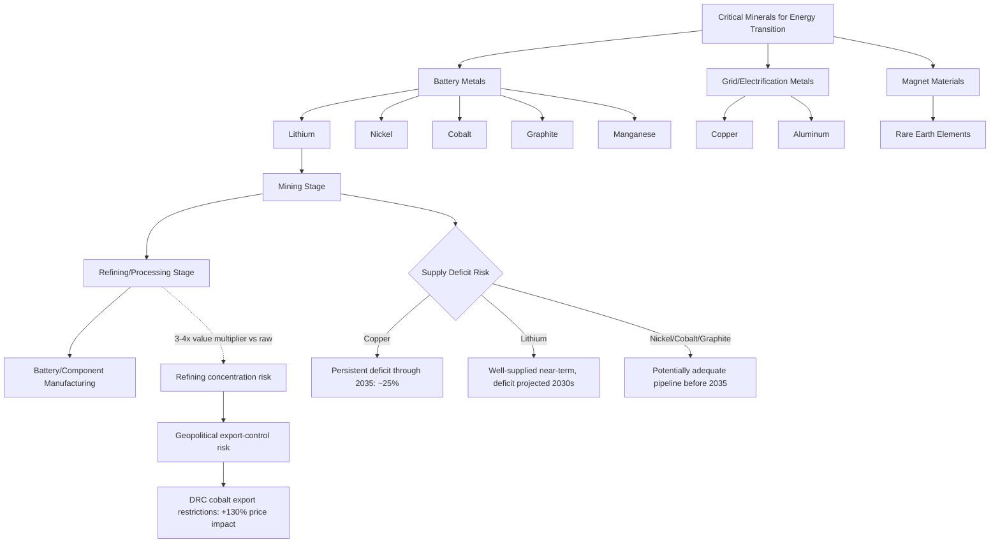

## Critical Minerals Economics for the Energy Transition

### Overview

Critical minerals economics examines the supply, demand, pricing, and geopolitical dynamics of the specific minerals required to build clean energy technologies—batteries (lithium, nickel, cobalt, graphite, manganese), electricity networks (copper, aluminum), and permanent magnets for wind turbines and electric motors (rare earth elements). The International Energy Agency (IEA) forecasts that demand for critical minerals will need to triple by 2030 and quadruple by 2040 if the world is to achieve net-zero emissions, positioning critical minerals as a potential material and economic bottleneck for the energy transition comparable in importance to capital availability or technology cost curves. A defining characteristic of this sector is **extreme price volatility combined with extreme supply concentration**, both of which distinguish critical minerals economics from more mature commodity markets.

### Which Minerals, and Why They Matter

**Key Points**

- The U.S. Department of Energy lists a total of 50 critical minerals, while the European Union's list focuses on 34; definitions vary by jurisdiction, but the IEA's most widely referenced core list includes lithium, nickel, cobalt, manganese, and graphite (used in batteries), aluminum and copper (vital for electricity networks and grid infrastructure), and rare earth elements (used in permanent magnets for wind turbine generators and electric vehicle motors).
- Cobalt's primary energy-transition relevance stems from its role as a critical element in most current lithium-ion battery chemistries, though future cobalt demand hinges substantially on how battery technology evolves, since both lithium iron phosphate (LFP) and sodium-ion battery chemistries do not use cobalt at all.
- For battery metals specifically (lithium, nickel, cobalt, graphite), the energy sector accounted for 85% of total demand growth in 2024, illustrating that these particular minerals' price dynamics are now overwhelmingly driven by clean energy technology demand rather than by their traditional industrial uses.

[Inference] The cobalt case illustrates a broader dynamic worth noting throughout this topic: because battery chemistry is an active area of technological substitution, demand projections for chemistry-specific minerals (cobalt, and to a lesser extent nickel) carry meaningfully more technology-substitution risk than for minerals with no ready substitute in their primary application, such as copper in electrical wiring.

### Demand Growth Trajectory: Historical and Projected

**Key Points**

| Mineral | 2024 Actual Growth | 2026 Projected Growth | Growth to 2040 (various scenarios) |
| --- | --- | --- | --- |
| Lithium | ~30% (vs. ~10%/year in 2010s) | ~16% year-over-year | Roughly fivefold from current levels; up to 40x+ in Sustainable Development Scenario |
| Nickel | 6–8% | — | Roughly doubles |
| Cobalt | 6–8% | — | Grows 50–60% |
| Graphite | 6–8% | — | Roughly doubles |
| Rare earth elements | 6–8% | — | Grows 50–60% |
| Copper | Largest driver: China grid investment | ~2.6% year-over-year | Grows ~30% by 2040 |

For lithium specifically, 2026 demand growth is forecast at 16% year-over-year, with 58% of that growth coming from electric vehicles and 30% from energy storage systems—illustrating that EVs remain the dominant lithium demand driver even as stationary storage becomes an increasingly significant secondary driver.

[Inference] The consistent pattern across nearly every mineral in this table—actual near-term growth rates substantially exceeding historical decade-long averages—reflects the genuinely unprecedented speed of the current demand ramp, distinguishing critical minerals from most historical commodity demand cycles, which tend to build more gradually in response to price signals rather than being driven by a coordinated global policy and technology shift.

### The 2024–2026 Price Cycle: Collapse Then Rebound

**Key Points**

Critical mineral prices have exhibited an unusually sharp boom-bust-rebound cycle within a short multi-year window:

- Lithium prices surged eightfold in 2021–2022, driven by the initial EV demand surge outpacing supply response.
- Lithium prices then fell by over 80% since 2023, as an even faster expansion of supply (particularly new mining and refining capacity brought online in response to the earlier price spike) exerted significant downward pressure, alongside a broader slowdown in EV demand growth relative to earlier expectations.
- Prices for graphite, cobalt, and nickel also dropped by 10% to 20% in 2024, reflecting the same general pattern of supply catching up to, and then outpacing, demand growth.
- **The cycle then reversed again**: critical mineral prices rebounded in 2025 and early 2026, driven by tight supply conditions. Base metal prices (aluminum, copper, tin) rose by one-third between January 2025 and April 2026, with copper prices reaching record highs.
- Lithium prices more than doubled during this 2025–2026 rebound period, driven by strong demand from energy storage applications combined with constrained supply (following the supply-side pullback that occurred during the 2023–2024 price collapse, when low prices discouraged new investment).
- Cobalt prices rose by approximately 130% during the same rebound period, largely attributable to export restrictions imposed by the Democratic Republic of the Congo (DRC)—illustrating how policy actions by a single dominant producing country can move global prices dramatically given supply concentration (discussed further below).
- Tungsten, tantalum, cobalt, lithium, and rare earth elements recorded the largest price increases since 2025, according to the IEA's most recent market review.

**Economic mechanism**: [Inference] This boom-bust-rebound pattern is a textbook illustration of the commodity "pig cycle" or cobweb model, in which long lead times for new mine and refining capacity (often 5–10+ years from discovery to production) mean that supply responses to price signals arrive with substantial lag, causing supply to overshoot in both directions relative to demand and generating persistent price volatility rather than smooth market clearing—a dynamic particularly pronounced in minerals with few, slow-to-develop supply sources.

### Supply Concentration and Geopolitical Risk

**Key Points**

- Diversification is described by the IEA as the watchword for energy security, but the critical minerals sector has moved in the opposite direction in recent years, particularly in refining and processing—meaning that even as some mining diversification has occurred, downstream processing capacity has become more, not less, geographically concentrated.
- One major mining region refines only around one-fifth of its own mined output of key energy minerals, with the exception of lithium, where integrated chemical processing has developed domestically—illustrating that mining capacity and refining capacity are geographically distinct chokepoints, and that a country's raw mineral reserves do not automatically translate into control over the higher-value refined product supply chain.
- The Democratic Republic of the Congo's cobalt export restrictions, cited above as a primary driver of the 130% cobalt price increase, exemplify how supply concentration in a small number of producing (or refining) countries creates policy-driven price risk that is largely absent in more geographically diversified commodity markets.
- Prices for "strategic minor minerals"—minerals with relatively small market sizes but critical roles across energy, high-tech, aerospace, and defense sectors—had already started rising in 2024 and continued to rally through 2025 and early 2026 amid new export controls and robust demand growth, indicating that export-control-driven price risk extends beyond the headline minerals (lithium, cobalt) to a broader set of specialty materials.

[Inference] The pattern of processing/refining concentration exceeding raw mining concentration is arguably a more significant medium-term supply-chain vulnerability than mining concentration alone, since building new refining capacity typically requires substantial specialized technical expertise and capital investment beyond what is needed to simply diversify mine ownership—meaning even successful mining diversification efforts may not translate into supply security if refining remains concentrated.

### The Refining Value Gap

**Key Points**

- The prices of refined materials such as lithium, graphite, nickel, and cobalt were 3 to 4 times that of their raw, unpurified counterparts in 2022, illustrating the substantial value-added captured at the refining stage relative to raw mineral extraction.
- As a specific example, refined cobalt averaged $20.8 per kg in 2022, while raw (unrefined) cobalt averaged only $6.6 per kg—a roughly 3.2x value multiplier attributable to refining alone.

**Policy Implication**: [Inference] This value gap means that countries or companies controlling only raw mineral extraction, without corresponding refining capacity, capture a substantially smaller share of the total value chain than the concentration of refining capacity in a small number of countries would suggest from mining data alone—a key motivation behind various national policies (in the US, EU, and elsewhere) aimed specifically at building domestic or allied refining capacity, rather than mining capacity alone.

### Supply Gap Analysis: Copper and Lithium as the Key Risk Minerals

**Key Points**

- Based on the current project development pipeline, supply deficits for copper and lithium are projected to persist through 2035, although the outlook has somewhat improved in the most recent assessment relative to the prior year's.
- For copper specifically, the projected supply deficit in 2035 has narrowed from around 30% in the previous year's outlook to 25% in the current outlook, as new projects advance, particularly in the Democratic Republic of the Congo and Zambia.
- The copper market faces this deficit due to a combination of structural factors: declining ore grades at existing mines (requiring more material to be processed per unit of metal extracted), rising capital costs for new mine development, long project lead times, and a limited pipeline of new discoveries.
- The lithium market, while comparatively well-supplied in the near term (reflected in the sharp 2023–2024 price collapse discussed above), is projected to enter a supply deficit in the 2030s as demand continues to surge, according to multiple IEA outlook editions.
- By contrast, announced projects for nickel, cobalt, and graphite may be sufficient to meet demand before 2035 in current base-case scenarios, distinguishing these minerals' supply-risk profile from the more acute copper and lithium deficit risk.

[Inference] The distinction between copper/lithium (persistent structural deficit risk) and nickel/cobalt/graphite (potentially adequate supply pipeline) is significant for energy transition policy: it suggests mineral-specific rather than blanket "critical minerals shortage" framing is more analytically accurate, since the supply-demand balance genuinely differs by mineral based on distinct geological, technological substitution, and project-development factors.

### Reserve Growth: A Partially Offsetting Trend

**Key Points**

- From 2010 to 2025, energy minerals—including copper, lithium, nickel, cobalt, natural graphite, and rare earth elements—recorded stronger reserve growth than base metals generally, reflecting increased exploration activity specifically targeting these minerals in response to anticipated energy-transition demand.
- One major lithium-producing region holds approximately one-quarter of global lithium supply, with output expected to grow by nearly 50% by the end of the decade, alongside substantial reserves of silver, graphite, rare earths, and other strategic minerals.

[Inference] This reserve growth trend suggests that the "critical minerals shortage" narrative should be understood as primarily a **near-to-medium-term supply-development timing problem** (mines and refineries take years to build, creating temporary bottlenecks) rather than an absolute geological scarcity problem, since underlying reserve estimates have generally grown rather than shrunk as exploration investment has increased in response to anticipated demand.

### Investment Requirements and the Funding Gap

**Key Points**

- Meeting 2030 net-zero goals is estimated to require approximately 80 new copper mines, 70 new lithium mines, 70 new nickel mines, and 30 new cobalt mines—illustrating the sheer physical scale of new mine development required across the mineral portfolio, not merely incremental capacity additions to existing operations.
- Total investment needed from 2022 to 2030 is projected to be in the range of $360–450 billion, against which a funding deficit of $180–270 billion has been identified—meaning current committed investment falls substantially short of what is estimated to be required to meet stated net-zero mineral demand.
- Investment patterns have diverged notably across mineral segments: despite improved financial performance and a price recovery for some minerals in 2025, companies and investors remained cautious overall, with battery metals investment weakening while copper investment remained comparatively strong, reflecting copper's central and less technology-substitutable role in electricity systems generally (not solely clean energy applications).

[Inference] This investment divergence—cautious battery metals investment despite price recovery, alongside sustained copper investment—suggests investors may be pricing in greater technology-substitution risk for battery-specific minerals (given active competition among battery chemistries) than for copper, whose demand is driven by broader electrification trends with fewer viable material substitutes in most applications.

### Scenario-Dependent Demand: The Clean Energy Share of Total Demand

**Key Points**

- In a Paris Agreement-aligned demand scenario, clean energy technologies' share of total mineral demand rises significantly over the next two decades: to over 40% for copper and rare earth elements, 60–70% for nickel and cobalt, and almost 90% for lithium—meaning under an aggressive decarbonization scenario, lithium demand becomes almost entirely a function of clean energy technology deployment rather than other industrial uses.
- Electric vehicles and battery storage have already displaced consumer electronics to become the largest consumer of lithium, and are set to take over from stainless steel as the largest end user of nickel by 2040 in climate-aligned demand scenarios—illustrating a structural shift in end-use demand composition for these minerals, not merely an increase in total volume.

[Inference] Because lithium demand is projected to become almost entirely (nearly 90%) clean-energy-driven under aggressive decarbonization scenarios, lithium market economics are likely to become increasingly sensitive to EV and battery storage policy and deployment trends specifically, with comparatively little demand diversification into other end uses to buffer against a slowdown in clean energy technology adoption—a risk profile distinct from copper, where a meaningful share of demand will likely remain tied to non-energy-transition uses (construction, general electrical infrastructure) even under aggressive climate scenarios.

### Critical Minerals Supply Chain Diagram

### Price Volatility Cycle Diagram (svg_diagram)

<svg xmlns="http://www.w3.org/2000/svg" viewBox="0 0 850 400" font-family="Arial, sans-serif">
<text x="425" y="25" font-size="17" font-weight="bold" text-anchor="middle" fill="#1a1a1a">Lithium Price Cycle: 2021-2026 (svg_diagram)</text>
<line x1="90" y1="340" x2="800" y2="340" stroke="#333" stroke-width="2" />
<line x1="90" y1="340" x2="90" y2="60" stroke="#333" stroke-width="2" />
<text x="445" y="375" font-size="12" text-anchor="middle" fill="#333">Timeline</text>
<text x="35" y="200" font-size="12" text-anchor="middle" fill="#333" transform="rotate(-90 35 200)">Relative Price Index</text>

<text x="130" y="358" font-size="11" text-anchor="middle" fill="#555">2021</text>

<text x="280" y="358" font-size="11" text-anchor="middle" fill="#555">2022</text>

<text x="430" y="358" font-size="11" text-anchor="middle" fill="#555">2023-24</text>

<text x="600" y="358" font-size="11" text-anchor="middle" fill="#555">2025</text>

<text x="750" y="358" font-size="11" text-anchor="middle" fill="#555">2026</text>

<line x1="90" y1="250" x2="800" y2="250" stroke="#ddd" stroke-width="1" stroke-dasharray="4,3" />
<text x="70" y="255" font-size="10" text-anchor="end" fill="#555">Baseline</text>
<polyline points="130,250 280,85 430,300 600,270 750,190" fill="none" stroke="#C0392B" stroke-width="3" />
<circle cx="130" cy="250" r="5" fill="#333" />
<circle cx="280" cy="85" r="5" fill="#C0392B" />
<text x="280" y="70" font-size="11" fill="#C0392B" font-weight="bold" text-anchor="middle">8x surge (2021-22)</text>
<circle cx="430" cy="300" r="5" fill="#1E6091" />
<text x="430" y="320" font-size="11" fill="#1E6091" font-weight="bold" text-anchor="middle">-80% collapse</text>
<circle cx="750" cy="190" r="5" fill="#2E8B57" />
<text x="750" y="175" font-size="11" fill="#2E8B57" font-weight="bold" text-anchor="middle">2x+ rebound</text>

<text x="425" y="392" font-size="11" font-style="italic" text-anchor="middle" fill="#666">IEA Global Critical Minerals Outlook 2025-2026; illustrative index</text>

</svg>

### Conclusion

Critical minerals economics is characterized by an unusual combination of rapid, structurally-driven demand growth (lithium demand growing nearly fivefold to 40-fold by 2040 depending on scenario) and extreme short-term price volatility driven by long supply-development lead times and geographic concentration, particularly in refining and processing rather than raw mining alone. The 2021–2026 period has already exhibited a complete boom-bust-rebound price cycle for lithium (8x surge, 80% collapse, more than doubling again), illustrating the cobweb-model dynamics characteristic of commodities with slow supply responses. [Inference] Copper and lithium represent the two minerals with the most persistent projected structural supply deficits through 2035, while nickel, cobalt, and graphite currently show potentially adequate project pipelines—suggesting mineral-specific rather than uniform "critical minerals crisis" framing is analytically more accurate. Refining capacity concentration, exemplified by the DRC's cobalt export restrictions driving a 130% price increase, represents a more acute and harder-to-diversify supply chain vulnerability than mining concentration alone, given the specialized capital and expertise required to build new refining capacity, and is the subject of increasing policy attention aimed at building domestic or allied processing capability rather than mining capacity alone.

**Next Steps**

- Battery chemistry substitution economics: LFP and sodium-ion adoption and its effect on cobalt/nickel demand
- Mine-to-market lead times and the "cobweb model" of commodity price cycles
- Refining and processing capacity investment: policy tools for supply chain diversification (US IRA, EU Critical Raw Materials Act)
- Copper demand drivers beyond the energy transition: grid infrastructure, construction, and general electrification
- Recycling and circular economy pathways for battery metals as a supply-side mitigant
- Comparative case study: Democratic Republic of the Congo cobalt export policy and global price effects
- Rare earth element supply chain concentration and its implications for wind turbine and EV motor manufacturing
- Strategic minor minerals and export control policy: aerospace, defense, and high-tech sector overlap with energy transition demand