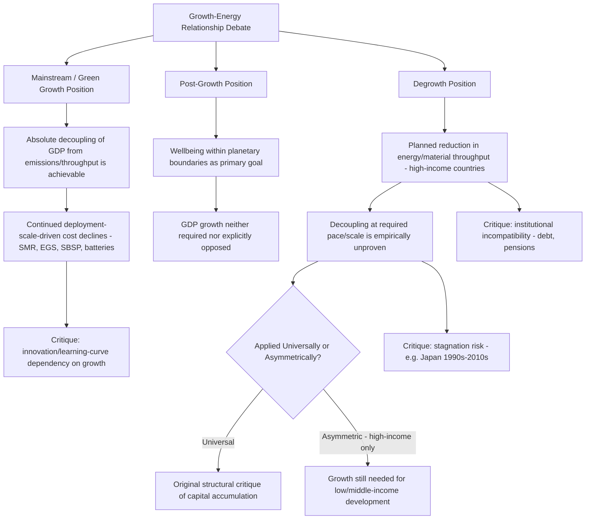

## Degrowth and Post-Growth Perspectives on Energy Economics

### Overview

Degrowth and post-growth are related but analytically distinct schools of thought within ecological economics that challenge the mainstream assumption—embedded in most conventional energy and climate economic modeling—that continued GDP growth is both desirable and compatible with the scale of emissions and material/energy throughput reductions required to remain within planetary boundaries. Degrowth explicitly advocates a **planned, managed reduction** in aggregate energy and material throughput in high-income economies, while post-growth is a somewhat broader and less prescriptive framing, generally emphasizing wellbeing and social provisioning within planetary boundaries without necessarily requiring an active reduction target. Both perspectives sit outside mainstream energy economics (which typically models decarbonization while holding GDP growth as either exogenous or as a policy goal to be preserved), and represent a genuinely contested, actively debated area of the discipline rather than a settled or marginal position within academic ecological economics.

### Defining the Distinction: Degrowth vs. Post-Growth

**Key Points**

- Degrowth's core empirical and theoretical claim, associated prominently with economist Giorgos Kallis, frames planned reductions in energy and resource use as necessary to restore ecological balance, explicitly rejecting the decoupling of economic growth from emissions as empirically unproven at the scale and speed required.
- A recent influential post-growth synthesis (Kallis, Hickel, O'Neill, Jackson, Victor, Raworth, Schor, Steinberger, and Ürge-Vorsatz, published in The Lancet Planetary Health, 2025) frames post-growth explicitly as "the science of wellbeing within planetary boundaries," positioning the field's core question as maximizing human wellbeing subject to ecological constraints, rather than centering GDP growth (or degrowth) as the primary policy variable.
- One critical academic review (Spash, 2026) argues that degrowth is becoming increasingly compromised by post-growth framings and by what the author characterizes as uncritical alliances—for example, noting that some prominent degrowth-adjacent institutions (such as the Wellbeing Economy Alliance) mainstream post-growth using conventional economic and utilitarian arguments, which the author argues dilutes degrowth's original, more structurally critical position on capital accumulation, extractivism, and environmental destruction.

[Inference] This internal tension—between degrowth's more structurally radical original critique and post-growth's comparatively more moderate, wellbeing-centered reframing—represents a genuine and ongoing debate within the field itself, not merely a semantic distinction; readers encountering "degrowth" and "post-growth" in different sources should not assume the terms are interchangeable, since some scholars within the tradition explicitly object to their conflation.

### The Core Critique of Decoupling

**Key Points**

- The central empirical claim degrowth scholars make against mainstream green growth or "absolute decoupling" positions (the idea that GDP can continue growing while absolute energy/material throughput and emissions decline) is that sufficient decoupling at the pace and scale required to meet climate targets has not been empirically demonstrated, and remains, in this view, an unproven assumption embedded in most conventional climate-economic modeling.
- One integrated assessment modeling study (Keyßer and Lenzen, 2021, published in Nature Communications) found that 1.5°C degrowth scenarios suggest the need for entirely new mitigation pathways distinct from those typically modeled in mainstream Integrated Assessment Models (IAMs), which generally assume continued GDP growth alongside deep decarbonization.
- A related modeling effort (Kikstra, Li, Brockway, Hickel, Keysser, Malik, Rogelj, Van Ruijven, and Lenzen, 2024) specifically examined "downscaling" degrowth assumptions into integrated assessment models, reflecting an active and ongoing research effort to formally incorporate degrowth and post-growth assumptions into the same quantitative modeling frameworks used by mainstream climate-economics (IPCC-aligned IAMs), rather than treating degrowth purely as a qualitative or political critique.

[Inference] The fact that degrowth and post-growth scholars are actively working to formalize their assumptions within mainstream IAM modeling frameworks (rather than remaining purely in qualitative/political critique) suggests the field is moving toward greater quantitative rigor and mainstream academic engagement, even as its core policy conclusions remain highly contested outside the ecological economics community.

### Energy-Specific Theoretical Foundations: Biophysical and Ecological Economics

**Key Points**

- Ecological economics (EE), the broader academic tradition from which degrowth and post-growth emerge, highlights how ecosystem stocks and flows sustain and limit human economies, developed explicitly as a critique of neoclassical economics; EE does not have its own fully developed theory of how capitalist economic growth mechanically works, but has documented cases where continued growth becomes "uneconomic" (i.e., where the marginal costs of further growth, including ecological costs, exceed marginal benefits).
- Some biophysical economists working in this tradition (e.g., Keen, Ayres, and Standish, 2019) have specifically examined the role of energy as a production input distinct from how energy is typically treated in mainstream neoclassical production functions (where energy is often a comparatively minor input relative to labor and capital)—arguing energy's role in enabling economic output has been systematically understated in mainstream economic modeling.
- A recent biophysical stock-flow consistent model (Jacques, Delannoy, Andrieu, Yilmaz, Jeanmart, and Godin, 2023) specifically assessed the economic consequences of an energy transition using a modeling framework that explicitly tracks physical energy and material flows alongside financial stocks and flows, representing a methodologically distinct approach from most mainstream macroeconomic models used in energy transition policy analysis.

[Inference] This biophysical modeling tradition represents a genuinely different methodological starting point than mainstream energy-economic modeling (which typically treats energy as one input among several in an aggregate production function): by explicitly foregrounding physical energy and material flow constraints as binding rather than substitutable via capital and technology, biophysical/degrowth-adjacent models tend to reach more pessimistic conclusions about the feasibility of continued growth-compatible decarbonization than mainstream IAM-based modeling.

### Formal Degrowth Macroeconomic Modeling

**Key Points**

- A specific degrowth macroeconomic model (Kemp-Benedict, 2025, published in Ecological Economics) is described as a "preliminary degrowth macroeconomic model" for transitioning to a sustainable economy, reflecting the still-developing and provisional state of formal quantitative degrowth macroeconomic modeling relative to mainstream macroeconomic modeling traditions, which have a much longer history of formal development.
- A comparative review of de- and post-growth modeling studies (published in Ecological Economics, 2025) surveys the growing but still relatively young literature applying formal economic modeling techniques to degrowth and post-growth scenarios, indicating the field has moved beyond purely qualitative or philosophical argumentation toward quantitative scenario modeling, though this modeling tradition remains considerably less mature than mainstream integrated assessment or computable general equilibrium modeling used in conventional climate-economic policy analysis.

### The "Feasibility-Necessity Paradox"

**Key Points**

- One influential analysis characterizes a central tension facing energy transition policy as a "feasibility-necessity paradox": politically feasible policy measures (typically reformist, market-based strategies such as carbon pricing or green subsidies operating within a growth-oriented economic framework) are argued by degrowth-aligned scholars to be ecologically insufficient to meet climate stabilization targets, while more transformative post-growth policy visions, though argued to be more ecologically adequate, face substantially greater political feasibility barriers.
- This same analysis proposes a "two-track" fiscal strategy as a potential synthesis: utilizing Green Keynesian stimulus (conventional, growth-compatible public investment) to build low-carbon infrastructure in the short term, while simultaneously introducing post-growth stabilizers intended to reduce structural growth dependency in the economy over the longer term.

[Inference] This two-track framing represents an attempt at practical policy synthesis between mainstream and post-growth perspectives, rather than treating them as mutually exclusive policy choices; however, [Speculation] whether such a hybrid strategy can be coherently implemented in practice—given that green Keynesian stimulus is generally designed to expand economic activity while post-growth stabilizers are designed to reduce growth dependency—represents an unresolved practical and theoretical tension that the proposing literature itself does not claim to have fully solved.

### Mainstream Critiques of Degrowth and Post-Growth

**Key Points**

Consistent with an evenhanded treatment of this contested topic, several substantive critiques have been raised against degrowth and post-growth positions from mainstream and heterodox economists alike:

- Critics argue that deliberately curtailing economic expansion invites risks of prolonged stagnation—defined as sustained low or zero GDP growth accompanied by high unemployment, subdued productivity gains, and inadequate investment in capital stock—citing empirical analysis of historical stagnation periods, such as Japan's experience from the early 1990s through the 2010s, where average annual real GDP growth hovered below 1%, coinciding with declining private investment.
- Critics emphasizing Schumpeterian creative destruction contend that growth-fueled market competition drives breakthrough innovations, whereas deliberate degrowth could stifle innovation by shrinking markets and redirecting resources toward redistribution rather than expansion—a concern with direct relevance to energy economics, since much of the projected cost decline in clean energy technologies (as discussed in the historical transitions and learning-curve material in this course) depends on continued deployment-driven manufacturing scale and innovation investment.
- Critics further argue that achieving sustained zero or negative GDP growth faces substantial practical implementation barriers in modern economies that are structurally reliant on debt financing, pension systems premised on continued economic growth, and continued technological advancement to service existing financial obligations.
- A separate academic analysis characterizes both extreme sustainability paradigms as facing severe practical feasibility problems: it empirically argues that the change in production technology required for "a-growth" (growth-agnostic) approaches is effectively impossible at the scale required, while the change in consumption preferences required for degrowth approaches is similarly assessed as unfeasible at the scale and speed required, given existing empirical evidence on how consumer preferences and production technologies actually change over time.

[Inference] The convergence of multiple independent critiques around similar concerns (stagnation risk, innovation reduction, institutional/financial-system incompatibility, and behavioral/technological feasibility) suggests these represent the most substantive and frequently-raised objections to degrowth and post-growth positions in current academic debate, though degrowth-aligned scholars have offered responses to each of these critiques within their own literature (for instance, arguing that historical stagnation examples like Japan reflect unplanned, crisis-driven stagnation rather than the deliberately planned and socially managed reduction that degrowth proposes, which they argue is a materially different policy scenario).

### Global Equity Tensions Within Degrowth

**Key Points**

- A notable internal tension identified in critical review of the degrowth literature involves its treatment of low- and middle-income countries: prominent degrowth scholars (Hickel et al., 2022) have argued that degrowth in high-income countries "frees up energy and materials for low- and middle-income countries in which growth might still be needed for development"—implying that degrowth as a policy prescription is intended to apply asymmetrically, primarily to wealthy nations, while continued economic growth remains acceptable or even necessary for developing nations.
- A critical reviewer (Spash, 2026) characterizes this asymmetric application as effectively "turning degrowth on its head" to support universal development framing, arguing that once capital-accumulating growth is treated as acceptable and even necessary for the majority of the world's population (all except high-income countries), the original, more universal critique of growth-oriented capital accumulation as inherently problematic is substantially weakened or abandoned.

[Inference] This internal debate over whether degrowth should apply universally or asymmetrically (only to wealthy nations) reflects a genuine and unresolved tension within the movement's own literature regarding global equity and development, rather than a settled consensus position; readers should understand that "degrowth" as commonly invoked in policy discourse often implicitly or explicitly refers to high-income-country degrowth specifically, not a universal global economic contraction.

### Relevance to Mainstream Energy Economics: Where the Debate Intersects

**Key Points**

- Degrowth and post-growth perspectives directly challenge a core assumption embedded in most conventional energy transition economic modeling covered elsewhere in this course (LCOE-based technology comparisons, learning curve projections, and climate-economic cost-benefit analysis): namely, that decarbonization can and should be pursued while preserving continued GDP growth as a policy objective.
- [Inference] This has direct practical relevance to several other topics in this chapter: for instance, the aggressive cost-decline projections relied upon for SMR nuclear, enhanced geothermal, and space-based solar power (all discussed elsewhere in this chapter) implicitly assume continued high levels of capital investment and manufacturing scale-up consistent with a growth-oriented economic trajectory; degrowth-aligned critiques would question whether such capital-intensive, deployment-scale-dependent cost-reduction pathways remain the most appropriate framework if aggregate economic activity is deliberately constrained, since deployment volume (not merely R&D) is the primary driver of the learning-curve cost declines these technologies depend upon.
- Degrowth and post-growth scholars have also directly engaged with the AI electricity demand growth phenomenon discussed elsewhere in this chapter, generally framing rapidly escalating computing-related energy demand as a paradigmatic example of the kind of resource-intensive, growth-driven consumption pattern that post-growth frameworks argue should be actively constrained or redirected, rather than accommodated through continued supply-side capacity expansion alone.

### Conceptual Framework Diagram

### Growth-Decoupling Debate Diagram (svg_diagram)

<svg xmlns="http://www.w3.org/2000/svg" viewBox="0 0 850 400" font-family="Arial, sans-serif">
<text x="425" y="25" font-size="17" font-weight="bold" text-anchor="middle" fill="#1a1a1a">Contested Positions: GDP Growth vs Energy/Material Throughput (svg_diagram)</text>
<line x1="100" y1="340" x2="780" y2="340" stroke="#333" stroke-width="2" />
<line x1="100" y1="340" x2="100" y2="60" stroke="#333" stroke-width="2" />
<text x="440" y="375" font-size="12" text-anchor="middle" fill="#333">Time</text>
<text x="45" y="200" font-size="12" text-anchor="middle" fill="#333" transform="rotate(-90 45 200)">Index (GDP vs Throughput)</text>
<polyline points="120,300 300,220 500,140 700,80" fill="none" stroke="#1E6091" stroke-width="3" />
<text x="700" y="65" font-size="11" fill="#1E6091" font-weight="bold" text-anchor="middle">GDP (mainstream growth path)</text>
<polyline points="120,300 300,270 500,220 700,150" fill="none" stroke="#C0392B" stroke-width="3" stroke-dasharray="6,3" />
<text x="700" y="165" font-size="11" fill="#C0392B" font-weight="bold" text-anchor="middle">Throughput/Emissions (green growth claim - relative decoupling)</text>
<polyline points="120,300 300,300 500,290 700,270" fill="none" stroke="#7F8C8D" stroke-width="3" stroke-dasharray="2,4" />
<text x="700" y="285" font-size="11" fill="#7F8C8D" font-weight="bold" text-anchor="middle">Throughput needed for climate targets (degrowth claim)</text>

<text x="425" y="392" font-size="11" font-style="italic" text-anchor="middle" fill="#666">Illustrative schematic of the contested decoupling debate, not empirical data</text>

</svg>

### Conclusion

Degrowth and post-growth perspectives represent a genuinely contested but academically substantive body of work within ecological economics that directly challenges the growth-preserving assumptions embedded in most mainstream energy transition economic modeling, including much of the technology-specific cost analysis covered elsewhere in this chapter. The field distinguishes between degrowth's more structurally critical stance (planned reduction of energy/material throughput, skepticism of decoupling) and post-growth's comparatively broader wellbeing-centered framing, with active internal debate over whether this distinction represents healthy theoretical development or a dilution of degrowth's original critique. [Inference] Formal quantitative modeling of degrowth and post-growth scenarios remains a comparatively young field relative to mainstream integrated assessment modeling, though active research is underway to incorporate these assumptions into standard climate-economic modeling frameworks. Substantive critiques—stagnation risk, reduced innovation incentives, institutional incompatibility with debt- and pension-based financial systems, and questions about the practical feasibility of large-scale preference and production-technology change—remain unresolved points of genuine academic disagreement rather than settled objections, and readers should understand this as an active area of contested inquiry rather than a fringe position without academic standing.

**Next Steps**

- Ecological economics foundations: biophysical economics and energy-as-production-input theory
- Integrated Assessment Model (IAM) methodology and its embedded growth assumptions
- Decoupling debates: relative vs. absolute decoupling of GDP from emissions, empirical evidence review
- Green Keynesian stimulus policy design and its relationship to post-growth stabilizer proposals
- Comparative case study: Japan's post-1990s stagnation as an empirical reference point in the degrowth debate
- Global equity and "differentiated" degrowth: implications for low- and middle-income country development pathways
- Wellbeing economics and alternative metrics to GDP (Genuine Progress Indicator, Better Life Index)
- Stock-flow consistent modeling as a methodological alternative to conventional macroeconomic and IAM approaches