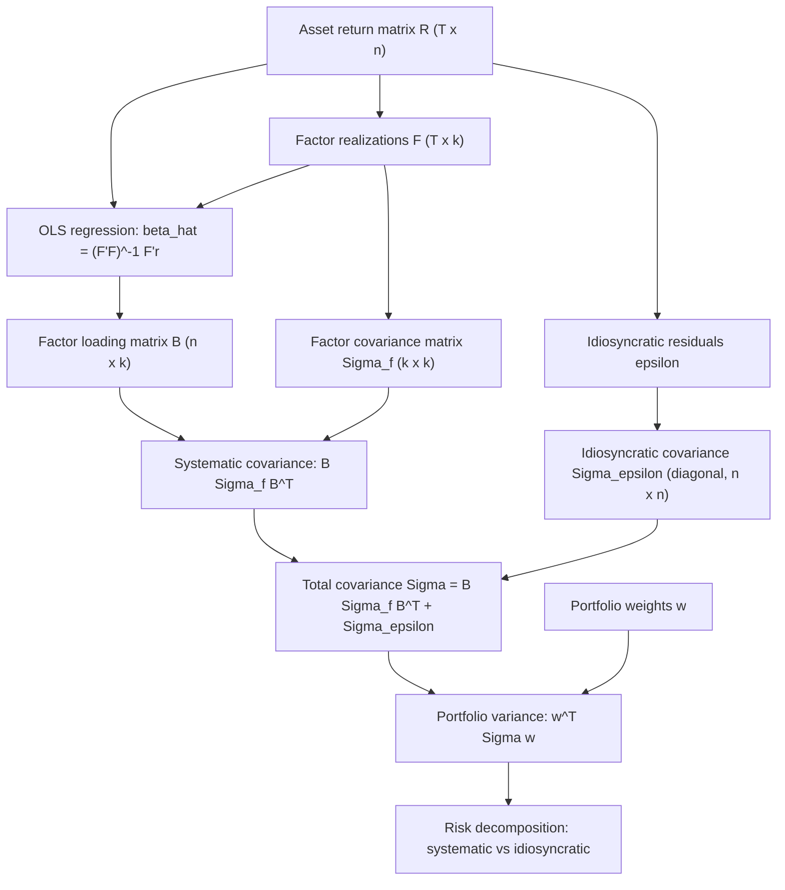

## Linear Algebra for Portfolio and Factor Models

### Overview

Linear algebra provides the computational and conceptual backbone for modern portfolio theory and factor modeling. Portfolios are naturally represented as vectors, covariance structures as matrices, and the core optimization problems of finance (mean-variance optimization, risk decomposition, factor exposure estimation) reduce to matrix equations with closed-form or near-closed-form solutions. This section develops the linear algebra machinery — vectors, matrices, quadratic forms, eigendecomposition, and projections — as it is used to construct portfolios, estimate factor models, and decompose risk.

### Vectors and Vector Spaces in Portfolio Theory

**Portfolio weight vectors**

A portfolio of $n$ assets is represented as a weight vector:

$$w = \begin{bmatrix} w_1 \\ w_2 \\ \vdots \\ w_n \end{bmatrix} \in \mathbb{R}^n$$

where $w_i$ is the fraction of capital allocated to asset $i$. The fully-invested constraint is expressed as an inner product with the ones vector $\mathbf{1} = (1, 1, \ldots, 1)^T$:

$$\mathbf{1}^T w = \sum_{i=1}^n w_i = 1$$

Long-only constraints add $w_i \geq 0 \; \forall i$, which is not a linear-algebraic constraint per se (it's an inequality, handled by quadratic programming), but it interacts directly with the vector-space geometry: the feasible set becomes the simplex rather than a hyperplane.

**Return vectors**

Asset returns at time $t$ form a random vector $r_t = (r_{1t}, \ldots, r_{nt})^T$. Portfolio return is the inner product:

$$r_{p,t} = w^T r_t$$

**Key Points**

- Portfolio construction is fundamentally an exercise in choosing a point in $\mathbb{R}^n$ (or a constrained subspace/simplex of it).
- Linear combinations of asset return vectors define the span of achievable portfolio returns — this span is the investable universe under linear combination (no leverage/short-sale constraints aside).
- The dimensionality $n$ of the vector space equals the number of assets, but the *effective* dimensionality of the return-generating process is often far lower, which motivates factor models (see below).

### The Covariance Matrix

**Definition and structure**

The covariance matrix $\Sigma$ is the central object of risk modeling:

$$\Sigma = \text{Cov}(r) = E[(r - \mu)(r - \mu)^T]$$

where $\mu = E[r]$ is the expected return vector. $\Sigma$ is an $n \times n$ matrix with:

$$\Sigma_{ij} = \text{Cov}(r_i, r_j), \quad \Sigma_{ii} = \text{Var}(r_i)$$

$\Sigma$ is symmetric ($\Sigma = \Sigma^T$) by construction, since $\text{Cov}(r_i, r_j) = \text{Cov}(r_j, r_i)$.

**Positive semi-definiteness**

$\Sigma$ is positive semi-definite (PSD): for any vector $x \in \mathbb{R}^n$,

$$x^T \Sigma x \geq 0$$

This follows because $x^T \Sigma x = \text{Var}(x^T r) \geq 0$ — variance of any linear combination of random variables cannot be negative. This property is not a mathematical curiosity; it is what guarantees that portfolio variance, computed as $w^T \Sigma w$, is always non-negative for any weight vector $w$, which is required for the mean-variance optimization problem to be well-posed (a convex quadratic program).

In practice, sample covariance matrices estimated from $T$ observations of $n$ assets are only guaranteed PSD (not strictly positive definite) when $T \geq n$. When $T < n$ (common with large universes and limited history), the sample covariance matrix is rank-deficient and singular, causing numerical instability in optimization. [Inference: the exact numerical behavior — whether an optimizer errors, returns extreme weights, or silently proceeds — depends on the specific solver and regularization used.]

**Portfolio variance as a quadratic form**

$$\sigma_p^2 = w^T \Sigma w = \sum_{i=1}^n \sum_{j=1}^n w_i w_j \Sigma_{ij}$$

This double-sum expansion is worth internalizing: portfolio variance is not the weighted average of individual variances — it also depends on every pairwise covariance term, scaled by the product of the corresponding weights. This is the mathematical source of diversification: off-diagonal covariance terms, when negative or small relative to variances, reduce $\sigma_p^2$ below the weighted-average variance.

### Mean-Variance Optimization via Linear Algebra

**The unconstrained (aside from budget) minimum-variance problem**

Markowitz's minimum-variance portfolio (ignoring the return target, only imposing full investment) solves:

$$\min_w \; w^T \Sigma w \quad \text{s.t.} \quad \mathbf{1}^T w = 1$$

Using Lagrange multipliers, form:

$$\mathcal{L} = w^T \Sigma w - \lambda(\mathbf{1}^T w - 1)$$

Taking the gradient and setting it to zero:

$$\nabla_w \mathcal{L} = 2\Sigma w - \lambda \mathbf{1} = 0 \;\Rightarrow\; w = \frac{\lambda}{2} \Sigma^{-1} \mathbf{1}$$

Applying the constraint $\mathbf{1}^T w = 1$ to solve for $\lambda$ gives the closed-form global minimum-variance (GMV) portfolio:

$$w_{GMV} = \frac{\Sigma^{-1} \mathbf{1}}{\mathbf{1}^T \Sigma^{-1} \mathbf{1}}$$

This result depends entirely on the invertibility of $\Sigma$ — the matrix inverse is not merely a computational convenience here, it is the object that encodes how the optimizer trades off each asset's variance against every other asset's covariance simultaneously.

**Mean-variance efficient frontier**

Adding a target return constraint $\mu^T w = r^*$, the full two-constraint Lagrangian problem yields a solution of the form:

$$w^*(r^*) = \Sigma^{-1}\big(\lambda_1 \mu + \lambda_2 \mathbf{1}\big)$$

where $\lambda_1, \lambda_2$ solve a $2\times 2$ linear system built from the scalars $A = \mathbf{1}^T \Sigma^{-1} \mathbf{1}$, $B = \mathbf{1}^T \Sigma^{-1} \mu$, $C = \mu^T \Sigma^{-1} \mu$. The efficient frontier is the parametric curve traced by $w^*(r^*)$ as $r^*$ varies — geometrically, it is a hyperbola in mean-standard-deviation space, a direct consequence of $\Sigma^{-1}$ being a fixed PSD-inverse quadratic form.

**Example**

For $n = 3$ assets with:

$$\Sigma = \begin{bmatrix} 0.04 & 0.01 & 0.00 \\ 0.01 & 0.09 & 0.02 \\ 0.00 & 0.02 & 0.16 \end{bmatrix}$$

Computing $\Sigma^{-1}\mathbf{1}$ and normalizing by $\mathbf{1}^T \Sigma^{-1}\mathbf{1}$ produces $w_{GMV}$. The asset with the lowest variance (asset 1, variance 0.04) and lowest covariances typically receives the largest weight, but the exact allocation also reflects the covariance structure — asset 3, despite having the highest variance (0.16), may still receive nonzero weight if its correlation with the others is favorable for diversification. [Inference: exact numeric weights require carrying out the matrix inversion; the qualitative direction described here follows directly from the structure of $\Sigma^{-1}\mathbf{1}$.]

### Matrix Inversion, Conditioning, and Numerical Issues

**Why invertibility matters**

$\Sigma^{-1}$ appears in every closed-form mean-variance solution. When $\Sigma$ is singular or near-singular (ill-conditioned), $\Sigma^{-1}$ amplifies estimation error, producing extreme, unstable portfolio weights. This is a well-documented failure mode of naive Markowitz optimization: small changes in estimated means or covariances lead to large swings in $w^*$.

**Condition number**

The condition number of $\Sigma$,

$$\kappa(\Sigma) = \frac{\lambda_{\max}(\Sigma)}{\lambda_{\min}(\Sigma)}$$

(ratio of largest to smallest eigenvalue) quantifies this sensitivity. A large $\kappa(\Sigma)$ indicates the matrix is close to singular along some direction, and inversion will magnify noise in that direction.

**Regularization approaches**

Common remedies that address the linear-algebraic root cause:

- **Shrinkage estimators** (e.g., Ledoit-Wolf): $\hat{\Sigma}_{shrink} = \delta F + (1-\delta)\hat{\Sigma}_{sample}$, where $F$ is a well-conditioned target (e.g., a scaled identity or single-factor structure) and $\delta \in [0,1]$ is the shrinkage intensity. This pulls eigenvalues away from zero, improving conditioning.
- **Factor model covariance** (see below): replacing the full sample covariance with a factor-model-implied covariance, which is PSD by construction and has far fewer free parameters to estimate.
- **Ridge-type regularization**: $\hat{\Sigma}_{ridge} = \hat{\Sigma}_{sample} + \epsilon I$ for small $\epsilon > 0$, which directly raises the smallest eigenvalues.

### Eigendecomposition and Principal Component Analysis

**Spectral decomposition of the covariance matrix**

Since $\Sigma$ is real and symmetric, the spectral theorem guarantees it admits an eigendecomposition:

$$\Sigma = Q \Lambda Q^T$$

where $Q$ is an orthogonal matrix ($Q^T Q = I$) whose columns $q_1, \ldots, q_n$ are the eigenvectors of $\Sigma$, and $\Lambda = \text{diag}(\lambda_1, \ldots, \lambda_n)$ contains the corresponding eigenvalues, conventionally ordered $\lambda_1 \geq \lambda_2 \geq \cdots \geq \lambda_n \geq 0$ (non-negativity follows from PSD-ness).

**Interpretation in portfolio risk**

Each eigenvector $q_k$ defines a portfolio (after normalization) whose return has variance equal to the corresponding eigenvalue $\lambda_k$, and these "eigenportfolios" are mutually uncorrelated:

$$\text{Var}(q_k^T r) = \lambda_k, \qquad \text{Cov}(q_k^T r, q_j^T r) = 0 \text{ for } k \neq j$$

This decomposes total portfolio risk into orthogonal, independent sources — the eigenvectors form a new basis for $\mathbb{R}^n$ in which the covariance structure is diagonal.

**Principal Component Analysis (PCA) for factor extraction**

PCA applies this decomposition to extract statistical factors directly from the covariance (or correlation) matrix of returns, without prespecifying factor identities:

1. Standardize returns and compute the sample covariance (or correlation) matrix $\hat{\Sigma}$.
2. Eigendecompose: $\hat{\Sigma} = Q\Lambda Q^T$.
3. The first $k$ eigenvectors (associated with the $k$ largest eigenvalues) define the top $k$ **statistical factors**; each asset's exposure (loading) to factor $k$ is the $k$-th component of $q_k$ scaled appropriately.
4. The proportion of total variance explained by the first $k$ components is:

$$\text{Variance explained} = \frac{\sum_{i=1}^k \lambda_i}{\sum_{i=1}^n \lambda_i} = \frac{\sum_{i=1}^k \lambda_i}{\text{tr}(\Sigma)}$$

using the identity that the trace of $\Sigma$ (sum of variances) equals the sum of all eigenvalues.

In equity markets, empirically the first principal component of a broad cross-section of stock returns typically has a large loading on nearly every stock and is commonly interpreted as a "market factor," loosely analogous to the market factor in the CAPM/Fama-French framework. [Inference: the magnitude of variance explained by this first component and its precise economic interpretation vary by market, time period, and universe, so this should be read as a general empirical regularity rather than a fixed number.]

### Factor Models: Structure and Matrix Form

**General linear factor model**

A $k$-factor model expresses each asset's return as a linear combination of $k$ common factors plus idiosyncratic (asset-specific) noise:

$$r_{i} = \alpha_i + \beta_{i1} f_1 + \beta_{i2} f_2 + \cdots + \beta_{ik} f_k + \epsilon_i$$

In matrix form, for $n$ assets and $k$ factors:

$$r = \alpha + Bf + \epsilon$$

where:

- $r \in \mathbb{R}^n$ is the vector of asset returns
- $\alpha \in \mathbb{R}^n$ is the vector of intercepts (asset-specific expected excess returns not explained by factors)
- $B \in \mathbb{R}^{n \times k}$ is the **factor loading (beta) matrix**, $B_{ij}$ = exposure of asset $i$ to factor $j$
- $f \in \mathbb{R}^k$ is the vector of factor realizations
- $\epsilon \in \mathbb{R}^n$ is the vector of idiosyncratic residuals, assumed uncorrelated with $f$ and, in the strict factor model, mutually uncorrelated across assets ($\text{Cov}(\epsilon_i, \epsilon_j) = 0$ for $i \neq j$)

**Factor-implied covariance matrix**

Taking the covariance of both sides of $r = \alpha + Bf + \epsilon$:

$$\Sigma = B \Sigma_f B^T + \Sigma_\epsilon$$

where $\Sigma_f \in \mathbb{R}^{k \times k}$ is the covariance matrix of the factors and $\Sigma_\epsilon$ is the covariance matrix of idiosyncratic returns (diagonal, under the strict factor model assumption). This is the single most important matrix identity in factor-based risk modeling: it decomposes total risk $\Sigma$ (an $n \times n$ object with $n(n+1)/2$ free parameters) into a low-rank systematic component $B\Sigma_f B^T$ (rank $\leq k$) plus a diagonal idiosyncratic component. When $k \ll n$, this dramatically reduces the number of parameters that must be estimated — from $O(n^2)$ to $O(nk)$ — which is the primary practical motivation for factor models in large-universe risk management.

**Estimating $B$ via least squares**

Given $T$ time-series observations of returns and factors, $B$ (and $\alpha$) is typically estimated asset-by-asset via ordinary least squares (OLS) time-series regression:

$$\hat{\beta}_i = (F^T F)^{-1} F^T r_i$$

where $F \in \mathbb{R}^{T \times (k+1)}$ is the design matrix (a column of ones for the intercept, plus $k$ columns of factor realizations) and $r_i \in \mathbb{R}^T$ is the time series of asset $i$'s returns. This is the standard OLS normal-equations solution, applied to each asset in turn (or simultaneously in matrix form for all assets at once, stacking the $\hat\beta_i$ into $\hat B$).

**Cross-sectional factor models (Fama-MacBeth style)**

An alternative estimation approach runs the regression the other way: at each time $t$, regress the cross-section of returns on known/estimated factor loadings to recover factor realizations:

$$f_t = (B^T B)^{-1} B^T r_t$$

This is used when loadings $B$ are observable characteristics (e.g., book-to-market ratios, size, industry dummies) rather than estimated from time series, and the goal is to back out the implied factor returns $f_t$ each period. Both estimation directions rely on the same linear-algebraic object: the least-squares projection via the pseudoinverse-like term $(X^T X)^{-1} X^T$.

**Example**

For a single-factor model (e.g., CAPM-style with the market as the only factor), $B$ collapses to a column vector $\beta \in \mathbb{R}^n$ of market betas, and:

$$\Sigma = \beta \sigma_m^2 \beta^T + \Sigma_\epsilon$$

Portfolio variance under this model becomes:

$$\sigma_p^2 = (w^T\beta)^2 \sigma_m^2 + w^T \Sigma_\epsilon w$$

demonstrating explicitly that total portfolio risk splits into systematic risk (driven by the portfolio's net market exposure $w^T\beta$) and idiosyncratic risk (which diversifies away as $\Sigma_\epsilon$ is diagonal and $n$ grows, provided weights aren't overly concentrated).

### Risk Decomposition Using Linear Algebra

**Marginal contribution to risk (MCTR)**

Given $\sigma_p = \sqrt{w^T \Sigma w}$, the gradient with respect to $w$ gives each asset's marginal contribution to portfolio volatility:

$$\text{MCTR} = \frac{\partial \sigma_p}{\partial w} = \frac{\Sigma w}{\sigma_p}$$

**Component contribution to risk (CCTR)**

Multiplying elementwise by weights and using Euler's theorem for homogeneous functions of degree 1 (since $\sigma_p$ is homogeneous of degree 1 in $w$):

$$\text{CCTR}_i = w_i \cdot \text{MCTR}_i = \frac{w_i (\Sigma w)_i}{\sigma_p}$$

These component contributions sum exactly to total portfolio volatility:

$$\sum_{i=1}^n \text{CCTR}_i = \frac{w^T \Sigma w}{\sigma_p} = \sigma_p$$

This additive decomposition — a direct consequence of Euler's homogeneous-function theorem applied to the quadratic form $w^T\Sigma w$ — underlies risk-budgeting and risk-parity portfolio construction, where the objective is often to choose $w$ such that all $\text{CCTR}_i$ are equal.

**Factor-based risk decomposition**

Using $\Sigma = B\Sigma_f B^T + \Sigma_\epsilon$, portfolio variance decomposes as:

$$\sigma_p^2 = w^T B \Sigma_f B^T w + w^T \Sigma_\epsilon w = (B^Tw)^T \Sigma_f (B^Tw) + w^T\Sigma_\epsilon w$$

The term $B^Tw \in \mathbb{R}^k$ is the portfolio's net factor exposure vector, and the first term is the systematic risk contributed by those exposures; the second term is aggregate idiosyncratic risk. This decomposition is the standard output of commercial factor risk models (e.g., Barra, Axioma) and lets portfolio managers attribute risk to named factors (value, momentum, size, sector, etc.) rather than to individual securities.

### Diagram: Data Flow in Factor-Based Portfolio Risk Modeling

### Diagram: Eigendecomposition of the Covariance Matrix (svg_diagram)

<svg xmlns="http://www.w3.org/2000/svg" viewBox="0 0 720 300" font-family="Helvetica, Arial, sans-serif">
<text x="360" y="25" text-anchor="middle" font-size="16" font-weight="bold" fill="#1a1a1a">Eigendecomposition of Sigma (svg_diagram)</text>
<rect x="20" y="70" width="110" height="90" fill="none" stroke="#2b6cb0" stroke-width="2" />
<text x="75" y="115" text-anchor="middle" font-size="20" fill="#2b6cb0">Σ</text>
<text x="75" y="175" text-anchor="middle" font-size="12" fill="#333333">n x n</text>
<text x="75" y="190" text-anchor="middle" font-size="11" fill="#666666">Covariance</text>

<text x="150" y="120" text-anchor="middle" font-size="22" fill="`#333333`">=</text>

<rect x="180" y="70" width="110" height="90" fill="none" stroke="#2f855a" stroke-width="2" />
<text x="235" y="115" text-anchor="middle" font-size="20" fill="#2f855a">Q</text>
<text x="235" y="175" text-anchor="middle" font-size="12" fill="#333333">n x n</text>
<text x="235" y="190" text-anchor="middle" font-size="11" fill="#666666">Eigenvectors</text>

<text x="310" y="120" text-anchor="middle" font-size="22" fill="`#333333`">×</text>

<rect x="340" y="70" width="110" height="90" fill="none" stroke="#c05621" stroke-width="2" />
<text x="395" y="105" text-anchor="middle" font-size="18" fill="#c05621">Λ</text>
<line x1="350" y1="90" x2="440" y2="150" stroke="#c05621" stroke-width="1" stroke-dasharray="3,3" />
<text x="395" y="140" text-anchor="middle" font-size="10" fill="#c05621">diag(λ1..λn)</text>
<text x="395" y="175" text-anchor="middle" font-size="12" fill="#333333">n x n</text>
<text x="395" y="190" text-anchor="middle" font-size="11" fill="#666666">Eigenvalues</text>

<text x="470" y="120" text-anchor="middle" font-size="22" fill="`#333333`">×</text>

<rect x="500" y="70" width="110" height="90" fill="none" stroke="#2f855a" stroke-width="2" />
<text x="555" y="115" text-anchor="middle" font-size="20" fill="#2f855a">Qᵀ</text>
<text x="555" y="175" text-anchor="middle" font-size="12" fill="#333333">n x n</text>
<text x="555" y="190" text-anchor="middle" font-size="11" fill="#666666">Transpose</text>

<text x="360" y="230" text-anchor="middle" font-size="13" fill="`#444444`">Each eigenvector q_k defines an uncorrelated "eigenportfolio"</text>

<text x="360" y="250" text-anchor="middle" font-size="13" fill="`#444444`">with variance equal to eigenvalue λ_k</text>

<text x="360" y="275" text-anchor="middle" font-size="12" fill="`#888888`">Top-k eigenvectors (largest λ) = principal statistical risk factors</text>

</svg>

### Projections and Orthogonality

**Least-squares as projection**

The OLS estimator $\hat\beta = (F^TF)^{-1}F^Tr$ has a geometric interpretation: $F\hat\beta$ is the orthogonal projection of $r$ onto the column space of $F$ (the space spanned by the factor time series). The residual $\epsilon = r - F\hat\beta$ is, by construction, orthogonal to every column of $F$:

$$F^T \epsilon = 0$$

This orthogonality is precisely the condition that ensures factor exposures $B$ are uncorrelated with idiosyncratic returns $\epsilon$ in the factor model — a structural assumption of the model that OLS estimation enforces mechanically by construction, not something separately verified.

**Orthogonalizing correlated factors**

When candidate factors are themselves correlated (multicollinearity), the Gram-Schmidt process or, equivalently, Cholesky decomposition of $\Sigma_f$, can be used to construct an orthogonal factor basis $f^{\perp} = L^{-1}f$, where $\Sigma_f = LL^T$ is the Cholesky factorization. This is used in practice to separate the "pure" contribution of one factor (e.g., value) from another with which it is correlated (e.g., size), producing orthogonalized factor returns with a diagonal covariance matrix.

### Matrix Algebra of Portfolio Constraints

**General linear constraints**

Many practical portfolio constraints beyond full investment are linear: sector exposure limits, factor-neutrality requirements, cash-neutrality. These are expressed jointly as $Aw = b$, where each row of $A$ encodes one linear constraint. The constrained mean-variance problem:

$$\min_w \; w^T\Sigma w \quad \text{s.t.} \quad Aw = b$$

has closed-form Lagrangian solution:

$$w^* = \Sigma^{-1}A^T(A\Sigma^{-1}A^T)^{-1}b$$

which generalizes the GMV formula (the special case $A = \mathbf{1}^T$, $b=1$ recovers $w_{GMV}$ exactly).

**Factor-neutral portfolio construction**

A common application: constructing a portfolio with zero net exposure to a specific factor (e.g., market-neutral), which sets one row of $A$ equal to the corresponding row of $B^T$ (the factor's loading vector) and the corresponding entry of $b$ to zero, i.e., $\beta^Tw = 0$.

### Standard Errors and the Role of $(X^TX)^{-1}$

In any OLS-estimated factor model, the covariance matrix of the estimated coefficients is:

$$\text{Var}(\hat\beta) = \sigma_\epsilon^2 (F^TF)^{-1}$$

under homoskedastic, uncorrelated-error assumptions (heteroskedasticity-consistent variants replace this with a sandwich estimator). The matrix $(F^TF)^{-1}$ recurs as the object that scales estimation uncertainty; when factors are highly correlated (ill-conditioned $F^TF$), standard errors on individual factor loadings inflate substantially even though the model's overall fit ($R^2$) may remain high — this is the classic multicollinearity problem viewed through a linear-algebra lens.

### Worked Numerical Example: Two-Factor Model

Suppose returns follow a two-factor model with factors "market" ($f_1$) and "value" ($f_2$), and three assets with estimated loadings:

$$B = \begin{bmatrix} 1.1 & 0.3 \\ 0.9 & -0.2 \\ 1.3 & 0.5 \end{bmatrix}, \quad \Sigma_f = \begin{bmatrix} 0.05 & 0.00 \\ 0.00 & 0.02 \end{bmatrix}, \quad \Sigma_\epsilon = \text{diag}(0.01, 0.015, 0.012)$$

The systematic covariance contribution is:

$$B\Sigma_f B^T$$

Computing the $(1,1)$ entry explicitly: $(1.1)(0.05)(1.1) + (0.3)(0.02)(0.3) = 0.0605 + 0.0018 = 0.0623$. Adding the idiosyncratic variance $0.01$ gives total variance for asset 1: $\Sigma_{11} = 0.0723$. Off-diagonal entries (e.g., $\Sigma_{12}$) come purely from the systematic term since $\Sigma_\epsilon$ is diagonal: $(1.1)(0.05)(0.9) + (0.3)(0.02)(-0.2) = 0.0495 - 0.0012 = 0.0483$.

**Key Points**

- Off-diagonal covariances in a factor model arise *entirely* from shared factor exposure — this is the defining structural implication of $\Sigma = B\Sigma_fB^T + \Sigma_\epsilon$ with diagonal $\Sigma_\epsilon$.
- Assets with loadings of opposite sign on a factor (like asset 2's negative value loading) can have their factor-driven covariance with other assets reduced or reversed in sign, illustrating how factor loadings directly generate the diversification structure of $\Sigma$.

### Conclusion

Linear algebra is not an auxiliary tool for portfolio and factor modeling — it is the language in which mean-variance optimization, risk decomposition, and factor attribution are natively expressed. The covariance matrix's symmetry and positive semi-definiteness guarantee well-posed optimization; its eigendecomposition reveals orthogonal sources of risk and underlies PCA-based statistical factor extraction; the factor model's low-rank-plus-diagonal structure ($B\Sigma_fB^T + \Sigma_\epsilon$) makes large-scale risk modeling computationally tractable; and constrained optimization, projection, and least-squares machinery together provide the closed-form and near-closed-form solutions that portfolio managers and quantitative researchers rely on in practice. Fluency with matrix inversion, quadratic forms, eigendecomposition, and orthogonal projection is a prerequisite for essentially every subsequent topic in quantitative portfolio management.

**Related Topics**

- Quadratic programming and convex optimization for constrained portfolio problems
- Principal Component Analysis and statistical factor models in depth
- Fama-French and Carhart multi-factor models (fundamental vs. statistical factors)
- Shrinkage estimation of covariance matrices (Ledoit-Wolf, Bayesian shrinkage)
- Risk parity and hierarchical risk parity portfolio construction
- Singular Value Decomposition (SVD) as an alternative to eigendecomposition for factor extraction
- Black-Litterman model (Bayesian blending of views with equilibrium returns, matrix-algebra-based)
- Multicollinearity diagnostics in cross-sectional and time-series factor regressions
- Robust covariance estimation (Ledoit-Wolf, factor models, random matrix theory / Marchenko-Pastur denoising)
- Matrix calculus for portfolio sensitivity ("the Greeks" of portfolio risk: MCTR, CCTR)