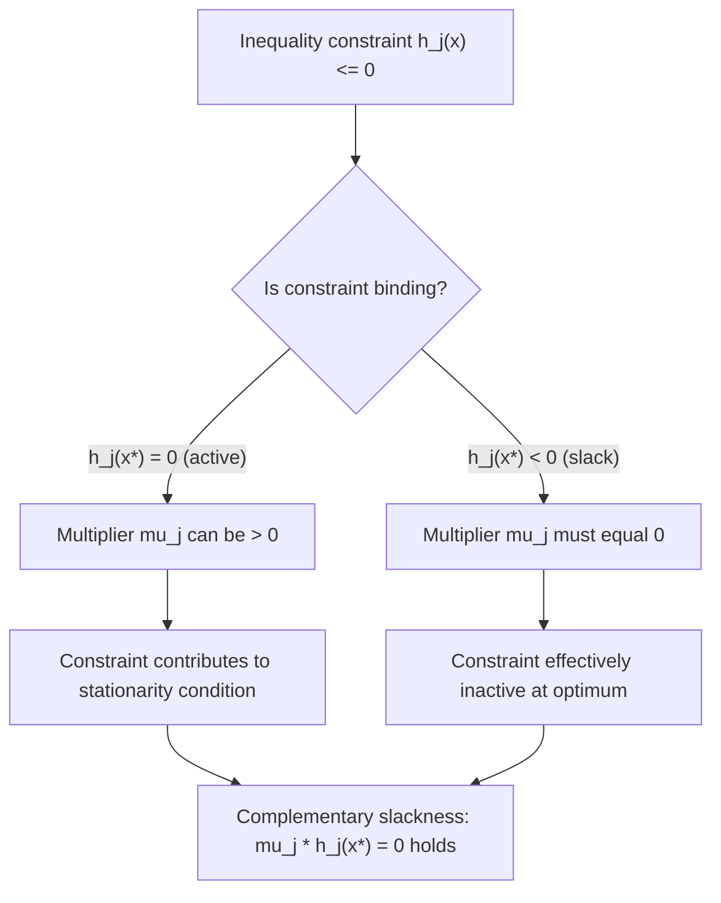

## Unconstrained and Constrained Optimization

### Overview

Optimization theory provides the formal machinery for solving the central decision problems of financial economics: portfolio selection, utility maximization, cost minimization, and equilibrium characterization. Nearly every normative model in finance — from Markowitz mean-variance optimization to expected utility maximization to arbitrage pricing — reduces to finding an extremum of an objective function, either freely (unconstrained) or subject to feasibility restrictions (constrained). This section develops the calculus-based theory of unconstrained optimization (critical points, second-order conditions), the Lagrangian method for equality-constrained problems, and the Karush-Kuhn-Tucker (KKT) framework for inequality-constrained problems, with financial applications throughout.

### Unconstrained Optimization

**First-order necessary condition**

For a differentiable objective function $f: \mathbb{R}^n \to \mathbb{R}$, a point $x^*$ is a candidate local extremum only if the gradient vanishes:

$$\nabla f(x^*) = 0$$

This is the multivariate generalization of setting a derivative to zero. Each component condition $\frac{\partial f}{\partial x_i}(x^*) = 0$ must hold simultaneously.

**Second-order conditions**

The first-order condition alone does not distinguish a minimum, maximum, or saddle point. The Hessian matrix $H = \nabla^2 f(x^*)$, the matrix of second partial derivatives, resolves this:

$$H_{ij} = \frac{\partial^2 f}{\partial x_i \partial x_j}(x^*)$$

Classification via definiteness of $H$ at the critical point:

- If $H$ is **positive definite** ($x^THx > 0$ for all $x \neq 0$), $x^*$ is a local minimum.
- If $H$ is **negative definite** ($x^THx < 0$ for all $x \neq 0$), $x^*$ is a local maximum.
- If $H$ is **indefinite** (some directions give positive, others negative), $x^*$ is a saddle point.
- If $H$ is positive or negative *semi*-definite (with some zero eigenvalues), the test is inconclusive and higher-order or direct analysis is required.

**Convexity and global optima**

A critical distinction in financial optimization: if $f$ is a **convex function** on a convex domain, any local minimum is automatically a **global minimum**. Convexity of $f$ is equivalent to the Hessian being positive semi-definite everywhere on the domain:

$$\nabla^2 f(x) \succeq 0 \; \forall x \; \Leftrightarrow \; f \text{ convex}$$

This is precisely why mean-variance portfolio optimization is tractable: the objective $w^T\Sigma w$ is a convex quadratic form (since $\Sigma$ is PSD), so any critical point found via the first-order condition is guaranteed to be the global minimum, not merely a local one.

**Example: Unconstrained minimum-variance point**

Minimizing $f(w) = w^T\Sigma w$ without any constraint (not even budget normalization) trivially gives $\nabla f(w) = 2\Sigma w = 0$, so $w^* = 0$ — investing nothing has zero variance. This degenerate result is precisely why portfolio problems are virtually never posed as pure unconstrained problems; the budget constraint $\mathbf{1}^Tw=1$ is what makes the problem economically meaningful, motivating the constrained methods below.

**Newton's method (numerical unconstrained optimization)**

When closed-form solutions are unavailable, Newton's method iterates:

$$x_{k+1} = x_k - [\nabla^2 f(x_k)]^{-1} \nabla f(x_k)$$

using local quadratic approximation of $f$ via its Hessian. Convergence is fast (locally quadratic) near a well-behaved minimum but requires $\nabla^2f(x_k)$ to be invertible and can behave poorly far from the optimum or when the Hessian is ill-conditioned. [Inference: exact convergence behavior — number of iterations, sensitivity to starting point — depends on the specific objective's curvature and is typically assessed empirically for a given problem instance.]

### Equality-Constrained Optimization: The Lagrangian Method

**Problem setup**

Many financial optimization problems take the form:

$$\min_x \; f(x) \quad \text{subject to} \quad g_i(x) = 0, \quad i = 1, \ldots, m$$

where $f$ is the objective (e.g., portfolio variance) and each $g_i$ is an equality constraint (e.g., budget constraint, target return constraint).

**The Lagrangian function**

Introduce one Lagrange multiplier $\lambda_i$ per constraint and form:

$$\mathcal{L}(x, \lambda) = f(x) - \sum_{i=1}^m \lambda_i g_i(x)$$

**First-order (necessary) conditions**

A candidate optimum satisfies the stationarity conditions:

$$\nabla_x \mathcal{L} = \nabla f(x) - \sum_{i=1}^m \lambda_i \nabla g_i(x) = 0$$

$$\nabla_\lambda \mathcal{L} = -g_i(x) = 0 \; \forall i \quad \text{(recovers the original constraints)}$$

Geometrically, stationarity requires that $\nabla f(x^*)$ be a linear combination of the constraint gradients $\nabla g_i(x^*)$ — equivalently, that $\nabla f(x^*)$ has no component along any direction in which the feasible set (the intersection of the constraint surfaces) can still move. At the constrained optimum, the objective's gradient is "trapped" within the span of the constraint gradients, so no feasible direction of movement can further improve $f$.

**Economic interpretation of $\lambda$: the shadow price**

The multiplier $\lambda_i$ measures the sensitivity of the optimal objective value to a marginal relaxation of constraint $i$:

$$\lambda_i = \frac{\partial f(x^*)}{\partial b_i}$$

where $b_i$ is the right-hand-side of constraint $g_i(x) = b_i$. In portfolio problems, the multiplier on the target-return constraint measures the marginal increase in portfolio variance required to raise the target return by one unit — an object directly related to the slope of the efficient frontier at that point.

**Worked Example: Markowitz Problem via Lagrangian**

Minimize portfolio variance subject to full investment and a target return:

$$\min_w \; w^T\Sigma w \quad \text{s.t.} \quad \mathbf{1}^Tw = 1, \;\; \mu^Tw = r^*$$

$$\mathcal{L} = w^T\Sigma w - \lambda_1(\mathbf{1}^Tw - 1) - \lambda_2(\mu^Tw - r^*)$$

Stationarity: $2\Sigma w - \lambda_1\mathbf{1} - \lambda_2\mu = 0 \;\Rightarrow\; w^* = \Sigma^{-1}(\lambda_1\mathbf{1} + \lambda_2\mu)/2$. Substituting back into the two constraints gives a $2\times2$ linear system for $\lambda_1, \lambda_2$ in terms of $r^*$ and the scalars $A=\mathbf{1}^T\Sigma^{-1}\mathbf{1}$, $B=\mathbf{1}^T\Sigma^{-1}\mu$, $C=\mu^T\Sigma^{-1}\mu$. This is the standard derivation of the mean-variance efficient frontier, and it demonstrates the Lagrangian method's core mechanic: converting a constrained problem in $w$ into an unconstrained (algebraic) problem in $(w, \lambda_1, \lambda_2)$ jointly.

### Diagram: Lagrangian Tangency Condition

<svg xmlns="http://www.w3.org/2000/svg" viewBox="0 0 640 360" font-family="Helvetica, Arial, sans-serif">
<text x="320" y="25" text-anchor="middle" font-size="16" font-weight="bold" fill="#1a1a1a">Tangency at the Constrained Optimum (svg_diagram)</text>
<line x1="80" y1="300" x2="480" y2="80" stroke="#2b6cb0" stroke-width="2.5" />
<text x="490" y="75" font-size="12" fill="#2b6cb0">g(x) = 0</text>
<ellipse cx="330" cy="190" rx="180" ry="90" fill="none" stroke="#c05621" stroke-width="1.3" stroke-dasharray="4,3" />
<ellipse cx="330" cy="190" rx="130" ry="65" fill="none" stroke="#c05621" stroke-width="1.3" stroke-dasharray="4,3" />
<ellipse cx="330" cy="190" rx="80" ry="40" fill="none" stroke="#c05621" stroke-width="1.8" />
<text x="500" y="180" font-size="12" fill="#c05621">level sets of f(x)</text>
<circle cx="290" cy="192" r="5" fill="#2f855a" />
<text x="230" y="215" font-size="12" fill="#2f855a" font-weight="bold">x* (optimum)</text>
<line x1="290" y1="192" x2="330" y2="150" stroke="#c05621" stroke-width="2" marker-end="url(#arrow1)" />
<text x="335" y="145" font-size="11" fill="#c05621">∇f(x*)</text>
<line x1="290" y1="192" x2="325" y2="155" stroke="#2b6cb0" stroke-width="2" marker-end="url(#arrow3)" />
<text x="345" y="170" font-size="11" fill="#2b6cb0">λ∇g(x*)</text>
<text x="320" y="335" text-anchor="middle" font-size="12" fill="`#444444`">At x*, the constraint line is tangent to a level curve of f:</text>

<text x="320" y="352" text-anchor="middle" font-size="12" fill="`#444444`">∇f(x*) is parallel to ∇g(x*), i.e. ∇f(x*) = λ∇g(x*)</text>

</svg>

**Key Points**

- The Lagrangian converts a constrained problem into a system of algebraic (first-order) equations solvable jointly for the decision variables and multipliers.
- Multiple equality constraints simply add more multipliers and more stationarity/feasibility equations — the method scales linearly in the number of constraints.
- The Lagrangian approach yields only *necessary* conditions in general (candidate points); sufficiency depends on second-order conditions or, more simply, convexity of $f$ and affineness (linearity) of the $g_i$, which holds in the standard Markowitz setup.

### Second-Order Conditions for Constrained Problems

**Bordered Hessian**

For equality-constrained problems, second-order sufficiency uses the **bordered Hessian**, which augments the Hessian of $\mathcal{L}$ with the constraint gradients:

$$\bar{H} = \begin{bmatrix} 0 & \nabla g^T \\ \nabla g & \nabla^2_{xx}\mathcal{L} \end{bmatrix}$$

Sign conditions on the leading principal minors of $\bar H$ (alternating or consistent sign patterns depending on convention) determine whether a stationary point is a constrained local minimum or maximum. [Inference: the precise sign pattern required depends on the number of variables and constraints and the specific textbook convention used; this is stated qualitatively here rather than with a universal numeric rule.]

**Why this is often skipped in practice**

In most standard financial optimization problems (mean-variance with linear constraints, utility maximization with concave utility and linear budget constraints), the objective is convex (or the negative of a concave utility is convex) and the constraints are affine. In this case, the feasible set is convex, the problem is a convex program, and any point satisfying the first-order Lagrangian conditions is automatically the global constrained optimum — the bordered Hessian check becomes unnecessary. This convexity shortcut is why so much of classical portfolio theory can be presented purely via first-order conditions.

### Inequality-Constrained Optimization: The KKT Framework

**Problem setup**

Extending to inequality constraints (e.g., no short-selling, position limits, sector caps):

$$\min_x \; f(x) \quad \text{s.t.} \quad g_i(x) = 0 \; (i=1,\ldots,m), \quad h_j(x) \leq 0 \; (j=1,\ldots,p)$$

Form the Lagrangian with both equality multipliers $\lambda_i$ and inequality multipliers $\mu_j \geq 0$:

$$\mathcal{L}(x,\lambda,\mu) = f(x) - \sum_i \lambda_i g_i(x) + \sum_j \mu_j h_j(x)$$

**The KKT conditions**

A point $x^*$ satisfying appropriate regularity conditions (constraint qualifications) is optimal only if there exist multipliers $\lambda^*, \mu^*$ such that:

1. **Stationarity**: $\nabla f(x^*) - \sum_i \lambda_i^*\nabla g_i(x^*) + \sum_j \mu_j^*\nabla h_j(x^*) = 0$
2. **Primal feasibility**: $g_i(x^*) = 0 \;\forall i$, $\;h_j(x^*)\leq 0 \;\forall j$
3. **Dual feasibility**: $\mu_j^* \geq 0 \;\forall j$
4. **Complementary slackness**: $\mu_j^* h_j(x^*) = 0 \;\forall j$

**Interpreting complementary slackness**

This is the economically central condition: for each inequality constraint, either the constraint is *binding* ($h_j(x^*) = 0$, "active") and its multiplier can be strictly positive, or the constraint is *slack* ($h_j(x^*) < 0$, strictly satisfied with room to spare) and its multiplier must be exactly zero. A constraint that isn't "pressing" against the optimal solution contributes nothing to the marginal trade-off at the optimum — it's as if that constraint weren't there.

**Financial application: long-only portfolio optimization**

Adding $w_i \geq 0 \;\forall i$ (no short sales) to the Markowitz problem, written as $h_i(w) = -w_i \leq 0$, KKT stationarity for each asset becomes:

$$2(\Sigma w)_i - \lambda_1 - \lambda_2\mu_i - \mu_i^{KKT} = 0$$

with complementary slackness $\mu_i^{KKT} w_i = 0$. This formalizes a well-known empirical feature of long-only mean-variance optimization: many assets end up at exactly $w_i = 0$ (the constraint binds, $\mu_i^{KKT} > 0$) rather than a small positive weight, because the unconstrained optimum for those assets would have been negative (a short position) and the inequality constraint clips it to the boundary. This is precisely the mechanism behind the well-documented tendency of unconstrained mean-variance optimization to produce extreme (including negative) weights, which practitioners address by imposing exactly these box constraints.

### Diagram: KKT Complementary Slackness Logic

**Key Points**

- KKT conditions generalize the Lagrangian method to handle inequality constraints, which are ubiquitous in realistic portfolio problems (no-short, leverage limits, turnover caps, sector bounds).
- Complementary slackness is what allows the *same* first-order framework to handle constraints that may or may not bind, without needing to guess in advance which constraints are active.
- Solving KKT systems in practice typically requires an active-set or interior-point numerical method (see Quadratic Programming below) rather than direct algebraic solution, because which constraints bind is not known a priori.

### Constraint Qualifications

KKT conditions are guaranteed *necessary* for optimality only when a constraint qualification (CQ) holds at $x^*$ — a technical regularity condition ensuring the constraint gradients behave well locally (e.g., linear independence of active constraint gradients, LICQ; or, for convex problems, Slater's condition — existence of a strictly feasible point). In most standard financial optimization setups with linear constraints (budget, factor-neutrality, box constraints), the constraint qualification holds automatically because linear constraints trivially satisfy LICQ wherever they are not degenerate, so this technical caveat rarely binds in practice but is worth knowing as the formal justification underlying the routine use of KKT conditions in portfolio software.

### Quadratic Programming (QP) as the Computational Bridge

**Standard QP form**

Mean-variance and related portfolio problems with inequality constraints are instances of quadratic programs:

$$\min_x \; \tfrac{1}{2}x^TQx + c^Tx \quad \text{s.t.} \quad Ax \leq b, \;\; Ex = d$$

When $Q$ (here, $2\Sigma$) is PSD, the QP is convex, and any KKT point is a global optimum. This is the formal justification for why numerical QP solvers (active-set methods, interior-point methods) reliably return globally optimal portfolios for standard mean-variance problems, even with many box and linear inequality constraints.

**Active-set method sketch**

1. Guess an initial active set (subset of inequality constraints assumed binding).
2. Solve the resulting equality-constrained problem via the Lagrangian method.
3. Check dual feasibility ($\mu_j \geq 0$) and primal feasibility for inactive constraints.
4. If violated, adjust the active set (add or remove constraints) and repeat.

This iterative logic is what commercial and open-source portfolio optimizers implement under the hood; the Lagrangian/KKT theory developed above is the mathematical foundation each iteration relies on. [Inference: specific solver implementations (e.g., interior-point vs. active-set, warm-starting strategies) vary by software package and are chosen based on problem size and structure rather than a single universal method.]

### Duality

**The dual problem**

Associated with any constrained optimization problem is a **dual problem**, obtained by defining the dual function:

$$q(\lambda,\mu) = \inf_x \mathcal{L}(x,\lambda,\mu)$$

and maximizing $q$ over $\mu \geq 0$ (and free $\lambda$). Weak duality always holds ($q(\lambda,\mu) \leq f(x^*)$ for any feasible $x$ and dual-feasible $(\lambda,\mu)$); for convex problems satisfying a constraint qualification, **strong duality** holds and the optimal primal and dual objective values coincide.

**Relevance to finance**

Duality underlies no-arbitrage pricing theory (the dual variables of a linear program over state prices correspond to risk-neutral probabilities/state prices themselves) and provides an alternative, often more tractable computational route to solving large constrained portfolio problems by optimizing over dual variables instead of primal decision variables directly.

### Unconstrained vs. Constrained: Summary Comparison

| Aspect | Unconstrained | Constrained (Equality) | Constrained (Inequality/KKT) |
| --- | --- | --- | --- |
| Optimality condition | $\nabla f(x^*)=0$ | $\nabla f = \sum\lambda_i\nabla g_i$ | KKT system (4 conditions) |
| Second-order check | Hessian definiteness | Bordered Hessian | Bordered Hessian on active set |
| Multiplier sign | N/A | Unrestricted | $\mu_j \geq 0$ required |
| Typical finance use | Rarely used alone (degenerate) | Budget/target-return constraints | Position limits, no-short, leverage caps |
| Global optimum guaranteed if | $f$ convex | $f$ convex, $g_i$ affine | $f$ convex, feasible set convex |

### Conclusion

Unconstrained and constrained optimization together supply the mathematical apparatus that turns economic objectives — minimize risk, maximize utility, minimize cost — into solvable systems of equations. The progression from first-order and second-order conditions in the unconstrained case, to the Lagrangian method for equality constraints, to the full KKT framework for inequality constraints, mirrors the increasing realism of financial models: pure unconstrained optimization is rarely economically meaningful on its own, equality-constrained Lagrangian methods deliver the classical closed-form portfolio theory results (efficient frontier, GMV portfolio), and KKT-based quadratic programming is what practical, real-world portfolio construction under realistic constraints (no-short, position limits, turnover) actually requires computationally. Fluency with these tools is a direct prerequisite for mean-variance optimization, utility maximization, and much of asset pricing theory covered elsewhere in this course.

**Related Topics**

- Convex analysis and convex optimization theory (convex sets, convex functions, convex programs)
- Quadratic programming solvers and numerical methods (active-set, interior-point)
- Duality theory and its role in no-arbitrage / state-price pricing
- Expected utility maximization as a constrained optimization problem
- Envelope theorem and comparative statics in economic optimization
- Dynamic programming and the Bellman equation (intertemporal constrained optimization)
- Portfolio optimization with transaction costs and turnover constraints
- Robust optimization under parameter uncertainty (worst-case constrained optimization)
- Second-order cone programming (SOCP) for advanced risk constraints (e.g., CVaR)
- Stochastic optimization and optimization under uncertainty