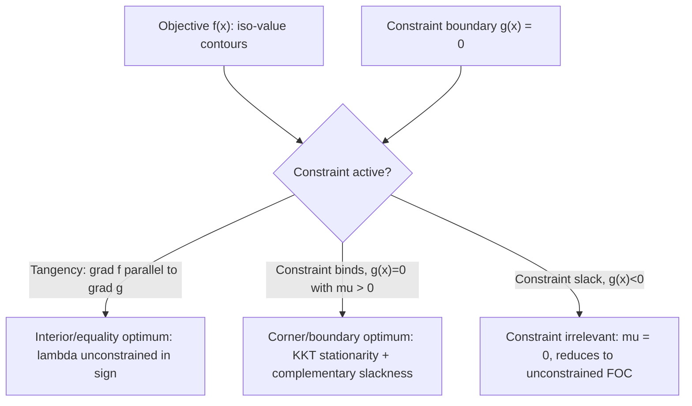

## Lagrange Multipliers and Kuhn-Tucker Conditions

### Overview and Economic Motivation

Constrained optimization is the mathematical backbone of financial economics. Portfolio selection, utility maximization, cost minimization, and general equilibrium models all reduce to optimizing an objective function subject to constraints — budget constraints, portfolio weight constraints, non-negativity restrictions, or regulatory limits. Lagrange multipliers handle equality constraints; the Karush-Kuhn-Tucker (KKT) conditions extend this framework to inequality constraints, which is essential because real economic problems (short-sale restrictions, borrowing limits, non-negative consumption) are rarely pure equality problems.

### The Classical Lagrange Multiplier Method

#### Problem Setup

Consider the constrained optimization problem:

$$\max_{x \in \mathbb{R}^n} f(x) \quad \text{subject to} \quad g(x) = 0$$

where $f: \mathbb{R}^n \to \mathbb{R}$ is the objective function and $g: \mathbb{R}^n \to \mathbb{R}^m$ represents $m$ equality constraints.

#### The Lagrangian Function

Introduce a multiplier $\lambda \in \mathbb{R}^m$ (one per constraint) and form the Lagrangian:

$$\mathcal{L}(x, \lambda) = f(x) - \lambda^T g(x)$$

Some texts write $+\lambda^T g(x)$; the sign convention does not affect the solution, only the interpreted sign of $\lambda$ at the optimum.

#### First-Order Conditions (FOC)

At an interior optimum, the gradient conditions are:

$$\nabla_x \mathcal{L} = \nabla f(x) - \lambda^T \nabla g(x) = 0$$

$$\nabla_\lambda \mathcal{L} = -g(x) = 0$$

The first condition says the gradient of $f$ must be a linear combination of the gradients of the constraints — geometrically, at the optimum, the level curve of $f$ is tangent to the constraint surface.

#### Economic Interpretation: The Shadow Price

The multiplier $\lambda^*$ has a precise economic meaning: it measures the marginal value of relaxing the constraint.

$$\lambda^* = \frac{\partial f(x^*)}{\partial b}$$

where $b$ is a parameter on the right-hand side of the constraint ($g(x) = b$). In consumer theory, if $g(x) = 0$ represents a budget constraint $p^Tx - w = 0$, then $\lambda^*$ is the marginal utility of wealth. In production theory, it is the shadow price of a scarce resource.

**Example**

Maximize utility $u(x_1, x_2) = x_1^{0.5}x_2^{0.5}$ subject to the budget constraint $p_1x_1 + p_2x_2 = w$.

Lagrangian:

$$\mathcal{L} = x_1^{0.5}x_2^{0.5} - \lambda(p_1x_1 + p_2x_2 - w)$$

FOCs:

$$0.5x_1^{-0.5}x_2^{0.5} = \lambda p_1$$

$$0.5x_1^{0.5}x_2^{-0.5} = \lambda p_2$$

Dividing these gives $\frac{x_2}{x_1} = \frac{p_1}{p_2}$, so $p_1x_1 = p_2x_2$. Substituting into the budget constraint yields the classic Cobb-Douglas demand functions:

$$x_1^* = \frac{w}{2p_1}, \quad x_2^* = \frac{w}{2p_2}$$

The multiplier evaluates to $\lambda^* = \frac{1}{2}\left(\frac{w}{2p_1p_2}\right)^{-0.5} \cdot p_1^{-0.5}$... more usefully, $\lambda^*$ simplifies to $\lambda^* = \frac{u(x_1^*, x_2^*)}{w}$, confirming it as the marginal utility per unit of wealth.

#### Second-Order Conditions and the Bordered Hessian

A stationary point of the Lagrangian is not automatically a maximum. The bordered Hessian tests second-order sufficiency:

$$H_B = \begin{pmatrix} 0 & \nabla g^T \\ \nabla g & \nabla^2_{xx}\mathcal{L} \end{pmatrix}$$

For a maximum with $n$ variables and $m$ constraints, the last $n-m$ leading principal minors of $H_B$ must alternate in sign starting with the sign of $(-1)^{m+1}$. This is [Inference: precise sign convention varies slightly by textbook ordering] — always verify against the specific source's indexing convention when applying mechanically.

### Extending to Inequality Constraints: The KKT Framework

#### General Problem Statement

$$\max_{x} f(x) \quad \text{s.t.} \quad g_i(x) \le 0, \; i = 1, \dots, m \quad \text{and} \quad h_j(x) = 0, \; j = 1, \dots, p$$

This nests the pure equality case and adds inequality constraints (e.g., non-negativity of consumption, portfolio weight limits, VaR ceilings).

#### The KKT Lagrangian

$$\mathcal{L}(x, \mu, \lambda) = f(x) - \sum_{i=1}^m \mu_i g_i(x) - \sum_{j=1}^p \lambda_j h_j(x)$$

#### The Four KKT Conditions

1. **Stationarity**

   $$\nabla f(x^*) - \sum_i \mu_i \nabla g_i(x^*) - \sum_j \lambda_j \nabla h_j(x^*) = 0$$
2. **Primal feasibility**

   $$g_i(x^*) \le 0 \; \forall i, \qquad h_j(x^*) = 0 \; \forall j$$
3. **Dual feasibility**

   $$\mu_i \ge 0 \; \forall i$$
4. **Complementary slackness**

   $$\mu_i \, g_i(x^*) = 0 \; \forall i$$

Complementary slackness is the conceptual heart of the framework: for each inequality constraint, either the constraint binds exactly ($g_i(x^*) = 0$) with a potentially positive multiplier, or it is slack ($g_i(x^*) < 0$) and its multiplier must be zero. A constraint that isn't "biting" cannot have a positive shadow price.

#### Constraint Qualifications

The KKT conditions are guaranteed necessary at a local optimum only if a constraint qualification (CQ) holds — this rules out degenerate geometries where gradients of active constraints behave pathologically. Common CQs:

- **Linear Independence CQ (LICQ):** gradients of active constraints are linearly independent at $x^*$
- **Slater's condition:** for convex problems, there exists a strictly feasible point (all inequality constraints hold strictly)
- **Mangasarian-Fromovitz CQ (MFCQ):** a weaker, more general alternative to LICQ

In most standard financial economics applications (linear or convex constraint sets like budget sets and portfolio simplices), Slater's condition is trivially satisfied and this is rarely a binding practical concern. [Inference: constraint qualification failures are more of a technical/theoretical edge case than a common empirical hurdle in typical portfolio and consumer problems.]

#### Sufficiency: When KKT Guarantees a Global Optimum

If $f$ is concave (for maximization), each $g_i$ is convex, and each $h_j$ is affine, the problem is convex and any point satisfying the KKT conditions is a **global** maximum — not merely a local stationary point. This convexity property is why so much of financial economic theory (mean-variance optimization, expected utility maximization with concave utility) is tractable: the KKT conditions are both necessary and sufficient.

### Worked Example: Portfolio Optimization with a Short-Sale Constraint

Consider minimizing portfolio variance subject to a return target and a no-short-selling constraint:

$$\min_{w} \frac{1}{2}w^T \Sigma w \quad \text{s.t.} \quad w^T\mu = r_p, \quad \mathbf{1}^Tw = 1, \quad w_i \ge 0 \; \forall i$$

Rewrite $w_i \ge 0$ as $-w_i \le 0$. The Lagrangian:

$$\mathcal{L} = \frac{1}{2}w^T\Sigma w - \lambda_1(w^T\mu - r_p) - \lambda_2(\mathbf{1}^Tw - 1) - \sum_i \mu_i(-w_i)$$

Stationarity for each asset $i$:

$$(\Sigma w)_i - \lambda_1 \mu_i - \lambda_2 + \mu_i = 0$$

Complementary slackness: $\mu_i w_i^* = 0$ — for any asset with a nonzero optimal weight, the corresponding multiplier $\mu_i$ must be zero, meaning the unconstrained first-order condition holds exactly for that asset. For assets pinned at zero weight (the short-sale constraint binds), $\mu_i > 0$ represents the "cost" of being unable to short that asset — intuitively, how much the portfolio variance would decrease per unit if shorting were allowed.

This is precisely why constrained mean-variance frontiers differ from the unconstrained Markowitz frontier: assets that would optimally receive negative weight get pinned to zero, and the multipliers quantify the opportunity cost.

### Visualizing the Geometry

The following diagram illustrates the classic tangency condition for a two-variable equality-constrained maximum:

<svg xmlns="http://www.w3.org/2000/svg" viewBox="0 0 500 380">
<text x="250" y="25" font-size="16" text-anchor="middle" font-family="sans-serif" font-weight="bold">Tangency at Constrained Optimum (svg_diagram)</text>
<line x1="50" y1="330" x2="470" y2="330" stroke="black" stroke-width="1.5" />
<line x1="50" y1="330" x2="50" y2="50" stroke="black" stroke-width="1.5" />
<text x="480" y="335" font-size="13" font-family="sans-serif">x1</text>
<text x="35" y="45" font-size="13" font-family="sans-serif">x2</text>
<line x1="80" y1="300" x2="380" y2="80" stroke="#1f77b4" stroke-width="2" />
<text x="385" y="75" font-size="12" fill="#1f77b4" font-family="sans-serif">g(x) = 0 (budget line)</text>
<ellipse cx="230" cy="190" rx="150" ry="70" fill="none" stroke="#d62728" stroke-width="1.5" transform="rotate(-25 230 190)" />
<ellipse cx="230" cy="190" rx="100" ry="45" fill="none" stroke="#d62728" stroke-width="1.5" transform="rotate(-25 230 190)" />
<ellipse cx="230" cy="190" rx="50" ry="22" fill="none" stroke="#d62728" stroke-width="1.5" transform="rotate(-25 230 190)" />
<text x="330" y="150" font-size="12" fill="#d62728" font-family="sans-serif">f(x) level curves</text>
<circle cx="245" cy="182" r="5" fill="black" />
<text x="255" y="175" font-size="13" font-family="sans-serif" font-weight="bold">x*</text>
<line x1="245" y1="182" x2="290" y2="140" stroke="green" stroke-width="1.5" marker-end="url(#arrow)" />
<text x="295" y="135" font-size="11" fill="green" font-family="sans-serif">grad f</text>
<line x1="245" y1="182" x2="275" y2="145" stroke="purple" stroke-width="1.5" stroke-dasharray="4,2" marker-end="url(#arrow2)" />
<text x="255" y="130" font-size="11" fill="purple" font-family="sans-serif">lambda * grad g</text>
</svg>

### Common Pitfalls

- **Sign confusion:** the interpretation of $\lambda$'s sign depends entirely on whether the Lagrangian is set up as $f - \lambda g$ or $f + \lambda g$, and whether the problem is a max or min. Always re-derive rather than pattern-match a memorized sign rule.
- **Forgetting dual feasibility:** for inequality constraints, $\mu_i \ge 0$ is required in maximization problems (with $g_i(x) \le 0$ constraints); mixing this up with equality-constraint multipliers (unrestricted sign) is a frequent source of error.
- **Ignoring complementary slackness when solving systems:** many textbook and exam problems require **case analysis** — checking which constraints are binding vs. slack — rather than solving one monolithic system of equations.
- **Applying KKT to non-convex problems and assuming global optimality:** stationarity alone only guarantees a local critical point unless convexity (or concavity for maximization) is established separately.

### Applications in Financial Economics

- **Mean-variance portfolio optimization** with weight constraints (Markowitz with short-sale restrictions, leverage caps)
- **Utility maximization** under budget constraints (standard consumer/investor choice theory)
- **Arbitrage pricing and no-arbitrage bounds**, where KKT multipliers correspond to state prices / risk-neutral probabilities in linear programming duals
- **Optimal contract design and principal-agent models**, where participation and incentive-compatibility constraints are often inequality constraints
- **Risk management**, e.g., minimizing portfolio risk subject to a VaR or CVaR ceiling
- **Dynamic optimization** (as a static analogue), forming the conceptual bridge to the Pontryagin Maximum Principle and Bellman's principle of optimality in continuous-time finance

**Related Topics**

- Envelope theorem and comparative statics
- Duality theory and shadow prices in linear/convex programming
- Convex optimization and convex duality (Slater's condition, strong duality)
- Pontryagin's Maximum Principle (dynamic/continuous-time extension)
- Dynamic programming and the Bellman equation
- Mean-variance portfolio theory (Markowitz optimization)
- Expected utility theory and risk aversion
- Arrow-Debreu state prices and general equilibrium
- Second-order conditions: Hessians, bordered Hessians, and definiteness tests