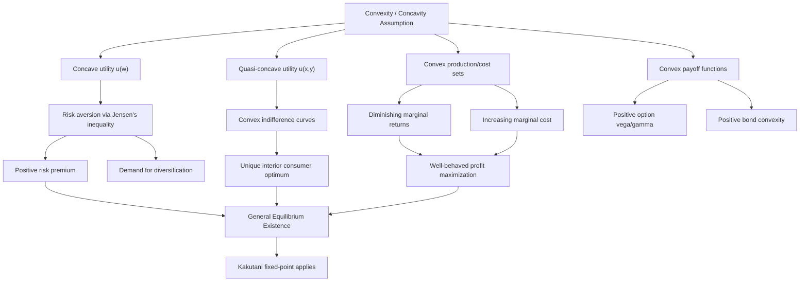

## Convexity and Concavity in Economic Models

### Definitions and Basic Concepts

**Concave Function**

A function $f: \mathbb{R}^n \to \mathbb{R}$ defined on a convex set is concave if for all $x, y$ in the domain and $\lambda \in [0,1]$:

$$f(\lambda x + (1-\lambda) y) \geq \lambda f(x) + (1-\lambda) f(y)$$

Geometrically, the line segment (chord) connecting any two points on the graph lies on or below the graph. A function is strictly concave if the inequality is strict for $x \neq y$ and $\lambda \in (0,1)$.

**Convex Function**

A function $f$ is convex if the reverse inequality holds:

$$f(\lambda x + (1-\lambda) y) \leq \lambda f(x) + (1-\lambda) f(y)$$

The chord lies on or above the graph. Equivalently, $f$ is convex if and only if $-f$ is concave.

**Convex Set**

A set $S \subseteq \mathbb{R}^n$ is convex if for any two points $x, y \in S$, the entire line segment $\lambda x + (1-\lambda)y$ for $\lambda \in [0,1]$ is also in $S$. Convexity of the domain is a prerequisite for the definitions above to be meaningful, since the definitions require $\lambda x + (1-\lambda)y$ to be in the function's domain.

### Second-Derivative Characterization

For twice-differentiable functions of a single variable, concavity and convexity have simple derivative tests:

- $f$ is concave on an interval if and only if $f''(x) \leq 0$ for all $x$ in that interval.
- $f$ is convex on an interval if and only if $f''(x) \geq 0$ for all $x$ in that interval.
- Strict inequality ($f''(x) < 0$ or $f''(x) > 0$) is sufficient (but not necessary) for strict concavity or convexity.

For multivariate functions, the relevant object is the **Hessian matrix** $H$ of second partial derivatives:

$$H = \begin{bmatrix} \dfrac{\partial^2 f}{\partial x_1^2} & \cdots & \dfrac{\partial^2 f}{\partial x_1 \partial x_n} \\ \vdots & \ddots & \vdots \\ \dfrac{\partial^2 f}{\partial x_n \partial x_1} & \cdots & \dfrac{\partial^2 f}{\partial x_n^2} \end{bmatrix}$$

- $f$ is concave if $H$ is negative semidefinite everywhere on the domain.
- $f$ is convex if $H$ is positive semidefinite everywhere on the domain.
- Negative definiteness (strictly) implies strict concavity; positive definiteness implies strict convexity.

**Key Points**

- Concavity/convexity is a global property tied to the shape of the entire function over its domain, not just local curvature at a point.
- A function can be neither convex nor concave (e.g., a cubic function over the whole real line has an inflection point).
- Affine (linear) functions are simultaneously (weakly) concave and convex, since equality holds in both definitions.

### Why Convexity/Concavity Matters in Economic Models

Financial economics relies heavily on these properties because they:

1. **Guarantee well-behaved optimization.** Concave objective functions maximized over convex constraint sets have optimization problems where any local maximum is a global maximum, and first-order conditions are sufficient (not just necessary) for optimality.
2. **Underpin risk preferences.** The curvature of the utility function directly encodes attitudes toward risk (see below).
3. **Determine market equilibrium existence and uniqueness.** Convexity of preferences and production sets is a standard assumption enabling fixed-point arguments (e.g., existence of Walrasian equilibrium via Brouwer/Kakutani fixed-point theorems).
4. **Explain diversification benefits.** Concavity of utility (or convexity of risk measures) formalizes why spreading risk across assets is preferred to concentration.
5. **Drive option pricing asymmetries.** Convex payoff structures (e.g., call options) generate value from volatility itself, independent of the direction of the underlying's movement.

### Concavity and Risk Aversion in Expected Utility Theory

**The Von Neumann–Morgenstern Framework**

In expected utility theory, an agent's preferences over risky prospects are represented by a utility function $u(w)$ over wealth $w$, and the agent evaluates a lottery by its expected utility $\mathbb{E}[u(w)]$.

**Jensen's Inequality and Risk Aversion**

For a concave utility function and a random wealth outcome $\tilde{w}$, Jensen's inequality gives:

$$\mathbb{E}[u(\tilde{w})] \leq u(\mathbb{E}[\tilde{w}])$$

This states that the expected utility of an uncertain outcome is less than or equal to the utility of the expected (certain) outcome. This inequality is the mathematical foundation of **risk aversion**: a risk-averse agent prefers the certain expected value of a gamble to the gamble itself.

- **Concave $u$** $\Rightarrow$ risk-averse agent (dislikes mean-preserving spreads).
- **Linear $u$** $\Rightarrow$ risk-neutral agent (indifferent to mean-preserving spreads).
- **Convex $u$** $\Rightarrow$ risk-seeking agent (prefers mean-preserving spreads).

**Certainty Equivalent and Risk Premium**

The certainty equivalent $CE$ of a lottery is the guaranteed amount that yields the same utility as the expected utility of the lottery:

$$u(CE) = \mathbb{E}[u(\tilde{w})]$$

The **risk premium** $\pi$ is the difference between the expected value and the certainty equivalent:

$$\pi = \mathbb{E}[\tilde{w}] - CE$$

For a concave (risk-averse) utility function, $\pi > 0$ for any non-degenerate gamble: the agent is willing to accept less than the expected value with certainty rather than face the risk.

**Arrow-Pratt Measures of Risk Aversion**

The curvature of $u$ is quantified locally by:

- Absolute risk aversion: $A(w) = -\dfrac{u''(w)}{u'(w)}$
- Relative risk aversion: $R(w) = -w \dfrac{u''(w)}{u'(w)} = w \cdot A(w)$

These measures normalize the second derivative (curvature) by the first derivative (marginal utility), making risk aversion comparable across utility functions with different scales. A more concave function (more negative $u''$ relative to $u'$) implies a higher risk premium for the same gamble.

**Example**

Consider $u(w) = \ln(w)$ (log utility), commonly used for its constant relative risk aversion.

- $u'(w) = 1/w$, $u''(w) = -1/w^2$
- $A(w) = -\dfrac{-1/w^2}{1/w} = \dfrac{1}{w}$ (decreasing absolute risk aversion)
- $R(w) = w \cdot \dfrac{1}{w} = 1$ (constant relative risk aversion)

Suppose an agent with wealth $w = 100$ faces a 50/50 gamble of winning or losing 40. Expected wealth is $\mathbb{E}[\tilde w] = 0.5(140) + 0.5(60) = 100$. Expected utility is:

$$\mathbb{E}[u(\tilde w)] = 0.5\ln(140) + 0.5\ln(60) \approx 0.5(4.9416) + 0.5(4.0943) \approx 4.5180$$

The certainty equivalent solves $\ln(CE) = 4.5180 \Rightarrow CE \approx 91.65$. The risk premium is $\pi = 100 - 91.65 = 8.35$: the agent would accept a guaranteed 91.65 rather than face the fair gamble worth 100 in expectation, purely because of the concavity of $\ln(w)$.

### Common Utility Function Forms and Their Curvature

| Utility Function | Form | $A(w)$ | $R(w)$ | Property |
| --- | --- | --- | --- | --- |
| CARA (exponential) | $u(w) = -e^{-\alpha w}$, $\alpha > 0$ | $\alpha$ (constant) | $\alpha w$ | Constant absolute risk aversion |
| CRRA (power) | $u(w) = \dfrac{w^{1-\gamma}}{1-\gamma}$, $\gamma \neq 1$ | $\gamma / w$ | $\gamma$ (constant) | Constant relative risk aversion |
| Log utility | $u(w) = \ln(w)$ | $1/w$ | $1$ | Special case of CRRA, $\gamma = 1$ |
| Quadratic | $u(w) = w - \dfrac{b}{2}w^2$, $b>0$ | $\dfrac{b}{1-bw}$ (increasing) | increasing | Used in mean-variance analysis; concave for $w < 1/b$ |

All of these are strictly concave over their relevant domains, consistent with risk-averse behavior. [Inference] The choice among these forms in applied work typically depends on whether the researcher wants risk aversion to be constant in absolute wealth terms (CARA), constant in proportional terms (CRRA), or increasing (quadratic), based on the empirical context.

### Concavity of Production and Cost Functions

**Concave Production Functions**

A production function $f(K, L)$ (capital, labor) exhibiting diminishing marginal returns to each input is typically modeled as concave in each input separately, and often jointly concave under decreasing or constant returns to scale. The Cobb-Douglas function:

$$f(K, L) = A K^{\alpha} L^{\beta}$$

is concave (jointly, in $(K,L)$) when $\alpha + \beta \leq 1$ (constant or decreasing returns to scale), reflecting diminishing marginal productivity of inputs.

**Convex Cost Functions**

Correspondingly, cost functions $C(q)$ are typically assumed convex in output $q$, reflecting increasing marginal cost: producing additional units becomes progressively more expensive as capacity constraints bind. This convexity is what makes marginal-cost-equals-marginal-revenue a valid profit-maximizing condition (the second-order condition for a profit maximum requires marginal cost to cross marginal revenue from below, which convex costs guarantee).

### Convexity in Consumer Theory: Preferences and Indifference Curves

**Convex Preferences**

A consumer's preferences are convex if, for any two bundles $x$ and $y$ that are indifferent (or $y$ weakly preferred to $x$), any weighted average bundle $\lambda x + (1-\lambda) y$ is at least as preferred as $x$. This formalizes the idea that "averages are preferred to extremes" — a taste for diversification/variety.

Convex preferences generate **convex-to-the-origin indifference curves**, which is the standard textbook shape. This is distinct from the convexity of a *function's graph*: convex indifference curves actually correspond to a **quasi-concave** utility function.

**Quasi-Concavity**

A function $u$ is quasi-concave if its upper contour sets $\{x : u(x) \geq c\}$ are convex sets for every $c$. This is a weaker condition than concavity: every concave function is quasi-concave, but not every quasi-concave function is concave.

- Quasi-concave utility functions are what generate the standard convex indifference curves that produce interior, unique solutions to consumer optimization (tangency between indifference curve and budget line).
- The Cobb-Douglas utility function $u(x,y) = x^{\alpha}y^{\beta}$ is quasi-concave for all $\alpha, \beta > 0$, even though it is only concave under the parameter restriction $\alpha + \beta \leq 1$.

**Key Points**

- Consumer theory formally requires *quasi-concavity* of utility (for convex indifference curves), not full concavity.
- Producer theory (profit maximization, cost minimization) typically requires genuine concavity of the production function and convexity of the cost function for well-behaved solutions.
- Confusing "convex preferences" (convex indifference curves, from quasi-concave utility) with "convex utility function" (risk-seeking, in the Jensen's inequality sense) is a common conceptual error — these are different objects (ordinal utility over goods vs. utility over wealth outcomes in uncertainty).

### Convexity in Option Pricing and Derivatives

**Convex Payoffs**

The payoff of a European call option at maturity, $\max(S_T - K, 0)$, is a convex function of the underlying price $S_T$. This convexity has direct pricing consequences:

- By Jensen's inequality (applied to a convex function), the expected payoff under increased volatility (a mean-preserving spread in $S_T$) is higher, all else equal. This is the intuitive reason why option value increases with volatility (positive **vega**).
- **Gamma** in option pricing, $\Gamma = \dfrac{\partial^2 V}{\partial S^2}$, is precisely the second derivative of option value with respect to the underlying price, and measures the degree of convexity of the option's value function. Long option positions (calls or puts) have positive gamma (convex value function); short option positions have negative gamma (concave value function).

**Bond Convexity**

In fixed-income analysis, bond price as a function of yield, $P(y)$, is convex (a decreasing, convex curve). This is because:

$$\frac{\partial^2 P}{\partial y^2} > 0$$

Price-yield convexity means that for a given absolute change in yield, a bond gains more in price when yields fall than it loses when yields rise by the same amount. Duration alone (the first-derivative, linear approximation) underestimates price increases and overestimates price decreases; the convexity term is the second-order correction:

$$\frac{\Delta P}{P} \approx -D \cdot \Delta y + \frac{1}{2} C \cdot (\Delta y)^2$$

where $D$ is (modified) duration and $C$ is convexity. Since $C > 0$ for standard option-free bonds, this term is always positive regardless of the direction of $\Delta y$, which is why "positive convexity" is a desirable property for bondholders. [Inference] In practice, bonds with embedded call options can exhibit negative convexity at low yields, because the call feature caps price appreciation — this is a widely cited but instrument-specific departure from the standard positive-convexity case.

### Concavity, Diversification, and Portfolio Theory

**Concave Utility and the Demand for Diversification**

Because risk-averse agents have concave utility, they prefer diversified portfolios to concentrated ones when diversification reduces variance without sacrificing expected return. This is formalized in mean-variance portfolio theory, where the efficient frontier itself is a **concave** curve when plotted with expected return on the vertical axis against standard deviation on the horizontal axis (for the region above the global minimum-variance portfolio) — reflecting diminishing marginal risk reduction from additional diversification.

**Risk Measures and Convexity**

Coherent risk measures (e.g., in the axiomatic framework of Artzner, Delbaen, Eber, and Heath) require **subadditivity**:

$$\rho(X + Y) \leq \rho(X) + \rho(Y)$$

which is closely related to convexity of the risk measure functional and formalizes that diversification should not increase risk. Value-at-Risk (VaR) famously fails to be subadditive (and thus fails to be convex) in general, which is a primary motivation for the development of **Expected Shortfall / Conditional VaR** as a coherent, convex alternative.

### Convexity in General Equilibrium and Fixed-Point Existence

Arrow-Debreu general equilibrium theory relies on convexity assumptions for both consumers and firms:

- **Convex consumption sets and convex preferences** ensure demand correspondences are convex-valued and upper hemicontinuous.
- **Convex production sets** (equivalent to non-increasing returns to scale) ensure supply correspondences are similarly well-behaved.

These convexity assumptions are what permit application of the **Kakutani fixed-point theorem** to prove existence of a Walrasian equilibrium (a price vector clearing all markets). Without convexity, equilibrium may fail to exist, or existence proofs require alternative techniques (e.g., the Shapley-Folkman lemma is used to approximate equilibrium in economies with non-convexities, showing that aggregate non-convexities "wash out" as the number of agents grows).

### Illustrative Diagram: Concave vs. Convex Function Shapes

The following diagram (svg_diagram) shows the qualitative shape distinction between a concave utility function and a convex payoff/cost function, with chord placement illustrating Jensen's inequality.

<svg xmlns="http://www.w3.org/2000/svg" viewBox="0 0 760 380" font-family="Helvetica, Arial, sans-serif">
<text x="380" y="24" font-size="16" font-weight="bold" text-anchor="middle" fill="#1a1a1a">Concave vs. Convex Functions (svg_diagram)</text>

<text x="180" y="50" font-size="13" font-weight="bold" text-anchor="middle" fill="`#1a1a1a`">Concave (e.g., utility u(w))</text>

<line x1="60" y1="320" x2="60" y2="70" stroke="#333" stroke-width="1.5" />

<line x1="60" y1="320" x2="320" y2="320" stroke="#333" stroke-width="1.5" />

<text x="30" y="80" font-size="11" fill="#333">u(w)</text>

<text x="300" y="340" font-size="11" fill="#333">w</text>

<path d="M 70 300 Q 190 60 310 150" stroke="#2563eb" stroke-width="2.5" fill="none" />

<line x1="110" y1="230" x2="270" y2="175" stroke="#dc2626" stroke-width="1.5" stroke-dasharray="4,3" />
<circle cx="110" cy="230" r="3.5" fill="#111" />
<circle cx="270" cy="175" r="3.5" fill="#111" />
<circle cx="190" cy="202" r="3.5" fill="#dc2626" />
<circle cx="190" cy="107" r="3.5" fill="#111" />
<line x1="190" y1="202" x2="190" y2="107" stroke="#999" stroke-width="1" stroke-dasharray="2,2" />

<text x="330" y="180" font-size="10.5" fill="`#dc2626`">E[u(w̃)]</text>

<text x="330" y="112" font-size="10.5" fill="#111">u(E[w̃])</text>

<text x="80" y="345" font-size="10.5" fill="#333">Chord below curve: E[u(w̃)] ≤ u(E[w̃])</text>

<text x="570" y="50" font-size="13" font-weight="bold" text-anchor="middle" fill="`#1a1a1a`">Convex (e.g., call payoff, cost)</text>

<line x1="440" y1="320" x2="440" y2="70" stroke="#333" stroke-width="1.5" />

<line x1="440" y1="320" x2="700" y2="320" stroke="#333" stroke-width="1.5" />

<text x="410" y="80" font-size="11" fill="#333">C(q)</text>

<text x="680" y="340" font-size="11" fill="#333">q</text>

<path d="M 450 300 Q 570 290 690 90" stroke="#16a34a" stroke-width="2.5" fill="none" />
<line x1="490" y1="292" x2="650" y2="150" stroke="#dc2626" stroke-width="1.5" stroke-dasharray="4,3" />
<circle cx="490" cy="292" r="3.5" fill="#111" />
<circle cx="650" cy="150" r="3.5" fill="#111" />
<circle cx="570" cy="221" r="3.5" fill="#dc2626" />
<circle cx="570" cy="291" r="3.5" fill="#111" />
<line x1="570" y1="221" x2="570" y2="291" stroke="#999" stroke-width="1" stroke-dasharray="2,2" />

<text x="580" y="225" font-size="10.5" fill="`#dc2626`">f(E[q])</text>

<text x="440" y="60" font-size="10.5" fill="#333" />

<text x="450" y="345" font-size="10.5" fill="#333">Chord above curve: f(E[q̃]) ≤ E[f(q̃)]</text>

</svg>

### Illustrative Diagram: How Convexity Assumptions Flow Through Economic Theory

### Related Topics

- Jensen's inequality and mean-preserving spreads
- Arrow-Pratt measures of absolute and relative risk aversion
- Expected utility theory and the independence axiom
- Quasi-concavity, quasi-convexity, and homothetic preferences
- Duration and convexity in fixed-income portfolio immunization
- Option Greeks (delta, gamma, vega) and convexity-based hedging strategies
- Coherent risk measures (Expected Shortfall) versus non-coherent measures (Value-at-Risk)
- Kakutani and Brouwer fixed-point theorems in general equilibrium existence proofs
- Shapley-Folkman lemma and approximate equilibrium under non-convexities
- Mean-variance efficient frontier geometry and the Capital Market Line
- Second-order conditions in constrained optimization (Kuhn-Tucker/KKT with convexity)
- Stochastic dominance (second-order) and its relation to concave utility