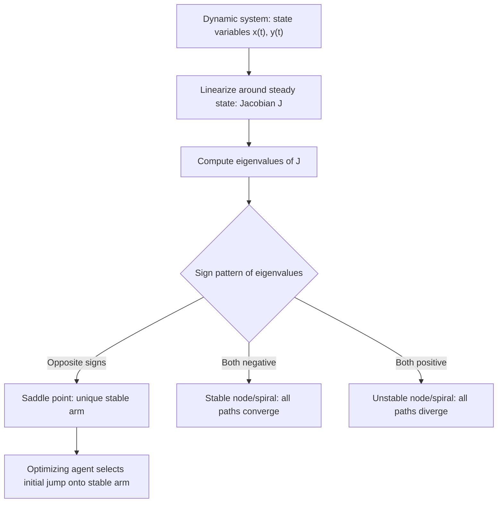

## Difference and Differential Equations

### Overview and Role in Financial Economics

Difference equations model dynamics in discrete time (period-to-period asset pricing, overlapping generations models, discrete-time consumption paths), while differential equations model dynamics in continuous time (option pricing PDEs, continuous-time portfolio choice, interest rate models). Both describe how a state variable evolves and are foundational for solving dynamic economic and financial models — from simple loan amortization to stochastic asset pricing.

### Part I: Difference Equations

#### Definition and Classification

A difference equation relates the value of a variable at time $t$ to its values at previous periods:

$$y_t = f(y_{t-1}, y_{t-2}, \dots, y_{t-n}, t)$$

**Order:** determined by the number of lags (an $n$th-order equation involves $y_{t-n}$).

**Linearity:** an equation is linear if $y_t$ and its lags appear only to the first power with no products between them.

**Homogeneity:** homogeneous if there is no constant/forcing term independent of $y$; nonhomogeneous otherwise.

#### First-Order Linear Difference Equations

The general first-order linear form:

$$y_t = a y_{t-1} + b$$

**Solution method:** find the particular solution (steady state) $y^*$ where $y^* = ay^* + b$, giving:

$$y^* = \frac{b}{1-a}, \quad a \ne 1$$

The general solution is the particular solution plus the homogeneous solution:

$$y_t = (y_0 - y^*)a^t + y^*$$

#### Stability Analysis

The qualitative behavior depends entirely on $a$:

| Value of $a$ | Behavior |
| --- | --- |
| $\|a\| < 1$ | Converges monotonically (if $0<a<1$) or with oscillating decay (if $-1<a<0$) to $y^*$ |
| $\|a\| > 1$ | Diverges from $y^*$ |
| $a = 1$ | No steady state (or a continuum, if $b=0$); $y_t$ grows linearly if $b \ne 0$ |
| $a = -1$ | Perpetual two-period oscillation, no convergence |

**Example: Loan Amortization**

A loan balance $y_t$ evolves as $y_t = (1+r)y_{t-1} - P$, where $r$ is the interest rate and $P$ is the fixed payment. Here $a = 1+r > 1$ and $b = -P$. The steady state is $y^* = \frac{-P}{1-(1+r)} = \frac{P}{r}$. Since $a>1$, the balance diverges from $y^*$ unless $y_0 = y^*$ exactly — meaning if the payment $P$ is set so the loan fully amortizes over $N$ periods, the path is a controlled divergence hitting zero exactly at maturity, not a convergence to a steady state.

#### Second-Order Linear Difference Equations

$$y_t = a_1 y_{t-1} + a_2 y_{t-2} + b$$

The homogeneous solution is found via the **characteristic equation**:

$$\lambda^2 - a_1\lambda - a_2 = 0$$

Solving gives roots $\lambda_1, \lambda_2$:

$$\lambda_{1,2} = \frac{a_1 \pm \sqrt{a_1^2 + 4a_2}}{2}$$

**Case 1 — Real distinct roots** ($a_1^2 + 4a_2 > 0$):

$$y_t = A_1\lambda_1^t + A_2\lambda_2^t + y^*$$

**Case 2 — Repeated roots** ($a_1^2 + 4a_2 = 0$):

$$y_t = (A_1 + A_2t)\lambda^t + y^*$$

**Case 3 — Complex roots** ($a_1^2 + 4a_2 < 0$), giving oscillatory (cyclical) behavior:

$$y_t = R^t(A_1\cos(\theta t) + A_2\sin(\theta t)) + y^*$$

where $R = \sqrt{-a_2}$ is the modulus and $\theta = \arctan\left(\frac{\sqrt{-(a_1^2+4a_2)}}{a_1}\right)$ determines the cycle frequency.

Stability requires $|\lambda_1| < 1$ and $|\lambda_2| < 1$ (or, for complex roots, $R < 1$).

### Part II: Differential Equations

#### First-Order Linear ODEs

$$\dot{y}(t) = ay(t) + b, \quad \dot y \equiv \frac{dy}{dt}$$

Steady state: $y^* = -b/a$ (for $a \ne 0$). General solution:

$$y(t) = (y_0 - y^*)e^{at} + y^*$$

**Stability:** converges to $y^*$ if $a < 0$; diverges if $a > 0$. This is the continuous-time analogue of $|a|<1$ in the discrete case — the sign of $a$ plays the role that the magnitude of the discrete multiplier plays.

**Example: Continuous Compounding and Present Value**

The value of an asset growing at instantaneous rate $r$ satisfies $\dot{V}(t) = rV(t)$, solved by $V(t) = V_0e^{rt}$. This is the building block for continuous-time discounting: $PV = V_T e^{-rT}$.

#### Second-Order Linear ODEs

$$\ddot y + a_1\dot y + a_2 y = b$$

Characteristic equation: $\lambda^2 + a_1\lambda + a_2 = 0$, giving roots analogous to the discrete case, but stability now depends on the **sign of the real part**:

- Real distinct roots: $y(t) = A_1e^{\lambda_1t} + A_2e^{\lambda_2t} + y^*$ — stable iff both roots are negative.
- Complex roots $\lambda = h \pm vi$: $y(t) = e^{ht}(A_1\cos(vt) + A_2\sin(vt)) + y^*$ — oscillatory, stable iff $h<0$ (damped oscillation), unstable if $h>0$ (explosive oscillation), sustained cycles if $h=0$.

#### Systems of Differential Equations and Phase Diagrams

Many financial economic models (e.g., the Ramsey-Cass-Koopmans growth model, continuous-time portfolio-consumption problems) reduce to a system:

$$\dot x = f(x, y), \quad \dot y = g(x,y)$$

**Phase diagram analysis** classifies the steady state $(x^*, y^*)$ by the eigenvalues of the linearized Jacobian:

$$J = \begin{pmatrix} \partial f/\partial x & \partial f/\partial y \\ \partial g/\partial x & \partial g/\partial y \end{pmatrix}$$

| Eigenvalue pattern | Steady-state classification |
| --- | --- |
| Both real, same sign, negative | Stable node |
| Both real, same sign, positive | Unstable node |
| Real, opposite signs | Saddle point |
| Complex, negative real part | Stable spiral |
| Complex, positive real part | Unstable spiral |
| Purely imaginary | Center (closed orbits) |

**Saddle-path stability** is the central concept in most optimal growth and consumption-investment models: the system has one stable and one unstable eigenvalue direction, and optimizing agents select initial conditions that place the system exactly on the stable manifold (the "saddle path"), ruling out both explosive and non-optimal trajectories.

#### Diagram: Phase Plane with a Saddle Path

<svg xmlns="http://www.w3.org/2000/svg" viewBox="0 0 500 420">
<text x="250" y="25" font-size="16" text-anchor="middle" font-family="sans-serif" font-weight="bold">Saddle-Path Stability (svg_diagram)</text>
<line x1="50" y1="370" x2="470" y2="370" stroke="black" stroke-width="1.5" />
<line x1="50" y1="370" x2="50" y2="60" stroke="black" stroke-width="1.5" />
<text x="480" y="375" font-size="13" font-family="sans-serif">x (capital)</text>
<text x="20" y="55" font-size="13" font-family="sans-serif">y (consumption)</text>
<path d="M 90 340 Q 260 220 440 100" fill="none" stroke="#d62728" stroke-width="2" />
<text x="330" y="115" font-size="11" fill="#d62728" font-family="sans-serif">x-dot = 0 locus</text>
<path d="M 260 350 L 260 90" fill="none" stroke="#1f77b4" stroke-width="2" />
<text x="265" y="80" font-size="11" fill="#1f77b4" font-family="sans-serif">y-dot = 0 locus</text>
<circle cx="260" cy="215" r="5" fill="black" />
<text x="270" y="210" font-size="12" font-family="sans-serif" font-weight="bold">Steady state</text>
<path d="M 120 320 Q 190 265 260 215" fill="none" stroke="green" stroke-width="2" marker-end="url(#arrowg1)" />
<path d="M 400 130 Q 330 170 260 215" fill="none" stroke="green" stroke-width="2" marker-end="url(#arrowg2)" />
<text x="90" y="335" font-size="11" fill="green" font-family="sans-serif">stable arm</text>
<path d="M 150 200 Q 200 150 260 215" fill="none" stroke="purple" stroke-width="1.5" stroke-dasharray="4,2" marker-end="url(#arrowp)" />
<path d="M 380 260 Q 320 235 260 215" fill="none" stroke="purple" stroke-width="1.5" stroke-dasharray="4,2" marker-end="url(#arrowp2)" />
<text x="330" y="270" font-size="11" fill="purple" font-family="sans-serif">unstable arm</text>
</svg>

### Discrete vs. Continuous Time: A Comparative Summary

| Feature | Difference Equations | Differential Equations |
| --- | --- | --- |
| Time domain | Discrete ($t = 0,1,2,\dots$) | Continuous ($t \in \mathbb{R}_+$) |
| Basic operator | Lag/forward shift | Derivative $d/dt$ |
| Stability criterion (1st order) | $\|a\| < 1$ | $a < 0$ |
| Characteristic roots | Powers $\lambda^t$ | Exponentials $e^{\lambda t}$ |
| Typical financial use | Discrete-time asset pricing, OLG models, binomial trees | Black-Scholes PDE, continuous-time consumption/portfolio choice, interest rate models (Vasicek, CIR) |

### Applications in Financial Economics

- **Discrete-time asset pricing recursions**: $P_t = \frac{E_t[P_{t+1} + D_{t+1}]}{1+r}$, solved forward to derive present-value pricing formulas and the transversality condition ruling out rational bubbles
- **Binomial option pricing models**, which are difference equations in the underlying asset's price lattice
- **The Solow and Ramsey growth models**, using both discrete-time (Solow) and continuous-time (Ramsey) capital accumulation equations
- **The Black-Scholes-Merton PDE**, a second-order linear parabolic partial differential equation
- **Term structure models** (Vasicek, CIR) specified as continuous-time SDEs for the short rate, whose deterministic (drift-only) skeleton is an ODE of the type covered here
- **Overlapping generations (OLG) models**, which rely heavily on first- and second-order difference equations to characterize equilibrium dynamics and dynamic (in)efficiency

**Related Topics**

- Stochastic differential equations (SDEs) and Itô calculus
- The Black-Scholes-Merton partial differential equation
- Dynamic programming and the Bellman equation
- Pontryagin's Maximum Principle
- Eigenvalues, eigenvectors, and matrix diagonalization
- Rational expectations and forward-solving asset pricing models
- Transversality conditions and no-bubble conditions
- Phase diagram analysis in continuous-time growth models (Solow, Ramsey-Cass-Koopmans)