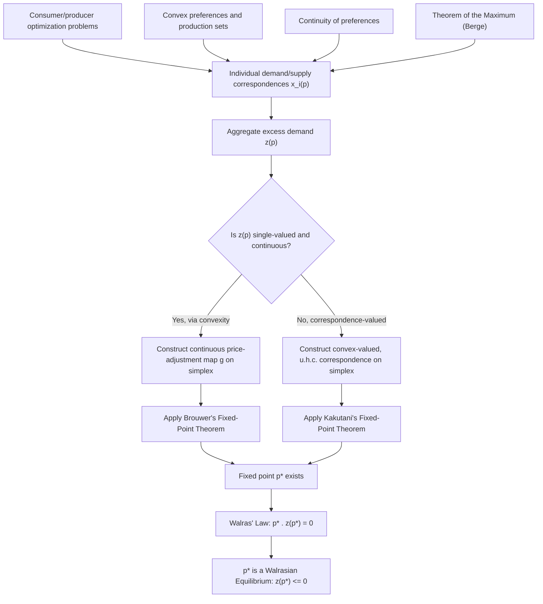

## Fixed-Point Theorems and Equilibrium Existence

### Overview

A fixed point of a function $f: X \to X$ is a point $x^* \in X$ such that $f(x^*) = x^*$. Fixed-point theorems provide sufficient conditions under which a fixed point is guaranteed to exist. In financial economics, equilibrium concepts — a price vector that clears all markets, a Nash equilibrium of a strategic interaction, a rational-expectations fixed point in an asset pricing model — are almost always formalized as fixed points of some mapping (an excess demand function, a best-response correspondence, a pricing operator). Fixed-point theorems are therefore the primary mathematical tool used to prove that such equilibria exist at all, prior to any question of uniqueness or computation.

### The Contraction Mapping Theorem (Banach Fixed-Point Theorem)

**Statement**

Let $(X, d)$ be a complete metric space, and let $T: X \to X$ be a contraction mapping — meaning there exists $\beta \in [0,1)$ such that:

$$d(T(x), T(y)) \leq \beta \, d(x,y) \quad \text{for all } x, y \in X$$

Then:

1. $T$ has a unique fixed point $x^* \in X$ with $T(x^*) = x^*$.
2. For any starting point $x_0 \in X$, the iterative sequence $x_{n+1} = T(x_n)$ converges to $x^*$.
3. The convergence rate is geometric: $d(x_n, x^*) \leq \beta^n d(x_0, x^*)$.

**Key Points**

- This is the only major fixed-point theorem that guarantees **uniqueness** in addition to existence, and it comes with a constructive algorithm (iterate $T$) and an explicit convergence rate.
- Completeness of the metric space is essential — a contraction on an incomplete space need not have a fixed point (e.g., $T(x) = x/2$ on $(0,1]$ has no fixed point in that space, though it is a contraction, because the "limit point" 0 is missing from the space).
- Contraction mapping is a *sufficient*, not necessary, condition — many non-contraction mappings still have fixed points via other theorems below.

**Application: Dynamic Programming and Bellman Equations**

The Bellman equation in dynamic programming (used throughout consumption-savings, asset pricing, and optimal growth models) has the form:

$$V(x) = \max_{a \in A(x)} \left\{ u(x,a) + \beta \, \mathbb{E}[V(x')] \right\}$$

Define the Bellman operator $(TV)(x) = \max_{a} \{u(x,a) + \beta \mathbb{E}[V(x')]\}$. Under standard conditions (bounded, continuous $u$, and discount factor $\beta \in (0,1)$), the Bellman operator is a contraction mapping on the space of bounded continuous functions under the sup norm (this follows from **Blackwell's sufficient conditions**: monotonicity and discounting). By the Contraction Mapping Theorem, a unique value function $V^*$ exists satisfying the Bellman equation, and value function iteration ($V_{n+1} = TV_n$) converges to it from any bounded starting guess $V_0$.

**Example**

Consider a simplified consumption problem $V(w) = \max_c \{u(c) + \beta V(w')\}$ with $w' = (w-c)R$. If $u$ is bounded and continuous and $\beta R < 1$ in the relevant sense (or more generally $\beta \in (0,1)$ under Blackwell's conditions with a bounded return function), the Bellman operator is a contraction with modulus $\beta$. Starting from any initial guess $V_0 = 0$, iterating $V_{n+1} = TV_n$ converges geometrically to the true value function $V^*$, with error shrinking by a factor of $\beta$ each iteration — the practical basis of the value function iteration algorithm used computationally in quantitative macro-finance.

### Brouwer's Fixed-Point Theorem

**Statement**

Let $S \subseteq \mathbb{R}^n$ be a nonempty, compact, and convex set, and let $f: S \to S$ be a continuous function. Then $f$ has at least one fixed point $x^* \in S$ such that $f(x^*) = x^*$.

**Key Points**

- Unlike the Contraction Mapping Theorem, Brouwer's theorem guarantees existence only — not uniqueness, and no constructive algorithm or convergence rate is provided.
- All three hypotheses are necessary: compactness, convexity, and continuity. Standard counterexamples: $f(x) = x+1$ on $\mathbb{R}$ (not compact, no fixed point); $f(x) = -x$ on an annulus (not convex domain, e.g., a rotation on a ring-shaped set can have no fixed point); a discontinuous function that "jumps over" the diagonal $f(x)=x$ can fail to intersect it.
- The one-dimensional case $S = [a,b]$ reduces to the Intermediate Value Theorem: a continuous $f:[a,b]\to[a,b]$ must cross the 45-degree line $y=x$ somewhere in $[a,b]$.

**Application: Existence of Nash Equilibrium**

In a finite strategic-form game with players $i=1,\ldots,n$, each choosing a mixed strategy $\sigma_i$ over their action space, define the best-response correspondence and consider Nash's construction of a single-valued map (via the Gale-Nikaido or Nash's original approach using a continuous function built from the best-response correspondence). Nash (1950, 1951) showed that the joint strategy space (a product of simplices, which is compact and convex) admits a continuous map whose fixed points correspond exactly to Nash equilibria. Applying Brouwer's theorem (or its correspondence generalization, Kakutani's theorem, in Nash's more commonly cited proof) establishes that every finite game has at least one Nash equilibrium in mixed strategies.

### Kakutani's Fixed-Point Theorem

**Statement**

Let $S \subseteq \mathbb{R}^n$ be nonempty, compact, and convex. Let $\varphi: S \twoheadrightarrow S$ be a correspondence (set-valued map) such that:

1. $\varphi(x)$ is nonempty and convex for every $x \in S$.
2. $\varphi$ has a **closed graph** (equivalently, is upper hemicontinuous, given the compactness of $S$).

Then $\varphi$ has a fixed point: there exists $x^* \in S$ such that $x^* \in \varphi(x^*)$.

**Key Points**

- Kakutani's theorem generalizes Brouwer's theorem from single-valued continuous functions to set-valued (correspondence) mappings, which is essential in economics because best-response and demand correspondences are frequently set-valued (an agent may be indifferent among multiple optimal choices).
- Convex-valuedness of $\varphi(x)$ at every point is what typically requires convex preferences/production sets in the underlying economic model — this is the direct link between the convexity assumptions in consumer/producer theory and equilibrium existence.
- Upper hemicontinuity (closed graph) is the correspondence analogue of continuity, and is what is typically verified via the **Theorem of the Maximum** (Berge's theorem) when $\varphi$ is derived as an argmax correspondence from an optimization problem with continuous objective and continuous, compact-valued constraint correspondence.

### Existence of Walrasian (Competitive) Equilibrium

**Setup**

Consider a pure exchange economy with $n$ goods, $m$ consumers, each with an initial endowment $\omega_i \in \mathbb{R}^n_+$ and preferences represented by a continuous, locally non-satiated utility function $u_i$. Given a price vector $p \in \mathbb{R}^n_+$, each consumer solves:

$$\max_{x_i} u_i(x_i) \quad \text{s.t.} \quad p \cdot x_i \leq p \cdot \omega_i$$

yielding individual demand $x_i(p)$, and aggregate excess demand:

$$z(p) = \sum_{i=1}^m \left[x_i(p) - \omega_i\right]$$

A Walrasian equilibrium is a price vector $p^*$ such that $z(p^*) \leq 0$ (with equality for goods with positive price).

**Properties of Excess Demand Used in the Proof**

1. **Continuity** of $z(p)$ (follows from continuity of preferences and the Theorem of the Maximum).
2. **Homogeneity of degree zero**: $z(\lambda p) = z(p)$ for $\lambda > 0$ (demand depends only on relative prices), which allows normalizing prices to the unit simplex $\Delta = \{p \in \mathbb{R}^n_+ : \sum p_k = 1\}$ — a compact, convex set, satisfying the domain requirements of Brouwer/Kakutani.
3. **Walras' Law**: $p \cdot z(p) = 0$ for all $p$ (aggregate budget constraints imply the value of excess demand is always zero).
4. **Boundary behavior**: as $p$ approaches the boundary of the simplex (some price $\to 0$), excess demand for that good tends to become unbounded (under standard assumptions), which is used to rule out equilibria at the boundary.

**Proof Sketch via Brouwer's Theorem**

Define a price-adjustment map $g: \Delta \to \Delta$ (e.g., $g_k(p) = \dfrac{p_k + \max(0, z_k(p))}{1 + \sum_j \max(0, z_j(p))}$), which is continuous and maps the compact, convex simplex into itself. By Brouwer's theorem, $g$ has a fixed point $p^*$. It is then shown (using Walras' Law) that any fixed point of $g$ must satisfy $z(p^*) \leq 0$, i.e., $p^*$ is a Walrasian equilibrium.

**Key Points**

- The **convexity of preferences** (ensuring convex, single-valued or convex-valued demand) is what permits working with a continuous function $g$ (Brouwer) rather than a correspondence; without convex preferences, demand may not be convex-valued, requiring Kakutani's theorem instead.
- **Local non-satiation** is what delivers Walras' Law, which is the key algebraic property tying the fixed point of the adjustment map back to market clearing.
- This result (existence of competitive equilibrium under convexity, continuity, and local non-satiation) is due to Arrow and Debreu (1954) and McKenzie (1954), building on Wald's earlier, more restrictive existence results.

### The Shapley-Folkman Lemma and Non-Convex Economies

When individual consumption or production sets are **not convex** (e.g., due to indivisibilities or fixed costs), the standard fixed-point argument above does not directly apply, since Kakutani's theorem requires convex-valued correspondences. The **Shapley-Folkman lemma** provides a partial remedy: it bounds how far the *sum* (aggregate) of a large number of non-convex sets can deviate from its convex hull, with the bound independent of the number of sets being summed.

**Key Points**

- [Inference] The practical implication commonly drawn from this result is that in economies with a large number of agents, aggregate excess demand behaves *as if* it were derived from convex preferences even if individual preferences are not convex, because individual non-convexities "average out" — allowing approximate equilibrium existence results even without individual convexity.
- This result explains why convexity assumptions, though individually restrictive (ruling out increasing returns, indivisible goods), are considered a reasonable approximation for economies with many small agents relative to the size of the market.

### Comparison of the Three Major Fixed-Point Theorems

| Theorem | Domain requirement | Map type | Existence | Uniqueness | Constructive? |
| --- | --- | --- | --- | --- | --- |
| Banach (Contraction) | Complete metric space | Single-valued, contraction | Yes | Yes | Yes (iteration converges) |
| Brouwer | Compact, convex $S \subseteq \mathbb{R}^n$ | Single-valued, continuous | Yes | No | No |
| Kakutani | Compact, convex $S \subseteq \mathbb{R}^n$ | Convex-valued correspondence, closed graph (u.h.c.) | Yes | No | No |

**Key Points**

- Moving down the table relaxes the map requirement (from contraction, to continuous function, to correspondence) but loses uniqueness and constructiveness.
- In applied economic modeling, Banach's theorem is preferred whenever applicable (e.g., dynamic programming) precisely because it yields a unique answer and a computational algorithm; Brouwer/Kakutani are reserved for existence-only questions (static equilibrium, game-theoretic equilibrium) where the underlying map is not naturally a contraction.

### Illustrative Diagram: Fixed Point of a Function on [0,1]

The following diagram (svg_diagram) illustrates the one-dimensional case of Brouwer's theorem: a continuous function mapping $[0,1]$ into itself must cross the 45-degree line.

<svg xmlns="http://www.w3.org/2000/svg" viewBox="0 0 500 500" font-family="Helvetica, Arial, sans-serif">
<text x="250" y="28" font-size="16" font-weight="bold" text-anchor="middle" fill="#1a1a1a">Fixed Point on [0,1] (svg_diagram)</text>
<line x1="70" y1="440" x2="440" y2="440" stroke="#333" stroke-width="1.5" />
<line x1="70" y1="440" x2="70" y2="70" stroke="#333" stroke-width="1.5" />
<text x="445" y="444" font-size="12" fill="#333">x</text>
<text x="55" y="65" font-size="12" fill="#333">f(x)</text>

<text x="65" y="455" font-size="11" text-anchor="middle" fill="#333">0</text>

<text x="435" y="455" font-size="11" text-anchor="middle" fill="#333">1</text>

<text x="55" y="444" font-size="11" text-anchor="middle" fill="#333">0</text>

<text x="55" y="75" font-size="11" text-anchor="middle" fill="#333">1</text>

<line x1="70" y1="440" x2="440" y2="70" stroke="#999" stroke-width="1.5" stroke-dasharray="5,4" />
<text x="380" y="105" font-size="11" fill="#666">y = x</text>

<path d="M 70 380 C 150 250, 220 130, 280 220 S 400 340, 440 200" stroke="#2563eb" stroke-width="2.5" fill="none" />
<text x="300" y="180" font-size="11" fill="#2563eb">f(x)</text>

<circle cx="150" cy="316" r="4.5" fill="#dc2626" />
<circle cx="330" cy="270" r="4.5" fill="#dc2626" />
<text x="150" y="335" font-size="10" fill="#dc2626" text-anchor="middle">x₁*</text>
<text x="330" y="255" font-size="10" fill="#dc2626" text-anchor="middle">x₂*</text>

<text x="250" y="480" font-size="11" text-anchor="middle" fill="#333">f continuous on [0,1] into [0,1] ⟹ f(x*) = x* for some x*</text>

</svg>

### Illustrative Diagram: From Individual Optimization to Equilibrium Existence

### Related Topics

- Value function iteration and Blackwell's sufficient conditions for a contraction
- Theorem of the Maximum (Berge's Theorem) and upper/lower hemicontinuity of correspondences
- Nash equilibrium existence and computation (Lemke-Howson algorithm)
- Arrow-Debreu general equilibrium model and welfare theorems
- Walras' Law and homogeneity of degree zero in demand functions
- Uniqueness of equilibrium: gross substitutes and the weak axiom of revealed preference
- Sperner's Lemma as a combinatorial proof technique underlying Brouwer's theorem
- Tarski's fixed-point theorem for monotone maps on lattices (supermodular games)
- Rational expectations equilibrium as a fixed point of a belief-updating operator
- Computable general equilibrium (CGE) modeling and numerical fixed-point algorithms (e.g., Scarf's algorithm)