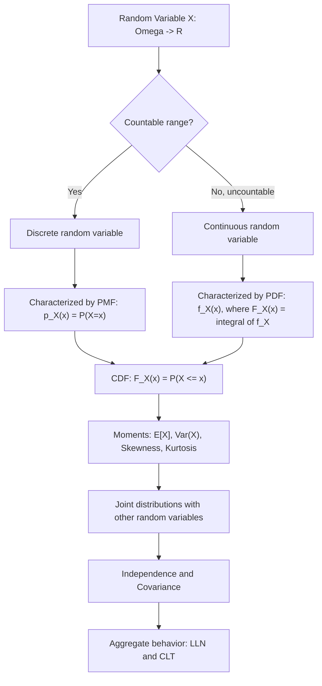

## Probability Spaces and Random Variables

### The Probability Space Triple $(\Omega, \mathcal{F}, P)$

A probability space is formally defined as a triple $(\Omega, \mathcal{F}, P)$, providing the rigorous foundation on which all of probability theory — and by extension, stochastic finance — is built.

**Sample Space $\Omega$**

The set of all possible outcomes of a random experiment. In finance, $\Omega$ might represent all possible paths a stock price could take over $[0,T]$, or all possible states of the economy at a future date.

**Event Space (Sigma-Algebra) $\mathcal{F}$**

A collection of subsets of $\Omega$ (called "events") satisfying:

1. $\Omega \in \mathcal{F}$ (the whole sample space is an event).
2. If $A \in \mathcal{F}$, then $A^c \in \mathcal{F}$ (closed under complementation).
3. If $A_1, A_2, \ldots \in \mathcal{F}$, then $\bigcup_{i=1}^\infty A_i \in \mathcal{F}$ (closed under countable unions).

These three properties (together with De Morgan's laws) imply $\mathcal{F}$ is also closed under countable intersections and contains the empty set $\emptyset$. $\mathcal{F}$ represents the collection of all events to which a probability can meaningfully be assigned.

**Probability Measure $P$**

A function $P: \mathcal{F} \to [0,1]$ satisfying the **Kolmogorov axioms**:

1. $P(\Omega) = 1$.
2. $P(A) \geq 0$ for all $A \in \mathcal{F}$.
3. **Countable additivity**: for any sequence of pairwise disjoint events $A_1, A_2, \ldots \in \mathcal{F}$, $P\left(\bigcup_{i=1}^\infty A_i\right) = \sum_{i=1}^\infty P(A_i)$.

**Key Points**

- Why a sigma-algebra is needed rather than simply assigning probabilities to all subsets of $\Omega$: for uncountable sample spaces (e.g., $\Omega = \mathbb{R}$), it is not generally possible to construct a countably additive probability measure defined on the power set of all subsets. The sigma-algebra restricts attention to a well-behaved collection of "measurable" sets for which probabilities can be consistently defined.
- The **Borel sigma-algebra** $\mathcal{B}(\mathbb{R})$, generated by all open intervals of $\mathbb{R}$, is the standard sigma-algebra used for real-valued random variables and underlies virtually all continuous financial models.
- In dynamic (multi-period or continuous-time) settings, the sigma-algebra is often indexed by time as a **filtration** $\{\mathcal{F}_t\}_{t \geq 0}$, an increasing family of sigma-algebras representing the information available at each time $t$ — the mathematical formalization of "what is known so far" and the basis for defining adapted stochastic processes and martingales.

**Example**

A single coin flip: $\Omega = \{H, T\}$. The sigma-algebra $\mathcal{F} = \{\emptyset, \{H\}, \{T\}, \Omega\}$ (the power set, since $\Omega$ is finite here). A fair-coin probability measure assigns $P(\{H\}) = P(\{T\}) = 0.5$, and by additivity $P(\Omega) = P(\{H\}) + P(\{T\}) = 1$, consistent with axiom 1.

### Random Variables

**Formal Definition**

A random variable is a function $X: \Omega \to \mathbb{R}$ such that for every Borel set $B \in \mathcal{B}(\mathbb{R})$, the preimage $X^{-1}(B) = \{\omega \in \Omega : X(\omega) \in B\}$ belongs to $\mathcal{F}$. This property is called **measurability**: it ensures that events defined in terms of $X$ (e.g., "$X \leq x$") are genuine events in $\mathcal{F}$, to which the probability measure $P$ can be applied.

**Key Points**

- A random variable is not "random" in an informal sense — it is a deterministic function of the underlying outcome $\omega$; the randomness comes entirely from the probability measure $P$ governing which $\omega$ occurs.
- Measurability with respect to $\mathcal{F}$ is what allows statements like $P(X \leq x) := P(\{\omega : X(\omega) \leq x\})$ to be well-defined, since the set $\{\omega : X(\omega) \leq x\}$ must be an element of $\mathcal{F}$ for $P$ to apply to it.
- In finance, "$X$ is $\mathcal{F}_t$-measurable" is standard shorthand for "the value of $X$ is known/determined given the information available at time $t$" — a central concept in defining adapted processes and non-anticipating trading strategies.

### Distribution Functions

**Cumulative Distribution Function (CDF)**

$$F_X(x) = P(X \leq x)$$

**Key Points**

- $F_X$ is non-decreasing, right-continuous, with $\lim_{x\to -\infty} F_X(x) = 0$ and $\lim_{x\to\infty} F_X(x) = 1$.
- Any function satisfying these properties corresponds to a valid distribution, and conversely, every random variable has a well-defined CDF — the CDF fully characterizes the probabilistic behavior of $X$.

**Discrete Random Variables**

$X$ is discrete if it takes values in a countable set $\{x_1, x_2, \ldots\}$. Its distribution is characterized by a **probability mass function (PMF)**:

$$p_X(x_i) = P(X = x_i), \quad \sum_i p_X(x_i) = 1$$

**Continuous Random Variables**

$X$ is (absolutely) continuous if there exists a **probability density function (PDF)** $f_X(x) \geq 0$ such that:

$$F_X(x) = \int_{-\infty}^{x} f_X(t)\, dt, \qquad \int_{-\infty}^{\infty} f_X(t)\, dt = 1$$

For continuous $X$, $P(X = x) = 0$ for any single point $x$; probabilities are only meaningfully assigned to intervals: $P(a \leq X \leq b) = \int_a^b f_X(t)\,dt$.

**Example**

The standard normal distribution, central to the Black-Scholes framework and much of classical finance theory, has PDF:

$$f_X(x) = \frac{1}{\sqrt{2\pi}} e^{-x^2/2}$$

with CDF denoted $\Phi(x) = \int_{-\infty}^x f_X(t)\,dt$, which has no closed-form elementary expression and is evaluated numerically or via tabulated/approximated values — this is precisely the $\Phi(\cdot)$ appearing in the Black-Scholes option pricing formula.

### Moments: Expectation, Variance, and Beyond

**Expectation**

For a discrete random variable: $\mathbb{E}[X] = \sum_i x_i \, p_X(x_i)$.

For a continuous random variable: $\mathbb{E}[X] = \int_{-\infty}^{\infty} x f_X(x)\, dx$.

More generally, for any measurable function $g$: $\mathbb{E}[g(X)] = \int g(x)\, dF_X(x)$ (a Riemann-Stieltjes / Lebesgue-Stieltjes integral unifying the discrete and continuous cases).

**Variance and Standard Deviation**

$$\text{Var}(X) = \mathbb{E}[(X - \mathbb{E}[X])^2] = \mathbb{E}[X^2] - (\mathbb{E}[X])^2, \qquad \sigma_X = \sqrt{\text{Var}(X)}$$

Variance (and its square root, standard deviation) is the standard measure of dispersion, and in finance is the foundational (though not the only) measure of risk used in mean-variance portfolio theory.

**Higher Moments: Skewness and Kurtosis**

$$\text{Skewness} = \mathbb{E}\left[\left(\frac{X-\mu}{\sigma}\right)^3\right], \qquad \text{Kurtosis} = \mathbb{E}\left[\left(\frac{X-\mu}{\sigma}\right)^4\right]$$

**Key Points**

- Skewness measures asymmetry: positive skewness indicates a longer right tail, negative skewness a longer left tail. Many asset return distributions exhibit negative skewness (large losses are more extreme than large gains).
- Kurtosis measures tail thickness relative to the normal distribution (which has kurtosis exactly 3; "excess kurtosis" is kurtosis minus 3). Financial returns are widely documented to exhibit excess kurtosis ("fat tails") relative to the normal distribution — large moves occur more often than a normal distribution would predict. [Inference] This empirical regularity is one of the primary motivations for using fat-tailed distributions (e.g., Student's t) or jump-diffusion models in place of the normal/lognormal assumption in more advanced asset pricing applications.

### Joint Distributions, Independence, and Covariance

**Joint Distribution**

For two random variables $X, Y$, the joint CDF is $F_{X,Y}(x,y) = P(X \leq x, Y \leq y)$, with an analogous joint PMF/PDF depending on whether $X, Y$ are discrete or continuous.

**Independence**

$X$ and $Y$ are independent if and only if:

$$F_{X,Y}(x,y) = F_X(x) \cdot F_Y(y) \quad \text{for all } x,y$$

equivalently (when densities exist), $f_{X,Y}(x,y) = f_X(x) f_Y(y)$.

**Covariance and Correlation**

$$\text{Cov}(X,Y) = \mathbb{E}[(X-\mu_X)(Y-\mu_Y)] = \mathbb{E}[XY] - \mathbb{E}[X]\mathbb{E}[Y]$$

$$\rho_{X,Y} = \frac{\text{Cov}(X,Y)}{\sigma_X \sigma_Y}, \qquad \rho_{X,Y} \in [-1, 1]$$

**Key Points**

- Independence implies zero covariance ($\text{Cov}(X,Y) = 0$), but the converse is not generally true — zero covariance only rules out *linear* dependence; $X$ and $Y$ can be nonlinearly dependent while having zero covariance (a standard counterexample: $X \sim N(0,1)$ and $Y = X^2$ have $\text{Cov}(X,Y)=0$ but are clearly dependent).
- Correlation $\rho$ is a normalized measure of *linear* association only; two variables can have $\rho = 0$ and still be strongly (nonlinearly) related, which is a key motivation for copula-based dependence modeling in portfolio risk applications where tail dependence matters more than linear correlation.
- For a portfolio of two assets with weights $w_1, w_2$, portfolio variance is $\text{Var}(w_1 X + w_2 Y) = w_1^2 \sigma_X^2 + w_2^2 \sigma_Y^2 + 2w_1 w_2 \,\text{Cov}(X,Y)$ — the direct link from the covariance concept to the diversification mathematics of Markowitz portfolio theory.

### Key Distributions Used in Finance

| Distribution | Type | Typical financial use |
| --- | --- | --- |
| Bernoulli / Binomial | Discrete | Default/no-default events; binomial option pricing trees |
| Poisson | Discrete | Jump arrival counts in jump-diffusion models; credit event counting |
| Uniform | Continuous | Simulation input (generating other distributions via inverse transform) |
| Normal (Gaussian) | Continuous | Log-returns in Black-Scholes/GBM; CLT-based approximations |
| Lognormal | Continuous | Asset prices under GBM (since $\ln S_T$ is normal) |
| Student's t | Continuous | Fat-tailed return modeling; small-sample statistical inference |
| Exponential | Continuous | Time-to-default / time-to-event modeling (constant hazard rate) |

### Convergence Concepts: Law of Large Numbers and Central Limit Theorem

**Law of Large Numbers (LLN)**

For i.i.d. random variables $X_1, \ldots, X_n$ with finite mean $\mu$, the sample average converges to the true mean:

$$\bar{X}_n = \frac{1}{n}\sum_{i=1}^n X_i \xrightarrow{P} \mu \quad \text{as } n \to \infty$$

This is the theoretical justification for Monte Carlo simulation: averaging many simulated payoffs converges to the true expected payoff.

**Central Limit Theorem (CLT)**

For i.i.d. random variables with finite mean $\mu$ and finite variance $\sigma^2$:

$$\sqrt{n}\left(\bar{X}_n - \mu\right) \xrightarrow{d} N(0, \sigma^2)$$

**Key Points**

- The CLT explains why normal approximations are pervasive in statistics and finance even when underlying individual shocks are not normally distributed — sums (or averages) of many small, independent shocks tend toward normality regardless of the shocks' original distribution (subject to finite variance).
- The CLT is also the theoretical basis for the standard error formula ($\sigma/\sqrt{n}$) used to quantify the precision of Monte Carlo estimates.
- The CLT requires finite variance; for heavy-tailed distributions with infinite variance (e.g., certain Lévy-stable distributions sometimes proposed for extreme financial returns), the classical CLT does not apply, and different (stable) limiting distributions arise instead.

### Illustrative Diagram: Structure of a Probability Space and Random Variable

The following diagram (svg_diagram) shows how a random variable maps outcomes in the sample space through the sigma-algebra structure into real-valued, measurable output.

<svg xmlns="http://www.w3.org/2000/svg" viewBox="0 0 760 400" font-family="Helvetica, Arial, sans-serif">
<text x="380" y="26" font-size="16" font-weight="bold" text-anchor="middle" fill="#1a1a1a">Probability Space to Random Variable (svg_diagram)</text>

<ellipse cx="150" cy="210" rx="110" ry="140" fill="#f1f5f9" stroke="#334155" stroke-width="2" />
<text x="150" y="90" font-size="13" font-weight="bold" text-anchor="middle" fill="#1a1a1a">Sample Space Ω</text>
<circle cx="110" cy="160" r="4" fill="#111" />
<circle cx="170" cy="140" r="4" fill="#111" />
<circle cx="130" cy="220" r="4" fill="#dc2626" />
<circle cx="190" cy="260" r="4" fill="#111" />
<circle cx="100" cy="280" r="4" fill="#111" />
<text x="140" y="235" font-size="10" fill="#dc2626">ω</text>

<ellipse cx="140" cy="230" rx="45" ry="35" fill="none" stroke="#2563eb" stroke-width="1.5" stroke-dasharray="4,3" />
<text x="90" y="200" font-size="10" fill="#2563eb">Event A ∈ 𝓕</text>

<path d="M 270 210 L 420 210" stroke="#333" stroke-width="1.5" marker-end="url(#arrow)" />
<text x="345" y="195" font-size="12" fill="#333">X(ω)</text>
<line x1="450" y1="210" x2="720" y2="210" stroke="#333" stroke-width="1.5" />
<text x="720" y="205" font-size="11" fill="#333">ℝ</text>
<circle cx="600" cy="210" r="4.5" fill="#dc2626" />
<text x="600" y="230" font-size="10" text-anchor="middle" fill="#dc2626">x = X(ω)</text>

<line x1="560" y1="210" x2="650" y2="210" stroke="#16a34a" stroke-width="4" opacity="0.5" />
<text x="605" y="255" font-size="10" text-anchor="middle" fill="#16a34a">Borel set B</text>

<text x="150" y="380" font-size="10.5" text-anchor="middle" fill="#333">X measurable: X⁻¹(B) ∈ 𝓕 for every Borel set B</text>

</svg>

### Illustrative Diagram: Types of Random Variables and Their Characterizing Functions

### Related Topics

- Filtrations, adapted processes, and information structure over time
- Conditional expectation and the tower property
- Martingales and their role in risk-neutral pricing
- Change of measure and the Radon-Nikodym derivative (Girsanov's theorem)
- Characteristic functions and moment generating functions
- Copulas and modeling nonlinear/tail dependence between assets
- Stable distributions and heavy-tailed models for extreme returns
- Stochastic processes: Markov chains, Brownian motion, and Poisson processes
- Maximum likelihood estimation for fitting distributions to financial data
- Multivariate normal distribution and its role in factor models