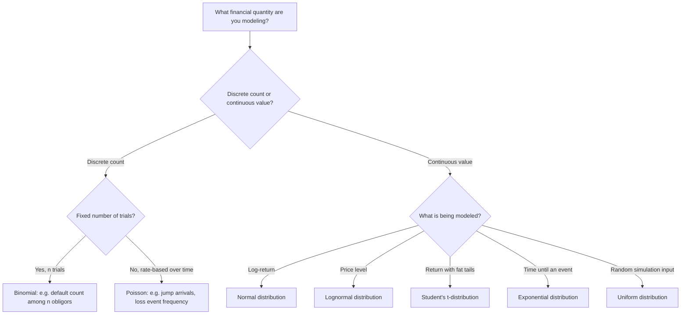

## Key Probability Distributions Used in Finance

### Overview

Financial models rely on a relatively small set of probability distributions, each chosen because its mathematical properties align with a specific empirical or theoretical feature of financial data: bounded outcomes for defaults, additive shocks for log-returns, fat tails for extreme moves, or waiting-time behavior for credit events. This section surveys the distributions most heavily used across asset pricing, risk management, and derivatives valuation, with their defining formulas, parameters, and the specific financial rationale for each.

### Bernoulli and Binomial Distributions

**Bernoulli Distribution**

Models a single trial with two outcomes (success/failure) with probability $p$ of success:

$$P(X=1) = p, \qquad P(X=0) = 1-p$$

$$\mathbb{E}[X] = p, \qquad \text{Var}(X) = p(1-p)$$

**Binomial Distribution**

The sum of $n$ independent Bernoulli($p$) trials, $X \sim \text{Binomial}(n,p)$:

$$P(X=k) = \binom{n}{k} p^k (1-p)^{n-k}, \quad k = 0,1,\ldots,n$$

$$\mathbb{E}[X] = np, \qquad \text{Var}(X) = np(1-p)$$

**Financial Applications**

- **Credit risk**: modeling the number of defaults among $n$ obligors, each defaulting independently with probability $p$ (the simplest form of portfolio credit risk model, before introducing default correlation).
- **Binomial option pricing (Cox-Ross-Rubinstein model)**: the underlying's price evolves as a sequence of up/down moves, each a Bernoulli trial under the risk-neutral probability $q$; the terminal price distribution after $n$ steps is binomial, and the model converges to the Black-Scholes continuous-time price as $n \to \infty$ (via a CLT-type argument).

**Key Points**

- $p$ often represents a risk-neutral probability (in option pricing) rather than a real-world (physical) probability — a critical distinction in financial applications of this distribution.
- The binomial distribution assumes **independent** trials with a **constant** success probability; correlated defaults (a key feature of real credit portfolios during systemic stress) require extensions such as factor-copula models.

### Poisson Distribution

Models the count of events occurring in a fixed interval, given a constant average rate $\lambda$:

$$P(X=k) = \frac{e^{-\lambda}\lambda^k}{k!}, \quad k=0,1,2,\ldots$$

$$\mathbb{E}[X] = \lambda, \qquad \text{Var}(X) = \lambda$$

**Financial Applications**

- **Jump-diffusion models** (e.g., the Merton jump-diffusion model): asset prices follow a diffusion process (Brownian motion) punctuated by discrete jumps, with the number of jumps in $[0,T]$ modeled as Poisson($\lambda T$). This captures sudden, discontinuous price moves (e.g., earnings surprises, macro shocks) that continuous diffusion alone cannot generate.
- **Credit risk (reduced-form/intensity models)**: default arrival is modeled as the first jump of a Poisson process with intensity (hazard rate) $\lambda$, giving $P(\text{no default by } T) = e^{-\lambda T}$.
- **Operational risk**: modeling the frequency of loss events (e.g., fraud, system failures) per period, often combined with a severity distribution in a compound Poisson framework.

**Key Points**

- The Poisson distribution is characterized by a single parameter $\lambda$ that equals both its mean and variance — a restrictive assumption (equidispersion) that real event-count data (e.g., default counts, which often show "overdispersion," i.e., variance exceeding the mean due to clustering) may not satisfy, motivating extensions like the negative binomial distribution.
- The **Poisson process** (the continuous-time stochastic process generating Poisson-distributed counts) has independent, stationary increments, an assumption that can break down during periods of contagion or clustering (e.g., default correlation spiking in a crisis).

### Uniform Distribution

$X \sim \text{Uniform}(a,b)$ has constant density on $[a,b]$:

$$f_X(x) = \frac{1}{b-a}, \quad a \leq x \leq b$$

$$\mathbb{E}[X] = \frac{a+b}{2}, \qquad \text{Var}(X) = \frac{(b-a)^2}{12}$$

**Financial Applications**

- Primarily a **simulation building block** rather than a model of financial variables directly: pseudo-random number generators produce Uniform(0,1) draws, which are then transformed (via the inverse CDF, or "inverse transform method") into draws from any target distribution (normal, exponential, etc.) needed for Monte Carlo pricing.
- Quasi-random (low-discrepancy) sequences used in quasi-Monte Carlo methods are also generated to approximate uniform coverage of $[0,1]^d$ more evenly than pseudo-random sampling.

### Normal (Gaussian) Distribution

$X \sim N(\mu, \sigma^2)$:

$$f_X(x) = \frac{1}{\sigma\sqrt{2\pi}} \exp\left[-\frac{(x-\mu)^2}{2\sigma^2}\right]$$

**Financial Applications**

- **Log-returns under Geometric Brownian Motion (GBM)**: the Black-Scholes framework assumes $\ln(S_T/S_0) \sim N\left[(\mu - \sigma^2/2)T, \, \sigma^2 T\right]$, making log-returns (not simple returns) normally distributed.
- **CAPM and factor models**: asset return residuals are frequently assumed (or approximated, via CLT-type reasoning) to be normally distributed for the purposes of hypothesis testing and confidence interval construction.
- **Value-at-Risk (parametric/variance-covariance method)**: assuming normally distributed portfolio returns allows VaR to be computed directly from the mean and standard deviation via the normal quantile.

**Key Points**

- The normal distribution is symmetric (zero skewness) and has kurtosis exactly 3; empirical financial returns are widely documented to exhibit negative skewness and excess kurtosis (fat tails), meaning the normal distribution systematically underestimates the probability of extreme moves. [Inference] This mismatch is one of the most commonly cited justifications in the finance literature for using the normal distribution primarily as an analytically tractable benchmark rather than as a literal description of empirical return behavior, especially at short (e.g., daily) frequencies.
- The **multivariate normal distribution** (a vector of jointly normal random variables, fully characterized by a mean vector and covariance matrix) is the foundation of Markowitz mean-variance portfolio theory, since it makes portfolio return variance in the standard quadratic form fully descriptive of risk when returns are jointly normal.

### Lognormal Distribution

If $Y = \ln X \sim N(\mu, \sigma^2)$, then $X$ is lognormally distributed, with density:

$$f_X(x) = \frac{1}{x\sigma\sqrt{2\pi}} \exp\left[-\frac{(\ln x - \mu)^2}{2\sigma^2}\right], \quad x > 0$$

$$\mathbb{E}[X] = e^{\mu + \sigma^2/2}, \qquad \text{Var}(X) = \left(e^{\sigma^2}-1\right)e^{2\mu+\sigma^2}$$

**Financial Applications**

- **Asset prices under GBM**: since log-returns are normal under GBM, the price level $S_T$ itself is lognormally distributed — this is the distributional assumption underlying the Black-Scholes closed-form option pricing formula.
- The lognormal distribution is strictly positive, correctly reflecting that limited-liability asset prices (e.g., stock prices) cannot go negative — an advantage over directly modeling prices as normal.

**Key Points**

- $\mathbb{E}[X] \neq e^{\mu}$; the expected price level under lognormality includes a variance-adjustment term ($e^{\sigma^2/2}$), a frequently emphasized point since naively exponentiating the expected log-return understates the expected price level (a manifestation of Jensen's inequality applied to the convex exponential function).

### Student's t-Distribution

With $\nu$ degrees of freedom, the standardized t-distribution has density:

$$f_X(x) = \frac{\Gamma\left(\frac{\nu+1}{2}\right)}{\sqrt{\nu\pi}\,\Gamma\left(\frac{\nu}{2}\right)} \left(1 + \frac{x^2}{\nu}\right)^{-\frac{\nu+1}{2}}$$

with mean $0$ (for $\nu > 1$) and variance $\dfrac{\nu}{\nu-2}$ (for $\nu > 2$).

**Financial Applications**

- **Fat-tailed return modeling**: the t-distribution has heavier tails than the normal distribution (controlled by $\nu$; smaller $\nu$ means heavier tails), making it a common practical substitute for modeling asset returns that exhibit excess kurtosis. As $\nu \to \infty$, the t-distribution converges to the standard normal.
- **Small-sample statistical inference**: used in constructing confidence intervals and hypothesis tests for the mean of a normal population when the variance is estimated from the sample (classical econometric application, e.g., testing whether an estimated CAPM alpha is significantly different from zero in a small sample).
- **Value-at-Risk and Expected Shortfall**: t-distributed models produce higher (more conservative) tail-risk estimates than normal-distribution models for the same estimated mean and variance, better matching the empirically observed frequency of extreme losses.

### Exponential Distribution

$X \sim \text{Exponential}(\lambda)$:

$$f_X(x) = \lambda e^{-\lambda x}, \quad x \geq 0, \qquad \mathbb{E}[X] = \frac{1}{\lambda}, \qquad \text{Var}(X) = \frac{1}{\lambda^2}$$

**Financial Applications**

- **Time-to-default modeling** in reduced-form credit risk models: if default intensity (hazard rate) $\lambda$ is constant, the time until default is exponentially distributed, with survival probability $P(\tau > t) = e^{-\lambda t}$.
- **Waiting times between events** in a Poisson process (e.g., time between consecutive jumps in a jump-diffusion model) are exponentially distributed — the exponential distribution and Poisson process are directly linked (inter-arrival times of a Poisson process are i.i.d. Exponential).

**Key Points**

- The exponential distribution has the **memoryless property**: $P(X > s+t \mid X > s) = P(X > t)$, meaning the probability of survival for an additional period does not depend on how long the entity has already survived. This is a strong and often unrealistic assumption for credit risk (real-world default hazard typically depends on time since issuance or macroeconomic state), motivating time-varying intensity models where $\lambda(t)$ is itself a stochastic process (e.g., Cox processes / doubly stochastic Poisson processes).

### Comparative Summary Table

| Distribution | Support | Key Parameter(s) | Primary Financial Use |
| --- | --- | --- | --- |
| Bernoulli/Binomial | $\{0,1,\ldots,n\}$ | $p$ (success probability) | Default counts; binomial option trees |
| Poisson | $\{0,1,2,\ldots\}$ | $\lambda$ (rate) | Jump counts; credit event counting |
| Uniform | $[a,b]$ | $a, b$ | Random number generation for simulation |
| Normal | $(-\infty, \infty)$ | $\mu, \sigma^2$ | Log-returns under GBM; CAPM residuals |
| Lognormal | $(0, \infty)$ | $\mu, \sigma^2$ (of $\ln X$) | Asset price levels under GBM |
| Student's t | $(-\infty, \infty)$ | $\nu$ (degrees of freedom) | Fat-tailed returns; small-sample inference |
| Exponential | $[0, \infty)$ | $\lambda$ (rate) | Time-to-default; inter-arrival times |

### Illustrative Diagram: Shape Comparison of Normal, t, and Lognormal Densities

The following diagram (svg_diagram) compares the shapes of the normal distribution, the fatter-tailed Student's t-distribution, and the right-skewed lognormal distribution.

<svg xmlns="http://www.w3.org/2000/svg" viewBox="0 0 760 400" font-family="Helvetica, Arial, sans-serif">
<text x="380" y="26" font-size="16" font-weight="bold" text-anchor="middle" fill="#1a1a1a">Distribution Shape Comparison (svg_diagram)</text>

<text x="190" y="52" font-size="13" font-weight="bold" text-anchor="middle" fill="`#1a1a1a`">Normal vs. Student's t (fat tails)</text>

<line x1="60" y1="340" x2="330" y2="340" stroke="#333" stroke-width="1.5" />

<line x1="195" y1="340" x2="195" y2="70" stroke="#333" stroke-width="1" />

<text x="335" y="344" font-size="10" fill="#333">x</text>

<path d="M 65 335 C 120 330, 160 90, 195 75 S 270 330, 325 335" stroke="#2563eb" stroke-width="2.5" fill="none" />
<text x="230" y="100" font-size="10.5" fill="#2563eb">Normal</text>
<path d="M 65 320 C 120 300, 165 150, 195 120 S 265 300, 325 320" stroke="#dc2626" stroke-width="2.5" fill="none" stroke-dasharray="6,3" />
<text x="260" y="200" font-size="10.5" fill="#dc2626">Student's t (fatter tails)</text>

<text x="570" y="52" font-size="13" font-weight="bold" text-anchor="middle" fill="`#1a1a1a`">Lognormal (right-skewed)</text>

<line x1="440" y1="340" x2="710" y2="340" stroke="#333" stroke-width="1.5" />

<line x1="450" y1="340" x2="450" y2="70" stroke="#333" stroke-width="1" />

<text x="715" y="344" font-size="10" fill="#333">x</text>

<path d="M 450 340 C 470 200, 500 90, 540 100 C 590 120, 650 260, 705 330" stroke="#16a34a" stroke-width="2.5" fill="none" />
<text x="600" y="150" font-size="10.5" fill="#16a34a">Lognormal</text>
<text x="450" y="360" font-size="10" fill="#333">0</text>
</svg>

### Illustrative Diagram: Selecting a Distribution by Financial Context

### Related Topics

- Jump-diffusion models (Merton model) and compound Poisson processes
- Reduced-form (intensity-based) credit risk models and hazard rates
- Copulas for modeling joint tail dependence beyond marginal distributions
- Stable (Lévy) distributions for infinite-variance return modeling
- Extreme Value Theory (EVT) and Generalized Pareto Distribution for tail risk
- Maximum likelihood estimation of distribution parameters from return data
- Value-at-Risk and Expected Shortfall under parametric distributional assumptions
- The Central Limit Theorem and its role in justifying normal approximations
- Cox processes (doubly stochastic Poisson processes) for time-varying default intensity
- Negative binomial distribution as an overdispersion-robust alternative to Poisson