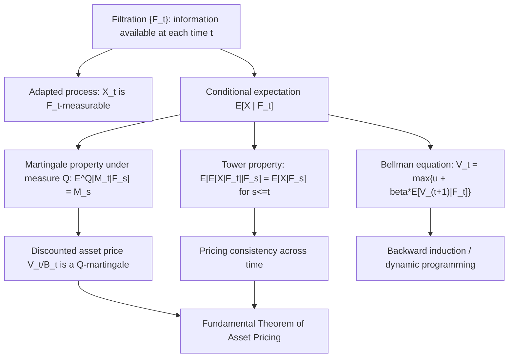

## Conditional Expectation and Filtrations

### Overview and Role in Finance

Conditional expectation and filtrations formalize the idea of updating beliefs and expectations as new information arrives over time. This machinery is indispensable in financial economics because nearly every dynamic model — martingale pricing, dynamic hedging, rational expectations — is fundamentally a statement about how expectations of future payoffs evolve as the market observes more information. Filtrations formalize "what is known so far"; conditional expectation formalizes "the best forecast given what is known so far."

### Filtrations: Formalizing the Flow of Information

**Definition**

A filtration $\{\mathcal{F}_t\}_{t \geq 0}$ on a probability space $(\Omega, \mathcal{F}, P)$ is a family of sigma-algebras indexed by time such that:

$$\mathcal{F}_s \subseteq \mathcal{F}_t \subseteq \mathcal{F} \quad \text{for all } 0 \leq s \leq t$$

That is, the collection of events that are "resolved" (knowable) grows monotonically as time passes — nothing that was previously observable becomes unobservable.

**Key Points**

- $\mathcal{F}_t$ represents the total information available to an observer (e.g., a trader) at time $t$: which events have already occurred, and the full history of any observed processes up to time $t$.
- The filtration generated by a stochastic process $\{X_t\}$, denoted $\mathcal{F}_t^X = \sigma(X_s : 0 \leq s \leq t)$, is the smallest sigma-algebra making $X_s$ measurable for every $s \leq t$ — i.e., the information contained purely in having observed the path of $X$ up to time $t$. This is the natural (and most common) filtration used in financial models where $X$ is an asset price process.
- The filtered probability space $(\Omega, \mathcal{F}, \{\mathcal{F}_t\}, P)$ (sometimes called a **stochastic basis**) is the standard mathematical object underlying continuous-time asset pricing theory.

**Adapted Processes**

A stochastic process $\{X_t\}$ is **adapted** to the filtration $\{\mathcal{F}_t\}$ if $X_t$ is $\mathcal{F}_t$-measurable for every $t$ — informally, the value of $X_t$ is known given the information available at time $t$ (it does not depend on future information).

**Key Points**

- Adaptedness is the mathematical formalization of "non-anticipating": a trading strategy or price process that is adapted cannot use information from the future. This is a basic no-arbitrage-consistency requirement for any admissible trading strategy in continuous-time finance.
- A process that is **predictable** (a stronger condition, roughly meaning $X_t$ is known just *before* time $t$, i.e., $\mathcal{F}_{t^-}$-measurable) is required for defining trading strategies in stochastic integration (Itô integrals), since a trader's position held over $[t, t+dt)$ must be decided based on information available strictly before that interval, not using the outcome within it.

### Conditional Expectation: Definition and Properties

**Elementary Conditional Expectation (Discrete Case)**

For events, conditional probability is:

$$P(A \mid B) = \frac{P(A \cap B)}{P(B)}, \quad P(B) > 0$$

For discrete random variables, conditional expectation given an event $\{Y = y\}$ is:

$$\mathbb{E}[X \mid Y=y] = \sum_x x \cdot P(X=x \mid Y=y)$$

**General Definition: Conditional Expectation Given a Sigma-Algebra**

For a random variable $X$ with $\mathbb{E}[|X|] < \infty$, and a sub-sigma-algebra $\mathcal{G} \subseteq \mathcal{F}$, the conditional expectation $\mathbb{E}[X \mid \mathcal{G}]$ is defined as the (essentially unique) random variable $Z$ satisfying:

1. $Z$ is $\mathcal{G}$-measurable.
2. $\mathbb{E}[Z \cdot \mathbb{1}_A] = \mathbb{E}[X \cdot \mathbb{1}_A]$ for every $A \in \mathcal{G}$.

**Key Points**

- $\mathbb{E}[X \mid \mathcal{G}]$ is itself a **random variable** (not a number) — it is $\mathcal{G}$-measurable, meaning its value is completely determined by the information in $\mathcal{G}$, but it varies with $\omega$ through that information.
- This definition generalizes conditioning on an event or a specific random variable's value: $\mathbb{E}[X \mid Y]$ is understood as shorthand for $\mathbb{E}[X \mid \sigma(Y)]$, the conditional expectation given the sigma-algebra generated by $Y$.
- In financial applications, $\mathbb{E}[X \mid \mathcal{F}_t]$ denotes the expectation of a future payoff $X$ conditional on all information available up to time $t$ — the mathematical object representing a trader's best forecast at time $t$.

**Key Properties**

| Property | Statement |
| --- | --- |
| Linearity | $\mathbb{E}[aX + bY \mid \mathcal{G}] = a\mathbb{E}[X\mid\mathcal{G}] + b\mathbb{E}[Y\mid\mathcal{G}]$ |
| Tower property (law of iterated expectations) | For $\mathcal{H} \subseteq \mathcal{G}$: $\mathbb{E}[\mathbb{E}[X\mid\mathcal{G}] \mid \mathcal{H}] = \mathbb{E}[X\mid\mathcal{H}]$ |
| Taking out what is known | If $Y$ is $\mathcal{G}$-measurable: $\mathbb{E}[YX \mid \mathcal{G}] = Y\,\mathbb{E}[X \mid \mathcal{G}]$ |
| Independence | If $X$ is independent of $\mathcal{G}$: $\mathbb{E}[X \mid \mathcal{G}] = \mathbb{E}[X]$ |
| Law of total expectation | $\mathbb{E}[\mathbb{E}[X \mid \mathcal{G}]] = \mathbb{E}[X]$ |
| Jensen's inequality (conditional) | For convex $\varphi$: $\varphi(\mathbb{E}[X\mid\mathcal{G}]) \leq \mathbb{E}[\varphi(X) \mid \mathcal{G}]$ |

**The Tower Property in Detail**

The tower property (sometimes called the "law of iterated expectations") states that for $s \leq t$:

$$\mathbb{E}\left[\mathbb{E}[X \mid \mathcal{F}_t] \,\middle|\, \mathcal{F}_s\right] = \mathbb{E}[X \mid \mathcal{F}_s]$$

Interpreted in words: forecasting a future forecast (from an earlier information set) is the same as forecasting directly from the earlier information set. This property is used extensively and directly in proving that discounted asset prices are martingales, in verifying no-arbitrage pricing recursions, and in multi-period dynamic programming derivations.

**Example**

Suppose a stock's log-return over the next two periods is $R_1, R_2$, i.i.d. with $\mathbb{E}[R_i] = \mu$. Let $S_2 = S_0 e^{R_1 + R_2}$. At time 1, having observed $R_1$ (so $\mathcal{F}_1 = \sigma(R_1)$):

$$\mathbb{E}[S_2 \mid \mathcal{F}_1] = S_0 e^{R_1} \cdot \mathbb{E}[e^{R_2} \mid \mathcal{F}_1] = S_0 e^{R_1} \cdot \mathbb{E}[e^{R_2}]$$

using the "taking out what is known" property (since $S_0 e^{R_1}$ is $\mathcal{F}_1$-measurable) and independence of $R_2$ from $\mathcal{F}_1$. Then applying the tower property at time 0:

$$\mathbb{E}\left[\mathbb{E}[S_2 \mid \mathcal{F}_1]\right] = S_0 \, \mathbb{E}[e^{R_1}]\, \mathbb{E}[e^{R_2}] = \mathbb{E}[S_2]$$

confirming consistency: the unconditional expectation equals the expectation of the one-period-ahead forecast, exactly as the tower property predicts.

### Application: Martingales and Risk-Neutral Pricing

**Martingale Definition**

An adapted process $\{M_t\}$ is a martingale with respect to $\{\mathcal{F}_t\}$ and probability measure $Q$ if:

1. $\mathbb{E}^Q[|M_t|] < \infty$ for all $t$.
2. $\mathbb{E}^Q[M_t \mid \mathcal{F}_s] = M_s$ for all $s \leq t$.

Interpreted in words: the best forecast of a future value, given current information, is simply the current value — a martingale has no predictable drift or trend under the relevant measure.

**The Fundamental Theorem of Asset Pricing (Informal Statement)**

Under a risk-neutral (equivalent martingale) measure $Q$, the price of any traded asset, when discounted by the risk-free rate, is a $Q$-martingale:

$$\frac{V_t}{B_t} = \mathbb{E}^Q\left[\frac{V_T}{B_T} \,\middle|\, \mathcal{F}_t\right]$$

where $B_t$ is the money-market account (numeraire) and $V_T$ is the payoff at maturity $T$. This equation — which is a direct application of conditional expectation given the filtration $\mathcal{F}_t$ — is the general pricing formula underlying essentially all no-arbitrage derivative valuation, including the Black-Scholes formula as a special case.

**Key Points**

- The choice of the sigma-algebra $\mathcal{F}_t$ (the filtration) and the choice of the probability measure ($Q$ versus the physical/real-world measure $P$) are both essential and separate components of the martingale pricing formula: changing either the information set or the measure generally changes whether the martingale property holds.
- The tower property guarantees pricing **consistency across time**: the price computed at $t=0$ for a claim expiring at $T$ must be consistent with the price that would be computed at any intermediate time $s$, given the information available at $s$ — without this, dynamic hedging arguments and recursive pricing formulas (e.g., backward induction in binomial trees) would not be internally consistent.

### Application: Backward Induction and Dynamic Programming

The recursive structure of the Bellman equation in dynamic programming is a direct application of conditional expectation with respect to an evolving filtration. In a discrete-time optimal control/consumption problem:

$$V_t(x_t) = \max_{a_t} \left\{ u(x_t, a_t) + \beta\, \mathbb{E}\left[V_{t+1}(x_{t+1}) \,\middle|\, \mathcal{F}_t\right]\right\}$$

The conditional expectation $\mathbb{E}[V_{t+1}(x_{t+1}) \mid \mathcal{F}_t]$ represents the agent's expected continuation value, computed using only information available at time $t$ (which crucially does not include the future realization of $x_{t+1}$ itself, consistent with adaptedness). Backward induction (as used in binomial option pricing trees, or in solving finite-horizon dynamic programs) works precisely because the tower property guarantees that valuing the problem one step at a time (working backward from the terminal date) yields the same answer as directly computing the full multi-period conditional expectation.

### Conditional Variance and the Law of Total Variance

Analogous to conditional expectation, **conditional variance** is defined as:

$$\text{Var}(X \mid \mathcal{G}) = \mathbb{E}\left[(X - \mathbb{E}[X\mid\mathcal{G}])^2 \,\middle|\, \mathcal{G}\right]$$

The **law of total variance** decomposes unconditional variance into two components:

$$\text{Var}(X) = \mathbb{E}\left[\text{Var}(X \mid \mathcal{G})\right] + \text{Var}\left(\mathbb{E}[X \mid \mathcal{G}]\right)$$

**Key Points**

- This decomposition separates total risk into "average within-group risk" (the expected conditional variance) and "risk due to variation in the conditional mean across groups" (the variance of the conditional mean) — directly relevant to models with time-varying volatility (e.g., GARCH-type models), where $\text{Var}(X\mid\mathcal{G})$ represents volatility conditional on information up to a given time, distinct from the unconditional (long-run average) variance.
- In stochastic volatility and GARCH models, the object of primary interest is precisely the conditional variance $\text{Var}(R_t \mid \mathcal{F}_{t-1})$ — how return variance evolves as a function of the information set, rather than a constant unconditional variance as assumed under simple GBM.

### Illustrative Diagram: Filtration as an Expanding Information Tree

The following diagram (svg_diagram) shows a binomial-tree-style illustration of a filtration expanding over three time periods, with the number of distinguishable events growing as information accumulates.

<svg xmlns="http://www.w3.org/2000/svg" viewBox="0 0 760 400" font-family="Helvetica, Arial, sans-serif">
<text x="380" y="26" font-size="16" font-weight="bold" text-anchor="middle" fill="#1a1a1a">Filtration as Expanding Information (svg_diagram)</text>

<text x="60" y="60" font-size="12" fill="#333">t=0: 𝓕₀ = {∅, Ω}</text>

<text x="270" y="60" font-size="12" fill="#333">t=1: 𝓕₁</text>

<text x="560" y="60" font-size="12" fill="#333">t=2: 𝓕₂</text>

<circle cx="80" cy="200" r="6" fill="#1a1a1a" />

<circle cx="300" cy="120" r="6" fill="#2563eb" />
<circle cx="300" cy="280" r="6" fill="#2563eb" />
<line x1="80" y1="200" x2="300" y2="120" stroke="#666" stroke-width="1.5" />
<line x1="80" y1="200" x2="300" y2="280" stroke="#666" stroke-width="1.5" />
<text x="310" y="105" font-size="10" fill="#2563eb">up</text>
<text x="310" y="300" font-size="10" fill="#2563eb">down</text>

<circle cx="560" cy="70" r="6" fill="#16a34a" />
<circle cx="560" cy="170" r="6" fill="#16a34a" />
<circle cx="560" cy="230" r="6" fill="#16a34a" />
<circle cx="560" cy="330" r="6" fill="#16a34a" />
<line x1="300" y1="120" x2="560" y2="70" stroke="#666" stroke-width="1.5" />
<line x1="300" y1="120" x2="560" y2="170" stroke="#666" stroke-width="1.5" />
<line x1="300" y1="280" x2="560" y2="230" stroke="#666" stroke-width="1.5" />
<line x1="300" y1="280" x2="560" y2="330" stroke="#666" stroke-width="1.5" />

<text x="600" y="75" font-size="10" fill="#333">uu</text>

<text x="600" y="175" font-size="10" fill="#333">ud</text>

<text x="600" y="235" font-size="10" fill="#333">du</text>

<text x="600" y="335" font-size="10" fill="#333">dd</text>

<text x="380" y="375" font-size="10.5" text-anchor="middle" fill="#333">𝓕₀ ⊆ 𝓕₁ ⊆ 𝓕₂: each step distinguishes more outcomes as the path is revealed</text>

</svg>

### Illustrative Diagram: From Conditional Expectation to Martingale Pricing

### Related Topics

- Martingales, submartingales, and supermartingales in continuous-time finance
- The Fundamental Theorem of Asset Pricing and equivalent martingale measures
- Girsanov's theorem and change of measure (Radon-Nikodym derivative)
- Itô's lemma and stochastic integration with respect to adapted/predictable processes
- Backward induction in binomial and trinomial option pricing trees
- GARCH and stochastic volatility models (conditional variance dynamics)
- Rational expectations equilibrium and information sets in macro-finance
- The Doob-Meyer decomposition and semimartingales
- Optional stopping theorem and its use in American option pricing
- Bayesian updating as a special case of conditional expectation with evolving information