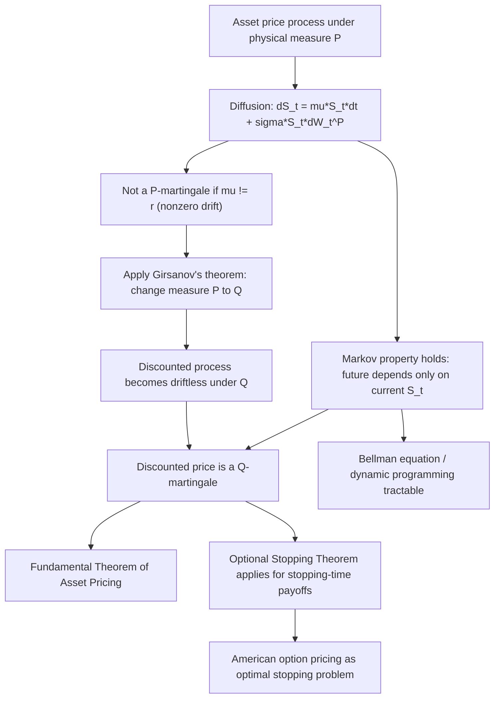

## Martingales and Markov Processes

### Overview

Martingales and Markov processes are two of the most important classes of stochastic processes in financial economics, each formalizing a distinct and complementary notion of "no exploitable structure" in a time series. A martingale formalizes the absence of predictable drift (the process cannot be forecast to systematically rise or fall). A Markov process formalizes the absence of memory beyond the present state (the future depends on the past only through the current value). Many core financial models — Brownian motion, geometric Brownian motion, many interest rate models — are simultaneously martingales (or become martingales under a change of measure) and Markov processes, and understanding both properties separately clarifies what each buys a model.

### Markov Processes

**Definition: The Markov Property**

A stochastic process $\{X_t\}$ is a Markov process if, for all $s < t$:

$$P(X_t \in A \mid \mathcal{F}_s) = P(X_t \in A \mid X_s)$$

for every measurable set $A$, where $\mathcal{F}_s = \sigma(X_u : u \leq s)$ is the natural filtration. Interpreted in words: given the current value $X_s$, the future distribution of the process does not depend on any additional information about the path taken to reach $X_s$ — the present state is a **sufficient statistic** for the future.

**Key Points**

- The Markov property is about the process's **distributional/probabilistic** structure — it does not, by itself, say anything about whether the process has a predictable drift (i.e., it does not imply or preclude the martingale property).
- Markov processes can be classified by state space (discrete: Markov chains; continuous: diffusion processes) and by time index (discrete-time or continuous-time).
- The Markov property is what makes **dynamic programming (Bellman equation) methods** tractable: because the future depends only on the current state (not the full history), the value function can be written purely as a function of the current state, collapsing an infinite-history optimization problem into a manageable state-space recursion.

**Discrete-Time Markov Chains**

For a discrete-time, discrete-state Markov chain, the dynamics are fully described by a **transition probability matrix** $P$, where $P_{ij} = P(X_{t+1} = j \mid X_t = i)$. The **Chapman-Kolmogorov equation** gives $n$-step transition probabilities:

$$P^{(n)}_{ij} = \sum_k P^{(m)}_{ik} P^{(n-m)}_{kj}, \quad 0 < m < n$$

equivalently, $P^{(n)} = P^n$ (the $n$-th matrix power).

**Stationary Distribution**

A distribution $\pi$ (a row vector summing to 1) is stationary if $\pi P = \pi$ — once the chain reaches this distribution over states, it remains there. Under standard regularity conditions (irreducibility and aperiodicity), the chain's distribution converges to a unique stationary distribution $\pi$ regardless of the initial state, as $n \to \infty$.

**Example: Credit Rating Migration**

A common financial application of discrete-time Markov chains is credit rating transition modeling. States represent rating categories (AAA, AA, ..., Default), and $P_{ij}$ is the one-year probability of migrating from rating $i$ to rating $j$. Default is typically modeled as an **absorbing state** ($P_{\text{Default}, \text{Default}} = 1$): once a firm defaults, it does not transition back to a performing rating. Multi-year cumulative default probabilities are computed via $P^n$, and the stationary distribution (if it existed without an absorbing state) would represent the long-run rating distribution — though with an absorbing default state, all probability mass eventually accumulates there, so the more relevant computed quantities are cumulative absorption ("first passage") probabilities into the default state by a given horizon.

**Continuous-Time Markov Processes: Diffusions**

Many financial state variables are modeled as continuous-time Markov processes via a stochastic differential equation:

$$dX_t = \mu(X_t, t)\,dt + \sigma(X_t, t)\,dW_t$$

Because the drift $\mu$ and diffusion coefficient $\sigma$ depend only on the current value $X_t$ (and time $t$), the process satisfies the Markov property: the entire future evolution depends on the past only through $X_t$. Standard examples used in finance include:

- **Geometric Brownian Motion (GBM)**: $dS_t = \mu S_t\, dt + \sigma S_t\, dW_t$ (Black-Scholes stock price model).
- **Ornstein-Uhlenbeck / Vasicek process**: $dr_t = \kappa(\theta - r_t)\,dt + \sigma\, dW_t$ (mean-reverting short-rate interest rate model).
- **Cox-Ingersoll-Ross (CIR) process**: $dr_t = \kappa(\theta - r_t)\,dt + \sigma\sqrt{r_t}\, dW_t$ (mean-reverting, non-negative interest rate model).

### Martingales

**Definition**

An adapted process $\{M_t\}$ with $\mathbb{E}[|M_t|] < \infty$ is a martingale with respect to filtration $\{\mathcal{F}_t\}$ and probability measure $P$ if:

$$\mathbb{E}[M_t \mid \mathcal{F}_s] = M_s \quad \text{for all } s \leq t$$

**Submartingales and Supermartingales**

- **Submartingale**: $\mathbb{E}[M_t \mid \mathcal{F}_s] \geq M_s$ (tends to drift upward, on average).
- **Supermartingale**: $\mathbb{E}[M_t \mid \mathcal{F}_s] \leq M_s$ (tends to drift downward, on average).

**Key Points**

- The martingale property depends critically on **which probability measure** is being used: a process can be a martingale under one measure and not under another. This is the central mechanism behind risk-neutral pricing — a discounted asset price is generally *not* a martingale under the real-world (physical) measure $P$ (since risky assets typically earn a positive risk premium above the risk-free rate, making the discounted price a submartingale under $P$), but is constructed to be a martingale under the risk-neutral measure $Q$.
- Martingales have **constant expected value over time**: $\mathbb{E}[M_t] = \mathbb{E}[M_0]$ for all $t$ (by the tower property applied with $s=0$), though the realized path can fluctuate arbitrarily.
- A martingale is not required to be Markov, and a Markov process is not required to be a martingale — they are logically independent properties. Standard Brownian motion happens to be both.

**Example: Martingale Transformations**

If $\{X_t\}$ is a martingale and $\varphi$ is a convex function, then by the conditional Jensen's inequality, $\{\varphi(X_t)\}$ is a **submartingale** (not generally a martingale itself):

$$\mathbb{E}[\varphi(X_t) \mid \mathcal{F}_s] \geq \varphi(\mathbb{E}[X_t \mid \mathcal{F}_s]) = \varphi(X_s)$$

This is precisely why, for example, if the discounted asset price $S_t/B_t$ is a $Q$-martingale, the discounted value of a convex payoff derived from it (e.g., an option payoff) is generally a $Q$-submartingale rather than a martingale — its expected discounted value tends to drift upward absent adjustment, which is consistent with time value of an option decaying as it approaches maturity in the reverse time direction.

### The Optional Stopping Theorem

**Statement (informal)**

If $\{M_t\}$ is a martingale and $\tau$ is a stopping time (a random time whose occurrence is determined using only information available up to that time — i.e., $\{\tau \leq t\} \in \mathcal{F}_t$ for all $t$) satisfying suitable regularity conditions (e.g., $\tau$ is bounded, or $M_t$ is uniformly integrable), then:

$$\mathbb{E}[M_\tau] = \mathbb{E}[M_0]$$

**Financial Applications**

- **American option pricing**: the optimal exercise decision is a stopping time (the decision to exercise depends only on information available up to that moment), and the theorem underlies the characterization of the American option value as the supremum, over all stopping times, of the expected discounted payoff — the foundational result in American-style derivative valuation theory.
- **Gambler's ruin arguments** applied to trading strategies: the theorem is the formal reason why a "doubling strategy" or similar attempt to guarantee a profit from a fair game generally fails once realistic constraints (bounded time horizon, bounded wealth/borrowing capacity) are imposed — without such constraints, a stopping time can be constructed that appears to generate a sure profit, but this requires violating the boundedness conditions of the theorem (e.g., unbounded time or unbounded risk of catastrophic loss before stopping).

**Key Points**

- Careful attention to the theorem's regularity conditions matters practically: a stopping time that is unbounded (e.g., "the first time the process reaches a target level," with no bound on how long that might take) can violate the theorem's hypotheses, and famous "martingale betting strategies" that appear to generate risk-free profit typically fail specifically because they rely on such unbounded stopping times combined with unbounded risk capacity.

### The Interplay: Markov Processes as Martingales via the Right Drift

**Making a Markov Process a Martingale**

Given a diffusion $dX_t = \mu(X_t,t)\,dt + \sigma(X_t,t)\,dW_t$, the process is a martingale (under the given measure) if and only if the drift is zero: $\mu(X_t,t) \equiv 0$. This observation underlies the entire construction of risk-neutral pricing via **Girsanov's theorem**: given a Markov process with a nonzero drift under the real-world measure $P$, Girsanov's theorem constructs an equivalent measure $Q$ under which the drift of the (discounted) process becomes exactly zero, making it a $Q$-martingale, while preserving the diffusion (volatility) structure and the Markov property.

**Example**

Under the physical measure $P$, a stock follows $dS_t = \mu S_t\,dt + \sigma S_t\,dW_t^P$ (with $\mu$ generally exceeding the risk-free rate $r$ to compensate for risk). The discounted price $\tilde S_t = S_t e^{-rt}$ satisfies:

$$d\tilde S_t = (\mu - r)\tilde S_t\, dt + \sigma \tilde S_t\, dW_t^P$$

which has nonzero drift $(\mu - r)\tilde{S}_t$ whenever $\mu \neq r$, so $\tilde S_t$ is not a $P$-martingale. Under the risk-neutral measure $Q$ (constructed via Girsanov's theorem using the market price of risk $(\mu-r)/\sigma$), the same discounted process becomes:

$$d\tilde S_t = \sigma \tilde S_t\, dW_t^Q$$

with zero drift, making $\tilde S_t$ a $Q$-martingale — while $S_t$ (equivalently $\tilde S_t$) remains a Markov process throughout, since only the drift term (not the functional dependence on the current state) has changed.

### Comparative Summary

| Property | Markov Property | Martingale Property |
| --- | --- | --- |
| What it restricts | Dependence structure on the past (memorylessness) | Expected direction of future movement (no predictable drift) |
| Depends on choice of measure? | Generally yes, but often preserved under equivalent measure changes (e.g., Girsanov) | Yes, critically — martingale status can hold under $Q$ but fail under $P$ |
| Implies the other property? | No | No |
| Key financial tool enabled | Dynamic programming / Bellman equations | Risk-neutral pricing / Fundamental Theorem of Asset Pricing |
| Canonical example | Any diffusion $dX_t = \mu(X_t,t)dt + \sigma(X_t,t)dW_t$ | Discounted asset price under $Q$ |

### Illustrative Diagram: Markov Property vs. Martingale Property

The following diagram (svg_diagram) contrasts what each property constrains: the Markov property restricts dependence on history, while the martingale property restricts the expected direction of movement.

<svg xmlns="http://www.w3.org/2000/svg" viewBox="0 0 760 380" font-family="Helvetica, Arial, sans-serif">
<text x="380" y="26" font-size="16" font-weight="bold" text-anchor="middle" fill="#1a1a1a">Markov vs. Martingale Property (svg_diagram)</text>

<text x="190" y="55" font-size="13" font-weight="bold" text-anchor="middle" fill="`#1a1a1a`">Markov: future depends only on present</text>

<circle cx="80" cy="200" r="6" fill="#999" />

<circle cx="150" cy="150" r="6" fill="#999" />

<circle cx="220" cy="230" r="6" fill="`#2563eb`" />

<line x1="80" y1="200" x2="150" y2="150" stroke="#ccc" stroke-width="1.5" stroke-dasharray="3,3" />

<line x1="150" y1="150" x2="220" y2="230" stroke="#ccc" stroke-width="1.5" stroke-dasharray="3,3" />

<text x="220" y="250" font-size="10" text-anchor="middle" fill="`#2563eb`">X_s (current state)</text>

<path d="M 220 230 Q 260 190 300 210" stroke="`#16a34a`" stroke-width="2" fill="none" marker-end="url(#arrowM)" />

<path d="M 220 230 Q 260 260 300 250" stroke="`#16a34a`" stroke-width="2" fill="none" marker-end="url(#arrowM)" />

<text x="310" y="215" font-size="9.5" fill="`#16a34a`">possible futures</text>

<text x="310" y="255" font-size="9.5" fill="`#16a34a`">depend only on X_s</text>

<text x="570" y="55" font-size="13" font-weight="bold" text-anchor="middle" fill="`#1a1a1a`">Martingale: no predictable drift</text>

<line x1="440" y1="300" x2="700" y2="300" stroke="#333" stroke-width="1" />

<line x1="440" y1="300" x2="440" y2="80" stroke="#333" stroke-width="1" />

<path d="M 450 220 L 490 200 L 520 240 L 560 190 L 600 220 L 640 180 L 680 210" stroke="`#dc2626`" stroke-width="2" fill="none" />

<line x1="450" y1="220" x2="680" y2="220" stroke="#666" stroke-width="1.5" stroke-dasharray="4,3" />

<text x="685" y="224" font-size="9.5" fill="#666">E[M_t | F_s] = M_s</text>

<circle cx="450" cy="220" r="4" fill="#111" />

</svg>

### Illustrative Diagram: How Markov and Martingale Properties Combine in Pricing

### Related Topics

- Girsanov's theorem and equivalent martingale measures
- The Fundamental Theorem of Asset Pricing (existence and uniqueness of $Q$)
- Optimal stopping theory and American option valuation
- Itô's lemma and stochastic calculus for diffusion processes
- Ornstein-Uhlenbeck, Vasicek, and Cox-Ingersoll-Ross interest rate models
- Absorbing Markov chains and credit rating transition matrices
- Doob-Meyer decomposition of submartingales
- Dynamic programming and the Bellman equation (link to the Markov property)
- Brownian motion as the canonical continuous-time martingale and Markov process
- Ergodicity and stationary distributions of Markov chains