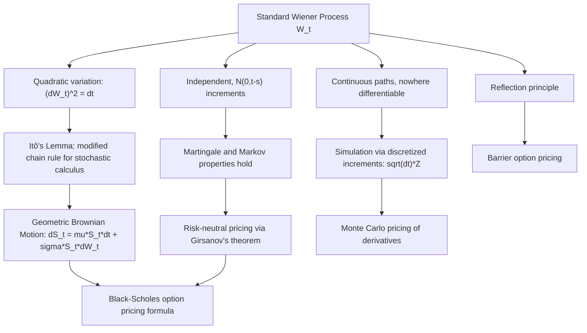

## Brownian Motion and Wiener Processes

### Overview and Historical Context

Brownian motion (equivalently, the Wiener process, named for the mathematician who rigorously constructed it) is the fundamental continuous-time stochastic process underlying modern quantitative finance. It provides the mathematical model of pure, unpredictable, continuous noise — a process with no jumps, no memory of direction, and statistically self-similar behavior at every timescale. It is the driving noise source in the stochastic differential equations used for asset prices (Geometric Brownian Motion), interest rates (Vasicek, CIR models), and virtually all continuous-time derivative pricing theory, including as the foundation of Itô calculus.

### Formal Definition

A stochastic process $\{W_t\}_{t \geq 0}$ is a (standard) **Wiener process** (Brownian motion) if it satisfies:

1. **$W_0 = 0$** (starts at the origin, by convention).
2. **Independent increments**: for any $0 \leq t_1 < t_2 < \cdots < t_n$, the increments $W_{t_2}-W_{t_1}, W_{t_3}-W_{t_2}, \ldots, W_{t_n}-W_{t_{n-1}}$ are mutually independent.
3. **Stationary, normally distributed increments**: for $s < t$, $W_t - W_s \sim N(0, t-s)$ — the increment's distribution depends only on the elapsed time $t-s$, not on $s$ itself.
4. **Continuous sample paths**: $t \mapsto W_t$ is continuous with probability 1 (almost surely).

**Key Points**

- Properties 2 and 3 together imply $W_t \sim N(0,t)$ for every $t$ (taking $s=0$), so the variance of the process grows linearly with time, and the standard deviation grows with $\sqrt{t}$ — the origin of the famous "square-root-of-time" scaling used throughout finance (e.g., annualizing daily volatility by multiplying by $\sqrt{252}$).
- Despite having continuous paths, Brownian motion is (with probability 1) **nowhere differentiable** — the paths are continuous but infinitely jagged at every scale, which is precisely why ordinary calculus (the Riemann integral and standard chain rule) cannot be applied directly to functions of $W_t$, motivating the development of Itô calculus.
- The process is a **martingale**: $\mathbb{E}[W_t \mid \mathcal{F}_s] = W_s$ for $s \leq t$ (since the increment $W_t - W_s$ is independent of $\mathcal{F}_s$ and has mean zero), and it is also a **Markov process** (future increments do not depend on the path taken to reach the current level, only on the current level itself, by the independent increments property).

### Key Distributional and Path Properties

**Quadratic Variation**

The quadratic variation of Brownian motion over $[0,T]$, defined as the limit of $\sum_i (W_{t_{i+1}} - W_{t_i})^2$ over increasingly fine partitions, satisfies:

$$[W,W]_T = T \quad \text{(almost surely)}$$

This is the single most consequential property of Brownian motion for stochastic calculus: it is often summarized by the informal (but rigorously justified) rule $(dW_t)^2 = dt$, which is the key departure from ordinary calculus (where $(dt)^2 = 0$ is negligible) and is the term that generates the second-derivative correction in **Itô's Lemma**.

**Scaling Property (Self-Similarity)**

For any constant $c > 0$, the rescaled process $\tilde{W}_t = \frac{1}{\sqrt{c}} W_{ct}$ is itself a standard Wiener process. This self-similarity (Brownian motion "looks the same" statistically at any time scale, after appropriate rescaling) underlies the common practice of converting between daily, weekly, and annualized volatility using square-root-of-time scaling.

**Reflection Principle**

For the running maximum $M_t = \max_{0 \leq s \leq t} W_s$, the reflection principle gives:

$$P(M_t \geq a) = 2P(W_t \geq a) = 2\left[1 - \Phi\left(\frac{a}{\sqrt{t}}\right)\right], \quad a > 0$$

This result — derived by "reflecting" the path after it first hits level $a$ — is the basis for pricing **barrier options** (options whose payoff depends on whether the underlying breaches a specified level), since it gives closed-form expressions for the probability (and, with further work, the risk-neutral expectation) of hitting a barrier.

**Non-Differentiability**

At almost every point $t$, the derivative $\lim_{h\to 0} \frac{W_{t+h}-W_t}{h}$ does not exist (fails to converge to any finite value) — informally, Brownian motion is "infinitely rough." This is consistent with quadratic variation being finite and positive ($=t$) while ordinary calculus would require quadratic variation to be zero for a differentiable function — the tension between these two facts is precisely what forces the introduction of a new (Itô) calculus for handling Brownian-driven processes.

### Wiener Process vs. General Brownian Motion (Terminology Note)

- **Standard Brownian motion / Wiener process**: $W_0 = 0$, increments $N(0, t-s)$ (variance parameter $\sigma^2=1$ per unit time).
- **Brownian motion with drift $\mu$ and volatility $\sigma$**: $X_t = \mu t + \sigma W_t$, giving $X_t \sim N(\mu t, \sigma^2 t)$. This is the process underlying the log-price in the Black-Scholes model: $\ln S_t = \ln S_0 + (\mu - \sigma^2/2)t + \sigma W_t$.

In much of the finance literature, "Brownian motion" and "Wiener process" are used interchangeably to refer to the standard (driftless, unit-variance) process, with drift and scaling explicitly added as separate terms when needed, as shown above.

### Simulating Brownian Motion Paths

Because increments are independent and normally distributed, a discretized Brownian motion path over $[0,T]$ with $n$ time steps of size $\Delta t = T/n$ can be simulated exactly (no discretization error, since the exact transition law is known) via:

$$W_{t_{k+1}} = W_{t_k} + \sqrt{\Delta t}\, Z_k, \quad Z_k \stackrel{\text{i.i.d.}}{\sim} N(0,1)$$

starting from $W_0 = 0$. This recursive simulation scheme is the standard building block for Monte Carlo simulation of any diffusion model, since more complex SDEs (e.g., GBM, mean-reverting processes) are simulated by combining this Brownian increment with the process's specific drift and diffusion coefficients (via, e.g., the Euler-Maruyama scheme, or an exact transition where available as in GBM).

### Application: Geometric Brownian Motion and the Black-Scholes Framework

The canonical application in finance is **Geometric Brownian Motion (GBM)**:

$$dS_t = \mu S_t\, dt + \sigma S_t\, dW_t$$

Applying Itô's Lemma to $\ln S_t$ (necessary precisely because of the non-standard chain rule required by the $(dW_t)^2 = dt$ rule) yields the closed-form solution:

$$S_t = S_0 \exp\left[\left(\mu - \frac{\sigma^2}{2}\right)t + \sigma W_t\right]$$

**Key Points**

- The $-\sigma^2/2$ term (sometimes called the "Itô correction" or "volatility drag") arises directly from the quadratic variation property of Brownian motion, and has no counterpart in ordinary (deterministic) exponential growth models — it is a purely stochastic-calculus effect, not an approximation.
- Under the risk-neutral measure $Q$ (constructed via Girsanov's theorem), the drift $\mu$ is replaced by the risk-free rate $r$, giving the risk-neutral dynamics $dS_t = rS_t\,dt + \sigma S_t\,dW_t^Q$ used directly in the Black-Scholes pricing formula.

### Illustrative Diagram: Simulated Brownian Motion Path

The following diagram (svg_diagram) shows an illustrative simulated Brownian motion path, highlighting its jagged, non-differentiable character and the widening $\sqrt{t}$ envelope of typical fluctuation.

<svg xmlns="http://www.w3.org/2000/svg" viewBox="0 0 760 380" font-family="Helvetica, Arial, sans-serif">
<text x="380" y="26" font-size="16" font-weight="bold" text-anchor="middle" fill="#1a1a1a">Simulated Brownian Motion Path (svg_diagram)</text>
<line x1="60" y1="200" x2="710" y2="200" stroke="#999" stroke-width="1" stroke-dasharray="3,3" />
<line x1="60" y1="340" x2="60" y2="60" stroke="#333" stroke-width="1.5" />
<line x1="60" y1="340" x2="710" y2="340" stroke="#333" stroke-width="1.5" />
<text x="715" y="344" font-size="11" fill="#333">t</text>
<text x="45" y="65" font-size="11" fill="#333">W_t</text>
<text x="60" y="205" font-size="10" fill="#666">0</text>

<path d="M 60 200 Q 250 130 460 90 Q 600 65 710 50" stroke="#94a3b8" stroke-width="1.2" fill="none" stroke-dasharray="5,4" />
<path d="M 60 200 Q 250 270 460 310 Q 600 335 710 350" stroke="#94a3b8" stroke-width="1.2" fill="none" stroke-dasharray="5,4" />
<text x="620" y="45" font-size="9.5" fill="#94a3b8">+σ√t envelope</text>
<text x="620" y="365" font-size="9.5" fill="#94a3b8">-σ√t envelope</text>

<path d="M 60 200 L 85 215 L 110 190 L 135 230 L 160 205 L 185 240 L 210 200 L 235 175 L 260 195 L 285 150 L 310 170 L 335 130 L 360 155 L 385 110 L 410 135 L 435 100 L 460 120 L 485 85 L 510 115 L 535 90 L 560 130 L 585 105 L 610 150 L 635 120 L 660 160 L 685 135 L 710 165" stroke="`#2563eb`" stroke-width="1.8" fill="none" />

<text x="380" y="30" font-size="0" />

<text x="200" y="360" font-size="10.5" text-anchor="middle" fill="#333">Continuous but nowhere differentiable; fluctuation grows with √t</text>

</svg>

### Illustrative Diagram: From Wiener Process to Financial Applications

### Related Topics

- Itô's Lemma and stochastic calculus for functions of Brownian motion
- Geometric Brownian Motion and the Black-Scholes-Merton model
- Girsanov's theorem and change of measure for risk-neutral pricing
- Stochastic differential equations: Vasicek, CIR, and other diffusion models
- Barrier, lookback, and other path-dependent option pricing via reflection principle
- Euler-Maruyama and Milstein discretization schemes for SDE simulation
- Fractional Brownian motion and long-memory extensions
- Lévy processes and jump-diffusion models as generalizations beyond continuous paths
- Quadratic variation and semimartingale theory
- Multi-dimensional and correlated Brownian motions for multi-asset models