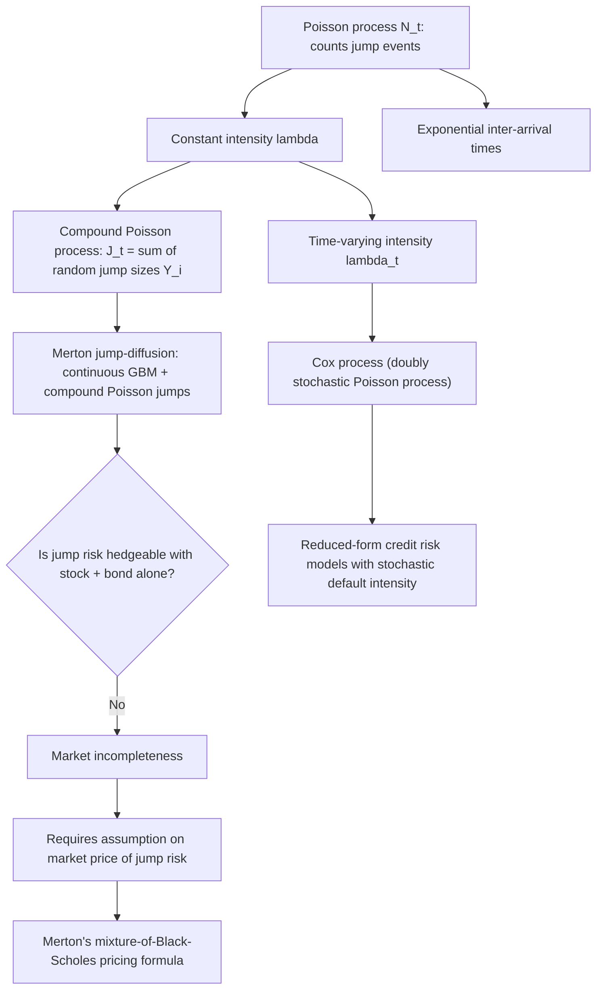

## Poisson Processes and Jump Processes

### Overview and Motivation

Poisson processes and jump processes model discontinuous, sudden changes over time — sharply contrasting with Brownian motion, whose paths are continuous. In finance, discrete jumps are needed to capture phenomena that continuous diffusion models cannot: earnings surprises causing sudden stock price gaps, default events, central bank rate decisions, and other discontinuous shocks. Jump processes extend the continuous-time toolkit built on Brownian motion by adding a mechanism for sudden, discrete moves at random times.

### The Poisson Process

**Definition**

A counting process $\{N_t\}_{t \geq 0}$ (with $N_t \in \{0,1,2,\ldots\}$, non-decreasing, counting the number of events by time $t$) is a Poisson process with intensity (rate) $\lambda > 0$ if:

1. $N_0 = 0$.
2. **Independent increments**: for $0 \leq t_1 < t_2 < \cdots < t_n$, the increments $N_{t_2}-N_{t_1}, \ldots, N_{t_n}-N_{t_{n-1}}$ are mutually independent.
3. **Stationary Poisson increments**: for $s<t$, $N_t - N_s \sim \text{Poisson}(\lambda(t-s))$.

**Key Distributional Results**

$$P(N_t = k) = \frac{e^{-\lambda t}(\lambda t)^k}{k!}, \qquad \mathbb{E}[N_t] = \lambda t, \qquad \text{Var}(N_t) = \lambda t$$

**Inter-Arrival Times**

The times between successive jumps, $\tau_1, \tau_2, \ldots$ (i.i.d.), are exponentially distributed:

$$\tau_i \sim \text{Exponential}(\lambda), \qquad \mathbb{E}[\tau_i] = \frac{1}{\lambda}$$

**Key Points**

- The Poisson process is a **pure jump process**: its paths are piecewise constant, jumping by exactly $+1$ at each event time and remaining flat otherwise — the polar opposite of Brownian motion's continuous-but-infinitely-jagged paths.
- The Poisson process is both a **martingale after compensation** (the compensated process $N_t - \lambda t$ is a martingale, since $\mathbb{E}[N_t - \lambda t \mid \mathcal{F}_s] = N_s + \lambda(t-s) - \lambda t = N_s - \lambda s$) and a **Markov process** (the independent-increments property implies future jump counts depend only on the current count, not the history of when past jumps occurred).
- The exponential inter-arrival time carries the **memoryless property**: regardless of how long it has been since the last jump, the expected waiting time to the next jump remains constant at $1/\lambda$ — a strong modeling assumption that time-varying intensity extensions (below) are designed to relax.

**Example: Default Timing via a Poisson Process**

In a reduced-form (intensity-based) credit risk model, a firm's default time $\tau$ is modeled as the first jump of a Poisson process with constant intensity $\lambda$ (the hazard rate). Then:

$$P(\tau > t) = P(N_t = 0) = e^{-\lambda t}$$

If $\lambda = 0.02$ per year (a 2% annual hazard rate), the probability of surviving 5 years without default is $e^{-0.02 \times 5} = e^{-0.1} \approx 0.905$, i.e., roughly a 90.5% survival probability, with the corresponding 5-year cumulative default probability of approximately 9.5%.

### Compound Poisson Processes

**Definition**

A compound Poisson process adds random jump *sizes* to the counting process:

$$J_t = \sum_{i=1}^{N_t} Y_i$$

where $N_t$ is a Poisson process with rate $\lambda$, and $Y_1, Y_2, \ldots$ are i.i.d. jump-size random variables (independent of $N_t$), drawn from some distribution (e.g., normal, or a distribution specific to the application).

**Mean and Variance**

$$\mathbb{E}[J_t] = \lambda t \, \mathbb{E}[Y], \qquad \text{Var}(J_t) = \lambda t \, \mathbb{E}[Y^2]$$

**Financial Applications**

- **Operational risk modeling**: total losses over a period as the sum of a random number of loss events, each of random severity — the compound Poisson framework is the standard building block of the "loss distribution approach" in operational risk capital modeling.
- **Aggregate insurance/catastrophe claims modeling**, and by extension, catastrophe bond and insurance-linked security pricing.

### Jump-Diffusion Models: Merton's Model

**Model Specification**

Merton (1976) extended the Black-Scholes GBM framework by adding a compound Poisson jump component to the asset price dynamics:

$$dS_t = \mu S_t\, dt + \sigma S_t\, dW_t + S_{t^-}\, dJ_t$$

where $J_t = \sum_{i=1}^{N_t}(Y_i - 1)$ represents multiplicative jump shocks (the price jumps from $S_{t^-}$ to $S_{t^-} Y_i$ at each jump time), with $N_t$ a Poisson process of intensity $\lambda$, and jump sizes $Y_i$ typically modeled as lognormal: $\ln Y_i \sim N(\mu_J, \sigma_J^2)$.

**Key Points**

- The subscript $t^-$ denotes the value of the process *just before* a potential jump at time $t$ — necessary notation because jump processes are not continuous, and the value can differ discontinuously at the jump instant itself.
- The resulting log-price process is a combination of a continuous Brownian component and a discrete jump component, giving the model both the small, continuous fluctuations of GBM and the ability to generate large, sudden discontinuous moves — directly addressing the empirically observed **excess kurtosis (fat tails)** in asset returns that pure GBM cannot replicate.
- Under Merton's model, markets are generally **incomplete** (there is no way to perfectly replicate an option's payoff using only the stock and a risk-free bond, because the jump risk introduces an additional source of randomness that cannot be hedged away with only two traded instruments), which means the risk-neutral measure is not unique. [Inference] Merton's original approach circumvents this by assuming jump risk is diversifiable and can be priced under the physical measure's jump distribution, a simplifying assumption that later literature has revisited and extended using more general incomplete-market pricing techniques (e.g., utility indifference pricing, or specifying additional market prices of jump risk).

**Merton's Closed-Form Option Pricing Formula**

Under the diversifiable-jump-risk assumption, the European call price is a Poisson-weighted mixture of Black-Scholes prices, conditioning on the number of jumps $n$ occurring before maturity:

$$C = \sum_{n=0}^{\infty} \frac{e^{-\lambda' T}(\lambda' T)^n}{n!} \, C_{BS}\left(S_0, K, T, r_n, \sigma_n\right)$$

where $\lambda' = \lambda(1+k)$ (with $k = \mathbb{E}[Y-1]$ adjusting for the mean jump size to preserve the risk-neutral drift), and $r_n, \sigma_n$ are adjusted rate and volatility parameters that depend on the number of jumps $n$ and the jump-size distribution parameters. Each term in the sum is weighted by the Poisson probability of exactly $n$ jumps occurring, directly reflecting the compound-Poisson structure of the jump component.

### Comparing Diffusion, Pure-Jump, and Jump-Diffusion Models

| Model type | Path behavior | Captures fat tails? | Market completeness |
| --- | --- | --- | --- |
| Pure diffusion (GBM) | Continuous | No (log-normal tails only) | Complete (single source of risk, hedgeable with stock+bond) |
| Pure jump (e.g., Variance Gamma) | Discontinuous, no continuous component | Yes | Generally incomplete |
| Jump-diffusion (Merton) | Continuous component + discrete jumps | Yes | Generally incomplete (extra jump risk source) |

### Time-Varying Intensity: Cox Processes

**Motivation**

The constant-intensity Poisson process assumes a fixed jump/default rate $\lambda$ at all times — an assumption inconsistent with observed clustering of credit events (e.g., defaults spike during recessions) and time-varying market conditions. A **Cox process** (doubly stochastic Poisson process) generalizes the Poisson process by allowing the intensity itself to be a stochastic process $\lambda_t$ (often modeled as a mean-reverting diffusion, such as a CIR process, to keep it non-negative):

$$P(N_t - N_s = k \mid \{\lambda_u\}_{u \geq 0}) = \frac{e^{-\int_s^t \lambda_u\, du}\left(\int_s^t \lambda_u\, du\right)^k}{k!}$$

**Key Points**

- Cox processes are the standard building block of modern **reduced-form credit risk models** (e.g., in pricing credit default swaps and other credit derivatives), where the default intensity $\lambda_t$ is correlated with, or driven by, broader economic/interest-rate factors — allowing default risk to be correlated across firms via a common underlying stochastic intensity factor.
- The "doubly stochastic" name reflects two layers of randomness: the intensity process $\lambda_t$ is itself random, and conditional on a realized path of $\lambda_t$, the jump/default times follow an (inhomogeneous) Poisson process driven by that path.

### Illustrative Diagram: Sample Path Comparison — Diffusion vs. Jump-Diffusion

The following diagram (svg_diagram) contrasts a continuous GBM path against a jump-diffusion path with discrete discontinuities superimposed on continuous fluctuation.

<svg xmlns="http://www.w3.org/2000/svg" viewBox="0 0 760 380" font-family="Helvetica, Arial, sans-serif">
<text x="380" y="26" font-size="16" font-weight="bold" text-anchor="middle" fill="#1a1a1a">Diffusion vs. Jump-Diffusion Paths (svg_diagram)</text>

<text x="190" y="52" font-size="13" font-weight="bold" text-anchor="middle" fill="`#1a1a1a`">Pure GBM (continuous)</text>

<line x1="60" y1="330" x2="330" y2="330" stroke="#333" stroke-width="1.2" />

<line x1="60" y1="330" x2="60" y2="70" stroke="#333" stroke-width="1.2" />

<path d="M 60 260 L 90 245 L 120 265 L 150 230 L 180 250 L 210 210 L 240 225 L 270 190 L 300 205 L 330 175" stroke="`#2563eb`" stroke-width="2" fill="none" />

<text x="570" y="52" font-size="13" font-weight="bold" text-anchor="middle" fill="`#1a1a1a`">Jump-Diffusion (Merton)</text>

<line x1="440" y1="330" x2="710" y2="330" stroke="#333" stroke-width="1.2" />

<line x1="440" y1="330" x2="440" y2="70" stroke="#333" stroke-width="1.2" />

<path d="M 440 260 L 470 250 L 500 265 L 530 240" stroke="`#dc2626`" stroke-width="2" fill="none" />

<line x1="530" y1="240" x2="530" y2="170" stroke="`#dc2626`" stroke-width="2" stroke-dasharray="2,2" />

<path d="M 530 170 L 560 180 L 590 160 L 620 175" stroke="`#dc2626`" stroke-width="2" fill="none" />

<line x1="620" y1="175" x2="620" y2="220" stroke="`#dc2626`" stroke-width="2" stroke-dasharray="2,2" />

<path d="M 620 220 L 650 205 L 680 195 L 710 185" stroke="`#dc2626`" stroke-width="2" fill="none" />

<circle cx="530" cy="240" r="3" fill="#111" />

<circle cx="530" cy="170" r="3" fill="#111" />

<circle cx="620" cy="175" r="3" fill="#111" />

<circle cx="620" cy="220" r="3" fill="#111" />

<text x="540" y="150" font-size="9.5" fill="#111">jump up</text>

<text x="630" y="240" font-size="9.5" fill="#111">jump down</text>

<text x="380" y="365" font-size="10.5" text-anchor="middle" fill="#333">Continuous Brownian fluctuation combined with discrete Poisson-timed jumps</text>

</svg>

### Illustrative Diagram: Building Up to Jump-Diffusion Models

### Related Topics

- Merton's jump-diffusion option pricing model and its closed-form solution
- Reduced-form (intensity-based) credit risk models and credit default swap pricing
- Lévy processes as a general class encompassing jump and jump-diffusion models
- Variance Gamma and other pure-jump models for option pricing
- Market incompleteness and pricing under multiple equivalent martingale measures
- Cox processes and stochastic default intensity correlated with macroeconomic factors
- Compound Poisson processes in operational risk and actuarial loss modeling
- Excess kurtosis and fat tails in empirical asset return distributions
- Simulation of jump-diffusion processes via thinning and compound Poisson methods
- Itô's Lemma for jump-diffusion processes (Itô-Lévy formula)