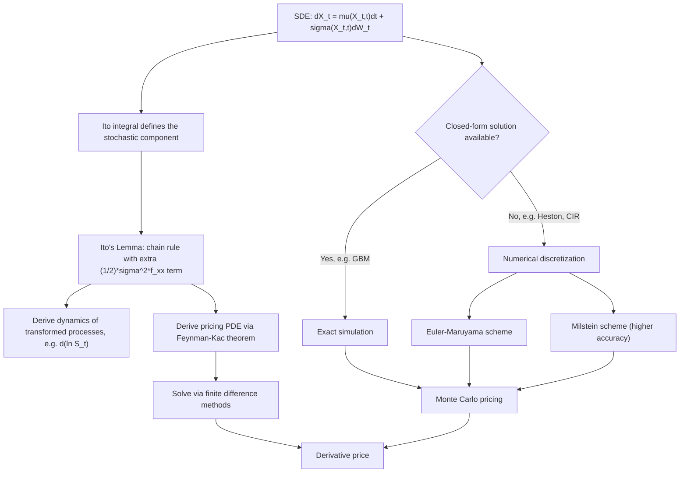

## Introduction to Stochastic Differential Equations

### Overview and Motivation

A stochastic differential equation (SDE) describes the evolution of a variable subject to both a predictable (deterministic) tendency and continuous random perturbation. SDEs are the language in which nearly all continuous-time financial models are written: asset prices, interest rates, volatility processes, and exchange rates are all typically specified as solutions to SDEs. This topic introduces the formal structure of an SDE, the calculus (Itô calculus) required to manipulate it, and the standard toolkit for solving and simulating SDEs used throughout continuous-time finance.

### General Form of a Stochastic Differential Equation

An SDE for a process $\{X_t\}$ driven by a Wiener process $\{W_t\}$ is written:

$$dX_t = \mu(X_t, t)\, dt + \sigma(X_t, t)\, dW_t$$

with an equivalent integral representation:

$$X_t = X_0 + \int_0^t \mu(X_s, s)\, ds + \int_0^t \sigma(X_s, s)\, dW_s$$

**Key Points**

- $\mu(X_t, t)$ is the **drift coefficient**: the deterministic (expected, instantaneous) rate of change of the process.
- $\sigma(X_t, t)$ is the **diffusion coefficient**: the magnitude of the random (volatility) component.
- The second integral, $\int_0^t \sigma(X_s,s)\, dW_s$, is a **stochastic (Itô) integral** — it cannot be defined using ordinary Riemann-Stieltjes integration theory because $W_t$ has unbounded variation (in fact infinite total variation) on any interval, which is why a specialized theory of stochastic integration is required.
- The "differential" notation $dX_t = \mu\,dt + \sigma\,dW_t$ is formal shorthand for the integral equation above; it does not imply $X_t$ is differentiable in the ordinary sense (in fact, for $\sigma \neq 0$, $X_t$ inherits the nowhere-differentiability of $W_t$).

### The Itô Integral

**Construction (Informal)**

For a suitable (adapted, square-integrable) process $\{f_t\}$, the Itô integral $\int_0^T f_s\, dW_s$ is constructed as the limit (in an appropriate probabilistic sense) of Riemann-sum-like approximations:

$$\int_0^T f_s\, dW_s \approx \sum_{i} f_{t_i}\left(W_{t_{i+1}} - W_{t_i}\right)$$

**Key Points**

- A critical and defining feature of the Itô integral's construction is that the integrand $f_{t_i}$ is evaluated at the **left endpoint** $t_i$ of each subinterval (not the right endpoint or a midpoint) — this reflects the non-anticipating (adapted/predictable) nature of trading strategies: a position must be decided before observing the price change over the coming instant, not after.
- Using a different evaluation point (e.g., the midpoint, as in the alternative **Stratonovich integral**) yields a different value for the integral in general, because $W_t$ has non-zero quadratic variation — this is a genuine mathematical distinction (not merely a notational choice), and the two integral conventions obey different chain rules.
- The Itô integral $M_t = \int_0^t f_s\, dW_s$ is itself a **martingale** (under standard integrability conditions on $f$), a property that does not hold in general for the Stratonovich integral — this martingale property is one of the primary reasons the Itô convention is the standard choice in mathematical finance.

### Itô's Lemma

**Statement (One Dimension)**

For a process $X_t$ satisfying $dX_t = \mu_t\, dt + \sigma_t\, dW_t$, and a twice-differentiable function $f(X_t, t)$, Itô's Lemma gives:

$$df(X_t,t) = \left(\frac{\partial f}{\partial t} + \mu_t \frac{\partial f}{\partial x} + \frac{1}{2}\sigma_t^2 \frac{\partial^2 f}{\partial x^2}\right) dt + \sigma_t \frac{\partial f}{\partial x}\, dW_t$$

**Key Points**

- The extra term $\frac{1}{2}\sigma_t^2 \frac{\partial^2 f}{\partial x^2}\, dt$ — absent from the ordinary chain rule of deterministic calculus — arises directly from the quadratic variation property $(dW_t)^2 = dt$ combined with a second-order Taylor expansion of $f$. This term is the single most important distinguishing feature of stochastic calculus relative to ordinary calculus.
- Itô's Lemma is derived (heuristically) via Taylor expansion of $f(X_t + dX_t, t+dt)$, retaining terms up to order $dt$ while applying the informal multiplication rules: $dt \cdot dt = 0$, $dt \cdot dW_t = 0$, and $dW_t \cdot dW_t = dt$.
- Itô's Lemma is the primary tool used to (a) derive the dynamics of a transformed process (e.g., deriving the SDE for $\ln S_t$ given the SDE for $S_t$), and (b) derive pricing partial differential equations (e.g., applying Itô's Lemma to a derivative's value function $V(S_t,t)$ is the standard first step in deriving the Black-Scholes PDE).

**Example: Deriving the SDE for $\ln S_t$ under GBM**

Given $dS_t = \mu S_t\,dt + \sigma S_t\,dW_t$, apply Itô's Lemma to $f(S_t) = \ln S_t$, so $\partial f/\partial S = 1/S$, $\partial^2 f/\partial S^2 = -1/S^2$, $\partial f/\partial t = 0$:

$$d(\ln S_t) = \left(\mu S_t \cdot \frac{1}{S_t} + \frac{1}{2}\sigma^2 S_t^2 \cdot \left(-\frac{1}{S_t^2}\right)\right) dt + \sigma S_t \cdot \frac{1}{S_t}\, dW_t = \left(\mu - \frac{\sigma^2}{2}\right)dt + \sigma\, dW_t$$

Since the right-hand side has constant coefficients, this SDE integrates directly to $\ln S_t = \ln S_0 + (\mu - \sigma^2/2)t + \sigma W_t$, recovering the closed-form GBM solution — this is the standard derivation showing precisely where the "$-\sigma^2/2$" correction term originates.

### Standard SDE Models Used in Finance

| Model | SDE | Key feature |
| --- | --- | --- |
| Geometric Brownian Motion (Black-Scholes) | $dS_t = \mu S_t\,dt + \sigma S_t\,dW_t$ | Lognormal prices; constant volatility |
| Ornstein-Uhlenbeck / Vasicek | $dr_t = \kappa(\theta - r_t)\,dt + \sigma\,dW_t$ | Mean-reverting; can go negative |
| Cox-Ingersoll-Ross (CIR) | $dr_t = \kappa(\theta - r_t)\,dt + \sigma\sqrt{r_t}\,dW_t$ | Mean-reverting; stays non-negative (under Feller condition) |
| Constant Elasticity of Variance (CEV) | $dS_t = \mu S_t\,dt + \sigma S_t^{\gamma}\,dW_t$ | Volatility depends on price level (leverage effect) |
| Heston stochastic volatility | $dS_t = \mu S_t dt + \sqrt{v_t}S_t dW_t^1$, $dv_t = \kappa(\theta-v_t)dt+\xi\sqrt{v_t}dW_t^2$ | Volatility itself follows a (CIR-type) SDE |

**Key Points**

- The **Feller condition** ($2\kappa\theta \geq \sigma^2$) for the CIR process ensures the process almost surely remains strictly positive; without it, the process can (theoretically) reach zero, which is problematic when the process represents a non-negative economic quantity like an interest rate or variance.
- Adding a square-root diffusion term ($\sigma\sqrt{X_t}$, as in CIR and Heston) rather than a proportional term ($\sigma X_t$, as in GBM) is a standard technique for building non-negativity or level-dependent volatility (the "leverage effect," where volatility tends to rise as price levels fall) directly into the SDE specification.

### Existence and Uniqueness of Solutions

**Standard Sufficient Conditions**

An SDE $dX_t = \mu(X_t,t)dt + \sigma(X_t,t)dW_t$ has a unique (strong) solution under standard regularity conditions on the coefficients:

1. **Lipschitz continuity**: $|\mu(x,t)-\mu(y,t)| + |\sigma(x,t)-\sigma(y,t)| \leq K|x-y|$ for some constant $K$.
2. **Linear growth condition**: $|\mu(x,t)| + |\sigma(x,t)| \leq K(1+|x|)$.

**Key Points**

- These conditions (analogous to the conditions ensuring existence/uniqueness of solutions to ordinary differential equations) are sufficient but not necessary — some financially important SDEs (e.g., the CIR process, due to the non-Lipschitz $\sqrt{X_t}$ term near zero) technically violate the standard Lipschitz condition, yet still admit unique strong solutions under separate, specialized existence arguments developed for that class of process.
- Practically, when working with a new or nonstandard SDE specification, checking these regularity conditions (or consulting established results for that specific model class) is a necessary first step before assuming a well-behaved solution exists — behavior of the true solution should not simply be assumed by analogy with better-known models.

### Simulating SDEs Numerically

**Euler-Maruyama Scheme**

The most widely used discretization method, approximating the SDE over small time steps $\Delta t$:

$$X_{t+\Delta t} = X_t + \mu(X_t,t)\Delta t + \sigma(X_t,t)\sqrt{\Delta t}\, Z, \quad Z \sim N(0,1)$$

**Milstein Scheme**

A higher-order correction that improves accuracy when the diffusion coefficient $\sigma$ depends on $X_t$:

$$X_{t+\Delta t} = X_t + \mu(X_t,t)\Delta t + \sigma(X_t,t)\sqrt{\Delta t}\,Z + \frac{1}{2}\sigma(X_t,t)\frac{\partial \sigma}{\partial x}(X_t,t)\left[(\sqrt{\Delta t}\,Z)^2 - \Delta t\right]$$

**Key Points**

- Euler-Maruyama has **strong convergence order 0.5** and **weak convergence order 1.0** (technical measures of how simulation error shrinks as $\Delta t \to 0$); the Milstein scheme improves strong convergence order to 1.0 by including an additional correction term derived from Itô's Lemma applied to $\sigma$ itself.
- For GBM specifically, the exact transition density is known in closed form (via the closed-form solution derived above), so exact simulation is preferred over Euler-Maruyama discretization whenever available, entirely avoiding discretization bias.
- Numerical scheme behavior (bias, stability, and required step size for a target accuracy) can vary meaningfully by model — an SDE with a bounded, non-explosive diffusion coefficient (e.g., GBM, Vasicek) is generally well-behaved under simple schemes, whereas more complex models (e.g., those with square-root or highly nonlinear diffusion terms) may require finer discretization or specialized schemes to avoid numerical artifacts such as the discretized process going negative.

### From SDEs to Partial Differential Equations: The Feynman-Kac Connection

**The Feynman-Kac Theorem (Informal Statement)**

Given an SDE $dX_t = \mu(X_t,t)dt+\sigma(X_t,t)dW_t$, the function $u(x,t) = \mathbb{E}\left[e^{-r(T-t)} g(X_T) \mid X_t = x\right]$ solves the partial differential equation:

$$\frac{\partial u}{\partial t} + \mu(x,t)\frac{\partial u}{\partial x} + \frac{1}{2}\sigma(x,t)^2 \frac{\partial^2 u}{\partial x^2} - ru = 0, \qquad u(x,T) = g(x)$$

**Key Points**

- This is the mathematical bridge connecting the probabilistic (expectation-based, Monte Carlo-friendly) representation of a derivative price with the analytic (PDE-based, finite-difference-friendly) representation — the Black-Scholes PDE is precisely the Feynman-Kac PDE corresponding to the risk-neutral GBM dynamics with $g(x) = \max(x-K,0)$ (a European call payoff).
- The Feynman-Kac theorem is what formally justifies computing a derivative price *either* by Monte Carlo simulation of the underlying SDE *or* by numerically solving the corresponding PDE (via finite differences) — both approaches target the same theoretical quantity, and the choice between them (discussed under numerical methods) is generally a matter of dimensionality and computational tractability rather than a difference in what is being computed.

### Illustrative Diagram: From SDE Specification to Financial Application

### Illustrative Diagram: Itô vs. Ordinary Calculus Chain Rule

The following diagram (svg_diagram) contrasts the ordinary chain rule with Itô's Lemma, highlighting the additional second-order term.

<svg xmlns="http://www.w3.org/2000/svg" viewBox="0 0 760 300" font-family="Helvetica, Arial, sans-serif">
<text x="380" y="26" font-size="16" font-weight="bold" text-anchor="middle" fill="#1a1a1a">Ordinary Chain Rule vs. Itô's Lemma (svg_diagram)</text>
<rect x="60" y="80" width="300" height="130" rx="8" fill="#f1f5f9" stroke="#334155" stroke-width="1.5" />
<text x="210" y="110" font-size="13" font-weight="bold" text-anchor="middle" fill="#1a1a1a">Ordinary Calculus</text>
<text x="210" y="150" font-size="13" text-anchor="middle" fill="#333">df = f'(x) dx</text>
<text x="210" y="180" font-size="10.5" text-anchor="middle" fill="#666">(dx)² treated as negligible</text>
<rect x="420" y="80" width="300" height="150" rx="8" fill="#eff6ff" stroke="#2563eb" stroke-width="1.5" />
<text x="570" y="110" font-size="13" font-weight="bold" text-anchor="middle" fill="#1a1a1a">Itô Calculus</text>
<text x="570" y="145" font-size="12.5" text-anchor="middle" fill="#333">df = f'(X_t)dX_t</text>
<text x="570" y="170" font-size="12.5" text-anchor="middle" fill="#2563eb">+ ½f''(X_t)σ² dt</text>
<text x="570" y="200" font-size="10.5" text-anchor="middle" fill="#666">(dW_t)² = dt is NOT negligible</text>

<text x="380" y="270" font-size="10.5" text-anchor="middle" fill="#333">Extra term arises from Brownian motion's nonzero quadratic variation</text>

</svg>

### Related Topics

- Itô's Lemma in multiple dimensions and for jump-diffusion processes (Itô-Lévy formula)
- The Feynman-Kac theorem and the Black-Scholes PDE derivation
- Girsanov's theorem and risk-neutral measure changes for SDEs
- Vasicek, CIR, and Heston models in interest rate and volatility modeling
- Euler-Maruyama and Milstein numerical schemes for SDE simulation
- Strong versus weak convergence of numerical SDE approximations
- Stratonovich calculus and its relationship to Itô calculus
- Martingale representation theorem and hedging in complete markets
- Local volatility and stochastic volatility model calibration
- Multi-factor and correlated SDE systems for multi-asset derivative pricing