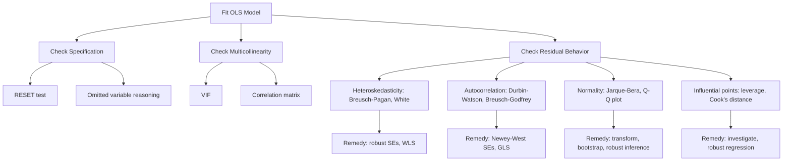

## Ordinary Least Squares and Regression Diagnostics

### Overview

Ordinary least squares (OLS) is the baseline estimator for linear regression models in econometrics, used to quantify relationships between a dependent variable and one or more explanatory variables. In financial economics, OLS underlies asset pricing tests, event studies, factor models (e.g., Fama-French regressions), yield curve modeling, and countless applied corporate finance and macro-finance exercises. Regression diagnostics are the companion toolkit used to check whether the assumptions required for OLS to be reliable actually hold in a given dataset, and what to do when they don't.

### The Linear Regression Model

The population model is written as:

$$y_i = \beta_0 + \beta_1 x_{1i} + \beta_2 x_{2i} + \cdots + \beta_k x_{ki} + u_i$$

In matrix form:

$$y = X\beta + u$$

where $y$ is an $n \times 1$ vector of the dependent variable, $X$ is an $n \times (k+1)$ matrix of regressors (including a constant column), $\beta$ is a $(k+1) \times 1$ vector of parameters, and $u$ is an $n \times 1$ vector of unobserved disturbances.

### Deriving the OLS Estimator

OLS chooses $\hat{\beta}$ to minimize the sum of squared residuals:

$$S(\beta) = \sum_{i=1}^{n}(y_i - x_i'\beta)^2 = (y - X\beta)'(y - X\beta)$$

Taking the derivative with respect to $\beta$ and setting it to zero yields the normal equations:

$$X'X\hat{\beta} = X'y$$

Provided $X'X$ is invertible (no perfect multicollinearity), the closed-form solution is:

$$\hat{\beta} = (X'X)^{-1}X'y$$

**Key Points**

- Fitted values: $\hat{y} = X\hat{\beta}$
- Residuals: $\hat{u} = y - \hat{y}$
- The residual vector is orthogonal to the regressor space: $X'\hat{u} = 0$
- The regression line always passes through the point of means $(\bar{x}, \bar{y})$ when a constant is included

### The Gauss-Markov Assumptions

OLS is the Best Linear Unbiased Estimator (BLUE) under the Gauss-Markov assumptions:

1. **Linearity in parameters**: the model is linear in $\beta$
2. **Random sampling**: observations are drawn i.i.d. from the population (or, for time series, a stationary/weakly dependent process)
3. **No perfect collinearity**: no exact linear relationship among regressors
4. **Zero conditional mean (exogeneity)**: $E[u_i \mid X] = 0$
5. **Homoskedasticity**: $\text{Var}(u_i \mid X) = \sigma^2$ (constant across observations)
6. **No autocorrelation**: $\text{Cov}(u_i, u_j \mid X) = 0$ for $i \neq j$

A seventh assumption, **normality of errors**, $u_i \mid X \sim N(0, \sigma^2)$, is not required for unbiasedness or BLUE status but is needed for exact finite-sample $t$ and $F$ inference. Without it, inference relies on asymptotic (large-sample) justification.

**Key Points**

- Assumptions 1–4 give unbiasedness: $E[\hat{\beta}] = \beta$
- Assumptions 1–6 (Gauss-Markov) give BLUE: OLS has the minimum variance among all linear unbiased estimators
- Violations don't necessarily bias $\hat{\beta}$, but they typically invalidate the standard errors, and hence hypothesis tests, unless corrected

### Variance of the OLS Estimator

Under homoskedasticity and no autocorrelation:

$$\text{Var}(\hat{\beta} \mid X) = \sigma^2 (X'X)^{-1}$$

$\sigma^2$ is estimated by:

$$\hat{\sigma}^2 = \frac{\hat{u}'\hat{u}}{n - k - 1}$$

where $n - k - 1$ is the degrees of freedom (sample size minus number of estimated parameters, including the intercept).

### Goodness of Fit

The total sum of squares decomposes as:

$$\text{SST} = \text{SSE} + \text{SSR}$$

where SST is total sum of squares, SSE is explained sum of squares, and SSR is residual (unexplained) sum of squares. $R^2$ is defined as:

$$R^2 = \frac{\text{SSE}}{\text{SST}} = 1 - \frac{\text{SSR}}{\text{SST}}$$

Adjusted $R^2$ penalizes for the number of regressors:

$$\bar{R}^2 = 1 - (1 - R^2)\frac{n-1}{n-k-1}$$

**Key Points**

- $R^2$ is non-decreasing in the number of regressors mechanically; $\bar{R}^2$ can fall if an added variable has little explanatory power
- High $R^2$ does not imply correct specification or causal validity — a spuriously trending pair of financial time series can produce a very high $R^2$ with no real relationship [Inference: this specific framing is a standard pedagogical point, but the exact magnitude in any dataset is empirical]

### Worked Example: CAPM Beta Estimation

A canonical financial application is estimating an asset's market beta via the single-factor market model:

$$R_{i,t} - R_{f,t} = \alpha_i + \beta_i (R_{m,t} - R_{f,t}) + \varepsilon_{i,t}$$

**Example**

Suppose monthly excess returns for a stock and the market over 60 months give:

- $\text{Cov}(R_i - R_f, R_m - R_f) = 0.0018$
- $\text{Var}(R_m - R_f) = 0.0012$

Then:

$$\hat{\beta}_i = \frac{\text{Cov}(R_i - R_f, R_m - R_f)}{\text{Var}(R_m - R_f)} = \frac{0.0018}{0.0012} = 1.5$$

A beta of 1.5 implies the stock's excess return moves 1.5% for each 1% move in the market's excess return, on average, over the sample period. The intercept $\hat{\alpha}_i$ is the estimated abnormal return unexplained by market exposure, central to tests of market efficiency and manager skill.

### Regression Diagnostics Overview

Diagnostics test whether the Gauss-Markov and normality assumptions are plausible for a fitted model. The main categories are: functional form/specification, multicollinearity, heteroskedasticity, autocorrelation, normality, and influential observations.



### Multicollinearity

Multicollinearity arises when regressors are highly correlated, inflating the variance of coefficient estimates without biasing them.

**Detection**

- **Variance Inflation Factor (VIF)**: $\text{VIF}_j = \frac{1}{1 - R_j^2}$, where $R_j^2$ is from regressing $x_j$ on all other regressors. A common (though somewhat arbitrary) rule of thumb flags $\text{VIF} > 10$ as concerning [Unverified: the threshold is a convention, not a derived statistical cutoff]
- Condition number of $X'X$
- Correlation matrix inspection among regressors

**Consequences**

- Inflated standard errors, unstable coefficients across sample subsets, coefficients that are individually insignificant despite a jointly significant and high $R^2$ model

**Remedies**

- Drop or combine collinear variables
- Use principal components or ridge regression
- Increase sample size where feasible
- Accept if prediction (rather than individual coefficient interpretation) is the goal, since multicollinearity does not bias forecasts

### Heteroskedasticity

Heteroskedasticity means the error variance is not constant across observations: $\text{Var}(u_i \mid X) \neq \sigma^2$. It is common in financial data — e.g., larger firms or higher-priced assets often exhibit larger absolute return variability.

**Detection**

*Breusch-Pagan test*: regress squared OLS residuals on the regressors, and test joint significance:

$$\hat{u}_i^2 = \delta_0 + \delta_1 x_{1i} + \cdots + \delta_k x_{ki} + v_i$$

The test statistic $LM = nR^2$ from this auxiliary regression is asymptotically $\chi^2_k$ under the null of homoskedasticity.

*White test*: a more general version that also includes squares and cross-products of regressors, robust to some forms of nonlinearity in the variance function.

**Consequences**

- OLS point estimates remain unbiased, but the usual standard error formula $\hat{\sigma}^2(X'X)^{-1}$ is invalid, so $t$-tests, $F$-tests, and confidence intervals become unreliable

**Remedies**

- **Heteroskedasticity-robust (White/Huber) standard errors**:

$$\widehat{\text{Var}}_{\text{robust}}(\hat{\beta}) = (X'X)^{-1}\left(\sum_i \hat{u}_i^2 x_i x_i'\right)(X'X)^{-1}$$

- **Weighted Least Squares (WLS)**, if the variance structure is known or estimable
- **Feasible Generalized Least Squares (FGLS)**

### Autocorrelation

Autocorrelation (serial correlation) means error terms are correlated across observations, typically over time: $\text{Cov}(u_t, u_{t-s}) \neq 0$. This is pervasive in financial time series (e.g., overlapping return windows, persistence in volatility, non-synchronous trading).

**Detection**

*Durbin-Watson statistic*:

$$DW = \frac{\sum_{t=2}^{n}(\hat{u}_t - \hat{u}_{t-1})^2}{\sum_{t=1}^{n}\hat{u}_t^2}$$

$DW \approx 2$ indicates no first-order autocorrelation; values near 0 suggest positive autocorrelation, values near 4 suggest negative autocorrelation. The test has known limitations: it is not valid with lagged dependent variables among regressors, and it has inconclusive regions requiring bounds tables.

*Breusch-Godfrey test*: more general, allows testing for higher-order autocorrelation and is valid with lagged dependent variables. It regresses residuals on their own lags plus the original regressors and tests joint significance of the lagged residual terms.

**Consequences**

- OLS coefficients remain unbiased (given exogeneity still holds) but are inefficient, and standard errors are typically understated when autocorrelation is positive, inflating apparent statistical significance

**Remedies**

- **Newey-West (HAC) standard errors**, robust to both heteroskedasticity and autocorrelation up to a specified lag length
- **Cochrane-Orcutt** or **Prais-Winsen** procedures for AR(1) errors
- Respecify the model (e.g., add lagged variables, model dynamics explicitly with ARMA/ARIMA components)

### Normality of Residuals

Formal $t$ and $F$ tests in finite samples assume $u_i \mid X \sim N(0, \sigma^2)$. Financial return data frequently exhibits fat tails and skewness, violating this assumption.

**Detection**

- **Jarque-Bera test**: based on sample skewness $S$ and kurtosis $K$ of residuals:

$$JB = \frac{n}{6}\left(S^2 + \frac{(K-3)^2}{4}\right)$$

Asymptotically distributed $\chi^2_2$ under the null of normality.

- Q-Q plots comparing residual quantiles to theoretical normal quantiles

**Consequences**

- With large samples, the Central Limit Theorem supports asymptotic normality of $\hat{\beta}$ regardless, so this concern is most relevant in small samples
- In small samples with non-normal errors, exact $t$/$F$ inference is unreliable

**Remedies**

- Bootstrap standard errors and confidence intervals
- Robust regression methods less sensitive to outliers
- Transform the dependent variable (e.g., log returns instead of simple returns)

### Influential Observations and Leverage

Certain observations can disproportionately affect $\hat{\beta}$.

**Leverage**: diagonal elements $h_{ii}$ of the hat matrix $H = X(X'X)^{-1}X'$, where $\hat{y} = Hy$. High leverage points have extreme regressor values.

**Studentized residuals**: residuals scaled by their estimated standard deviation, accounting for leverage, used to flag outliers in the $y$-dimension.

**Cook's Distance**: measures the combined effect of leverage and residual size on the fitted values:

$$D_i = \frac{\hat{u}_i^2}{k \cdot \hat{\sigma}^2} \cdot \frac{h_{ii}}{(1-h_{ii})^2}$$

A common informal threshold flags $D_i > 4/n$ as worth investigating [Unverified: rule of thumb, not a formally derived cutoff].

**Remedies**

- Investigate data quality for flagged points (data entry errors, corporate actions like stock splits not adjusted for, etc.)
- Robust regression (e.g., M-estimation) that downweights outliers
- Sensitivity analysis: report results with and without influential points

### Specification Testing

**RESET (Regression Equation Specification Error Test)**: adds powers of fitted values ($\hat{y}^2$, $\hat{y}^3$) to the original regression and tests their joint significance, as a general check for omitted nonlinearity or incorrect functional form.

**Omitted variable bias**: if a relevant variable $z$ correlated with both $y$ and an included regressor $x$ is omitted, $\hat{\beta}_x$ is biased. The direction of bias depends on the sign of $\text{Cov}(x, z)$ and the true coefficient on $z$:

$$\text{plim}\,\hat{\beta}_x = \beta_x + \beta_z \cdot \frac{\text{Cov}(x,z)}{\text{Var}(x)}$$

This is a central concern in empirical asset pricing, where omitting a priced risk factor can bias estimated factor loadings on included factors.

### Diagnostic Residual Plot (SVG)

<svg xmlns="http://www.w3.org/2000/svg" viewBox="0 0 640 380">
<title>Residuals vs Fitted Values (svg_diagram)</title>
<rect x="0" y="0" width="640" height="380" fill="#ffffff" />
<text x="320" y="24" font-size="16" text-anchor="middle" fill="#111827" font-family="sans-serif">Residuals vs Fitted Values (svg_diagram)</text>
<line x1="60" y1="320" x2="600" y2="320" stroke="#374151" stroke-width="1.5" />
<line x1="60" y1="60" x2="60" y2="320" stroke="#374151" stroke-width="1.5" />
<text x="330" y="355" font-size="13" text-anchor="middle" fill="#374151" font-family="sans-serif">Fitted Values</text>
<text x="24" y="190" font-size="13" text-anchor="middle" fill="#374151" font-family="sans-serif" transform="rotate(-90 24 190)">Residuals</text>
<line x1="60" y1="190" x2="600" y2="190" stroke="#9ca3af" stroke-width="1" stroke-dasharray="4,4" />
<text x="605" y="194" font-size="11" fill="#6b7280" font-family="sans-serif">0</text>
<g fill="#2563eb">
<circle cx="90" cy="185" r="4" />
<circle cx="120" cy="200" r="4" />
<circle cx="150" cy="178" r="4" />
<circle cx="180" cy="210" r="4" />
<circle cx="210" cy="170" r="4" />
<circle cx="240" cy="225" r="4" />
<circle cx="270" cy="160" r="4" />
<circle cx="300" cy="240" r="4" />
<circle cx="330" cy="150" r="4" />
<circle cx="360" cy="255" r="4" />
<circle cx="390" cy="140" r="4" />
<circle cx="420" cy="270" r="4" />
<circle cx="450" cy="125" r="4" />
<circle cx="480" cy="285" r="4" />
<circle cx="510" cy="110" r="4" />
<circle cx="540" cy="300" r="4" />
<circle cx="570" cy="95" r="4" />
</g>
<text x="330" y="70" font-size="12" text-anchor="middle" fill="#dc2626" font-family="sans-serif">Funnel/fan shape suggests heteroskedasticity</text>
</svg>

The widening spread of residuals as fitted values increase (a "fan" or "megaphone" pattern) is a classic visual signal of heteroskedasticity, prompting a Breusch-Pagan/White test and consideration of robust standard errors.

### Sample R-Style Implementation Pattern

```r
model <- lm(excess_return ~ mkt_excess + smb + hml, data = portfolio_data)
summary(model)

# Heteroskedasticity test
library(lmtest)
bptest(model)

# Robust (HC1) standard errors
library(sandwich)
coeftest(model, vcov = vcovHC(model, type = "HC1"))

# Newey-West HAC standard errors
coeftest(model, vcov = NeweyWest(model, lag = 4))

# Autocorrelation test
bgtest(model, order = 4)

# Multicollinearity
library(car)
vif(model)

# Influence diagnostics
cooks.distance(model)
```

**Output**

Behavior such as exact function names (`bptest`, `vcovHC`, `NeweyWest`) reflects standard usage in the `lmtest`, `sandwich`, and `car` packages as documented; exact numerical output will vary by dataset, package version, and estimation options. [Inference: general workflow pattern is standard practice; specific output values are data-dependent]

### Conclusion

OLS remains the workhorse estimator in financial econometrics because of its computational simplicity, interpretability, and the strong optimality properties (BLUE) it enjoys under the Gauss-Markov assumptions. However, financial data — with its fat tails, time-varying volatility, and serial dependence — routinely violates several of these assumptions. Regression diagnostics are therefore not optional add-ons but a required step: they determine whether reported standard errors, test statistics, and confidence intervals can be trusted, and they guide the choice of appropriate remedies (robust standard errors, GLS/WLS, HAC estimators, or respecification) before any inference is drawn from the fitted model.

**Related Topics**

- Generalized Least Squares (GLS) and Feasible GLS
- Instrumental variables estimation and two-stage least squares (endogeneity)
- Panel data methods: fixed effects and random effects models
- Time series diagnostics: unit roots, stationarity, and cointegration
- Heteroskedasticity and autocorrelation consistent (HAC) covariance estimation in depth
- Maximum likelihood estimation as an alternative to OLS
- GARCH models for time-varying volatility in financial returns
- Fama-MacBeth two-step regression procedure