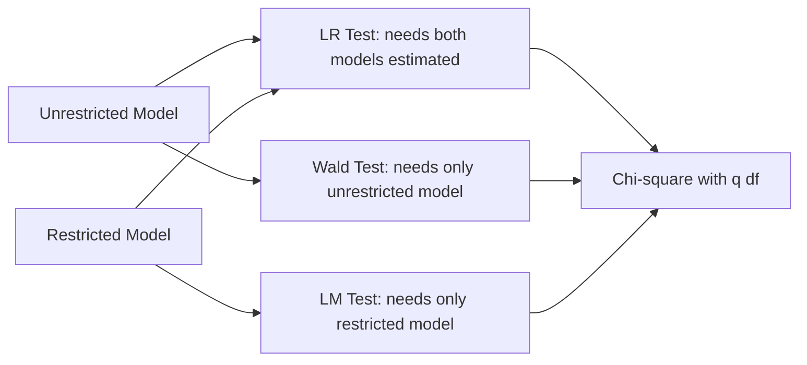

## Maximum Likelihood Estimation

### Overview

Maximum likelihood estimation (MLE) is a general-purpose method for estimating the parameters of a statistical model by choosing the parameter values that make the observed data most probable under an assumed distributional form. In financial economics, MLE underlies volatility modeling (GARCH family), discrete choice models (default/bankruptcy prediction), duration models (time-to-default), and many asset pricing models estimated via structural or reduced-form likelihoods.

### The Likelihood Function

Given a sample $\{y_1, y_2, \ldots, y_n\}$ assumed to be drawn from a distribution with density $f(y_i; \theta)$ indexed by parameter vector $\theta$, and assuming independence across observations, the likelihood function is:

$$L(\theta; y) = \prod_{i=1}^{n} f(y_i; \theta)$$

Because products of many small probabilities are numerically unstable and analytically harder to differentiate, the **log-likelihood** is used instead:

$$\ell(\theta; y) = \ln L(\theta; y) = \sum_{i=1}^{n} \ln f(y_i; \theta)$$

The maximum likelihood estimator is:

$$\hat{\theta}_{MLE} = \arg\max_{\theta} \ell(\theta; y)$$

**Key Points**

- The log transformation is monotonic, so maximizing $\ell(\theta)$ and $L(\theta)$ yield the same $\hat{\theta}$
- MLE requires a fully specified parametric distribution, unlike OLS, which only requires assumptions on the first two moments
- If the distributional assumption is correct, MLE is asymptotically efficient (achieves the Cramér-Rao lower bound)

### First-Order Conditions and the Score Function

The **score function** is the gradient of the log-likelihood with respect to $\theta$:

$$S(\theta) = \frac{\partial \ell(\theta)}{\partial \theta}$$

The MLE solves the score equations:

$$S(\hat{\theta}_{MLE}) = 0$$

For many models (e.g., logistic regression, GARCH), this system has no closed-form solution and must be solved numerically.

### Worked Example: MLE of the Normal Distribution

Suppose $y_i \sim N(\mu, \sigma^2)$ i.i.d. The log-likelihood is:

$$\ell(\mu, \sigma^2) = -\frac{n}{2}\ln(2\pi) - \frac{n}{2}\ln(\sigma^2) - \frac{1}{2\sigma^2}\sum_{i=1}^{n}(y_i - \mu)^2$$

**Example**

Taking the derivative with respect to $\mu$ and setting it to zero:

$$\frac{\partial \ell}{\partial \mu} = \frac{1}{\sigma^2}\sum_{i=1}^{n}(y_i - \mu) = 0 \implies \hat{\mu}_{MLE} = \bar{y} = \frac{1}{n}\sum_{i=1}^{n} y_i$$

Taking the derivative with respect to $\sigma^2$:

$$\frac{\partial \ell}{\partial \sigma^2} = -\frac{n}{2\sigma^2} + \frac{1}{2\sigma^4}\sum_{i=1}^{n}(y_i - \mu)^2 = 0 \implies \hat{\sigma}^2_{MLE} = \frac{1}{n}\sum_{i=1}^{n}(y_i - \hat{\mu})^2$$

Note that $\hat{\sigma}^2_{MLE}$ divides by $n$, not $n-1$, and is therefore biased in finite samples (though consistent). This is a well-documented property of the normal MLE, distinct from the unbiased sample variance estimator.

### Asymptotic Properties

Under standard regularity conditions (correct specification, identifiability, smoothness of the likelihood), the MLE has three key large-sample properties:

1. **Consistency**: $\hat{\theta}_{MLE} \xrightarrow{p} \theta_0$ as $n \to \infty$
2. **Asymptotic normality**:

$$\sqrt{n}(\hat{\theta}_{MLE} - \theta_0) \xrightarrow{d} N(0, I(\theta_0)^{-1})$$

where $I(\theta_0)$ is the Fisher information matrix.

3. **Asymptotic efficiency**: the MLE attains the Cramér-Rao lower bound asymptotically, meaning no consistent, asymptotically normal estimator has a smaller asymptotic variance

**Fisher Information**: measures the expected curvature of the log-likelihood:

$$I(\theta) = -E\left[\frac{\partial^2 \ell(\theta)}{\partial \theta \, \partial \theta'}\right]$$

The estimated variance-covariance matrix of $\hat{\theta}$ is typically computed as the inverse of the **observed** information (the negative Hessian evaluated at $\hat{\theta}$), or via the **outer product of gradients (OPG)** estimator, or a **sandwich (robust) estimator** when the model may be misspecified.

### Hypothesis Testing Under MLE

Three classical test procedures are built directly on the likelihood framework:

**Likelihood Ratio (LR) test**: compares the log-likelihood of the unrestricted model to a restricted (null) model:

$$LR = 2(\ell_{unrestricted} - \ell_{restricted}) \xrightarrow{d} \chi^2_q$$

where $q$ is the number of restrictions.

**Wald test**: uses only the unrestricted estimates and their estimated covariance to test restrictions $R\theta = r$:

$$W = (R\hat{\theta} - r)' \left[R \, \widehat{\text{Var}}(\hat{\theta}) \, R'\right]^{-1} (R\hat{\theta} - r) \xrightarrow{d} \chi^2_q$$

**Lagrange Multiplier (LM) / Score test**: uses only the restricted model, evaluating the score at the restricted estimate:

$$LM = S(\hat{\theta}_r)' \, I(\hat{\theta}_r)^{-1} \, S(\hat{\theta}_r) \xrightarrow{d} \chi^2_q$$

**Key Points**

- All three tests are asymptotically equivalent under the null hypothesis
- LR requires estimating both models; Wald and LM each require estimating only one, which can be computationally convenient when one model is much harder to fit

### Numerical Optimization

Since closed-form solutions are rare outside simple distributions, MLE typically relies on iterative numerical algorithms:

- **Newton-Raphson**: uses the Hessian for fast (quadratic) local convergence, but can be unstable if the Hessian is not negative definite
- **BHHH (Berndt-Hall-Hall-Hausman)**: approximates the Hessian using the outer product of the score/gradient, avoiding the need to compute second derivatives directly; common in econometric software for GARCH and discrete choice models
- **BFGS / quasi-Newton methods**: build up an approximation to the Hessian iteratively, widely used as a default optimizer
- **EM (Expectation-Maximization) algorithm**: used when the model involves latent/unobserved variables (e.g., regime-switching models, mixtures)

**Key Points**

- Optimization can converge to a local rather than global maximum, especially in models with multiple parameters or flat likelihood regions; multiple starting values are standard practice to check robustness
- Convergence failures or boundary solutions (e.g., variance parameters approaching zero) are common diagnostic red flags in applied work [Inference: general software behavior across common econometric packages, not a claim about a specific tool]

### Application: MLE Estimation of a GARCH(1,1) Model

A leading financial application is estimating conditional variance dynamics. The GARCH(1,1) model specifies:

$$r_t = \mu + \varepsilon_t, \quad \varepsilon_t = \sigma_t z_t, \quad z_t \sim N(0,1)$$

$$\sigma_t^2 = \omega + \alpha \varepsilon_{t-1}^2 + \beta \sigma_{t-1}^2$$

Conditional on past information, $\varepsilon_t \mid \mathcal{F}_{t-1} \sim N(0, \sigma_t^2)$, so the log-likelihood contribution of each observation is:

$$\ell_t(\theta) = -\frac{1}{2}\ln(2\pi) - \frac{1}{2}\ln(\sigma_t^2) - \frac{\varepsilon_t^2}{2\sigma_t^2}$$

summed over $t = 1, \ldots, T$ to form the sample log-likelihood, maximized numerically over $\theta = (\mu, \omega, \alpha, \beta)$ subject to constraints $\omega > 0$, $\alpha, \beta \geq 0$, $\alpha + \beta < 1$ (for covariance stationarity).

**Output**

Typical estimation output reports $\hat{\omega}$, $\hat{\alpha}$, $\hat{\beta}$, standard errors (often robust/QML-based, discussed below), and the maximized log-likelihood value, alongside diagnostics like the Ljung-Box test on standardized residuals to check whether volatility clustering has been adequately captured. Exact coefficient values and significance depend on the specific return series and sample period used. [Unverified: output values are empirical and dataset-dependent, not fixed facts]

### Quasi-Maximum Likelihood Estimation (QMLE)

In practice, the true distribution of financial returns is rarely exactly normal (fat tails, skewness are common). **Quasi-MLE** proceeds by maximizing a (possibly misspecified) Gaussian likelihood anyway, because doing so still yields consistent estimates of the conditional mean and variance parameters under weaker conditions — this is the standard justification for widespread use of Gaussian QMLE in GARCH estimation.

Because the assumed distribution may be wrong, standard errors must be adjusted using the **sandwich (robust) covariance estimator**:

$$\widehat{\text{Var}}(\hat{\theta}) = I(\hat{\theta})^{-1} \, J(\hat{\theta}) \, I(\hat{\theta})^{-1}$$

where $J(\theta)$ is the outer product of scores (estimating the variance of the score), and $I(\theta)$ is the Hessian-based information matrix. This is often called the **Bollerslev-Wooldridge robust standard error** in the GARCH literature.

### MLE vs. OLS: Comparison

| Aspect | OLS | MLE |
| --- | --- | --- |
| Distributional assumption | Not required for unbiasedness (needed only for exact finite-sample inference) | Required for the estimator itself |
| Objective | Minimize sum of squared residuals | Maximize likelihood of observed data |
| Efficiency | BLUE under Gauss-Markov | Asymptotically efficient if distribution correctly specified |
| Equivalence | — | Under normal errors and homoskedasticity, MLE and OLS estimators of $\beta$ coincide exactly |
| Typical financial use | Linear factor models, event studies | GARCH, discrete choice, duration models, latent variable models |

**Key Points**

- When errors are assumed i.i.d. normal, MLE of a linear regression model gives $\hat{\beta}_{MLE} = \hat{\beta}_{OLS}$; the two methods diverge only in the variance estimator ($\hat{\sigma}^2_{MLE}$ uses $n$ in the denominator versus $n-k-1$ for the standard unbiased OLS estimator)

### Common Financial Applications of MLE

- **GARCH/EGARCH/GJR-GARCH** models of conditional volatility
- **Probit and logit models** for corporate default, bond rating migration, or IPO decisions
- **Duration/hazard models** (e.g., Cox proportional hazards) for time-to-default or time-to-bankruptcy
- **Regime-switching (Markov-switching) models** for business cycle or bull/bear market identification
- **Term structure models** (e.g., Vasicek, CIR) estimated via MLE using the transition density of the short rate process
- **Copula-based dependence models** for portfolio tail-risk estimation

### Conclusion

Maximum likelihood estimation provides a unified, theoretically grounded framework for parameter estimation whenever a plausible parametric model for the data-generating process can be specified. Its asymptotic efficiency makes it the preferred approach whenever the underlying distribution is well understood, and its flexibility allows it to handle nonlinear, non-normal, and latent-variable models that OLS cannot address. In financial economics specifically, MLE (and its quasi-likelihood variant) is the backbone of volatility modeling, credit risk modeling, and dynamic term structure estimation, though its reliance on distributional assumptions means diagnostic checking and robust standard errors remain essential complements to the point estimates.

**Related Topics**

- GARCH and stochastic volatility model families
- Quasi-maximum likelihood and robust (sandwich) standard errors in depth
- Discrete choice models: probit, logit, and multinomial extensions
- The EM algorithm and latent variable/regime-switching models
- Generalized Method of Moments (GMM) as an alternative estimation framework
- Bayesian estimation methods (MCMC) as a contrast to classical MLE
- Information criteria (AIC, BIC) for model selection based on likelihood
- Kalman filtering and state-space model estimation via likelihood methods