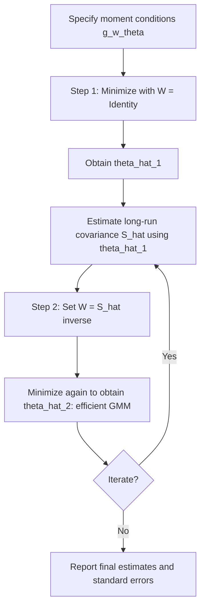

## Generalized Method of Moments

### Overview

Generalized Method of Moments (GMM) is an estimation framework that derives parameter estimates from **moment conditions** — theoretical restrictions implied by an economic model — without requiring a fully specified likelihood function. Developed formally by Lars Peter Hansen (1982), GMM is central to financial economics because many asset pricing models (consumption-based CAPM, stochastic discount factor models, rational expectations models) deliver moment restrictions (e.g., Euler equations) directly, but not a tractable full-distribution likelihood.

### Moment Conditions

The starting point is a vector of **population moment conditions** implied by economic theory:

$$E[g(w_i, \theta_0)] = 0$$

where $w_i$ is the data for observation $i$, $\theta_0$ is the true parameter vector (dimension $p$), and $g(\cdot)$ is a vector of functions (dimension $q$) representing the moment restrictions.

**Key Points**

- If $q = p$ (exactly identified case), the model can typically be solved so the sample moments equal zero exactly — this is the classical **Method of Moments (MM)**
- If $q > p$ (overidentified case), no parameter vector can generally set all sample moment conditions to exactly zero simultaneously, so GMM instead minimizes a weighted quadratic form of the sample moments
- If $q < p$, the parameters are not identified from these moments alone

### The GMM Objective Function

The sample analog of the moment condition is:

$$\bar{g}_n(\theta) = \frac{1}{n}\sum_{i=1}^{n} g(w_i, \theta)$$

GMM chooses $\hat{\theta}$ to minimize a quadratic form:

$$J_n(\theta) = \bar{g}_n(\theta)' \, W_n \, \bar{g}_n(\theta)$$

where $W_n$ is a $q \times q$ positive semi-definite **weighting matrix**. The GMM estimator is:

$$\hat{\theta}_{GMM} = \arg\min_{\theta} \bar{g}_n(\theta)' \, W_n \, \bar{g}_n(\theta)$$

**Key Points**

- Different choices of $W_n$ yield different (but all consistent) GMM estimators
- The choice of $W_n$ affects only efficiency, not consistency, provided the moment conditions are correctly specified

### Choice of Weighting Matrix and Efficient GMM

The **optimal (efficient) weighting matrix** is the inverse of the long-run covariance matrix of the moment conditions:

$$W_n^* = S^{-1}, \quad S = \text{Avar}\left[\sqrt{n}\,\bar{g}_n(\theta_0)\right]$$

Since $S$ depends on the unknown $\theta_0$, efficient GMM is typically implemented in two steps:

1. **First step**: estimate $\hat{\theta}^{(1)}$ using an arbitrary positive-definite weighting matrix, commonly $W_n = I$ (the identity matrix)
2. **Second step**: use $\hat{\theta}^{(1)}$ to construct a consistent estimate $\hat{S}$ of the moment covariance matrix, set $W_n = \hat{S}^{-1}$, and re-minimize to obtain $\hat{\theta}^{(2)}$, the **two-step efficient GMM estimator**

This procedure can be iterated further (**iterated GMM**) until the estimates converge, or replaced by **continuously updated GMM (CU-GMM)**, which re-estimates $S(\theta)$ at every candidate $\theta$ within a single optimization rather than in discrete steps.

### Asymptotic Properties

Under standard regularity conditions (correct moment specification, identification, stationarity/ergodicity of the data), the GMM estimator is:

- **Consistent**: $\hat{\theta}_{GMM} \xrightarrow{p} \theta_0$
- **Asymptotically normal**:

$$\sqrt{n}(\hat{\theta}_{GMM} - \theta_0) \xrightarrow{d} N\left(0, \, (D'WD)^{-1} D'WSWD(D'WD)^{-1}\right)$$

where $D = E\left[\frac{\partial g(w_i,\theta_0)}{\partial \theta'}\right]$. With the efficient weighting matrix $W = S^{-1}$, this simplifies to:

$$\sqrt{n}(\hat{\theta}_{GMM} - \theta_0) \xrightarrow{d} N\left(0, \, (D'S^{-1}D)^{-1}\right)$$

which is the smallest asymptotic variance achievable among GMM estimators using this moment set.

### Test of Overidentifying Restrictions (Hansen's J-test)

When $q > p$, the model imposes more restrictions than needed for identification, allowing a specification test. Under efficient two-step or iterated GMM, the minimized objective function scaled by $n$ is asymptotically chi-squared:

$$J = n \cdot \bar{g}_n(\hat{\theta})' \hat{S}^{-1} \bar{g}_n(\hat{\theta}) \xrightarrow{d} \chi^2_{q-p}$$

**Key Points**

- A large, statistically significant $J$-statistic suggests the moment conditions are not jointly consistent with the data — i.e., the model or instrument set may be misspecified
- The J-test has no power to detect misspecification in the exactly identified case ($q = p$), since the objective function is driven to exactly zero regardless of model validity

### Worked Example: Linear Instrumental Variables as GMM

Standard IV/2SLS estimation is a special case of GMM. Consider the linear model $y_i = x_i'\beta + u_i$ with instruments $z_i$ (dimension $q \geq p$) satisfying $E[z_i u_i] = 0$.

**Example**

The moment condition is:

$$g(w_i, \beta) = z_i (y_i - x_i'\beta)$$

so $E[z_i(y_i - x_i'\beta_0)] = 0$. The sample moment is $\bar{g}_n(\beta) = \frac{1}{n}Z'(y - X\beta)$. Minimizing $\bar{g}_n(\beta)'W\bar{g}_n(\beta)$ with $W = (Z'Z)^{-1}$ yields the classical two-stage least squares (2SLS) estimator:

$$\hat{\beta}_{2SLS} = \left[X'Z(Z'Z)^{-1}Z'X\right]^{-1} X'Z(Z'Z)^{-1}Z'y$$

Using the efficient GMM weighting matrix $W = \hat{S}^{-1}$ (which allows for heteroskedasticity or autocorrelation in $u_i$) instead of $(Z'Z)^{-1}$ produces the more general and, under those conditions, more efficient **two-step efficient GMM-IV estimator**, sometimes labeled GMM2SLS in applied work.

### Application: Hansen-Singleton Consumption CAPM Estimation

The canonical financial application motivating Hansen's original development of GMM is testing the Euler equation from the consumption-based asset pricing model. The first-order condition for optimal consumption/investment choice is:

$$E_t\left[\beta \left(\frac{C_{t+1}}{C_t}\right)^{-\gamma} R_{t+1} \, \Big| \, \mathcal{F}_t \right] = 1$$

where $\beta$ is the subjective discount factor, $\gamma$ is the coefficient of relative risk aversion, $C_t$ is consumption, and $R_{t+1}$ is a gross asset return.

**Example**

Because this conditional expectation holds for any variable $z_t$ in the time-$t$ information set (an instrument, such as lagged consumption growth or lagged returns), it generates unconditional moment conditions:

$$E\left[\left(\beta \left(\frac{C_{t+1}}{C_t}\right)^{-\gamma} R_{t+1} - 1\right) z_t\right] = 0$$

Stacking this condition across multiple assets and instruments produces an overidentified system ($q > p = 2$ parameters: $\beta, \gamma$), estimable by GMM without specifying the full joint distribution of consumption growth and returns — only the Euler equation moment restriction is needed. This is precisely the setting where MLE would require strong, likely fragile, distributional assumptions that GMM avoids.

**Output**

Empirical GMM estimates of $\gamma$ from this framework have historically come out implausibly large in many datasets relative to standard risk-aversion priors, a finding widely referred to in the literature as the **equity premium puzzle** (Mehra and Prescott). [Unverified: specific numerical magnitudes are sample- and specification-dependent and evolve with updated data vintages]

### GMM vs. MLE vs. OLS

| Aspect | OLS | MLE | GMM |
| --- | --- | --- | --- |
| Requires distributional assumption | No (for consistency) | Yes | No |
| Basis for estimation | Minimize squared residuals | Maximize likelihood | Set weighted sample moments near zero |
| Efficiency | BLUE under Gauss-Markov | Asymptotically efficient if correctly specified | Efficient within the class using the given moments; MLE score is itself a valid, typically most efficient, moment condition |
| Handles endogeneity | No (without modification) | Requires structural/likelihood modification | Naturally, via instrument-based moment conditions |
| Specification test | Not built-in | LR/Wald/LM tests (requires distributional correctness) | J-test of overidentifying restrictions |

**Key Points**

- MLE can be shown to be a special case of GMM where the moment condition is the score function $g(w_i,\theta) = \partial \ln f(w_i;\theta)/\partial \theta$; under correct specification, MLE's moment condition attains the efficiency bound, so correctly specified MLE is (asymptotically) at least as efficient as GMM using other moments
- GMM's core appeal is robustness: it delivers consistent estimates using only the moment restrictions the researcher is willing to assert, without the entire distributional apparatus needed for full MLE

### Practical Implementation Considerations

- **Instrument/moment relevance**: weak instruments (moment conditions only weakly informative about $\theta$) cause poor finite-sample performance and unreliable asymptotic approximations, a well-documented concern in applied IV/GMM work
- **HAC-robust weighting matrix estimation**: since $S$ often must account for serial correlation (e.g., due to overlapping return horizons), Newey-West-type kernel estimators are standard for constructing $\hat{S}$
- **Finite-sample bias**: two-step and iterated GMM can exhibit small-sample bias, especially with many overidentifying restrictions; alternatives like continuously updated GMM or empirical likelihood methods are sometimes preferred in these settings [Inference: general finding widely discussed in the GMM literature; exact severity depends on sample size and moment count]
- **Numerical optimization**: as with MLE, the GMM objective is minimized numerically (Newton-type or derivative-free methods) when no closed form exists

### Common Financial Applications of GMM

- **Consumption-based and stochastic discount factor asset pricing models** (Euler equation estimation)
- **Testing linear factor models** (Fama-French, momentum) via GMM-based cross-sectional asset pricing tests (e.g., Hansen-Jagannathan distance)
- **Dynamic panel data models** in corporate finance (Arellano-Bond estimator is a GMM estimator)
- **Term structure and interest rate models** where moment conditions come from no-arbitrage restrictions
- **Volatility and jump-diffusion models** estimated via simulated method of moments when likelihoods are intractable

### Conclusion

GMM occupies a middle ground between OLS and MLE: it is more flexible than OLS because it naturally accommodates endogeneity and nonlinear moment restrictions, and less demanding than MLE because it requires only correctly specified moment conditions rather than a full distributional model. This makes it especially well suited to financial economics, where theoretical models frequently deliver Euler equations, no-arbitrage conditions, or orthogonality restrictions directly, without implying a convenient likelihood. The framework's built-in overidentification test (the J-test) also provides a natural specification check that OLS lacks and that MLE can only replicate under strong distributional assumptions.

**Related Topics**

- Instrumental variables estimation and two-stage least squares
- Hansen-Jagannathan bounds and stochastic discount factor models
- Weak instrument diagnostics and robust inference
- Simulated Method of Moments (SMM) for intractable likelihoods
- Arellano-Bond and dynamic panel GMM estimators
- Empirical likelihood as an alternative to GMM weighting
- Euler equation estimation in consumption-based asset pricing
- Newey-West HAC covariance matrix estimation in depth