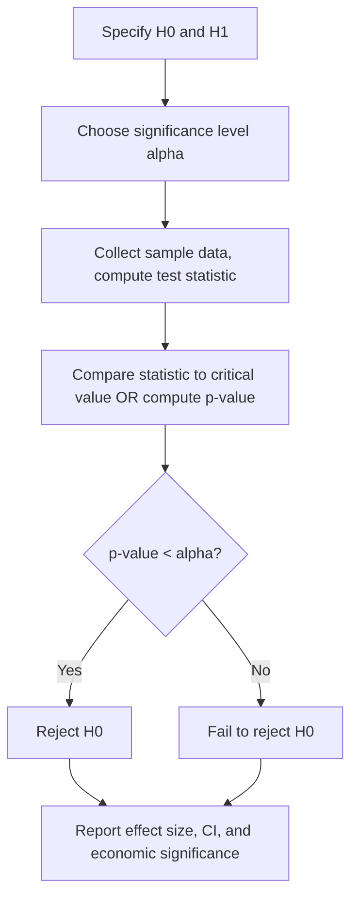

## Hypothesis Testing and Statistical Inference

### Overview and Role in Financial Economics

Statistical inference is the process of drawing conclusions about a population or a data-generating process from a finite sample. In financial economics it underlies nearly every empirical exercise: testing whether an asset pricing factor carries a nonzero risk premium, whether markets are efficient, whether a fund manager's alpha is genuinely different from zero, or whether a regression coefficient is statistically significant. Hypothesis testing provides the formal decision framework for these questions under sampling uncertainty.

### Foundational Concepts

#### Population, Sample, and Estimators

A **population** is the full set of outcomes a random variable can take; a **sample** is a finite, observed subset. An **estimator** $\hat\theta$ is a function of the sample data used to infer an unknown population parameter $\theta$ (e.g., a mean return, a beta coefficient, a variance).

Key estimator properties:

- **Unbiasedness:** $E[\hat\theta] = \theta$
- **Consistency:** $\hat\theta \xrightarrow{p} \theta$ as sample size $n \to \infty$
- **Efficiency:** among unbiased estimators, the one with the smallest variance
- **Sampling distribution:** the probability distribution of $\hat\theta$ across hypothetical repeated samples — the basis for all inference

#### The Central Limit Theorem (CLT)

For i.i.d. random variables $X_1, \dots, X_n$ with mean $\mu$ and finite variance $\sigma^2$:

$$\sqrt{n}(\bar X_n - \mu) \xrightarrow{d} N(0, \sigma^2)$$

This is the theoretical bedrock that permits normal-based inference (t-tests, z-tests, confidence intervals) even when the underlying data is not normally distributed, provided $n$ is reasonably large. In finance, this justifies treating sample averages of returns as approximately normal despite returns themselves often being fat-tailed and skewed.

### The Hypothesis Testing Framework

#### Setting Up Hypotheses

- **Null hypothesis** $H_0$: the default/status-quo claim (e.g., "the factor risk premium is zero," "the market is efficient," "$\beta = 1$")
- **Alternative hypothesis** $H_1$ or $H_A$: the claim accepted if $H_0$ is rejected

Tests can be:

- **Two-sided:** $H_0: \theta = \theta_0$ vs. $H_1: \theta \ne \theta_0$
- **One-sided:** $H_0: \theta \le \theta_0$ vs. $H_1: \theta > \theta_0$ (or the mirror image)

#### Type I and Type II Errors

|  | $H_0$ True | $H_0$ False |
| --- | --- | --- |
| **Reject $H_0$** | Type I Error (probability $\alpha$) | Correct decision (power $= 1-\beta$) |
| **Fail to reject $H_0$** | Correct decision | Type II Error (probability $\beta$) |

- **Significance level ($\alpha$):** the probability of a Type I error the researcher is willing to tolerate, conventionally set at 0.01, 0.05, or 0.10
- **Power ($1-\beta$):** the probability of correctly rejecting a false null; power increases with sample size, effect size, and lower variance

There is an inherent trade-off: for a fixed sample size, decreasing $\alpha$ (being more conservative about false positives) increases $\beta$ (more false negatives), reducing power.

#### Test Statistics and Decision Rules

A test statistic is a function of the data whose distribution under $H_0$ is known. The general form for a mean-based test:

$$t = \frac{\hat\theta - \theta_0}{SE(\hat\theta)}$$

**Decision rule:** reject $H_0$ if the test statistic falls in the rejection region (critical region), determined by comparing against critical values from the relevant reference distribution (normal, $t$, $\chi^2$, $F$) at the chosen $\alpha$.

#### The p-value

The p-value is the probability, under $H_0$, of observing a test statistic at least as extreme as the one actually computed. Reject $H_0$ if $p < \alpha$.

**Common misinterpretation:** the p-value is **not** the probability that $H_0$ is true, nor is $1-p$ the probability that $H_1$ is true. It is a statement about the probability of the data (or more extreme data) given the null — a frequentist, not a Bayesian, quantity.

### Key Test Statistics and Their Distributions

#### The z-test

Used when the population variance $\sigma^2$ is known (rare in practice) or the sample is large enough that $\hat\sigma$ is treated as $\sigma$:

$$z = \frac{\bar X - \mu_0}{\sigma/\sqrt{n}} \sim N(0,1) \text{ under } H_0$$

#### The t-test

Used when $\sigma^2$ is unknown and estimated from the sample — the standard case in finance with finite samples:

$$t = \frac{\bar X - \mu_0}{s/\sqrt{n}} \sim t_{n-1} \text{ under } H_0$$

As $n \to \infty$, the $t$-distribution converges to the standard normal, so for large samples (a common situation with daily/monthly financial time series spanning many years) $z$ and $t$ tests give nearly identical results.

**Example: Testing Whether Average Excess Return Is Zero**

Suppose a fund's monthly excess returns over 60 months have sample mean $\bar r = 0.85\%$ and sample standard deviation $s = 4.2\%$. Test $H_0: \mu = 0$ vs. $H_1: \mu \ne 0$ at $\alpha = 0.05$.

$$t = \frac{0.0085 - 0}{0.042/\sqrt{60}} = \frac{0.0085}{0.00542} \approx 1.568$$

With $n-1 = 59$ degrees of freedom, the two-sided critical value is approximately $\pm 2.00$. Since $|1.568| < 2.00$, we fail to reject $H_0$ — there is insufficient evidence at the 5% level that this fund's average excess return differs from zero, even though the point estimate is economically positive. This is a classic illustration of the gap between economic and statistical significance.

#### The Chi-Square Test

Used for tests involving variances, goodness-of-fit, and independence in contingency tables:

$$\chi^2 = \frac{(n-1)s^2}{\sigma_0^2} \sim \chi^2_{n-1} \text{ under } H_0: \sigma^2 = \sigma_0^2$$

#### The F-test

Used to compare two variances, or to test joint hypotheses in regression (e.g., whether a group of coefficients are jointly zero):

$$F = \frac{s_1^2/\sigma_1^2}{s_2^2/\sigma_2^2} \sim F_{n_1-1, n_2-1} \text{ under } H_0: \sigma_1^2 = \sigma_2^2$$

In regression analysis, the F-test for overall significance compares a restricted model (e.g., intercept only) to an unrestricted model:

$$F = \frac{(RSS_r - RSS_u)/q}{RSS_u/(n-k)} \sim F_{q, n-k}$$

where $q$ is the number of restrictions, $RSS_r$ and $RSS_u$ are restricted and unrestricted residual sums of squares, and $n-k$ is the residual degrees of freedom in the unrestricted model.

### Confidence Intervals

A $(1-\alpha)$ confidence interval is the set of parameter values that would **not** be rejected by a two-sided test at level $\alpha$ — confidence intervals and hypothesis tests are two views of the same underlying inferential machinery.

$$CI_{1-\alpha} = \hat\theta \pm t_{\alpha/2, \, n-1} \cdot SE(\hat\theta)$$

**Interpretation:** across repeated sampling, $(1-\alpha)\times100\%$ of such constructed intervals would contain the true parameter. It is **not** correct to say "there is a 95% probability the true parameter lies in this particular interval" under the frequentist interpretation — the parameter is fixed, not random; the randomness is in the interval's construction across hypothetical repeated samples. [Inference: this frequentist-vs-common-language distinction is a standard pedagogical point but is often glossed over informally even by practitioners — treat the loose reading as a simplification rather than the technically correct statement.]

### Errors, Multiple Testing, and Financial Applications

#### The Multiple Testing Problem

When many hypotheses are tested simultaneously (e.g., screening thousands of trading strategies or "factors" for statistical significance), the probability of at least one false positive rises sharply. If $m$ independent tests are each run at $\alpha = 0.05$:

$$P(\text{at least one false positive}) = 1-(1-\alpha)^m$$

This is central to the "factor zoo" problem and data-mining/backtest-overfitting concerns in empirical asset pricing — the more strategies tested, the more likely one appears "significant" by chance alone. Common corrections include the **Bonferroni correction** ($\alpha_{adjusted} = \alpha/m$) and control of the **False Discovery Rate (FDR)**.

#### Specification and Robustness in Regression-Based Tests

Standard $t$- and $F$-tests in OLS regression rely on assumptions (homoskedasticity, no autocorrelation, correct functional form). Financial time series routinely violate these:

- **Heteroskedasticity** (volatility clustering) — addressed with heteroskedasticity-robust (White) standard errors
- **Autocorrelation** (serial dependence in returns/errors) — addressed with Newey-West (HAC) standard errors
- Failure to correct standard errors under these violations leads to invalid (typically overstated) test statistics and spurious rejections of $H_0$

### Bayesian vs. Frequentist Inference (Brief Contrast)

| Aspect | Frequentist | Bayesian |
| --- | --- | --- |
| Parameter view | Fixed, unknown constant | Random variable with a distribution |
| Core object | p-value, confidence interval | Posterior distribution |
| Prior information | Not formally incorporated | Explicit prior, updated via Bayes' rule |
| Interpretation | Long-run frequency across repeated samples | Degree of belief given the data |

Bayesian methods are increasingly used in finance for portfolio choice under parameter uncertainty (e.g., Black-Litterman) and for model averaging, but classical (frequentist) hypothesis testing remains the dominant framework in empirical asset pricing and standard econometric practice.

### Common Pitfalls

- **Confusing statistical and economic significance:** a highly significant coefficient (small p-value) from a huge dataset can be economically trivial in magnitude, and vice versa in small samples.
- **p-hacking / data snooping:** repeatedly testing until a significant result appears, without correcting for the number of tests performed.
- **Ignoring non-i.i.d. structure:** applying standard t-tests to serially correlated or heteroskedastic financial returns without robust standard errors.
- **Overinterpreting "fail to reject":** failing to reject $H_0$ is not equivalent to proving $H_0$ true — it may simply reflect low power (a small sample or large variance).

### Applications in Financial Economics

- **Testing asset pricing models** (CAPM, Fama-French factors): testing whether Jensen's alpha is significantly different from zero
- **Market efficiency tests**: testing for predictability in returns (e.g., testing autocorrelation coefficients against zero)
- **Event studies**: testing whether abnormal returns around a corporate event (earnings announcement, M&A) are statistically significant
- **Testing for structural breaks**: whether a relationship (e.g., a beta, a volatility regime) has changed over time (Chow test)
- **GMM and instrumental variables tests**: overidentifying restriction tests (e.g., Hansen's J-test) in asset pricing moment conditions
- **Risk management backtesting**: testing whether VaR exceedances match their theoretical frequency (Kupiec test)

**Related Topics**

- Ordinary least squares (OLS) regression and the Gauss-Markov theorem
- Maximum likelihood estimation
- Generalized Method of Moments (GMM)
- Time series properties: stationarity, autocorrelation, unit roots
- Heteroskedasticity- and autocorrelation-consistent (HAC) standard errors
- Multiple hypothesis testing corrections (Bonferroni, FDR)
- Bayesian econometrics and the Black-Litterman model
- Event study methodology