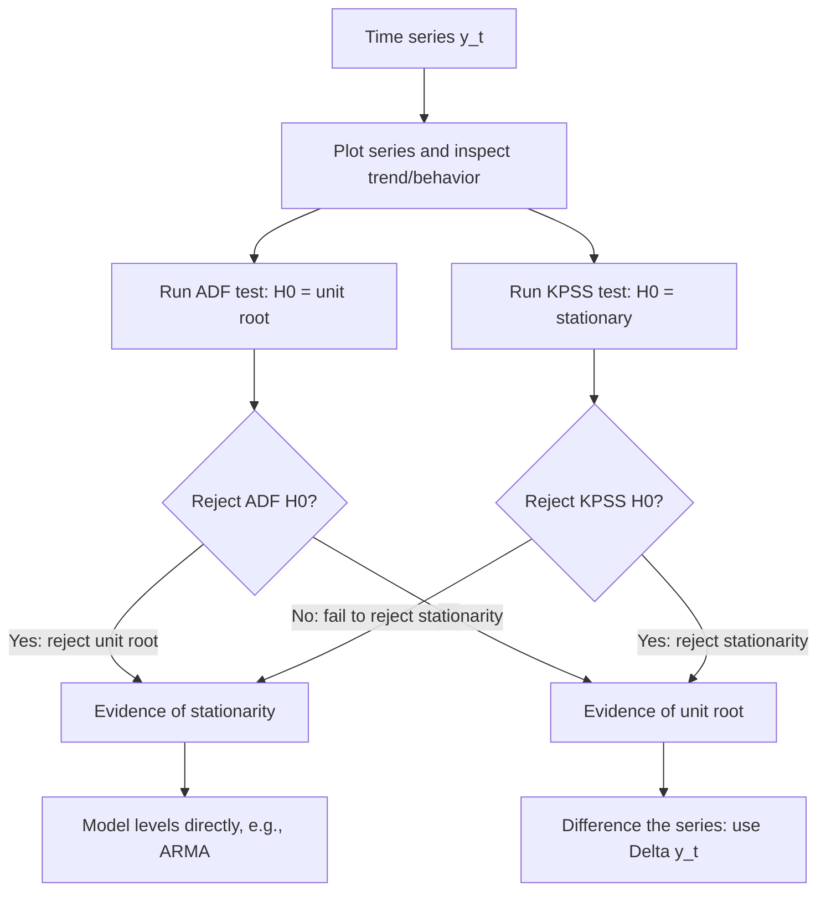

## Time Series Models and Unit Roots

### Overview

Time series econometrics deals with data observed sequentially over time, where observations are typically correlated with their own past values. In financial economics, time series methods underlie return forecasting, volatility modeling, yield curve dynamics, and tests of market efficiency (e.g., whether prices follow a random walk). A central concern in this area is **stationarity** and, specifically, the presence of **unit roots**, since standard inferential tools can behave very differently — often misleadingly — when applied to nonstationary data.

### Stationarity

A time series $\{y_t\}$ is **strictly stationary** if its joint distribution is invariant to time shifts. A weaker and more commonly used condition is **covariance (weak) stationarity**, requiring:

1. $E[y_t] = \mu$ for all $t$ (constant mean)
2. $\text{Var}(y_t) = \sigma^2$ for all $t$ (constant variance)
3. $\text{Cov}(y_t, y_{t-h}) = \gamma(h)$ depends only on the lag $h$, not on $t$

**Key Points**

- Financial asset *prices* and *levels* (stock indices, exchange rates, interest rates) are typically **non-stationary**, while *returns* (log price differences) are typically much closer to stationary, though not always — e.g., volatility clustering means squared or absolute returns often display persistent, slowly-decaying dependence
- Standard OLS inference (t-tests, F-tests) is generally invalid when applied to regressions involving nonstationary variables, unless those variables are cointegrated (discussed below)

### Autoregressive and Moving Average Models

**AR(p) process**:

$$y_t = c + \phi_1 y_{t-1} + \phi_2 y_{t-2} + \cdots + \phi_p y_{t-p} + \varepsilon_t$$

**MA(q) process**:

$$y_t = \mu + \varepsilon_t + \theta_1 \varepsilon_{t-1} + \cdots + \theta_q \varepsilon_{t-q}$$

**ARMA(p,q) process** combines both:

$$y_t = c + \sum_{i=1}^{p}\phi_i y_{t-i} + \varepsilon_t + \sum_{j=1}^{q}\theta_j \varepsilon_{t-j}$$

**Key Points**

- An AR(1) process $y_t = c + \phi y_{t-1} + \varepsilon_t$ is stationary if and only if $|\phi| < 1$; if $\phi = 1$, the process is a **random walk**, which is non-stationary
- Model order ($p$, $q$) is typically selected using the sample autocorrelation function (ACF) and partial autocorrelation function (PACF), or by minimizing information criteria (AIC, BIC) across candidate specifications

### The Random Walk and Unit Roots

A **random walk** is:

$$y_t = y_{t-1} + \varepsilon_t$$

with $\varepsilon_t$ i.i.d. mean-zero (a random walk with drift adds a constant $c$). This process has an autoregressive root exactly equal to 1, hence the term **unit root**.

**Key Points**

- The variance of $y_t$ grows without bound as $t$ increases ($\text{Var}(y_t) = t\sigma^2$ starting from a fixed $y_0$), violating stationarity
- Shocks to a unit root process have **permanent effects** — they never decay — in contrast to a stationary AR process where shocks decay geometrically at rate $\phi$
- The random walk hypothesis for stock prices is a classical formalization of weak-form market efficiency: if prices follow a random walk, past price changes contain no information useful for predicting future changes

### Consequences of Unit Roots: Spurious Regression

Regressing one nonstationary series on another unrelated nonstationary series can produce a high $R^2$ and statistically significant coefficients purely as an artifact, a phenomenon formally demonstrated by Granger and Newbold (1974).

**Example**

Simulating two entirely independent random walks and regressing one on the other frequently yields $t$-statistics well above conventional critical values and $R^2$ values often exceeding 0.5, despite there being no true relationship between the series. This is the classic **spurious regression** problem, and it is a key reason unit root testing precedes any regression involving trending or highly persistent financial or macroeconomic time series.

### Testing for Unit Roots: The Dickey-Fuller Framework

The **Dickey-Fuller (DF) test** examines $H_0: \phi = 1$ (unit root, nonstationary) against $H_1: \phi < 1$ (stationary) in the model:

$$y_t = c + \phi y_{t-1} + \varepsilon_t$$

rewritten in first-difference form for estimation convenience:

$$\Delta y_t = c + \gamma y_{t-1} + \varepsilon_t, \quad \gamma = \phi - 1$$

Testing $H_0: \gamma = 0$ against $H_1: \gamma < 0$ is equivalent to testing for a unit root. Critically, under $H_0$ the test statistic does **not** follow a standard $t$-distribution; it follows the non-standard **Dickey-Fuller distribution**, requiring specialized critical value tables (Dickey-Fuller/MacKinnon critical values).

**Augmented Dickey-Fuller (ADF) test** extends this by adding lagged difference terms to account for higher-order serial correlation in the errors:

$$\Delta y_t = c + \gamma y_{t-1} + \sum_{i=1}^{p} \delta_i \Delta y_{t-i} + \varepsilon_t$$

**Key Points**

- The ADF test can be specified with no constant, a constant only, or a constant and trend, depending on the suspected behavior of the series under the alternative; critical values differ across these specifications
- Lag length $p$ is chosen via information criteria or by testing down from a maximum lag until the added lags are no longer significant
- The ADF test has relatively low power against near-unit-root (highly persistent but technically stationary) alternatives in finite samples, a well-documented limitation in the literature [Inference: widely discussed methodological point, exact power depends on sample size and the true persistence parameter]

**Phillips-Perron (PP) test** offers an alternative that corrects for serial correlation and heteroskedasticity nonparametrically (via a robust variance estimator) rather than by adding parametric lag terms, testing the same null hypothesis.

**KPSS test** reverses the hypotheses: $H_0$ is stationarity, and $H_1$ is a unit root. Using both ADF/PP and KPSS together is common practice, since agreement between a test with $H_0$ = unit root and one with $H_0$ = stationarity strengthens the conclusion, while disagreement flags ambiguity.

### Order of Integration

A series that becomes stationary after differencing $d$ times is said to be **integrated of order $d$**, denoted $I(d)$.

- $I(0)$: stationary in levels (e.g., typically, log returns)
- $I(1)$: requires one difference to achieve stationarity (e.g., typically, log price levels, many interest rate series)
- $I(2)$: requires two differences (rare in financial applications, more common in some price-level/inflation series)

**Key Points**

- Differencing an already-stationary series (over-differencing) introduces artificial moving-average structure and is generally undesirable
- The distinction between $I(0)$ and $I(1)$ variables is essential before choosing between modeling levels, differences, or a cointegrating relationship

### Cointegration

Even when two series are each individually $I(1)$ (nonstationary), a specific linear combination of them may be $I(0)$ (stationary). If so, the series are said to be **cointegrated**, meaning they share a common long-run stochastic trend and do not drift arbitrarily far apart.

$$y_t - \beta x_t = u_t, \quad u_t \sim I(0)$$

**Example**

The classic financial illustration is a pair of stock prices with a stable long-run economic relationship (e.g., shares of two firms in the same regulated industry, or a stock and a closely related ETF), which motivates **pairs trading**: even though each price series is nonstationary, if they are cointegrated, deviations from their long-run relationship $u_t$ are mean-reverting and can generate trading signals when the spread departs from its historical equilibrium.

**Testing for cointegration**:

- **Engle-Granger two-step method**: (1) estimate the cointegrating regression by OLS; (2) test the residuals $\hat{u}_t$ for a unit root using (critical-value-adjusted) ADF-type tests, since the residuals are generated regressors
- **Johansen test**: a multivariate, likelihood-based procedure that can detect multiple cointegrating relationships among more than two series simultaneously and determine the cointegrating rank

**Error Correction Model (ECM)**: once cointegration is established, short-run dynamics are modeled jointly with the long-run relationship:

$$\Delta y_t = \alpha(y_{t-1} - \beta x_{t-1}) + \sum_i \gamma_i \Delta y_{t-i} + \sum_j \delta_j \Delta x_{t-j} + \varepsilon_t$$

where $\alpha$ measures the speed of adjustment back toward long-run equilibrium after a deviation.

### Vector Autoregressions (VAR)

For modeling the joint dynamics of multiple (typically stationary, or differenced) time series without imposing strong theoretical restrictions on which variable affects which, a **VAR(p)** treats each variable as a function of lagged values of itself and all other variables in the system:

$$Y_t = c + A_1 Y_{t-1} + A_2 Y_{t-2} + \cdots + A_p Y_{t-p} + \varepsilon_t$$

where $Y_t$ is a vector of variables (e.g., short rate, term spread, stock returns).

**Key Points**

- VARs are widely used in finance for **impulse response analysis** (tracing the dynamic effect of a shock to one variable on the system over time) and **variance decomposition** (attributing forecast error variance to different shocks)
- If the variables in a VAR are $I(1)$ and cointegrated, a **Vector Error Correction Model (VECM)** is the appropriate specification instead of a VAR in levels or first differences alone

### Worked Example: Testing a Stock Index for a Unit Root

**Example**

Suppose the ADF test on the log level of a stock index yields a test statistic of $-1.85$, against a 5% MacKinnon critical value of approximately $-2.86$ (constant, no trend specification, moderate sample size). Since $-1.85 > -2.86$ (i.e., the test statistic is not sufficiently negative), the null hypothesis of a unit root is **not rejected** — consistent with the standard finding that log stock price levels behave like a (near) random walk. Running the same ADF test on the first-differenced series (log returns) would typically produce a much larger negative test statistic, comfortably rejecting the unit root null and confirming that returns are (approximately) stationary, consistent with weak-form market efficiency discussions. [Inference: numerical values illustrative; actual test statistics depend on the specific index, sample period, and lag specification used]

### Conclusion

Time series models provide the tools for characterizing dynamic dependence in financial data, while unit root and cointegration analysis address a foundational question that must be resolved before such models — or indeed any regression involving trending financial variables — can be reliably estimated and interpreted: is the series stationary, and if not, do related nonstationary series share a stable long-run relationship? Ignoring these issues risks spurious regression results and invalid inference, while properly incorporating them (via differencing, cointegration testing, and error correction modeling) enables both statistically sound estimation and economically meaningful applications such as pairs trading, yield curve modeling, and macro-financial impulse response analysis.

**Related Topics**

- ARCH/GARCH models for conditional heteroskedasticity in financial returns
- Cointegration-based pairs trading strategy design
- Vector Error Correction Models (VECM) in depth
- Structural VAR identification and impulse response analysis
- State-space models and the Kalman filter for time-varying parameters
- Long memory and fractional integration in volatility series
- Panel unit root and panel cointegration tests
- Nonlinear time series models: threshold autoregression and regime switching