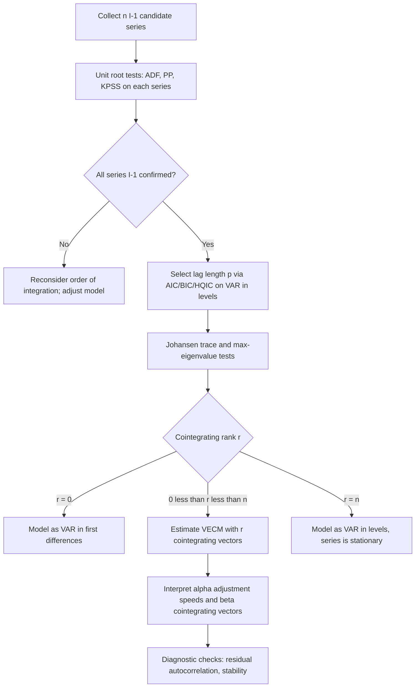

## Cointegration and Vector Autoregressions

### Overview

Vector autoregressions (VARs) and cointegration analysis form the core toolkit for modeling multivariate time series in financial economics, particularly when variables exhibit long-run equilibrium relationships despite short-run divergence. VARs generalize univariate autoregressive models to systems of interrelated variables, treating each variable as a function of its own lags and the lags of every other variable in the system. Cointegration addresses a specific pathology: many economically meaningful time series (exchange rates, interest rate term structures, asset prices linked by arbitrage) are individually non-stationary (integrated of order 1, or $I(1)$), yet a linear combination of them is stationary. This chapter develops the VAR framework, the concept and tests for cointegration, and the Vector Error Correction Model (VECM) that unifies short-run dynamics with long-run equilibrium correction.

### Stationarity and Integration Review

A time series $y_t$ is covariance-stationary if its mean, variance, and autocovariance structure are time-invariant. Many financial and macroeconomic series (asset prices, exchange rates, GDP) are non-stationary in levels but become stationary after differencing.

A series is integrated of order $d$, denoted $y_t \sim I(d)$, if it requires $d$ differences to achieve stationarity. Most financial and macro series of interest are $I(1)$: their first differences (returns, growth rates) are stationary, but their levels are not.

**Key Points**

- $I(0)$: stationary in levels (e.g., asset returns)
- $I(1)$: stationary after first-differencing (e.g., log asset prices, log exchange rates)
- Standard OLS regression between two independent $I(1)$ series produces a "spurious regression": high $R^2$ and significant $t$-statistics despite no true relationship [Inference — this is the well-documented Granger-Newbold result, included here as established theory rather than an uncertain claim]
- Testing for unit roots (Augmented Dickey-Fuller, Phillips-Perron, KPSS) is the necessary precursor to any cointegration or VAR-in-levels analysis

### The Vector Autoregression (VAR) Model

A VAR of order $p$, denoted VAR($p$), for an $n$-dimensional vector of time series $Y_t = (y_{1t}, y_{2t}, \ldots, y_{nt})'$ is:

$$Y_t = c + A_1 Y_{t-1} + A_2 Y_{t-2} + \cdots + A_p Y_{t-p} + \varepsilon_t$$

where $c$ is an $n \times 1$ vector of constants, each $A_i$ is an $n \times n$ coefficient matrix, and $\varepsilon_t$ is a vector white noise process with $E[\varepsilon_t] = 0$, $E[\varepsilon_t \varepsilon_t'] = \Sigma$, and $E[\varepsilon_t \varepsilon_s'] = 0$ for $t \neq s$.

#### Structure and Interpretation

Each equation in the system is itself a linear regression of one variable on lagged values of every variable in the system, including itself. This symmetric treatment — no variable is a priori exogenous — is the defining feature distinguishing VARs from traditional structural simultaneous-equation models, which require the modeler to impose identifying restrictions before estimation.

#### Estimation

Each equation of a VAR($p$) can be estimated by OLS equation-by-equation, since the regressors (lagged values) are identical across equations and the errors are contemporaneously correlated but the system is "seemingly unrelated" in a way that makes equation-by-equation OLS equivalent to GLS/SUR (Zellner's insight, given identical regressors) [Inference — asymptotic equivalence result under the identical-regressors condition]. Maximum likelihood estimation under Gaussian errors yields the same coefficient estimates as OLS.

#### Lag Length Selection

Lag order $p$ is typically chosen via information criteria:

$$AIC(p) = \ln|\hat{\Sigma}(p)| + \frac{2pn^2}{T}$$

$$BIC(p) = \ln|\hat{\Sigma}(p)| + \frac{pn^2 \ln T}{T}$$

$$HQIC(p) = \ln|\hat{\Sigma}(p)| + \frac{2pn^2 \ln(\ln T)}{T}$$

where $\hat{\Sigma}(p)$ is the estimated residual covariance matrix at lag order $p$ and $T$ is the sample size. BIC and HQIC penalize additional parameters more heavily than AIC and tend to select more parsimonious models in finite samples.

#### Stability Condition

A VAR($p$) is stable (and the underlying levels process, if stationary, well-behaved) if all roots of the characteristic polynomial

$$\det(I_n - A_1 z - A_2 z^2 - \cdots - A_p z^p) = 0$$

lie outside the unit circle, equivalently all eigenvalues of the companion matrix have modulus less than 1. Stability implies the VAR has a valid, convergent Wold moving-average representation and that impulse responses decay to zero.

### Granger Causality

Granger causality tests whether lagged values of one variable improve forecasts of another, conditional on the variable's own lags. $y_2$ "Granger-causes" $y_1$ if the coefficients on lagged $y_2$ in the $y_1$ equation are jointly statistically significant (typically via an F-test or Wald test).

**Key Points**

- Granger causality is a statement about predictive content, not structural or economic causality
- Bidirectional Granger causality ("feedback") is common in financial systems, e.g., between stock prices and trading volume
- Tests are sensitive to lag length specification and omitted variables

### Impulse Response Functions and Variance Decomposition

#### Impulse Response Functions (IRFs)

The VAR($p$) can be rewritten in Wold moving-average (VMA) form:

$$Y_t = \mu + \sum_{i=0}^{\infty} \Phi_i \varepsilon_{t-i}$$

The matrices $\Phi_i$ trace the effect of a one-unit shock in one variable at time $t$ on all variables at time $t+i$, holding all else constant. Because $\varepsilon_t$ components are typically contemporaneously correlated, raw ("non-orthogonalized") IRFs conflate the effects of simultaneous shocks.

**Cholesky Orthogonalization**: The standard fix decomposes $\Sigma = PP'$ via Cholesky factorization, transforming correlated shocks $\varepsilon_t$ into orthogonal shocks $u_t = P^{-1}\varepsilon_t$. This imposes a recursive causal ordering — variables ordered earlier are assumed to affect later variables contemporaneously but not vice versa. [Inference — the appropriateness of any given ordering is a substantive economic judgment call, not a statistical fact, and results can be sensitive to ordering choice]

#### Forecast Error Variance Decomposition (FEVD)

FEVD quantifies the proportion of the $h$-step-ahead forecast error variance of each variable attributable to each orthogonalized shock, offering a complementary view to IRFs on the relative importance of shocks across the system.

### Spurious Regression and the Motivation for Cointegration

Regressing one $I(1)$ series on another unrelated $I(1)$ series in levels produces a regression that appears to show a strong significant relationship purely as an artifact of shared stochastic trends, not genuine covariation — the classic Granger-Newbold / Phillips spurious regression problem. This motivated two responses in applied econometrics: (1) difference all series to induce stationarity before modeling (a VAR in differences), or (2) test whether, despite each series being individually non-stationary, some linear combination of the series is stationary — i.e., test for cointegration, which if present implies differencing alone discards important long-run information.

### Cointegration: Definition and Intuition

**Definition (Engle-Granger).** Two or more $I(1)$ series are cointegrated if there exists a linear combination of them that is $I(0)$ (stationary). Formally, for $Y_t = (y_{1t}, \ldots, y_{nt})'$ with each $y_{it} \sim I(1)$, if there exists a nonzero vector $\beta$ such that

$$z_t = \beta' Y_t \sim I(0)$$

then $Y_t$ is cointegrated, and $\beta$ is called the cointegrating vector.

#### Economic Interpretation

Cointegration formalizes the idea of a long-run equilibrium relationship enforced by economic forces (arbitrage, policy targets, budget constraints) even though the individual series wander stochastically. Classic financial examples:

- Spot and futures prices for the same asset (cost-of-carry arbitrage)
- Prices of the same asset cross-listed on different exchanges (law of one price)
- Short-term and long-term interest rates (expectations hypothesis of the term structure)
- Consumption and income (permanent income hypothesis)

The deviation $z_t = \beta' Y_t$ from the long-run relationship is the "equilibrium error" — it can wander in the short run but is pulled back toward zero, since it is stationary by construction.

#### Cointegrating Rank

For an $n$-variable system, there can be up to $n-1$ linearly independent cointegrating vectors, collectively forming the cointegrating rank $r$ ($0 \le r \le n-1$). If $r = 0$, no cointegration exists and the series should be modeled as a VAR in first differences. If $r = n$, the series is actually stationary in levels (not a cointegration case at all).

### Engle-Granger Two-Step Method

The Engle-Granger (1987) procedure tests for and estimates cointegration between two series.

**Step 1 — Estimate the long-run (cointegrating) relationship:**

Regress $y_{1t}$ on $y_{2t}$ by OLS:

$$y_{1t} = \alpha + \beta y_{2t} + z_t$$

Because both series are $I(1)$, if they are truly cointegrated, this OLS estimator is "superconsistent" — it converges to the true cointegrating parameter at rate $T$ rather than the usual $\sqrt{T}$ [Inference — Stock (1987) superconsistency result, standard but worth flagging as an asymptotic property rather than small-sample guarantee].

**Step 2 — Test the residuals for stationarity:**

Save the residuals $\hat{z}_t = y_{1t} - \hat{\alpha} - \hat{\beta}y_{2t}$ and apply an Augmented Dickey-Fuller test. Critical values must be adjusted from the standard ADF table (the Engle-Granger / MacKinnon critical values) because $\hat{z}_t$ is a generated regressor from an estimated relationship, not directly observed data.

**Limitations**

- Only identifies a single cointegrating relationship; not suited to systems with more than one cointegrating vector
- Sensitive to which variable is placed on the left-hand side (asymmetric treatment) — the two possible normalizations are not guaranteed to give consistent inferences in finite samples
- Two-step estimation compounds first-stage estimation error into the second-stage test

### Johansen's Methodology

Johansen (1988, 1991) developed a full-system, maximum-likelihood approach that tests for and estimates all cointegrating relationships simultaneously within a VAR/VECM framework, resolving Engle-Granger's single-equation limitations.

#### The VECM Representation

Any VAR($p$) system with cointegrated $I(1)$ variables can be reparameterized into a Vector Error Correction Model:

$$\Delta Y_t = \Pi Y_{t-1} + \sum_{i=1}^{p-1} \Gamma_i \Delta Y_{t-i} + c + \varepsilon_t$$

where $\Pi = \alpha \beta'$, with $\beta$ ($n \times r$) containing the $r$ cointegrating vectors and $\alpha$ ($n \times r$) containing the adjustment (loading) coefficients — how quickly each variable responds to deviations from each long-run equilibrium.

The rank of $\Pi$ reveals the cointegrating structure:

- $\text{rank}(\Pi) = 0$: no cointegration; model as VAR in first differences
- $\text{rank}(\Pi) = n$: $Y_t$ is stationary in levels; model as VAR in levels
- $0 < \text{rank}(\Pi) = r < n$: $r$ cointegrating relationships exist; use the VECM

#### Trace and Maximum Eigenvalue Tests

Johansen's procedure estimates $\Pi$ via reduced-rank regression, extracting eigenvalues $\hat{\lambda}_1 > \hat{\lambda}_2 > \cdots > \hat{\lambda}_n$ that measure the strength of each potential cointegrating relationship. Two likelihood-ratio-type test statistics determine $r$:

**Trace test:**

$$\lambda_{trace}(r) = -T \sum_{i=r+1}^{n} \ln(1 - \hat{\lambda}_i)$$

Tests $H_0: \text{rank} \le r$ against $H_1: \text{rank} = n$, sequentially for $r = 0, 1, \ldots, n-1$.

**Maximum eigenvalue test:**

$$\lambda_{max}(r, r+1) = -T \ln(1 - \hat{\lambda}_{r+1})$$

Tests $H_0: \text{rank} = r$ against $H_1: \text{rank} = r+1$.

Both statistics have non-standard asymptotic distributions (functions of multivariate Brownian motion), so critical values come from simulated tables (Johansen 1995; Osterwald-Lenum 1992) that depend on $n - r$ and the deterministic trend specification.

**Deterministic Trend Specifications**

Johansen's framework requires specifying how constants and trends enter the model, since this materially affects critical values:

| Case | Specification |
| --- | --- |
| I | No intercept in VECM or cointegrating relation |
| II | Intercept restricted to cointegrating relation only |
| III | Unrestricted intercept, no trend |
| IV | Trend restricted to cointegrating relation, unrestricted intercept |
| V | Unrestricted trend and intercept |

Case III (unrestricted intercept, no trend) is the most common default for financial applications without a clear deterministic trend in levels.

### VECM Interpretation and Estimation

Once $r$ and the cointegrating vectors $\beta$ are identified, the VECM decomposes dynamics into:

- **Long-run component**: $\alpha \beta' Y_{t-1}$ — the error-correction term, pulling variables back toward equilibrium
- **Short-run component**: $\sum \Gamma_i \Delta Y_{t-i}$ — standard VAR-in-differences dynamics

The elements of $\alpha$ (adjustment speeds) are of direct economic interest: a large negative $\alpha_i$ (for a positive equilibrium deviation) implies variable $i$ adjusts quickly to restore equilibrium; an $\alpha_i$ near zero implies that variable is weakly exogenous with respect to the long-run relationship.

**Example**

Consider the term structure of interest rates with a 3-month T-bill rate $r_{3t}$ and a 10-year Treasury yield $r_{10t}$, both $I(1)$. Suppose Johansen's test finds $r=1$ with cointegrating vector normalized as $\beta = (1, -1)'$, implying the spread $r_{3t} - r_{10t}$ is stationary (consistent with the expectations hypothesis holding in the long run, up to a constant term premium). The VECM might estimate:

$$\Delta r_{3t} = 0.15(r_{3,t-1} - r_{10,t-1}) + \text{short-run terms} + \varepsilon_{1t}$$

$$\Delta r_{10t} = -0.03(r_{3,t-1} - r_{10,t-1}) + \text{short-run terms} + \varepsilon_{2t}$$

Here the short rate adjusts much more aggressively ($\alpha_1 = 0.15$) than the long rate ($\alpha_2 = -0.03$) toward closing the spread, consistent with short rates being more directly influenced by monetary policy actions responding to the yield curve. [Inference — illustrative stylized coefficients, not estimated from actual data; the qualitative direction is consistent with widely cited term-structure findings]

### Testing Procedure Diagram

### System Structure Diagram (svg_diagram)

<svg xmlns="http://www.w3.org/2000/svg" viewBox="0 0 720 380">
<text x="360" y="24" text-anchor="middle" font-size="16" font-weight="bold" fill="#111">VAR/VECM Decomposition (svg_diagram)</text>
<rect x="40" y="60" width="200" height="70" rx="8" fill="#eef4ff" stroke="#3b5bdb" stroke-width="1.5" />
<text x="140" y="90" text-anchor="middle" font-size="13" fill="#1c2b4a">Levels VAR(p)</text>
<text x="140" y="110" text-anchor="middle" font-size="12" fill="#1c2b4a">Y_t = c + sum A_i Y_(t-i) + e_t</text>
<line x1="240" y1="95" x2="300" y2="95" stroke="#333" stroke-width="1.5" marker-end="url(#arrow)" />
<text x="270" y="85" text-anchor="middle" font-size="11" fill="#555">reparameterize</text>
<rect x="300" y="60" width="220" height="70" rx="8" fill="#fff4e6" stroke="#e8590c" stroke-width="1.5" />
<text x="410" y="90" text-anchor="middle" font-size="13" fill="#5c2c06">VECM Form</text>
<text x="410" y="110" text-anchor="middle" font-size="11" fill="#5c2c06">dY_t = Pi Y_(t-1) + sum Gamma_i dY_(t-i) + e_t</text>
<line x1="410" y1="130" x2="410" y2="180" stroke="#333" stroke-width="1.5" marker-end="url(#arrow)" />
<text x="440" y="160" font-size="11" fill="#555">Pi = alpha beta'</text>
<rect x="240" y="200" width="180" height="70" rx="8" fill="#e6fcf5" stroke="#0ca678" stroke-width="1.5" />
<text x="330" y="230" text-anchor="middle" font-size="13" fill="#0b4a3c">Long-run: beta</text>
<text x="330" y="250" text-anchor="middle" font-size="11" fill="#0b4a3c">cointegrating vectors</text>
<rect x="440" y="200" width="180" height="70" rx="8" fill="#fff0f6" stroke="#d6336c" stroke-width="1.5" />
<text x="530" y="230" text-anchor="middle" font-size="13" fill="#5c0a2e">Adjustment: alpha</text>
<text x="530" y="250" text-anchor="middle" font-size="11" fill="#5c0a2e">loading speeds</text>
<line x1="330" y1="270" x2="330" y2="320" stroke="#333" stroke-width="1.5" marker-end="url(#arrow)" />
<line x1="530" y1="270" x2="450" y2="320" stroke="#333" stroke-width="1.5" marker-end="url(#arrow)" />
<rect x="230" y="320" width="260" height="50" rx="8" fill="#f8f0fc" stroke="#9c36b5" stroke-width="1.5" />
<text x="360" y="350" text-anchor="middle" font-size="12" fill="#3d0a52">Equilibrium error z_t = beta' Y_t (stationary)</text>
</svg>

### Diagnostic Checks

**Key Points**

- **Residual autocorrelation**: test with Portmanteau (multivariate Ljung-Box) or LM tests on VECM/VAR residuals; remaining autocorrelation suggests insufficient lag length
- **Normality**: multivariate Jarque-Bera; financial return residuals typically fail this due to fat tails, which does not invalidate point estimates but affects small-sample inference
- **Stability**: eigenvalues of the companion matrix / roots of the characteristic polynomial should lie appropriately relative to the unit circle after imposing the estimated cointegrating rank
- **Structural breaks**: cointegrating relationships estimated over long financial samples are vulnerable to regime shifts (e.g., monetary policy regime changes, crisis periods); Gonzalo-Granger and Gregory-Hansen tests extend cointegration testing to allow for breaks

### Applications in Financial Economics

- **Pairs trading / statistical arbitrage**: identifying cointegrated pairs of stocks and trading the mean-reverting spread
- **Purchasing Power Parity (PPP)**: testing cointegration between nominal exchange rates and relative price levels
- **Term structure of interest rates**: testing the expectations hypothesis via cointegration among yields of different maturities
- **Stock price and dividends**: testing present-value models via cointegration between prices and dividends
- **Commodity spot-futures relationships**: basis trading strategies built on cointegration between spot and futures prices

**Behavioral note**: the persistence and tradability of estimated cointegrating relationships in live markets may vary with liquidity conditions, transaction costs, and structural breaks not present in the estimation sample. [Unverified as a forward-looking claim — historical cointegration is not a guarantee of future relationship stability]

### Common Pitfalls

- Treating Granger causality as economic/structural causality
- Applying Engle-Granger to systems with genuinely more than one cointegrating relationship
- Ignoring structural breaks that can cause spurious rejection of cointegration (or spurious non-rejection) when using constant-parameter Johansen tests
- Misordering variables in Cholesky decomposition without economic justification, then over-interpreting resulting IRFs
- Failing to verify all series share the same order of integration before testing for cointegration (cointegration analysis presumes $I(1)$ series; mixing $I(0)$ and $I(1)$ variables requires different techniques, e.g., ARDL bounds testing)

**Related Topics**

- Autoregressive Distributed Lag (ARDL) models and the bounds testing approach to cointegration
- Structural VARs (SVAR) and alternative identification schemes (sign restrictions, long-run restrictions)
- Threshold cointegration and nonlinear error correction models
- Panel cointegration methods (Pedroni, Westerlund tests)
- Fractional cointegration and long-memory processes
- State-space models and the Kalman filter as an alternative to VAR/VECM for time-varying relationships
- Dynamic Conditional Correlation (DCC) models for time-varying covariance in multivariate financial systems