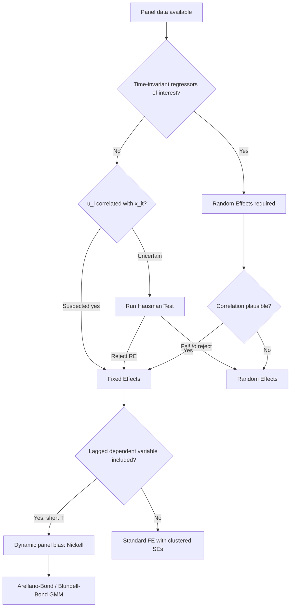

## Panel Data Methods


### Overview

Panel data (also called longitudinal data) combines cross-sectional and time-series dimensions: the same units — firms, households, countries, banks — are observed repeatedly over multiple time periods. In financial economics, panel methods are the workhorse for asset pricing tests across firms and time, corporate finance studies of capital structure, banking regulation research, and cross-country studies of financial development. The core advantage over pure cross-sections or pure time series is the ability to control for unobserved heterogeneity while exploiting both within-unit and between-unit variation.

A balanced panel has observations for every unit in every period; an unbalanced panel has gaps. Notation: $y_{it}$ denotes the outcome for unit $i$ at time $t$, with $i = 1, \dots, N$ and $t = 1, \dots, T$.

### Why Use Panel Data

**Key Points**

- Controls for unobserved, time-invariant heterogeneity (e.g., firm-specific risk culture, managerial quality) that would otherwise bias cross-sectional estimates
- Increases degrees of freedom and reduces collinearity among regressors relative to a single cross-section or time series
- Allows identification of dynamics (adjustment speeds, persistence) that pure cross-sections cannot reveal
- Enables study of causal effects using variation within a unit over time, netting out omitted factors correlated with the regressors

### The General Panel Regression Model

$$y_{it} = \alpha + \beta' x_{it} + u_i + \epsilon_{it}$$

Where $x_{it}$ is a vector of time-varying regressors, $u_i$ is the unit-specific unobserved effect (assumed time-invariant), and $\epsilon_{it}$ is the idiosyncratic error term, typically assumed $\epsilon_{it} \sim \text{iid}(0, \sigma^2_\epsilon)$ and uncorrelated with $x_{it}$.

The central econometric question in panel modeling is how to treat $u_i$: as a fixed parameter to be estimated or swept out (fixed effects), or as a random draw from a distribution uncorrelated with $x_{it}$ (random effects).

### Pooled OLS

The simplest approach ignores the panel structure and stacks all $NT$ observations:

$$y_{it} = \alpha + \beta' x_{it} + v_{it}, \quad v_{it} = u_i + \epsilon_{it}$$

Pooled OLS is consistent only if $u_i$ is uncorrelated with $x_{it}$ (no unobserved heterogeneity problem) and requires clustered standard errors at the unit level, since $v_{it}$ is serially correlated across $t$ for the same $i$ through the common $u_i$ component. In practice, pooled OLS is rarely defensible in finance applications because firm or country fixed characteristics are almost always correlated with financial regressors (leverage, size, profitability).

### Fixed Effects (Within) Estimator

**Key Points**

- Eliminates $u_i$ by demeaning each variable at the unit level, removing any time-invariant confounder — observed or unobserved
- Consistent even when $u_i$ is correlated with $x_{it}$ (the standard finance case: unobserved firm quality correlated with capital structure choices)
- Cannot estimate coefficients on time-invariant regressors (e.g., industry, if industry doesn't change), since they're swept out along with $u_i$

The within transformation subtracts the unit-specific time mean:

$$\tilde{y}_{it} = y_{it} - \bar{y}_i, \quad \tilde{x}_{it} = x_{it} - \bar{x}_i$$


$$\tilde{y}_{it} = \beta' \tilde{x}_{it} + \tilde{\epsilon}_{it}$$

OLS on the demeaned data gives the Fixed Effects (FE) estimator, algebraically identical to including a full set of unit dummies (the Least Squares Dummy Variable, LSDV, estimator), but computationally far cheaper for large $N$.

**Two-way fixed effects** add time fixed effects $\lambda_t$ alongside unit effects $u_i$:

$$y_{it} = \alpha + \beta' x_{it} + u_i + \lambda_t + \epsilon_{it}$$

This is standard in corporate finance and asset pricing panels to absorb common macro shocks (e.g., a financial crisis year affecting all firms) in addition to firm heterogeneity.

**Example**

Testing whether firm leverage affects ROA using a panel of firms over 10 years, with firm and year fixed effects:



```
roa_it = β1*leverage_it + β2*size_it + β3*tangibility_it + u_i + λ_t + ε_it
```

`u_i` absorbs firm-level unobservables (management quality, industry positioning); `λ_t` absorbs year-specific shocks (interest rate cycles, recessions) common to all firms.

### Random Effects Estimator

**Key Points**

- Treats $u_i$ as a random variable, uncorrelated with $x_{it}$: $u_i \sim \text{iid}(0, \sigma_u^2)$
- More efficient than FE if the assumption holds, because it uses both within- and between-unit variation
- Allows estimation of coefficients on time-invariant regressors
- Estimated via Generalized Least Squares (GLS) using a quasi-demeaning transformation with a parameter $\theta$ that partially removes the unit mean, weighted by the relative variance of $u_i$ versus $\epsilon_{it}$

$$y_{it} - \theta \bar{y}_i = \alpha(1-\theta) + \beta'(x_{it} - \theta \bar{x}_i) + (v_{it} - \theta \bar{v}_i)$$

where $\theta = 1 - \sqrt{\dfrac{\sigma_\epsilon^2}{\sigma_\epsilon^2 + T\sigma_u^2}}$

When $\theta = 1$, RE collapses to FE (within estimator); when $\theta = 0$, it collapses to pooled OLS.

### Hausman Test: Fixed vs. Random Effects

The Hausman specification test compares the FE and RE estimates. Under the null that $u_i$ is uncorrelated with $x_{it}$ (RE assumption valid), both FE and RE are consistent, but RE is efficient. Under the alternative, FE remains consistent but RE is inconsistent.

$$H = (\hat{\beta}_{FE} - \hat{\beta}_{RE})' [\text{Var}(\hat{\beta}_{FE}) - \text{Var}(\hat{\beta}_{RE})]^{-1} (\hat{\beta}_{FE} - \hat{\beta}_{RE}) \sim \chi^2_k$$

A large, statistically significant $H$ rejects RE in favor of FE. [Inference] In empirical finance practice, FE is very often preferred by default because the RE orthogonality assumption is considered implausible for most firm- or country-level regressors, so many papers skip the Hausman test and report FE directly, defending the choice on economic grounds rather than the test statistic.

### First-Differencing Estimator

An alternative to eliminate $u_i$: difference consecutive periods.

$$\Delta y_{it} = y_{it} - y_{i,t-1} = \beta' \Delta x_{it} + \Delta \epsilon_{it}$$

**Key Points**

- Also removes time-invariant $u_i$, consistent under the same conditions as FE
- Algebraically equivalent to FE only when $T = 2$; for $T > 2$, FE (within) is more efficient if $\epsilon_{it}$ is serially uncorrelated, while first-differencing is more efficient if $\epsilon_{it}$ follows a random walk
- Preferred when the idiosyncratic error is highly persistent or non-stationary, since differencing removes unit roots

### Dynamic Panel Models

Many finance applications require a lagged dependent variable to capture persistence (e.g., capital structure adjustment, profitability persistence, dividend smoothing):

$$y_{it} = \alpha + \rho y_{i,t-1} + \beta' x_{it} + u_i + \epsilon_{it}$$

**The Nickell Bias Problem**

Including $y_{i,t-1}$ with fixed effects creates a mechanical correlation: after within-transformation, the demeaned lagged dependent variable $\tilde{y}_{i,t-1}$ is correlated with the demeaned error $\tilde{\epsilon}_{it}$, because $\bar{y}_i$ (used in demeaning) contains $\epsilon_{it}$ itself for all $t$ in the sample. This bias is of order $1/T$ and does not vanish as $N \to \infty$ — only as $T \to \infty$. It is severe in short panels (small $T$), which is the typical structure of firm-level financial datasets (many firms, few years).

**Arellano-Bond (Difference GMM)**

First-difference the equation to remove $u_i$:

$$\Delta y_{it} = \rho \Delta y_{i,t-1} + \beta' \Delta x_{it} + \Delta \epsilon_{it}$$

$\Delta y_{i,t-1}$ is still correlated with $\Delta \epsilon_{it}$ (since $\Delta y_{i,t-1}$ contains $y_{i,t-1}$, which is correlated with $\epsilon_{i,t-1}$, a component of $\Delta \epsilon_{it}$). Arellano and Bond (1991) propose instrumenting $\Delta y_{i,t-1}$ with deeper lags in levels, $y_{i,t-2}, y_{i,t-3}, \dots$, which are valid instruments under the assumption that $\epsilon_{it}$ is not serially correlated, estimated via Generalized Method of Moments (GMM).

**Blundell-Bond (System GMM)**

Difference GMM performs poorly when the series is highly persistent (near unit root), because lagged levels become weak instruments for differences. Blundell and Bond (1998) augment the difference equation with the levels equation, using lagged differences as instruments for levels, improving efficiency under persistence — a common situation for financial ratios like leverage or Tobin's Q.

**Key Points**

- Number of instruments can explode with $T$; over-instrumenting causes instrument proliferation and overfits the endogenous variable, biasing GMM back toward pooled OLS
- Diagnostic tests are essential: the Hansen/Sargan test for overidentifying restrictions (joint validity of instruments), and the Arellano-Bond AR(2) test for second-order serial correlation in the differenced residuals (should not reject at reasonable significance; AR(1) rejection is expected and not a concern)
- [Unverified] Rule-of-thumb instrument-count limits (e.g., instrument count should not exceed $N$) are commonly cited in applied work but are heuristics rather than formally derived thresholds

### Panel Unit Roots and Cointegration

Financial panels of macro or price-level variables (exchange rates, interest rates, stock indices across countries) often require testing for stationarity before levels regressions are valid, to avoid spurious regression.

**Key Points**

- **Levin-Lin-Chu (LLC)**: assumes a common unit root process across all units (homogeneous alternative)
- **Im-Pesaran-Shin (IPS)**: allows heterogeneous autoregressive coefficients across units (each unit may have a different persistence), generally considered more realistic for cross-country financial panels
- **Fisher-type tests (Maddala-Wu, Choi)**: combine p-values from individual unit-level unit root tests, robust to unbalanced panels
- Panel cointegration tests (Pedroni, Westerlund) extend the Engle-Granger and Johansen frameworks to panel settings, used for testing long-run relationships such as purchasing power parity or the Fisher effect across countries

### Standard Errors and Inference

**Key Points**

- OLS default (homoskedastic, independent) standard errors are almost always invalid in panels due to within-unit serial correlation and cross-sectional heteroskedasticity
- **Clustered standard errors** at the unit level (e.g., firm-clustered) are the standard correction, allowing arbitrary serial correlation within a unit over time and arbitrary heteroskedasticity across units
- **Driscoll-Kraay standard errors** additionally correct for cross-sectional dependence (contemporaneous correlation across units, common when firms share exposure to the same macro shocks) and are robust to heteroskedasticity and autocorrelation
- **Two-way clustering** (e.g., by firm and by year) is used when both dimensions may generate correlated errors, common in corporate finance panels with firm and time fixed effects
- [Inference] Two-way clustered standard errors are generally viewed as the current default in top corporate finance journals when both firm-level persistence and common time shocks are plausible, though the appropriate clustering choice remains dependent on the specific data-generating process assumed

### Model Selection Diagram



### Within-Unit vs Between-Unit Variation (SVG)

<svg xmlns="http://www.w3.org/2000/svg" viewBox="0 0 640 380" font-family="Helvetica, Arial, sans-serif">
<text x="320" y="28" text-anchor="middle" font-size="16" font-weight="bold" fill="#1a1a1a">Within vs. Between Variation Across Firms (svg_diagram)</text>
<line x1="70" y1="330" x2="600" y2="330" stroke="#333" stroke-width="2" />
<line x1="70" y1="60" x2="70" y2="330" stroke="#333" stroke-width="2" />
<text x="335" y="360" text-anchor="middle" font-size="13" fill="#333">Time (t)</text>
<text x="30" y="200" text-anchor="middle" font-size="13" fill="#333" transform="rotate(-90 30 200)">Leverage (y_it)</text>

<polyline points="110,150 170,140 230,155 290,145 350,160 410,150 470,158 530,148" fill="none" stroke="`#2563eb`" stroke-width="2.5" />

<text x="540" y="140" font-size="12" fill="`#2563eb`">Firm A (mean ≈ 0.35)</text>

<polyline points="110,260 170,255 230,270 290,258 350,275 410,262 470,268 530,255" fill="none" stroke="`#dc2626`" stroke-width="2.5" />

<text x="540" y="278" font-size="12" fill="`#dc2626`">Firm B (mean ≈ 0.55)</text>

<line x1="70" y1="152" x2="600" y2="152" stroke="#2563eb" stroke-width="1" stroke-dasharray="5,3" />
<line x1="70" y1="263" x2="600" y2="263" stroke="#dc2626" stroke-width="1" stroke-dasharray="5,3" />

<text x="90" y="90" font-size="12" fill="#555">Between variation = distance between dashed lines (used by RE, removed by FE)</text>

<text x="90" y="110" font-size="12" fill="#555">Within variation = fluctuation of each solid line around its own dashed mean (used by FE)</text>

</svg>

### Applications in Financial Economics

**Key Points**

- **Corporate finance**: capital structure determinants (Rajan-Zingales style panels), investment-cash flow sensitivity, dividend policy persistence
- **Banking**: determinants of bank capital ratios, risk-taking under regulation, cross-country studies of financial stability using bank-level or country-level panels
- **Asset pricing**: Fama-MacBeth-style two-pass regressions are a special panel technique (cross-sectional regression run each period, coefficients averaged over time) distinct from standard FE/RE panel regression, used to estimate risk premia from firm/portfolio panels
- **International finance**: exchange rate pass-through, purchasing power parity, and interest rate parity tested using country-time panels with unit root and cointegration diagnostics
- **Governance and ownership**: relationship between ownership structure and firm performance, where reverse causality and unobserved heterogeneity both motivate FE and dynamic GMM approaches

### Common Pitfalls

**Key Points**

- Applying pooled OLS clustering only by firm when time effects also matter, understating standard errors
- Including a lagged dependent variable in a static FE model without addressing Nickell bias, especially problematic when $T$ is small (a common feature of firm-level finance panels)
- Treating panel unit root rejection as proof of stationarity for every individual unit — panel tests test a joint/average hypothesis, not unit-by-unit stationarity
- Over-instrumenting dynamic GMM models, which can make results indistinguishable from OLS while appearing methodologically rigorous
- Ignoring survivorship bias in unbalanced financial panels (firms that fail or delist drop out non-randomly), which can bias FE and GMM estimates if attrition is correlated with $\epsilon_{it}$

### Related Topics

- Fama-MacBeth two-pass cross-sectional regression methodology
- Difference-in-differences and event study designs as special panel applications
- Instrumental variables and endogeneity in corporate finance
- Time series econometrics: unit roots, cointegration, and VAR models
- Quantile regression for panel data
- Spatial panel models and cross-sectional dependence
- Survivorship bias and sample attrition corrections