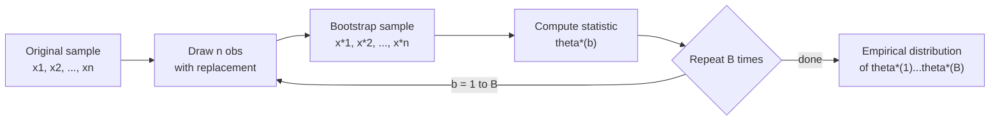
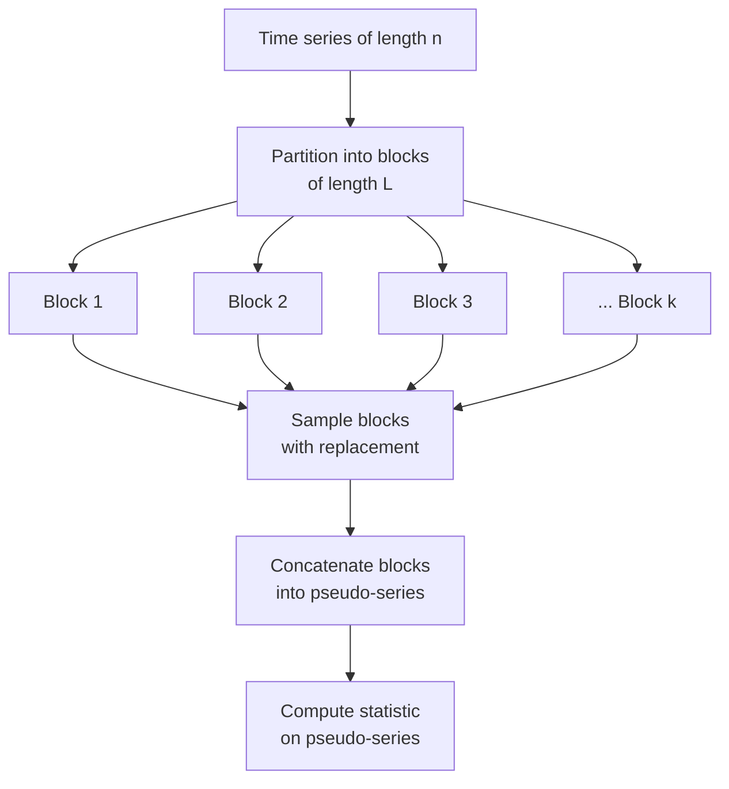

## Bootstrap and Resampling Techniques

### Overview

Bootstrap and resampling techniques are computational methods for estimating the sampling distribution of a statistic by repeatedly drawing samples from observed data, rather than relying on closed-form analytical formulas. In financial economics, these methods are indispensable because asset returns routinely violate the assumptions (normality, independence, homoskedasticity) underlying classical inference, and analytical standard errors for many financial statistics (e.g., Sharpe ratios, VaR, complex portfolio weights) either don't exist in closed form or are unreliable in finite samples.

**Key Points**

- The bootstrap approximates the sampling distribution of a statistic by treating the observed sample as a stand-in for the population and resampling from it
- Standard IID bootstrap fails under time-series dependence common in financial data; block-based variants are required
- Bootstrap methods underpin modern approaches to standard errors, confidence intervals, hypothesis testing, and model validation in empirical asset pricing

---

### The Core Bootstrap Principle

Given an observed sample $X = \{x_1, \dots, x_n\}$ drawn from an unknown distribution $F$, and a statistic of interest $\hat{\theta} = s(X)$, the bootstrap substitutes the empirical distribution $\hat{F}_n$ for the unknown $F$. Resampling from $\hat{F}_n$ (i.e., resampling from the data itself) generates many pseudo-samples $X^{*(1)}, \dots, X^{*(B)}$, each producing a bootstrap replicate $\hat{\theta}^{*(b)} = s(X^{*(b)})$.

The empirical distribution of $\{\hat{\theta}^{*(1)}, \dots, \hat{\theta}^{*(B)}\}$ approximates the true sampling distribution of $\hat{\theta}$. This "plug-in" logic — substituting $\hat{F}_n$ for $F$ — is the foundational idea introduced by Efron (1979).

$$\widehat{\text{SE}}(\hat{\theta}) = \sqrt{\frac{1}{B-1} \sum_{b=1}^{B} \left( \hat{\theta}^{*(b)} - \bar{\theta}^{*} \right)^2}$$

where $\bar{\theta}^{*} = \frac{1}{B}\sum_{b=1}^{B} \hat{\theta}^{*(b)}$.

**Why this matters in finance:** many statistics used in portfolio and risk analysis — Sharpe ratios, information ratios, drawdown measures, quantile-based risk metrics — have sampling distributions that are analytically intractable or only asymptotically justified, and the asymptotic approximation can be poor at typical financial sample sizes (e.g., 5–10 years of monthly data yields only 60–120 observations).

---

### Classical (IID) Bootstrap

#### Nonparametric (Case) Resampling

Draws $n$ observations **with replacement** from the original sample of size $n$. Each bootstrap sample is the same size as the original, and any given observation may appear zero, one, or multiple times.

**Assumptions:** observations are independent and identically distributed. This is the critical weakness for financial time series, where returns exhibit autocorrelation, volatility clustering, and regime dependence — the IID bootstrap destroys this temporal structure.

#### Parametric Bootstrap

Instead of resampling the data directly, a parametric model is fit to the data (e.g., a GARCH model or a normal distribution with estimated mean and variance), and pseudo-samples are drawn from the **fitted model** rather than the empirical distribution.

$$X^{*(b)} \sim F(\cdot \,;\, \hat{\theta}_{\text{param}})$$

This is appropriate when there is strong prior justification for a distributional form (e.g., testing whether an option-pricing model's assumptions hold), but it inherits model misspecification risk: if the parametric form is wrong, the bootstrap inherits that bias.

#### Residual Bootstrap (Regression Context)

For a fitted regression model $y_i = X_i \hat{\beta} + \hat{\varepsilon}_i$, residuals $\hat{\varepsilon}_i$ are resampled (with replacement) and added back to the fitted values to construct new pseudo-outcomes:

$$y_i^{*} = X_i \hat{\beta} + \hat{\varepsilon}_i^{*}$$

The model is then re-estimated on $(X_i, y_i^{*})$ to obtain $\hat{\beta}^{*(b)}$. This is common in event-study and factor-model contexts but requires the assumption that residuals are exchangeable — again problematic under heteroskedasticity (common in financial residuals, where volatility clusters over time).

---

### Time-Series Resampling: Block Bootstrap Methods

Because financial returns are serially dependent (autocorrelation in volatility, momentum/reversal effects, macro regime persistence), naive IID resampling breaks the dependence structure and produces invalid inference. Block-based methods resample *contiguous blocks* of observations to preserve local time-series dependence.

#### Non-Overlapping (Moving) Block Bootstrap

The sample is divided into blocks of length $\ell$, and blocks are drawn with replacement and concatenated to form a pseudo-sample of length $n$.

**Block length selection** is a bias–variance tradeoff:

- Too short → dependence structure not preserved (approaches IID bootstrap)
- Too long → too few effective blocks, high variance in the bootstrap distribution

A common data-driven rule of thumb sets $\ell \propto n^{1/3}$, though optimal block-length selection procedures (e.g., Politis and White's automatic block-length selection) exist and are preferred in rigorous applications. [Inference: exact optimal constants depend on the dependence structure and are typically estimated via spectral or autocovariance-based methods rather than a fixed universal rule.]

#### Moving Block Bootstrap (Overlapping Blocks)

Rather than partitioning into non-overlapping blocks, all $n - \ell + 1$ possible overlapping blocks of length $\ell$ are candidates for resampling, giving more granular reuse of the data and typically better finite-sample performance than the non-overlapping variant.

#### Stationary Bootstrap (Politis and Romano, 1994)

Instead of a fixed block length, block lengths are themselves random, drawn from a geometric distribution with mean $1/p$. This ensures the resulting pseudo-series is stationary (unlike the fixed-block bootstrap, whose resampled series has a periodicity artifact at the block boundaries). This is one of the most widely used methods for bootstrapping financial return series because it avoids the need to commit to a single deterministic block length.

$$P(\text{block length} = k) = p(1-p)^{k-1}, \quad k = 1, 2, \dots$$

#### Circular Block Bootstrap

Treats the time series as if wrapped around a circle (observation $n$ is followed by observation 1), so blocks can be drawn starting from any point without truncation issues at the end of the sample. This reduces edge bias relative to the standard moving block bootstrap.

#### Wild Bootstrap

Rather than resampling observations or residuals directly, the wild bootstrap multiplies residuals by a random weight $\eta_i$ drawn from an auxiliary distribution with mean 0 and variance 1 (e.g., Rademacher: $\eta_i \in \{-1, +1\}$ with equal probability):

$$\varepsilon_i^{*} = \hat{\varepsilon}_i \cdot \eta_i$$

This preserves each observation's own heteroskedasticity pattern (unlike standard residual resampling, which pools all residuals together) and is especially useful for financial regressions with conditional heteroskedasticity, such as event-study abnormal return tests.

---

### Bootstrap Confidence Intervals

Several methods convert a set of bootstrap replicates $\{\hat{\theta}^{*(b)}\}$ into a confidence interval, with differing accuracy properties.

| Method | Construction | Coverage Accuracy |
| --- | --- | --- |
| Normal approximation | $\hat{\theta} \pm z_{\alpha/2} \cdot \widehat{\text{SE}}^{*}$ | First-order; assumes normality of $\hat{\theta}$ |
| Percentile | $[\hat{\theta}^{*}_{(\alpha/2)}, \hat{\theta}^{*}_{(1-\alpha/2)}]$, the empirical quantiles of the bootstrap distribution | First-order; simple but can be biased |
| Basic (reflection) | $[2\hat{\theta} - \hat{\theta}^{*}_{(1-\alpha/2)},\ 2\hat{\theta} - \hat{\theta}^{*}_{(\alpha/2)}]$ | First-order |
| Bias-Corrected and accelerated (BCa) | Adjusts percentile endpoints for both bias and skewness of the bootstrap distribution | Second-order accurate |
| Studentized (bootstrap-t) | Bootstraps the pivotal quantity $t^{*} = (\hat{\theta}^{*} - \hat{\theta}) / \widehat{\text{SE}}^{*}$ | Second-order accurate; often most reliable in practice |

The **BCa** interval is generally preferred in applied financial econometrics because return-based statistics (e.g., Sharpe ratios) are frequently skewed and biased in finite samples, and BCa corrects for both:

$$\text{BCa interval: } \left[ \hat{\theta}^{*}_{(\alpha_1)},\ \hat{\theta}^{*}_{(\alpha_2)} \right]$$

where $\alpha_1, \alpha_2$ are adjusted quantile levels incorporating a bias-correction term $\hat{z}_0$ and an acceleration term $\hat{a}$ estimated via jackknife.

---

### The Jackknife (Related Resampling Method)

The jackknife estimates the sampling distribution of a statistic by systematically leaving out one observation at a time (leave-one-out), computing the statistic on each reduced sample $X_{(-i)}$:

$$\hat{\theta}_{(-i)} = s(X_{(-i)}), \quad i = 1, \dots, n$$

$$\widehat{\text{SE}}_{\text{jack}} = \sqrt{\frac{n-1}{n} \sum_{i=1}^{n} \left( \hat{\theta}_{(-i)} - \bar{\theta}_{(\cdot)} \right)^2}$$

The jackknife is deterministic (no randomness across runs) and computationally cheaper, but it is known to fail for non-smooth statistics (e.g., the median) and generally provides less accurate variance estimates than the bootstrap for complex, nonlinear financial statistics. It remains useful primarily as an input to BCa bias/acceleration corrections and for quick, low-cost robustness checks.

---

### Applications in Financial Economics

#### 1. Sharpe Ratio Inference

The Sharpe ratio $\widehat{SR} = \hat{\mu}/\hat{\sigma}$ has a sampling distribution that depends on higher moments (skewness, kurtosis) of returns under non-normality. Bootstrap (typically block or stationary bootstrap, given return autocorrelation) is standard for constructing confidence intervals and testing whether two strategies' Sharpe ratios differ significantly — a more robust alternative to the analytical Jobson-Korkie/Memmel formula, which assumes joint normality.

#### 2. Backtest Overfitting and Data Snooping

When many trading strategies are tested and the best-performing one is selected, standard $p$-values are invalidated by the multiple-testing/selection problem. Bootstrap-based procedures — notably White's **Reality Check** and Hansen's **Superior Predictive Ability (SPA)** test — resample returns to construct the null distribution of the *maximum* Sharpe ratio or performance statistic across all tested strategies, providing a valid test of whether the best strategy's outperformance could plausibly be attributable to chance.

#### 3. Value-at-Risk (VaR) and Expected Shortfall

Historical-simulation VaR estimates a quantile of the empirical return distribution directly; bootstrap resampling of historical returns (often block bootstrap, to preserve volatility clustering) is used to construct confidence intervals around the VaR/ES point estimate itself, quantifying estimation uncertainty in tail-risk measures.

#### 4. Portfolio Optimization Robustness (Michaud Resampling)

Michaud's **resampled efficient frontier** approach bootstraps historical return data, re-estimates the mean-variance optimal portfolio on each bootstrap sample, and averages the resulting portfolio weights across replicates. This addresses the well-known instability of mean-variance optimization to estimation error in expected returns and the covariance matrix, producing more diversified, less extreme portfolio weights than a single-sample optimization.

#### 5. Event Studies

Wild bootstrap and block bootstrap methods are used to test the significance of cumulative abnormal returns (CARs) around corporate events (earnings announcements, M&A), particularly when event-window returns exhibit cross-sectional correlation or heteroskedasticity that violate the assumptions of standard $t$-tests.

---

### Worked Example: Bootstrap Standard Error for the Sharpe Ratio

**Setup:** Monthly returns for a strategy, $n = 60$ observations. Point estimate $\widehat{SR} = 0.18$ (monthly).

**Procedure:**

1. Choose a stationary bootstrap with mean block length $1/p = 6$ (roughly capturing short-run autocorrelation in monthly returns)
2. For $b = 1, \dots, 5000$: generate a pseudo-series of length 60 by resampling geometrically-distributed blocks from the original series
3. Compute $\widehat{SR}^{*(b)} = \hat{\mu}^{*(b)} / \hat{\sigma}^{*(b)}$ for each replicate
4. Form the empirical distribution of the 5000 replicates

**Output**

\widehat{\text{SE}}(\widehat{SR}) \approx 0.071, \quad \text{95% BCa CI} \approx [0.04, 0.31]

**Conclusion:** Despite a positive point estimate, the wide confidence interval (reflecting both limited sample size and serial dependence) indicates the Sharpe ratio estimate carries substantial estimation uncertainty — a conclusion that a naive normal-approximation standard error, ignoring autocorrelation, would likely understate. [Inference: illustrative numbers; actual SE/CI width depends on the realized autocorrelation and higher-moment structure of the specific return series.]

---

### Bootstrap Method Selection (svg_diagram)

<svg xmlns="http://www.w3.org/2000/svg" viewBox="0 0 760 460">
\<style\>
.box { fill: #f4f4f4; stroke: #333; stroke-width: 1.5; }
.decision { fill: #e8eef7; stroke: #2b4c7e; stroke-width: 1.5; }
.terminal { fill: #eaf6ea; stroke: #2e7d32; stroke-width: 1.5; }
.label { font-family: Arial, sans-serif; font-size: 13px; fill: #222; }
.title { font-family: Arial, sans-serif; font-size: 15px; font-weight: bold; fill: #111; }
.edge { stroke: #555; stroke-width: 1.3; fill: none; marker-end: url(#arrow); }
.edgelabel { font-family: Arial, sans-serif; font-size: 11px; fill: #444; }
\</style\>
<text x="380" y="24" text-anchor="middle" class="title">Bootstrap Method Selection (svg_diagram)</text>

<rect x="300" y="40" width="160" height="42" rx="6" class="decision" />
<text x="380" y="65" text-anchor="middle" class="label">Data temporally</text>
<text x="380" y="78" text-anchor="middle" class="label">dependent?</text>
<rect x="80" y="140" width="180" height="42" rx="6" class="decision" />
<text x="170" y="165" text-anchor="middle" class="label">No (cross-sectional /</text>
<text x="170" y="178" text-anchor="middle" class="label">panel, exchangeable)</text>
<rect x="500" y="140" width="200" height="42" rx="6" class="decision" />
<text x="600" y="165" text-anchor="middle" class="label">Yes (time series:</text>
<text x="600" y="178" text-anchor="middle" class="label">returns, volatility)</text>
<rect x="40" y="240" width="150" height="42" rx="6" class="terminal" />
<text x="115" y="262" text-anchor="middle" class="label">IID / Case</text>
<text x="115" y="275" text-anchor="middle" class="label">Resampling</text>
<rect x="210" y="240" width="160" height="42" rx="6" class="terminal" />
<text x="290" y="262" text-anchor="middle" class="label">Residual Bootstrap</text>
<text x="290" y="275" text-anchor="middle" class="label">(regression)</text>
<rect x="430" y="240" width="170" height="42" rx="6" class="terminal" />
<text x="515" y="262" text-anchor="middle" class="label">Stationary Bootstrap</text>
<text x="515" y="275" text-anchor="middle" class="label">(general purpose)</text>
<rect x="620" y="240" width="140" height="42" rx="6" class="terminal" />
<text x="690" y="262" text-anchor="middle" class="label">Block Bootstrap</text>
<text x="690" y="275" text-anchor="middle" class="label">(fixed structure)</text>
<rect x="500" y="330" width="220" height="52" rx="6" class="terminal" />
<text x="610" y="352" text-anchor="middle" class="label">Wild Bootstrap</text>
<text x="610" y="367" text-anchor="middle" class="label">if conditional heteroskedasticity</text>
<text x="610" y="380" text-anchor="middle" class="label">(e.g., event studies)</text>
<path d="M340,82 L170,140" class="edge" />
<text x="220" y="115" class="edgelabel">No</text>
<path d="M420,82 L590,140" class="edge" />
<text x="540" y="115" class="edgelabel">Yes</text>
<path d="M140,182 L115,240" class="edge" />
<text x="90" y="215" class="edgelabel">simple stat</text>
<path d="M200,182 L280,240" class="edge" />
<text x="255" y="215" class="edgelabel">regression</text>
<path d="M580,182 L520,240" class="edge" />
<text x="590" y="215" class="edgelabel">unclear block length</text>
<path d="M630,182 L690,240" class="edge" />
<text x="670" y="215" class="edgelabel">known dependence</text>
<path d="M520,282 L580,330" class="edge" />
<text x="590" y="310" class="edgelabel">heteroskedastic</text>
</svg>

---

### Common Pitfalls in Financial Applications

- **Applying IID bootstrap to raw return series:** ignores autocorrelation and volatility clustering, leading to understated standard errors and overconfident inference
- **Block length misspecification:** too-short blocks understate dependence-driven variance; too-long blocks inflate variance and reduce effective resampling diversity
- **Ignoring cross-sectional dependence in panel bootstraps:** when bootstrapping across multiple assets simultaneously (e.g., for portfolio-level inference), resampling must preserve contemporaneous cross-correlation, typically via resampling entire cross-sectional time periods rather than resampling assets and time independently
- **Insufficient replications:** $B$ too small (e.g., $B < 1000$) produces unstable percentile estimates, especially in the tails needed for VaR/ES confidence intervals
- **Survivorship and look-ahead bias baked into the original sample:** bootstrap resampling cannot correct biases already present in the source data — the bootstrap only characterizes sampling variability *given* the observed data, not data-quality issues

---

**Related Topics / Next Steps**

- Monte Carlo simulation methods and their distinction from bootstrap resampling
- GARCH and stochastic volatility models (input to parametric/simulation-based resampling)
- Multiple hypothesis testing corrections (Bonferroni, Benjamini-Hochberg, White's Reality Check, SPA test)
- Newey-West and HAC standard errors as an analytical alternative to block bootstrap
- Extreme value theory for tail-risk estimation
- Panel data bootstrap methods (cluster bootstrap, cross-sectional dependence)
- Jackknife-after-bootstrap diagnostics for bootstrap stability