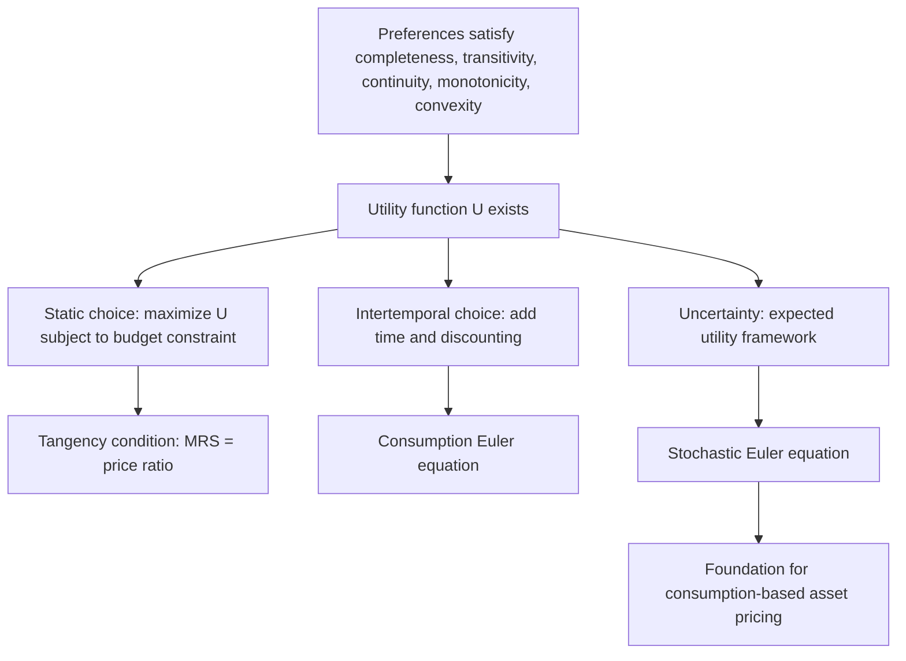

## Consumer Theory and Utility Maximization

### Overview

Consumer theory models how individuals allocate scarce resources across competing uses to maximize their well-being, subject to a budget constraint. In financial economics, this framework is the microfoundation for intertemporal consumption-savings decisions, portfolio choice under uncertainty, and asset pricing models that derive equilibrium returns from the first-order conditions of a representative (or heterogeneous) consumer's optimization problem.

### Preferences and Utility Functions

A consumer's preferences over bundles of goods (or, in finance, consumption at different dates or states of the world) are represented by a **utility function** $U(\cdot)$, provided preferences satisfy standard axioms:

- **Completeness**: any two bundles can be ranked
- **Transitivity**: if $A \succeq B$ and $B \succeq C$, then $A \succeq C$
- **Continuity**: small changes in a bundle do not cause discontinuous jumps in ranking
- **Monotonicity (non-satiation)**: more of a good is weakly preferred to less
- **Convexity**: consumers prefer diversified bundles to extreme ones, generating convex indifference curves (diminishing marginal rate of substitution)

**Key Points**

- These axioms guarantee the existence of a utility function representing preferences (up to a monotonic transformation), and are the standard foundation on which most consumer and asset pricing theory is built
- Utility is an **ordinal** ranking device, not a cardinal measure — only the ordering of bundles matters for basic consumer choice theory, though cardinal utility (and specific functional forms) becomes essential once uncertainty and risk aversion are introduced

### The Budget Constraint

For a two-good static problem with prices $p_1, p_2$ and income $m$:

$$p_1 x_1 + p_2 x_2 \leq m$$

Graphically, this defines a budget line with slope $-p_1/p_2$, representing the market rate at which one good trades for another.

**Key Points**

- In intertemporal finance applications, the "goods" are consumption at different dates, and the "prices" are determined by the interest rate (discussed below)

### Utility Maximization Problem

The consumer's problem is:

$$\max_{x_1, x_2} U(x_1, x_2) \quad \text{subject to} \quad p_1 x_1 + p_2 x_2 = m$$

Using a Lagrangian:

$$\mathcal{L} = U(x_1, x_2) + \lambda(m - p_1 x_1 - p_2 x_2)$$

First-order conditions:

$$\frac{\partial U}{\partial x_1} = \lambda p_1, \qquad \frac{\partial U}{\partial x_2} = \lambda p_2$$

Dividing these conditions gives the **tangency condition**:

$$\frac{MU_1}{MU_2} = \frac{p_1}{p_2}$$

where $MU_i = \partial U/\partial x_i$ is the marginal utility of good $i$. The Lagrange multiplier $\lambda$ has the economic interpretation of the **marginal utility of income** (or wealth) — how much additional utility one more unit of the budget would provide at the optimum.

**Key Points**

- At the optimum, the consumer's subjective trade-off rate between goods (the marginal rate of substitution, $MU_1/MU_2$) equals the market's objective trade-off rate (the price ratio)
- This tangency logic extends directly to the consumption-investment problem: the marginal rate of substitution between consumption today and consumption tomorrow must equal the market's intertemporal price (related to the gross return on the riskless asset)

### Worked Example: Cobb-Douglas Utility

**Example**

Let $U(x_1, x_2) = x_1^{\alpha} x_2^{1-\alpha}$, with $0 < \alpha < 1$. Solving the maximization problem yields the well-known closed-form demand functions:

$$x_1^* = \frac{\alpha m}{p_1}, \qquad x_2^* = \frac{(1-\alpha)m}{p_2}$$

This result — that the consumer spends a constant budget share $\alpha$ on good 1 regardless of prices or income — is a defining feature of Cobb-Douglas preferences and a standard textbook result of this functional form's algebra.

### Indirect Utility, Expenditure, and Duality

The **indirect utility function** $V(p_1, p_2, m)$ gives the maximum attainable utility as a function of prices and income (substituting the optimal demands back into $U$). Its dual counterpart, the **expenditure function** $E(p_1, p_2, \bar{u})$, gives the minimum expenditure needed to achieve a target utility level $\bar{u}$.

**Key Points**

- **Roy's identity** recovers demand functions directly from the indirect utility function: $x_i^*(p, m) = -\dfrac{\partial V/\partial p_i}{\partial V/\partial m}$
- **Shephard's lemma** recovers compensated (Hicksian) demand from the expenditure function: $x_i^h(p, \bar{u}) = \dfrac{\partial E}{\partial p_i}$
- This duality apparatus underlies welfare analysis (compensating and equivalent variation) used in evaluating the welfare cost of financial market frictions or policy changes, though such applications go beyond the base consumer theory result itself

### Income and Substitution Effects

A price change decomposes into two effects via the **Slutsky equation**:

$$\frac{\partial x_i}{\partial p_j} = \underbrace{\frac{\partial x_i^h}{\partial p_j}}_{\text{substitution effect}} - \underbrace{x_j \frac{\partial x_i}{\partial m}}_{\text{income effect}}$$

**Key Points**

- The substitution effect (holding utility constant) is always negative for the good whose own price rises, by the convexity of preferences (law of demand for compensated demand)
- The income effect can reinforce or offset the substitution effect; a **Giffen good** is the rare case where the income effect is strong enough (for a strongly inferior good with a large budget share) to make total demand rise when its own price rises — a standard textbook curiosity rather than an empirically common finance-relevant phenomenon

### Intertemporal Consumption Choice

Extending the static model to two periods with certain income $m_1, m_2$ and a gross interest rate $R = 1+r$ available for borrowing/lending, the intertemporal budget constraint is:

$$c_1 + \frac{c_2}{R} = m_1 + \frac{m_2}{R}$$

The consumer maximizes lifetime utility, typically modeled as time-separable:

$$U(c_1, c_2) = u(c_1) + \beta \, u(c_2)$$

where $\beta \in (0,1)$ is the subjective discount factor reflecting time preference (impatience).

**Example**

The first-order condition (the **consumption Euler equation** in its deterministic form) is:

$$u'(c_1) = \beta R \, u'(c_2)$$

This says the marginal utility cost of saving one unit today ($u'(c_1)$) must equal the discounted marginal utility benefit of the extra consumption it funds tomorrow ($\beta R \, u'(c_2)$). If $\beta R = 1$, the consumer chooses a flat consumption path ($c_1 = c_2$); if $\beta R > 1$ (return outweighs impatience), consumption tilts upward over time ($c_2 > c_1$).

### Extension to Uncertainty: Expected Utility

When future income or asset payoffs are uncertain, the standard extension is the **von Neumann-Morgenstern expected utility** framework, under axioms including the **independence axiom** (preferences over lotteries respect a specific linearity property across probability mixtures):

$$E[U(c)] = \sum_s \pi_s \, u(c_s)$$

where $\pi_s$ is the probability of state $s$ and $c_s$ is consumption in that state.

**Key Points**

- This is the bridge from static consumer theory to portfolio choice and asset pricing: replacing certain consumption with state-contingent consumption and taking expectations recovers the stochastic consumption Euler equation central to consumption-based asset pricing (see Generalized Method of Moments discussion of the Hansen-Singleton framework)
- Commonly used utility functions in finance include **CRRA (constant relative risk aversion)**, $u(c) = \dfrac{c^{1-\gamma}}{1-\gamma}$ (with the log case $u(c) = \ln c$ as $\gamma \to 1$), and **CARA (constant absolute risk aversion)**, $u(c) = -e^{-\alpha c}$, chosen for their tractability and specific risk-aversion implications rather than as universally accurate descriptions of actual preferences

### Risk Aversion Measures

Given a utility function $u(c)$, two standard local measures characterize attitudes toward risk:

**Arrow-Pratt absolute risk aversion**:

$$A(c) = -\frac{u''(c)}{u'(c)}$$

**Relative risk aversion**:

$$R(c) = -c \cdot \frac{u''(c)}{u'(c)}$$

**Key Points**

- CRRA utility has constant $R(c) = \gamma$ for all wealth/consumption levels, implying the proportion of wealth allocated to a risky asset is independent of wealth level — a common and analytically convenient assumption in portfolio choice models
- CARA utility has constant $A(c)$, implying the *dollar* amount invested in a risky asset is independent of wealth — useful for models with normally distributed returns (e.g., mean-variance portfolio problems) but implying implausible behavior at very different wealth levels, which is a well-known limitation of this functional form
- Empirical estimates of relative risk aversion from asset pricing data (see the equity premium puzzle discussion under GMM) have often implied values considered implausibly high relative to values inferred from other contexts (e.g., insurance purchase decisions), a persistent tension in the literature [Inference: reflects a long-standing, widely discussed empirical puzzle rather than a settled, single point estimate]

### Application: Portfolio Choice as Constrained Utility Maximization

**Example**

A single-period investor with initial wealth $W_0$, CRRA utility over terminal wealth, and access to a riskless asset (return $R_f$) and a risky asset (random return $\tilde{R}$) solves:

$$\max_{\omega} \, E\left[\frac{[(1-\omega)R_f + \omega \tilde{R}]^{1-\gamma} W_0^{1-\gamma}}{1-\gamma}\right]$$

where $\omega$ is the portfolio share in the risky asset. The first-order condition equates the expected marginal-utility-weighted excess return to zero:

$$E\left[u'(W_1) (\tilde{R} - R_f)\right] = 0$$

This is structurally identical to the consumption Euler equation applied to a portfolio problem, and it is the direct microfoundation of the stochastic discount factor approach to asset pricing: the ratio $m = \beta \, u'(c_2)/u'(c_1)$ acts as a pricing kernel satisfying $E[m \, \tilde{R}] = 1$ for the return on any asset, connecting consumer theory directly to no-arbitrage asset pricing.

### Conclusion

Consumer theory and utility maximization provide the essential microeconomic scaffolding on which much of modern financial economics is built: static utility maximization establishes the logic of constrained optimization and marginal trade-offs; its intertemporal extension yields the consumption Euler equation governing savings and borrowing; and its extension to uncertainty via expected utility produces the stochastic discount factor framework underlying nearly all modern asset pricing theory. Understanding the assumptions embedded in standard utility specifications (CRRA, CARA) — and their known empirical tensions, such as the equity premium puzzle — is essential context for interpreting the asset pricing models built on top of this foundation.

**Related Topics**

- Expected utility theory and risk aversion in depth
- Stochastic discount factors and the fundamental theorem of asset pricing
- Mean-variance portfolio theory and the Capital Asset Pricing Model
- The equity premium puzzle and habit formation / long-run risk alternatives
- Intertemporal consumption-based asset pricing (Hansen-Singleton framework)
- Behavioral critiques of expected utility: prospect theory and loss aversion
- General equilibrium and Arrow-Debreu state-contingent claims
- Producer theory and firm investment decisions under uncertainty