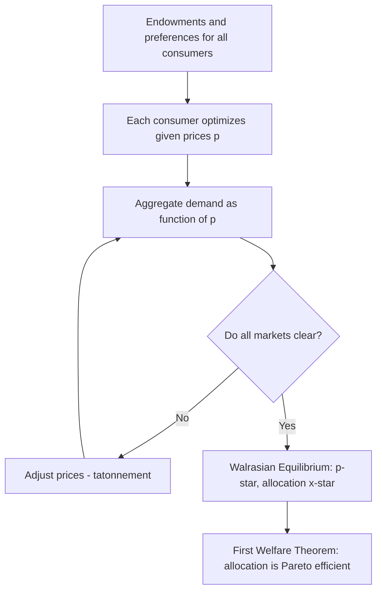

## General Equilibrium Theory

### Overview

General equilibrium theory studies how prices and quantities are simultaneously determined across all markets in an economy, in contrast to partial equilibrium analysis, which examines a single market holding all others fixed. In financial economics, general equilibrium reasoning underlies the Arrow-Debreu state-contingent claims framework, the derivation of equilibrium asset prices from aggregate consumer and producer optimization, and consumption-based asset pricing models where returns are determined jointly with consumption and production decisions rather than taken as exogenously given.

### Partial vs. General Equilibrium

**Partial equilibrium** analysis (e.g., standard supply-and-demand analysis of a single stock or single good) assumes cross-market effects are negligible or held fixed. **General equilibrium (GE)** analysis instead requires that all markets clear simultaneously, recognizing that prices in one market affect income, demand, and prices in others.

**Key Points**

- GE is essential in finance whenever the object of interest is *why* asset prices take the values they do in aggregate — not just how a single asset's price responds to an isolated shock — since asset returns, aggregate consumption, and production decisions are jointly determined
- The tractability cost of GE is substantial: closed-form solutions require strong simplifying assumptions (e.g., representative agent, specific utility functional forms, complete markets), which is why partial equilibrium (e.g., CAPM taking the market portfolio's risk premium as given) remains the workhorse tool for many practical applications

### The Walrasian Exchange Economy

Consider a **pure exchange economy** with $I$ consumers and $L$ goods, where consumer $i$ has an endowment $\omega_i \in \mathbb{R}^L_+$ and utility function $u_i(x_i)$. A **Walrasian (competitive) equilibrium** is a price vector $p^*$ and an allocation $\{x_i^*\}$ such that:

1. Each consumer maximizes utility subject to their budget constraint: $x_i^*$ solves $\max_{x_i} u_i(x_i)$ s.t. $p^* \cdot x_i \leq p^* \cdot \omega_i$
2. **Markets clear**: $\sum_{i=1}^{I} x_i^* = \sum_{i=1}^{I} \omega_i$ for every good

**Key Points**

- Equilibrium prices are determined only up to a positive scalar (only relative prices matter) — a consequence of the budget constraint being homogeneous of degree zero in prices, formally known as the absence of "money illusion" in this framework
- **Walras' Law**: if $L-1$ markets clear, the $L$-th market clears automatically, since the sum of all consumers' budget constraints implies the value of aggregate excess demand is identically zero at any price vector

### Existence, Uniqueness, and the First and Second Welfare Theorems

**Existence** of a Walrasian equilibrium is guaranteed under standard conditions (continuous, convex preferences; positive endowments) via fixed-point arguments (Arrow-Debreu, building on Brouwer/Kakutani fixed-point theorems). **Uniqueness** is not generally guaranteed without additional restrictions (e.g., gross substitutability).

**First Welfare Theorem**: any Walrasian equilibrium allocation is **Pareto efficient** (no reallocation can make one consumer better off without making another worse off), provided there are no externalities and markets are complete.

**Second Welfare Theorem**: under convexity assumptions, any Pareto efficient allocation can be achieved as a Walrasian equilibrium for *some* redistribution of initial endowments, via appropriate lump-sum transfers.

**Key Points**

- The First Welfare Theorem is the formal justification underlying the intuition that competitive financial markets, absent frictions and externalities, allocate risk and capital efficiently
- Departures from the theorem's assumptions — incomplete markets, asymmetric information, externalities (e.g., systemic risk, fire-sale externalities) — are precisely the conditions invoked to justify financial market regulation, since efficiency is no longer guaranteed once these are present

### Production Economies

Extending the pure exchange model to include production, firms choose production plans $y_j$ to maximize profit given prices, and profits are distributed to consumers (often via ownership shares $\theta_{ij}$ of firm $j$'s profit). Equilibrium now requires:

1. Consumer utility maximization given prices and (profit-inclusive) income
2. **Firm profit maximization**: $y_j^*$ solves $\max_{y_j \in Y_j} p \cdot y_j$, where $Y_j$ is firm $j$'s production possibility set
3. Market clearing in both goods and factor markets

**Key Points**

- In finance, this structure underlies models linking corporate investment decisions (firms' production choices) to equilibrium asset returns (since a firm's stock is a claim on its profit stream, and its equilibrium price reflects the marginal consumer's valuation of that stream)

### Arrow-Debreu State-Contingent Claims

The Arrow-Debreu framework extends the GE model to uncertainty by treating goods as **state-contingent claims**: a "good" is defined not just by its physical characteristics but by the state of the world $s$ in which it is delivered. An **Arrow security** for state $s$ pays one unit of the consumption good if state $s$ occurs and zero otherwise.

**Key Points**

- If markets for Arrow securities exist for *every* possible state (**complete markets**), any state-contingent payoff can be replicated (spanned) as a portfolio of Arrow securities, and the resulting equilibrium allocation is Pareto efficient by the First Welfare Theorem applied to this state-expanded good space
- The equilibrium price $q_s$ of the Arrow security for state $s$ is directly interpretable as a **state price**, and the vector of state prices normalized by state probabilities constitutes the **stochastic discount factor (pricing kernel)** central to modern asset pricing theory
- Real financial markets are generally **incomplete** — not every conceivable state has a directly tradable claim — but a sufficiently rich set of traded securities (stocks, bonds, options) can span, or approximately span, the relevant state space in many models, which is the theoretical justification for using traded asset prices to infer implied state prices (e.g., via the Breeden-Litzenberger relationship between option prices and risk-neutral densities)

### From State Prices to the Stochastic Discount Factor

**Example**

In a single-period Arrow-Debreu economy with states $s = 1, \ldots, S$, state probabilities $\pi_s$, and state prices $q_s$, define the stochastic discount factor as $m_s = q_s/\pi_s$. Any asset with state-contingent payoff $x_s$ has equilibrium price:

$$p = \sum_{s=1}^{S} q_s \, x_s = \sum_{s=1}^{S} \pi_s \, m_s \, x_s = E[m \, x]$$

This single equation — the **fundamental equation of asset pricing** — is the general equilibrium counterpart of the Euler equation derived from individual consumer optimization (see Consumer Theory and GMM discussions): in a representative-agent economy, $m_s = \beta \, u'(c_s)/u'(c_0)$, directly linking equilibrium state prices to the representative consumer's marginal utility of consumption in each state.

**Key Points**

- This shows explicitly why consumption-based asset pricing (Hansen-Singleton, CCAPM) is a *general equilibrium* theory of asset prices: the pricing kernel is not an arbitrary discount factor but is derived from the equilibrium marginal utility of the consumer(s) whose optimization also determines the consumption allocation itself
- No-arbitrage pricing (e.g., Black-Scholes, binomial option pricing) is a weaker, partial-equilibrium-consistent framework: it derives relative prices among traded securities without needing to fully specify or solve the underlying general equilibrium, which is precisely why no-arbitrage models are more widely used in practical derivatives pricing despite being "incomplete" as full equilibrium theories

### Representative Agent Models

Because solving a full heterogeneous-agent GE model is often analytically intractable, financial economics frequently uses a **representative agent** — a fictional single consumer whose preferences and optimization summarize aggregate behavior — to obtain tractable equilibrium asset pricing relationships (as in the Consumption CAPM).

**Key Points**

- The representative agent construct is valid (aggregation holds exactly) only under restrictive conditions — for example, complete markets combined with specific classes of utility functions (e.g., all agents having HARA utility with the same cautiousness parameter) — a well-known theoretical result (Gorman aggregation / Rubinstein aggregation conditions)
- When these aggregation conditions fail, heterogeneous-agent models (with incomplete markets, borrowing constraints, or heterogeneous beliefs) can generate qualitatively different asset pricing implications than the representative agent benchmark, which is an active area of research motivated partly by empirical puzzles (e.g., the equity premium puzzle) that representative-agent CCAPM struggles to match [Inference: characterizes a well-established research motivation rather than a single settled finding]

### Equilibrium Asset Pricing: The Lucas Tree Model

**Example**

The Lucas (1978) "tree" model is a canonical GE asset pricing model: a representative agent economy with a single risky asset ("tree") that produces a stochastic, non-storable dividend (consumption) each period, and the agent cannot alter the aggregate consumption process (consumption equals dividends by market clearing, since the good cannot be stored or produced beyond the endowment). The agent's Euler equation for holding the tree,

$$P_t = E_t\left[\beta \frac{u'(D_{t+1})}{u'(D_t)}(P_{t+1} + D_{t+1})\right]$$

is solved (given a dividend process and utility function) for the equilibrium price $P_t$ as a function of the current dividend, since consumption is pinned down by market clearing rather than being a free choice variable as in a full production/savings economy. This model is a foundational building block for showing explicitly how equilibrium asset prices emerge jointly with consumption from optimization plus market clearing, rather than being assumed as exogenous inputs to a pricing formula.

### General Equilibrium vs. No-Arbitrage: A Comparison

| Aspect | General Equilibrium Pricing | No-Arbitrage Pricing |
| --- | --- | --- |
| What determines prices | Simultaneous optimization by all agents + market clearing | Absence of riskless profit opportunities among traded securities |
| Requires utility/preference specification | Yes | No (or only indirectly, via risk-neutral probabilities) |
| Determines absolute price levels | Yes (in principle) | No — only relative prices among spanned securities |
| Typical use | Explaining risk premia, the equity premium, macro-finance links | Pricing derivatives given underlying asset prices (Black-Scholes, binomial trees) |
| Tractability | Often requires strong simplifying assumptions | Generally more tractable, widely used in practice |

### Conclusion

General equilibrium theory provides the deepest theoretical foundation for asset pricing, showing how equilibrium prices emerge from the joint optimization of all consumers (and, in production economies, firms) subject to market-clearing conditions, rather than being assumed exogenously. The Arrow-Debreu state-contingent claims extension directly yields the stochastic discount factor concept underlying consumption-based asset pricing, connecting general equilibrium theory to the empirical GMM and utility-maximization material covered elsewhere in this course. While full GE models are often intractable for direct empirical estimation without simplifying devices like the representative agent, the framework's core insight — that asset prices, consumption, and production are jointly, not independently, determined — remains the conceptual backbone distinguishing genuine equilibrium asset pricing theory from purely relative, no-arbitrage-based pricing tools.

**Related Topics**

- Arrow-Debreu securities and complete markets theory in depth
- The Lucas tree model and consumption-based asset pricing
- Stochastic discount factors and the fundamental theorem of asset pricing
- Representative agent aggregation conditions (Gorman, Rubinstein)
- Incomplete markets and heterogeneous-agent asset pricing models
- No-arbitrage pricing and risk-neutral valuation
- Welfare economics and the First/Second Welfare Theorems
- Rational expectations equilibrium and information aggregation in markets