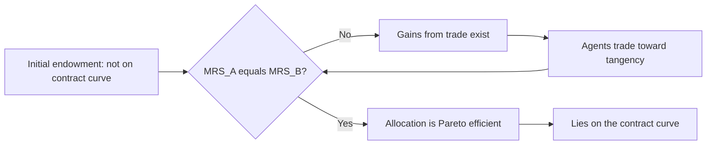

## Welfare Economics and Pareto Efficiency

### Overview

Welfare economics studies how resource allocations affect the wellbeing of individuals and society, providing the normative foundation for evaluating financial markets, regulation, and policy. Pareto efficiency is its central benchmark concept: an allocation is Pareto efficient if no individual's welfare can be improved without making at least one other individual worse off. In financial economics, welfare analysis underlies the justification for market completeness, the interpretation of equilibrium asset prices, the case for and against financial regulation, and the evaluation of risk-sharing arrangements.

### Pareto Efficiency: Formal Definition

An allocation $x = (x_1, \dots, x_n)$ of resources among $n$ agents is **Pareto efficient** (or Pareto optimal) if there exists no feasible alternative allocation $x'$ such that:

$$U_i(x'_i) \geq U_i(x_i) \text{ for all } i, \quad \text{with strict inequality for at least one } i$$

An allocation that fails this condition is **Pareto dominated**: some alternative feasible allocation makes at least one agent strictly better off without harming anyone else. The set of all Pareto efficient allocations is the **Pareto frontier** (or contract curve, in a two-agent exchange setting).

**Key Points**

- Pareto efficiency is a minimal criterion — it says nothing about *distribution* or *fairness*; a highly unequal allocation can be Pareto efficient if no reallocation could help someone without hurting another
- Pareto comparisons are a *partial ordering*: many allocations are simply not comparable (a change that helps some and hurts others is neither a Pareto improvement nor dominated)
- A **Pareto improvement** is any feasible move from a non-efficient allocation to one where at least one agent gains and none lose

### The Edgeworth Box and Contract Curve

For a two-agent, two-good exchange economy, Pareto efficient allocations can be characterized geometrically: they occur where the agents' indifference curves are tangent, i.e., where their marginal rates of substitution (MRS) are equal.

$$MRS^A_{xy} = MRS^B_{xy}$$

The locus of all such tangency points forms the **contract curve** — the set of Pareto efficient allocations reachable within the box, given the aggregate endowment.

### The First Fundamental Theorem of Welfare Economics

**Statement**: Under standard assumptions — complete markets, perfect competition (price-taking agents), no externalities, and no public goods — any competitive equilibrium allocation is Pareto efficient.

**Key Points**

- Formalizes Adam Smith's "invisible hand" intuition: decentralized, self-interested trading in competitive markets, with no coordination, achieves an efficient outcome
- Requires markets for *every* relevant good and contingency (complete markets); in a financial context, this maps directly to the requirement of a complete set of Arrow-Debreu securities spanning all states of the world
- Says nothing about *which* Pareto efficient allocation is reached — that depends on the initial endowment distribution

**Financial economics interpretation**: In the Arrow-Debreu framework, if markets are complete (a full set of state-contingent claims exists and are competitively traded), the resulting equilibrium allocation of consumption across states and agents is Pareto efficient. This result underlies the theoretical case for financial innovation and market completion: each new security that spans previously unspanned states of the world moves the economy closer to the conditions required for the First Welfare Theorem to hold.

### The Second Fundamental Theorem of Welfare Economics

**Statement**: Under convexity assumptions (convex preferences, convex production sets) and the same market-completeness conditions, *any* Pareto efficient allocation can be achieved as a competitive equilibrium, given an appropriate initial redistribution of endowments (typically via lump-sum transfers).

**Key Points**

- Separates the *efficiency* question from the *equity* question: society can pick any point on the Pareto frontier it prefers (on distributional/equity grounds) and then rely on competitive markets to reach it, provided lump-sum redistribution is feasible
- The practical difficulty is that lump-sum transfers (transfers that do not distort incentives) are rarely available in reality; most real-world redistribution tools (taxes, subsidies) are distortionary, which is why the Second Theorem is often treated as a benchmark rather than an operational policy tool
- Provides the theoretical basis for separating "efficiency" and "redistribution" arguments in financial regulation debates — inefficiency arguments (market completion, reducing frictions) are distinguished from equity arguments (who should bear risk or receive transfers)

### Conditions Under Which Markets Fail to Deliver Pareto Efficiency

**Key Points**

- **Market incompleteness**: when not all states of the world have a corresponding traded security, equilibrium allocations are generally *not* Pareto efficient (agents cannot fully insure against all risks) — a central motivation for financial innovation and derivatives markets
- **Externalities**: costs or benefits not reflected in market prices (e.g., systemic risk imposed by one financial institution's failure on the rest of the system) lead to inefficient private decisions relative to the social optimum
- **Asymmetric information**: adverse selection and moral hazard (central to the economics of insurance, lending, and corporate finance) generally prevent competitive equilibria from being fully Pareto efficient; see Rothschild-Stiglitz-type results on inefficiency of competitive insurance markets under asymmetric information
- **Market power**: non-price-taking behavior (monopoly, oligopoly, market-making with market power) generally produces inefficient allocations relative to the competitive benchmark
- **Incomplete or imperfect competition among financial intermediaries**: transaction costs, bid-ask spreads, and intermediation frictions all drive a wedge between the frictionless efficient benchmark and observed outcomes

### Pareto Efficiency in Risk Sharing

A central financial economics application: how should risk be allocated across agents with different risk preferences (and possibly different beliefs) to achieve efficiency?

**Borch's Theorem (Mutuality Principle)**: In a Pareto efficient risk-sharing arrangement among agents with von Neumann-Morgenstern utility functions, individual consumption in each state depends only on *aggregate* risk (the total endowment/output across all agents in that state), not on any idiosyncratic risk specific to one agent. Idiosyncratic risk is fully diversified away in an efficient allocation; only aggregate (undiversifiable) risk is borne.

**Key Points**

- Under efficient risk sharing, each agent's optimal consumption share is a function of the aggregate endowment: $c_i(\theta) = f_i(W(\theta))$ where $W(\theta)$ is aggregate wealth in state $\theta$
- This result underlies the theoretical justification for insurance pooling, mutual funds, and diversified financial intermediation: pooling and sharing idiosyncratic risks across many agents is a Pareto improvement over each agent bearing their own idiosyncratic risk alone
- With homogeneous beliefs and standard (e.g., HARA-class) utility functions, efficient risk sharing implies each agent's consumption is a linear or specific nonlinear function of aggregate consumption — the basis for representative-agent asset pricing models

### Welfare Criteria Beyond Pareto: Handling Non-Comparable Allocations

Because most real policy changes create both winners and losers, additional welfare criteria are used to rank allocations the Pareto criterion cannot compare.

**Kaldor-Hicks efficiency (compensation principle)**: a change is a Kaldor-Hicks improvement if the winners could *in principle* compensate the losers and still be better off, even if compensation does not actually occur.

**Key Points**

- Widely used in cost-benefit analysis of financial regulation (e.g., evaluating whether a new capital requirement's efficiency gains exceed its compliance costs), because most real policies are not literal Pareto improvements
- Criticized because hypothetical compensation is not the same as actual compensation — a Kaldor-Hicks improvement can still leave some agents strictly worse off in practice
- The **Scitovsky reversal paradox** shows Kaldor-Hicks rankings can be inconsistent (a move from A to B and a move from B back to A can both separately satisfy the compensation criterion), undermining its use as a strict ordering

**Social Welfare Functions**: aggregate individual utilities into a single social objective, $W = W(U_1, \dots, U_n)$, allowing explicit tradeoffs between efficiency and equity (e.g., utilitarian $W = \sum_i U_i$, or Rawlsian maximin $W = \min_i U_i$). [Inference] Social welfare function approaches are generally considered more normatively demanding than the Pareto criterion because they require interpersonal utility comparisons, a controversial assumption in welfare economics, whereas Pareto efficiency requires no such comparison.

### Pareto Efficiency and Asset Pricing

**Key Points**

- Complete, frictionless, competitive markets with no arbitrage imply the existence of a **stochastic discount factor (SDF)** / state-price density consistent with Pareto efficient risk allocation; this SDF can often be represented as a function of aggregate consumption under standard assumptions, connecting welfare theory directly to the Consumption-CAPM
- The representative agent construct used in much of asset pricing theory is a direct consequence of Pareto efficient risk sharing under complete markets: if risk sharing is efficient, aggregate outcomes can be represented as though generated by a single fictitious agent with an aggregated utility function
- Deviations from Pareto efficiency (due to incomplete markets, borrowing constraints, heterogeneous beliefs) are active research areas explaining asset pricing anomalies that representative-agent, complete-markets models struggle to match (e.g., idiosyncratic risk premia, limits to risk sharing across households)

### Application: Evaluating Financial Regulation Through a Welfare Lens

**Key Points**

- Capital requirements, deposit insurance, and systemic risk regulation are frequently evaluated using welfare economics frameworks that weigh the efficiency costs of regulation (reduced risk-taking, reduced credit supply) against the welfare gains from reducing externalities (systemic risk, moral hazard)
- The theoretical case for regulating financial institutions typically rests on identifying a specific market failure (externality, information asymmetry, market incompleteness) that prevents the unregulated competitive equilibrium from being Pareto efficient — regulation is then justified as correcting that specific wedge rather than as a general presumption against markets
- [Inference] Much of the applied welfare-economics literature on financial regulation focuses on quantifying second-best outcomes — because it is rarely possible to remove every market failure simultaneously, regulatory design often targets the welfare-maximizing policy *given* that other frictions remain present (the theory of the second best), rather than the unconstrained first-best Pareto efficient allocation

### Pareto Frontier Diagram (SVG)

<svg xmlns="http://www.w3.org/2000/svg" viewBox="0 0 640 400" font-family="Helvetica, Arial, sans-serif">
<text x="320" y="26" text-anchor="middle" font-size="16" font-weight="bold" fill="#1a1a1a">Pareto Frontier: Two-Agent Utility Space (svg_diagram)</text>
<line x1="80" y1="340" x2="580" y2="340" stroke="#333" stroke-width="2" />
<line x1="80" y1="60" x2="80" y2="340" stroke="#333" stroke-width="2" />
<text x="330" y="370" text-anchor="middle" font-size="13" fill="#333">Utility of Agent A</text>
<text x="35" y="200" text-anchor="middle" font-size="13" fill="#333" transform="rotate(-90 35 200)">Utility of Agent B</text>
<path d="M 100 320 Q 250 90 540 90" fill="none" stroke="#2563eb" stroke-width="3" />
<text x="420" y="100" font-size="12" fill="#2563eb">Pareto frontier</text>
<circle cx="250" cy="230" r="6" fill="#dc2626" />
<text x="260" y="225" font-size="12" fill="#dc2626">Interior point (inefficient)</text>
<circle cx="330" cy="150" r="6" fill="#16a34a" />
<text x="340" y="145" font-size="12" fill="#16a34a">Efficient point on frontier</text>
<path d="M 250 230 L 330 150" stroke="#555" stroke-width="1.5" stroke-dasharray="4,3" marker-end="url(#arrow)" />
<text x="150" y="270" font-size="12" fill="#555">Pareto improvement: both A and B gain</text>
</svg>

### Common Pitfalls and Misconceptions

**Key Points**

- Equating Pareto efficiency with fairness or social optimality — an allocation where one agent has everything and others starve can be Pareto efficient, since redistributing would make the wealthy agent worse off
- Assuming real-world financial markets satisfy the First Welfare Theorem's conditions by default — market incompleteness, asymmetric information, and externalities are pervasive in finance, so competitive equilibrium is not automatically Pareto efficient
- Treating Kaldor-Hicks efficiency as equivalent to a genuine Pareto improvement — compensation is hypothetical, not actual, unless explicitly implemented
- Ignoring the theory of the second best: removing a single market friction in a world with multiple, uncorrected frictions does not guarantee a welfare improvement, and can in some cases reduce welfare

### Related Topics

- Arrow-Debreu general equilibrium and complete markets
- Stochastic discount factors and the Consumption-CAPM
- Adverse selection, moral hazard, and information economics in finance
- Theory of the second best
- Risk sharing, diversification, and Borch's Theorem
- Externalities and systemic risk regulation
- Social choice theory and Arrow's impossibility theorem