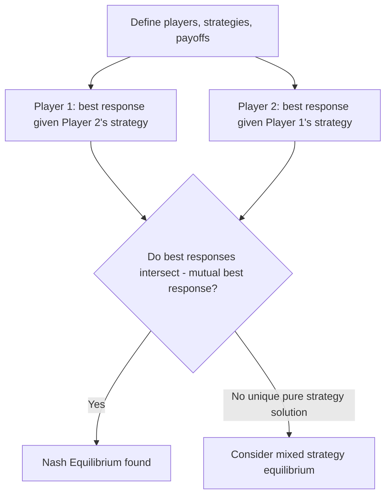

## Game Theory and Nash Equilibrium

### Overview

Game theory studies strategic interactions among rational agents whose payoffs depend not only on their own actions but on the actions of others. In financial economics, game-theoretic reasoning underlies market microstructure (bidding and order placement strategies), corporate finance (capital structure and takeover contests), banking (bank runs and coordination failures), and strategic trading models where informed and uninformed traders interact. Nash equilibrium is the central solution concept used to predict outcomes in these settings.

### Elements of a Game

A game in **normal (strategic) form** is defined by:

- A set of **players** $i = 1, \ldots, N$
- A **strategy space** $S_i$ for each player, from which they choose a strategy $s_i \in S_i$
- A **payoff function** $u_i(s_1, \ldots, s_N)$ giving player $i$'s payoff as a function of the full strategy profile chosen by all players

**Key Points**

- Strategies can be **pure** (a single deterministic action) or **mixed** (a probability distribution over pure strategies)
- Games are classified by information structure: **complete information** (all players know all payoff functions) vs. **incomplete information** (players have private information, modeled via Bayesian games); and by timing: **simultaneous-move** (normal form) vs. **sequential-move** (extensive form, represented by a game tree)

### Dominant Strategies and Dominated Strategy Elimination

A strategy $s_i$ **strictly dominates** another strategy $s_i'$ for player $i$ if $s_i$ yields a strictly higher payoff than $s_i'$ regardless of what other players do. A strategy that strictly dominates all others is a **dominant strategy**.

**Key Points**

- **Iterated elimination of strictly dominated strategies** is a solution technique: repeatedly remove any player's dominated strategies (given remaining strategies of others), which can sometimes narrow the prediction to a unique outcome without needing to invoke Nash equilibrium directly
- Not all games have a dominant strategy for every player, which is precisely why a more general solution concept — Nash equilibrium — is needed

### Nash Equilibrium

A strategy profile $(s_1^*, \ldots, s_N^*)$ is a **Nash equilibrium** if, for every player $i$:

$$u_i(s_i^*, s_{-i}^*) \geq u_i(s_i, s_{-i}^*) \quad \text{for all } s_i \in S_i$$

where $s_{-i}^*$ denotes the equilibrium strategies of all players other than $i$. In words: no player can improve their payoff by unilaterally deviating from their equilibrium strategy, given the strategies chosen by everyone else.

**Key Points**

- Nash equilibrium is a **mutual best-response** condition — it does not require strategies to be dominant, only that each is optimal *given* what others are doing
- A game may have zero, one, or multiple pure-strategy Nash equilibria; **Nash's existence theorem** guarantees that every finite game (finite players, finite strategies) has at least one Nash equilibrium in **mixed strategies**
- Nash equilibrium is a natural extension of the individual constrained-optimization logic from consumer theory: each player solves their own optimization problem, but now the "constraint" includes correctly anticipating others' equilibrium behavior rather than treating it as a fixed environmental parameter

### Worked Example: Cournot Duopoly

**Example**

Two firms choose output quantities $q_1, q_2$ simultaneously, facing inverse demand $P(Q) = a - bQ$ where $Q = q_1 + q_2$, and constant marginal cost $c$. Firm $i$'s profit is $\pi_i = [a - b(q_1+q_2) - c]q_i$. Taking the first-order condition with respect to $q_i$, holding the rival's quantity fixed, gives each firm's **best response function**:

$$q_i^* = \frac{a - c - b q_j}{2b}$$

Solving the two best-response functions simultaneously (imposing $q_1 = q_2 = q^*$ by symmetry) yields the Cournot-Nash equilibrium:

$$q^* = \frac{a-c}{3b}$$

**Key Points**

- At this equilibrium, neither firm can raise profit by unilaterally changing output, given the other firm's quantity — this is the defining property of Nash equilibrium applied to quantity competition
- The Cournot framework and its extensions inform models of strategic interaction among market makers or large institutional traders whose trades have price impact, where quantity/order size plays a role analogous to output

### Mixed Strategy Equilibrium

When no pure-strategy Nash equilibrium exists (common in games with conflicting interests, such as matching pennies or certain bargaining games), players may randomize over their pure strategies. In a **mixed strategy Nash equilibrium**, each player's mixing probabilities make the *other* player indifferent between their own pure strategies (rendering them willing to mix as well, given their own equilibrium beliefs about the opponent).

**Key Points**

- Mixed strategies are often interpreted in finance as capturing genuinely unpredictable behavior that is strategically optimal — e.g., trade timing or order-type choice that must be unpredictable to avoid being exploited by counterparties who could otherwise anticipate and front-run a deterministic strategy [Inference: a standard interpretive framing found in the market microstructure literature, not a claim that any specific real trader literally randomizes via a formal equilibrium calculation]

### Sequential Games and Subgame Perfect Equilibrium

For games with a sequential (extensive-form) structure, plain Nash equilibrium can support outcomes sustained by **non-credible threats** — strategies that would not actually be carried out if the relevant decision point were reached. **Subgame Perfect Nash Equilibrium (SPNE)** refines Nash equilibrium by requiring that strategies constitute a Nash equilibrium in *every* subgame, not just along the equilibrium path.

**Solution method — backward induction**: starting from the final decision nodes and working backward, determine the optimal action at each node given optimal play in all subsequent nodes.

**Example**

In a two-stage entry-deterrence game, an incumbent firm may threaten to engage in a costly price war if a potential entrant enters a market. If, conditional on entry actually occurring, waging the price war would be less profitable for the incumbent than accommodating the entrant, the threat is **not credible**: it may support a Nash equilibrium (entrant stays out, believing the threat) but fails the subgame perfection refinement, since the incumbent would not actually carry out the threat if called. SPNE analysis of such games is a standard tool in the corporate finance literature on entry deterrence, predatory pricing, and capacity investment as strategic commitment devices.

### Bayesian Games and Incomplete Information

When players have private information (e.g., about their own type, cost, or valuation) unknown to others, the appropriate solution concept is **Bayesian Nash Equilibrium**: each player chooses a strategy (a mapping from their private type to an action) that maximizes their *expected* payoff given their beliefs about other players' types and strategies.

**Key Points**

- This framework is essential for modeling financial markets with information asymmetry — e.g., auction-based security issuance, IPO bookbuilding, or trading models where informed and uninformed traders interact (the Kyle (1985) and Glosten-Milgrom (1985) market microstructure models are built on this logic, with informed traders' strategies depending on their private signal and market makers updating beliefs based on observed order flow)
- **Perfect Bayesian Equilibrium (PBE)** extends subgame perfection to games with incomplete information, requiring beliefs to be updated consistently with Bayes' rule along the equilibrium path — the standard equilibrium concept in signaling and screening models widely used in corporate finance (e.g., Myers-Majluf-style signaling via capital structure choice, Spence-style signaling more generally)

### Application: Bank Runs as a Coordination Game

**Example**

The Diamond-Dybvig (1983) model represents bank runs as a coordination game with **multiple equilibria**: if depositors expect other depositors to withdraw funds early (a "run"), it can be individually optimal for each depositor to withdraw as well (even if the underlying bank assets are fundamentally sound), since assets liquidated early lose value, validating the initial fear — a self-fulfilling **bad equilibrium**. If instead depositors expect others to leave funds deposited, waiting is optimal, sustaining a **good equilibrium** with efficient risk-sharing and no run. Both outcomes can be supported as a Nash equilibrium in the same underlying game, purely as a function of coordinated expectations — providing the canonical game-theoretic justification for deposit insurance and lender-of-last-resort policy as mechanisms to eliminate the bad equilibrium by removing depositors' incentive to run.

### Repeated Games and Cooperation

When a stage game is played repeatedly (finitely or infinitely), a wider set of equilibrium outcomes — including cooperative behavior not sustainable in the single-shot game — can be supported, provided players are sufficiently patient (discount future payoffs enough) and can credibly punish deviations. The **Folk Theorem** formalizes this: in infinitely repeated games with sufficiently patient players, a very wide range of individually rational payoff outcomes can be sustained as subgame perfect equilibria via strategies such as **grim trigger** (cooperate until any deviation occurs, then punish forever) or **tit-for-tat**.

**Key Points**

- Repeated game logic is used to analyze tacit collusion among financial institutions (e.g., in setting fees, lending standards, or bid-ask spreads), reputation effects (why financial intermediaries may honor implicit promises even absent formal contracts to preserve future business), and long-term lending relationships between banks and borrowers

### Conclusion

Game theory and Nash equilibrium extend the individual optimization logic of consumer and producer theory to settings where outcomes depend jointly on the strategic choices of multiple interacting agents — a structure pervasive in financial markets, from oligopolistic competition among financial institutions to information-driven trading, corporate signaling, and coordination failures such as bank runs. Refinements of the baseline Nash concept (subgame perfection for sequential games, Bayesian Nash and perfect Bayesian equilibrium for incomplete information, and repeated-game equilibrium concepts for long-run interactions) provide the specific tools used across market microstructure, corporate finance, and banking theory to derive testable predictions about strategic financial behavior.

**Related Topics**

- Market microstructure: the Kyle and Glosten-Milgrom models of informed trading
- Signaling and screening models in corporate finance (Myers-Majluf, capital structure signaling)
- Bank runs, deposit insurance, and the Diamond-Dybvig model
- Auction theory and security issuance mechanisms
- Repeated games, the Folk Theorem, and tacit collusion among financial institutions
- Mechanism design and optimal contracting under asymmetric information
- Behavioral game theory and bounded rationality in strategic settings
- Corporate takeover contests and strategic entry deterrence models